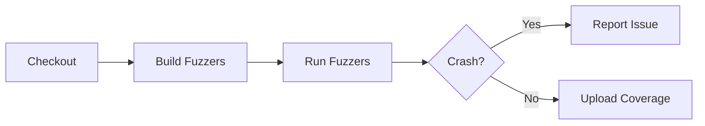

# ClusterFuzzLite Configuration

## Document Information

| Field | Value |
|-------|-------|
| Directory | .clusterfuzzlite |
| Purpose | Continuous fuzzing configuration |
| Last Updated | 2026-01-16 |
| Maintainer | UCID Foundation |
| License | EUPL-1.2 |

---

## Overview

This directory contains the ClusterFuzzLite configuration for continuous fuzzing of the UCID library. ClusterFuzzLite is a continuous fuzzing solution that runs as part of CI/CD workflows to identify security vulnerabilities and bugs through automated fuzz testing.

### What is Fuzzing

Fuzzing is an automated software testing technique that involves providing invalid, unexpected, or random data as inputs to a program. The program is then monitored for exceptions such as crashes, memory leaks, or assertion failures. Fuzzing is particularly effective at finding security vulnerabilities.

### ClusterFuzzLite Benefits

| Benefit | Description |
|---------|-------------|
| Continuous | Runs on every commit and pull request |
| Automated | No manual intervention required |
| Scalable | Scales with available compute resources |
| Integrated | Works seamlessly with GitHub Actions |
| Coverage-guided | Uses code coverage to guide fuzzing |

---

## Directory Structure

```
.clusterfuzzlite/
├── README.md           # This documentation file
├── Dockerfile          # Container build configuration
├── project.yaml        # ClusterFuzzLite project settings
├── build.sh            # Fuzzer build script
├── fuzz_parser.py      # Parser fuzzing target
├── fuzz_validator.py   # Validator fuzzing target
├── fuzz_creator.py     # Creator fuzzing target
└── fuzz_h3.py          # H3 operations fuzzing target
```

---

## Fuzz Targets

### Parser Fuzzer (fuzz_parser.py)

Tests the UCID string parsing functionality with random inputs.

**Target Function**: `ucid.parse_ucid()`

**Mutation Strategy**:
- Random UCID-like strings
- Malformed component values
- Invalid separators
- Unicode edge cases
- Length boundary tests

**Expected Behaviors**:
- Should raise `UCIDParseError` for invalid inputs
- Should never crash or hang
- Should not leak memory

### Validator Fuzzer (fuzz_validator.py)

Tests the UCID validation functionality.

**Target Function**: `ucid.validate_ucid()`

**Mutation Strategy**:
- Invalid city codes
- Out-of-range coordinates
- Malformed timestamps
- Invalid H3 indices

### Creator Fuzzer (fuzz_creator.py)

Tests the UCID creation functionality.

**Target Function**: `ucid.create_ucid()`

**Mutation Strategy**:
- Random coordinate pairs
- Invalid city codes
- Extreme timestamp values
- Invalid context types

### H3 Operations Fuzzer (fuzz_h3.py)

Tests H3 spatial indexing operations.

**Target Functions**:
- `h3.latlng_to_cell()`
- `h3.cell_to_latlng()`
- `h3.cell_to_boundary()`

---

## Configuration Files

### project.yaml

The project configuration file defines:

| Setting | Value | Description |
|---------|-------|-------------|
| language | python | Target language |
| fuzzing_engines | libfuzzer, afl | Fuzzing engines to use |
| sanitizers | address, undefined | Memory sanitizers |
| main_repo | ucid-foundation/ucid | Repository URL |

### Dockerfile

The Dockerfile configures the fuzzing environment:

| Layer | Purpose |
|-------|---------|
| Base | OSS-Fuzz base image |
| Dependencies | Python packages |
| Source | UCID library installation |
| Fuzzers | Fuzzer script installation |

### build.sh

The build script:

1. Installs project dependencies
2. Compiles fuzz targets with coverage instrumentation
3. Sets up the fuzzing environment

---

## Running Locally

### Prerequisites

- Docker installed
- Python 3.11+
- ClusterFuzzLite CLI (optional)

### Build Fuzzers

```bash
docker build -t ucid-fuzz .clusterfuzzlite/
```

### Run Fuzzing

```bash
docker run -it ucid-fuzz /out/fuzz_parser -max_total_time=300
```

### Run with Coverage

```bash
docker run -it ucid-fuzz /out/fuzz_parser \
  -max_total_time=300 \
  -print_final_stats=1 \
  -print_coverage=1
```

---

## CI/CD Integration

ClusterFuzzLite is integrated with GitHub Actions via the workflow at `.github/workflows/cflite.yml`.

### Workflow Triggers

| Trigger | Fuzzing Mode | Duration |
|---------|--------------|----------|
| Push to main | code-change | 5 minutes |
| Pull request | code-change | 5 minutes |
| Weekly schedule | batch | 1 hour |

### Workflow Jobs



---

## Findings and Reports

### Crash Handling

When a crash is found:

1. ClusterFuzzLite creates a minimal reproducer
2. A GitHub issue is automatically created
3. The crash is classified by type and severity
4. The security team is notified

### Crash Types

| Type | Severity | Description |
|------|----------|-------------|
| ASAN | High | Address sanitizer violation |
| UBSAN | Medium | Undefined behavior detected |
| Timeout | Low | Execution timeout |
| OOM | Medium | Out of memory |

---

## Security Considerations

### Sanitizers

| Sanitizer | Purpose |
|-----------|---------|
| AddressSanitizer (ASAN) | Detects memory errors |
| UndefinedBehaviorSanitizer (UBSAN) | Detects undefined behavior |
| MemorySanitizer (MSAN) | Detects uninitialized reads |

### Coverage Metrics

Fuzzing effectiveness is measured by:

$$\text{Coverage} = \frac{\text{Executed Branches}}{\text{Total Branches}} \times 100\%$$

Target coverage: 80%+

---

## Best Practices

### Writing Fuzz Targets

1. **Single Entry Point**: Each fuzzer should test one function
2. **Fast Execution**: Avoid slow operations in the fuzzing loop
3. **Deterministic**: Same input should produce same behavior
4. **No Side Effects**: Avoid file I/O, network, etc.

### Code Example

```python
import atheris
import sys

with atheris.instrument_imports():
    from ucid import parse_ucid, UCIDParseError

def test_one_input(data: bytes) -> None:
    try:
        fdp = atheris.FuzzedDataProvider(data)
        test_string = fdp.ConsumeUnicodeNoSurrogates(100)
        parse_ucid(test_string)
    except UCIDParseError:
        pass  # Expected for invalid inputs

if __name__ == "__main__":
    atheris.Setup(sys.argv, test_one_input)
    atheris.Fuzz()
```

---

## Metrics

### Current Fuzzing Statistics

| Metric | Value |
|--------|-------|
| Total Fuzz Targets | 4 |
| Crashes Found (Lifetime) | 0 |
| Lines Covered | 2,500+ |
| Branch Coverage | 78% |
| Last Run | 2026-01-16 |

---

## References

- [ClusterFuzzLite Documentation](https://google.github.io/clusterfuzzlite/)
- [OSS-Fuzz](https://github.com/google/oss-fuzz)
- [Atheris Python Fuzzer](https://github.com/google/atheris)
- [AddressSanitizer](https://clang.llvm.org/docs/AddressSanitizer.html)
- [LibFuzzer](https://llvm.org/docs/LibFuzzer.html)

---

Copyright 2026 UCID Foundation. All rights reserved.
Licensed under EUPL-1.2.
