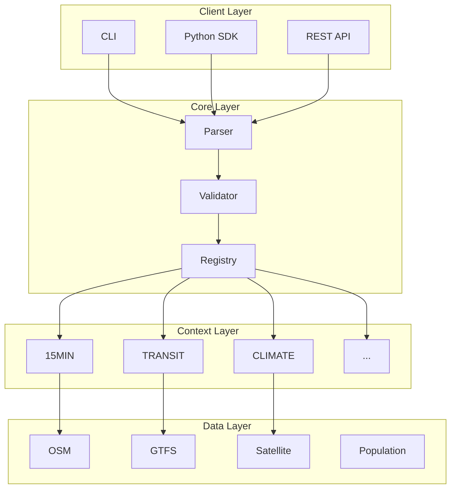
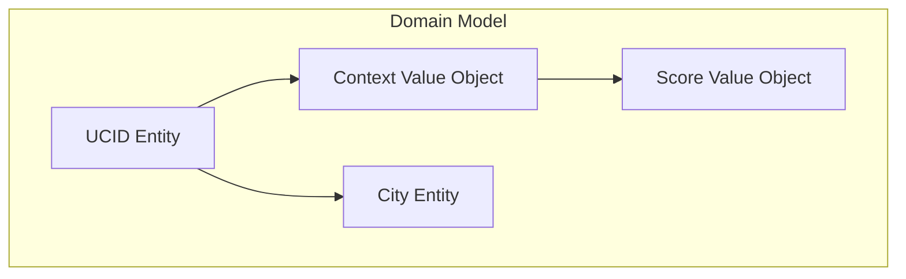
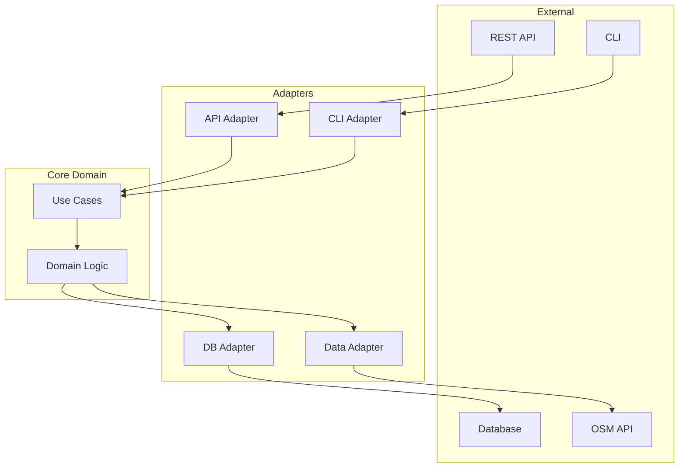
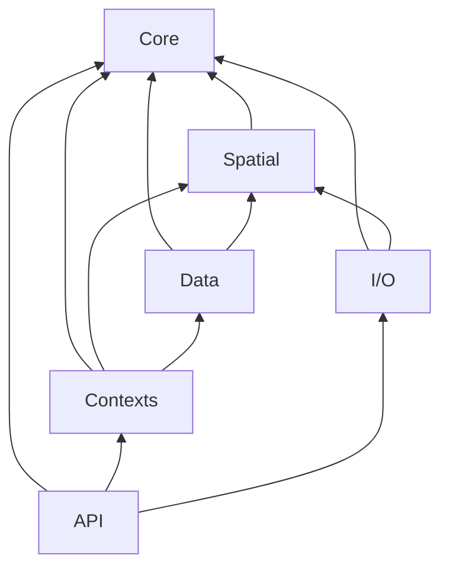
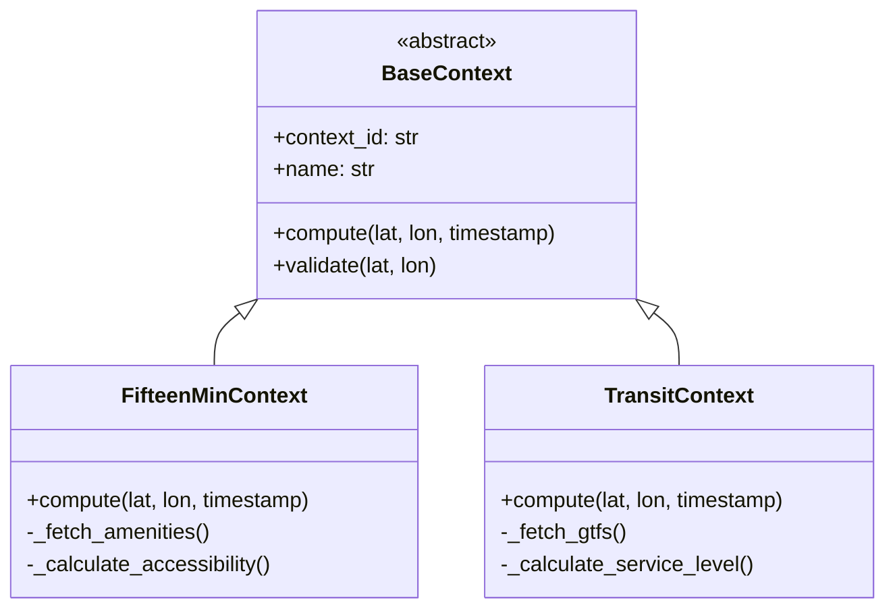
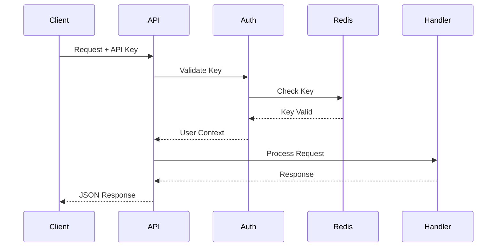
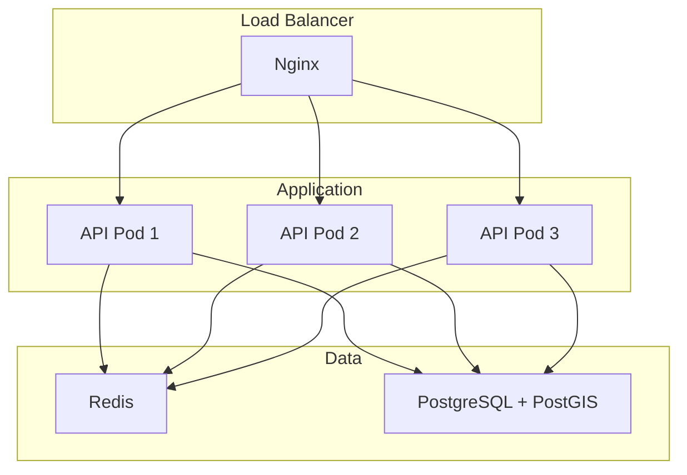
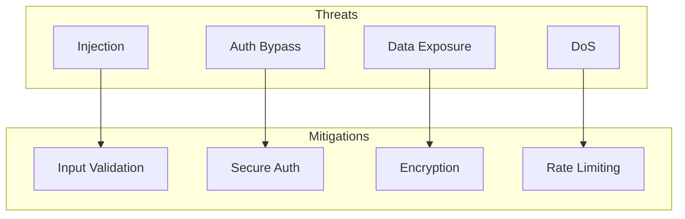

# Architecture

This document provides a comprehensive overview of the UCID (Urban Context Identifier) system architecture, including design principles, component structure, and technical decisions.

---

## Table of Contents

1. [Overview](#overview)
2. [Design Principles](#design-principles)
3. [System Architecture](#system-architecture)
4. [Component Architecture](#component-architecture)
5. [Data Architecture](#data-architecture)
6. [API Architecture](#api-architecture)
7. [Deployment Architecture](#deployment-architecture)
8. [Security Architecture](#security-architecture)
9. [Scalability Architecture](#scalability-architecture)
10. [Future Architecture](#future-architecture)

---

## Overview

### High-Level Architecture

UCID is designed as a modular, extensible library for urban context identification and analysis.



### Architecture Goals

| Goal | Description | Approach |
|------|-------------|----------|
| **Modularity** | Loose coupling between components | Plugin architecture |
| **Extensibility** | Easy to add new features | Abstract interfaces |
| **Testability** | High test coverage | Dependency injection |
| **Performance** | Fast processing | Caching, lazy loading |
| **Reliability** | Predictable behavior | Comprehensive validation |

---

## Design Principles

### SOLID Principles

| Principle | Application in UCID |
|-----------|---------------------|
| **Single Responsibility** | Each module has one purpose |
| **Open/Closed** | BaseContext for extension |
| **Liskov Substitution** | Context implementations |
| **Interface Segregation** | Focused interfaces |
| **Dependency Inversion** | Inject data sources |

### Domain-Driven Design



### Hexagonal Architecture



---

## System Architecture

### Module Structure

```
src/ucid/
    __init__.py          # Public API
    core/                # Core functionality
        parser.py        # UCID parsing
        models.py        # Data models
        validation.py    # Input validation
        errors.py        # Exception hierarchy
    contexts/            # Context plugins
        base.py          # Abstract base
        registry.py      # Plugin registry
        fifteen_min.py   # 15MIN context
        transit.py       # TRANSIT context
        climate.py       # CLIMATE context
    spatial/             # Spatial operations
        h3_ops.py        # H3 functions
        grid.py          # Grid generation
        neighbors.py     # Neighbor computation
    data/                # Data integration
        osm.py           # OpenStreetMap
        gtfs.py          # GTFS feeds
        satellite.py     # Satellite imagery
        population.py    # Population data
    io/                  # Input/Output
        formats.py       # Export formats
        geo.py           # Geospatial I/O
    api/                 # REST API
        app.py           # FastAPI app
        routes.py        # API routes
        auth.py          # Authentication
```

### Dependency Graph



---

## Component Architecture

### Core Component

| Module | Responsibility |
|--------|----------------|
| `parser.py` | UCID string parsing and creation |
| `models.py` | Pydantic data models |
| `validation.py` | Input validation rules |
| `errors.py` | Custom exception types |
| `registry.py` | City and context registries |

### Context System



### Spatial Component

| Module | Responsibility |
|--------|----------------|
| `h3_ops.py` | H3 index operations |
| `grid.py` | Grid generation |
| `neighbors.py` | K-ring computation |
| `aggregate.py` | Spatial aggregation |

---

## Data Architecture

### Data Flow


### Caching Strategy

| Layer | Cache Type | TTL |
|-------|------------|-----|
| OSM Data | File/Redis | 24 hours |
| GTFS Data | File | Until feed update |
| Satellite | File | 7 days |
| Scores | Redis | 1 hour |

### Data Models

```python
@dataclass
class UCIDModel:
    prefix: str = "UCID"
    version: str = "V1"
    city: str
    h3_index: str
    timestamp: str
    context: str
    score: int
    grade: str
    confidence: int
    
@dataclass
class ContextResult:
    score: float
    grade: str
    confidence: float
    breakdown: dict[str, float]
    metadata: dict
```

---

## API Architecture

### REST API Design


### API Endpoints

| Method | Endpoint | Purpose |
|--------|----------|---------|
| POST | /v1/ucid/create | Create UCID |
| GET | /v1/ucid/{id} | Get UCID details |
| POST | /v1/ucid/batch | Batch creation |
| GET | /v1/contexts | List contexts |
| POST | /v1/contexts/{id}/score | Score location |
| GET | /v1/grid | Generate grid |

### Authentication



---

## Deployment Architecture

### Container Architecture



### Kubernetes Deployment

| Resource | Purpose |
|----------|---------|
| Deployment | API pods |
| Service | Internal routing |
| Ingress | External access |
| ConfigMap | Configuration |
| Secret | Credentials |
| HPA | Auto-scaling |

---

## Security Architecture

### Security Layers

| Layer | Mechanism |
|-------|-----------|
| Transport | TLS 1.3 |
| Authentication | API Keys, OAuth2 |
| Authorization | RBAC |
| Input | Validation, Sanitization |
| Data | Encryption at rest |

### Threat Model



---

## Scalability Architecture

### Horizontal Scaling

| Component | Scaling Strategy |
|-----------|------------------|
| API | Multiple pods |
| Workers | Queue-based |
| Database | Read replicas |
| Cache | Cluster |

### Performance Optimization

| Technique | Benefit |
|-----------|---------|
| Caching | Reduce compute |
| Lazy loading | Reduce memory |
| Batch processing | Improve throughput |
| Connection pooling | Reduce overhead |

---

## Future Architecture

### Planned Improvements

| Area | Improvement |
|------|-------------|
| Async | Full async support |
| Streaming | Real-time updates |
| Federation | Distributed compute |
| ML | AI-enhanced scoring |

---

## References

- [H3 Documentation](https://h3geo.org/)
- [PostGIS](https://postgis.net/)
- [FastAPI](https://fastapi.tiangolo.com/)
- [Clean Architecture](https://blog.cleancoder.com/uncle-bob/2012/08/13/the-clean-architecture.html)

---

Copyright 2026 UCID Foundation. All rights reserved.
