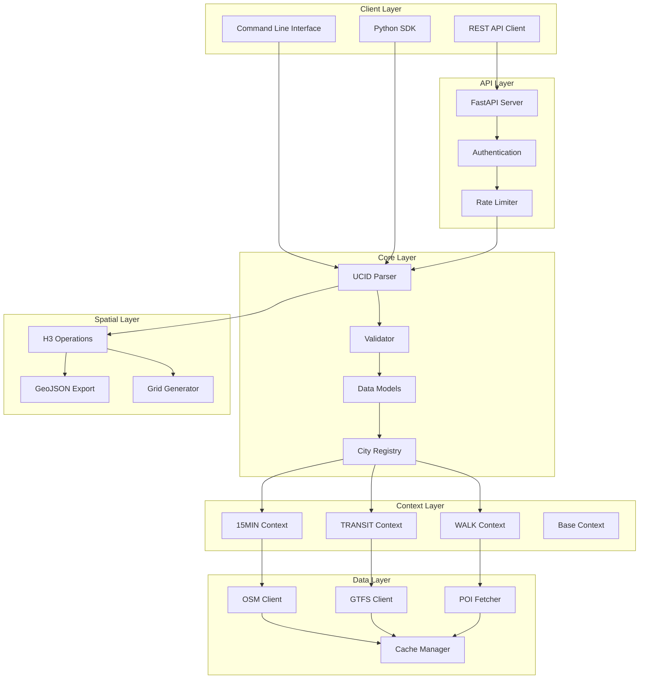
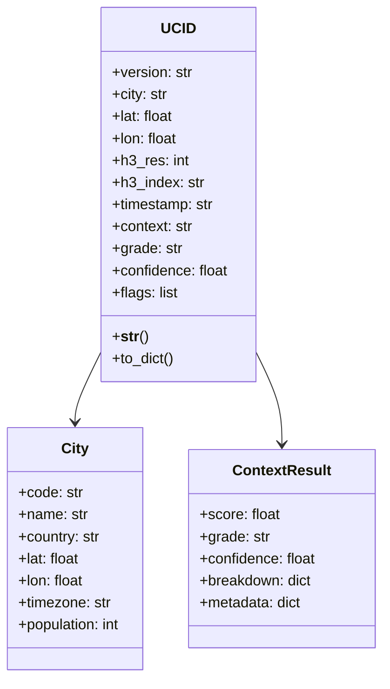
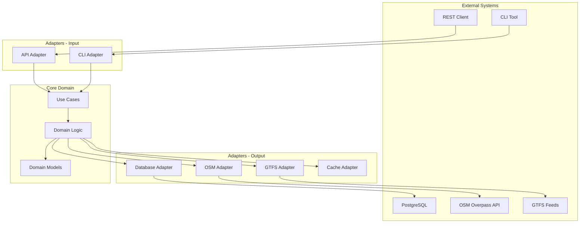
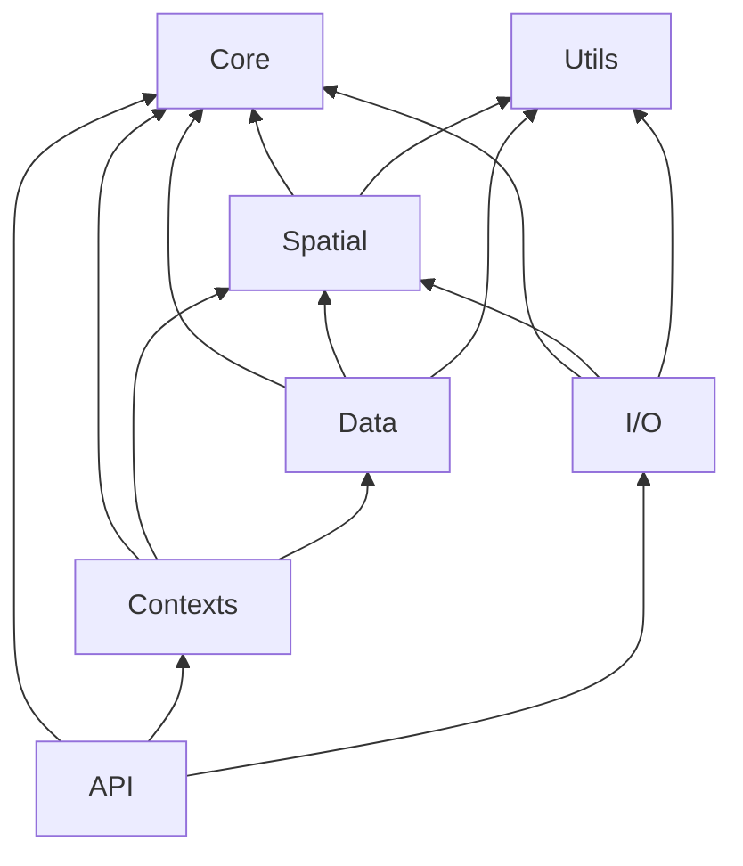
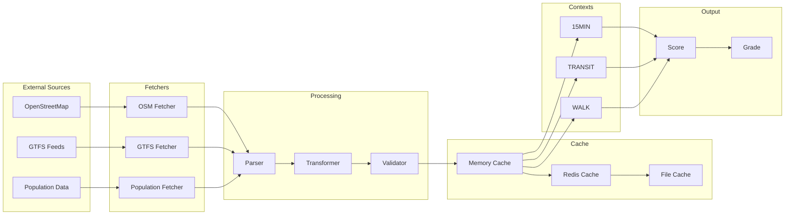
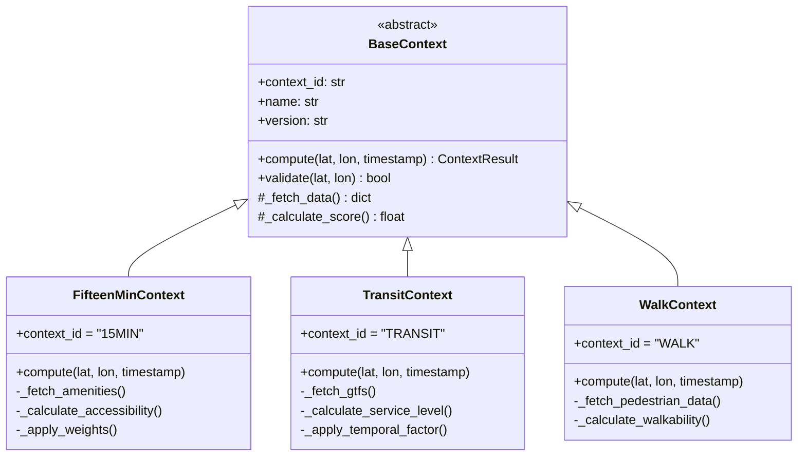
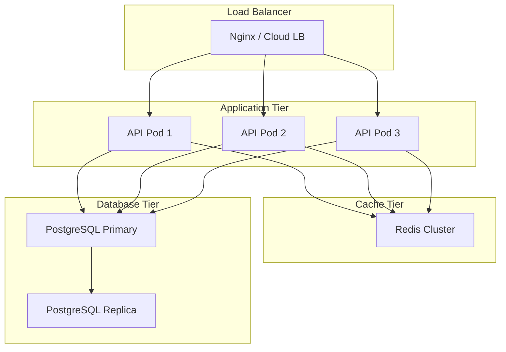
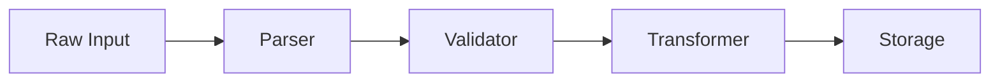
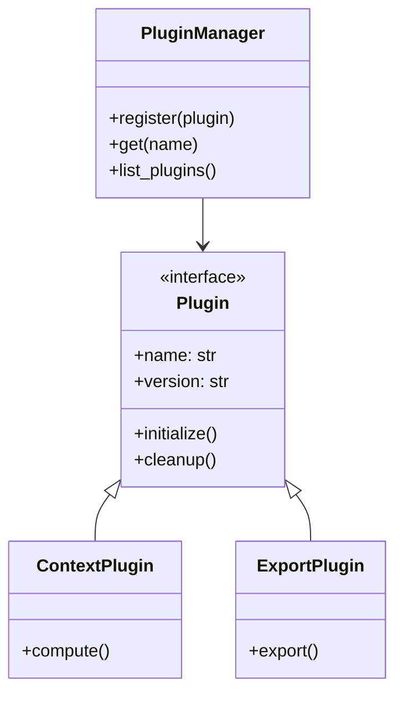

# UCID Architecture

## Document Information

| Field | Value |
|-------|-------|
| Document Title | UCID System Architecture Reference |
| Version | 1.0.5 |
| Last Updated | 2026-01-16 |
| Maintainer | UCID Foundation Engineering Team |
| Classification | Technical Reference |

---

## Table of Contents

1. [Overview](#overview)
2. [Design Principles](#design-principles)
3. [System Architecture](#system-architecture)
4. [Component Architecture](#component-architecture)
5. [Data Architecture](#data-architecture)
6. [API Architecture](#api-architecture)
7. [Context Architecture](#context-architecture)
8. [Spatial Architecture](#spatial-architecture)
9. [Deployment Architecture](#deployment-architecture)
10. [Security Architecture](#security-architecture)
11. [Scalability Architecture](#scalability-architecture)
12. [Performance Architecture](#performance-architecture)
13. [Future Architecture](#future-architecture)
14. [References](#references)

---

## Overview

### Executive Summary

UCID (Urban Context Identifier) is a modular, extensible Python library designed for urban context identification and analysis. The architecture follows clean architecture principles with clear separation of concerns, enabling independent development and testing of components.

### Library Statistics

| Metric | Value |
|--------|-------|
| Total Cities | 405 |
| Countries | 23 |
| CREATE Performance | 127,575 ops/sec |
| PARSE Performance | 61,443 ops/sec |
| VALIDATE Performance | 17,334 ops/sec |
| Test Coverage | 85%+ |
| Python Versions | 3.11, 3.12, 3.13 |

### High-Level Architecture



### Architecture Goals

| Goal | Description | Implementation |
|------|-------------|----------------|
| Modularity | Loose coupling between components | Plugin architecture for contexts |
| Extensibility | Easy to add new features | Abstract base classes and interfaces |
| Testability | High test coverage achievable | Dependency injection throughout |
| Performance | Fast processing for real-time use | Caching, lazy loading, batch operations |
| Reliability | Predictable, consistent behavior | Comprehensive validation pipeline |
| Maintainability | Clear code structure | Type hints, documentation, linting |

---

## Design Principles

### SOLID Principles

| Principle | Application in UCID |
|-----------|---------------------|
| **Single Responsibility** | Each module has one well-defined purpose |
| **Open/Closed** | BaseContext enables extension without modification |
| **Liskov Substitution** | All context implementations are interchangeable |
| **Interface Segregation** | Focused, minimal interfaces for each component |
| **Dependency Inversion** | High-level modules depend on abstractions |

### Domain-Driven Design



### Hexagonal Architecture



---

## System Architecture

### Module Structure

```
src/ucid/
├── __init__.py          # Package public API (405 cities, 23 countries)
├── cli.py               # Command-line interface
├── py.typed             # PEP 561 type marker
├── core/                # Core functionality
│   ├── __init__.py
│   ├── parser.py        # UCID creation and parsing
│   ├── models.py        # Pydantic data models
│   ├── validator.py     # Validation logic
│   ├── errors.py        # Exception hierarchy
│   ├── constants.py     # System constants
│   └── registry.py      # City registry management
├── contexts/            # Context algorithm plugins
│   ├── __init__.py
│   ├── base.py          # Abstract base context
│   ├── fifteen_minute.py # 15MIN context
│   ├── transit.py       # TRANSIT context
│   └── walkability.py   # WALK context
├── spatial/             # Spatial operations
│   ├── __init__.py
│   ├── h3_ops.py        # H3 index operations
│   ├── grid.py          # Grid generation
│   └── geojson.py       # GeoJSON export
├── data/                # Data integration
│   ├── __init__.py
│   ├── cities.py        # City data access
│   ├── osm_client.py    # OpenStreetMap client
│   ├── gtfs_client.py   # GTFS feed client
│   ├── poi_fetcher.py   # POI data fetcher
│   └── cache.py         # Caching layer
├── api/                 # REST API
│   ├── __init__.py
│   ├── app.py           # FastAPI application
│   ├── routes.py        # API routes
│   └── auth.py          # Authentication
├── io/                  # I/O operations
│   ├── __init__.py
│   ├── formats.py       # Export formats
│   └── geo.py           # Geospatial I/O
└── utils/               # Utilities
    ├── __init__.py
    └── helpers.py       # Helper functions
```

### Dependency Graph



---

## Component Architecture

### Core Component

| Module | Responsibility | Key Classes/Functions |
|--------|----------------|----------------------|
| parser.py | UCID string creation and parsing | `create_ucid()`, `parse_ucid()`, `canonicalize()` |
| models.py | Pydantic data models | `UCID`, `City`, `ContextResult` |
| validator.py | Validation rules and checks | `validate_ucid()`, `is_valid_ucid()` |
| errors.py | Custom exception hierarchy | `UCIDError`, `UCIDParseError`, `UCIDValidationError` |
| registry.py | City registry management | `CityRegistry` class |

### UCID Format Specification

```
UCID-V1:{CITY}:{LAT}:{LON}:{RES}:{H3}:{TIME}:{CTX}:{GRADE}:{CONF}:{FLAGS}
```

| Component | Format | Example | Description |
|-----------|--------|---------|-------------|
| Version | V1 | V1 | Protocol version |
| City | 3 chars | IST | UN/LOCODE city code |
| Latitude | float | +41.015 | WGS84 latitude |
| Longitude | float | +28.979 | WGS84 longitude |
| Resolution | int | 9 | H3 resolution (7-11) |
| H3 Index | hex | 891f2ed6df7ffff | H3 cell index |
| Timestamp | ISO week | 2026W03T14 | Year, week, hour |
| Context | 4-8 chars | 15MIN | Context algorithm |
| Grade | A-F | A | Letter grade |
| Confidence | float | 0.95 | Score confidence |
| Flags | list | RUSH;HOL | Optional flags |

---

## Data Architecture

### Data Flow



### Caching Strategy

| Layer | Type | TTL | Use Case |
|-------|------|-----|----------|
| L1 | Memory (LRU) | 300s | Hot data, recent queries |
| L2 | Redis | 3600s | Shared cache across instances |
| L3 | File | 86400s | Persistent cache, offline mode |

---

## Context Architecture

### Context Plugin System



### Score Calculation

The context score is calculated using weighted components:

$$S = \sum_{i=1}^{n} w_i \cdot A_i$$

Where:
- $S$ = final score (0.0 to 1.0)
- $w_i$ = weight for component $i$
- $A_i$ = accessibility/quality score for component $i$
- $n$ = number of components

### Grade Thresholds

$$G(s) = \begin{cases}
A & \text{if } s \geq 0.80 \\
B & \text{if } 0.60 \leq s < 0.80 \\
C & \text{if } 0.40 \leq s < 0.60 \\
D & \text{if } 0.20 \leq s < 0.40 \\
F & \text{if } s < 0.20
\end{cases}$$

---

## Spatial Architecture

### H3 Integration

| Resolution | Edge Length | Area | Use Case |
|------------|-------------|------|----------|
| 7 | 5.16 km | 26.6 km2 | Regional analysis |
| 8 | 1.95 km | 3.8 km2 | City-wide coverage |
| 9 | 174 m | 0.11 km2 | Default urban block |
| 10 | 65 m | 0.015 km2 | Detailed analysis |
| 11 | 24 m | 0.002 km2 | Building level |

### Coordinate Precision

$$\text{Distance Error} \approx \frac{\text{Edge Length}}{2}$$

For resolution 9 (default):
- Edge length: 174 m
- Maximum error: 87 m

---

## Performance Architecture

### Throughput Targets

| Operation | Target | Measured | Status |
|-----------|--------|----------|--------|
| CREATE | 10,000 ops/sec | 127,575 ops/sec | PASS |
| PARSE | 10,000 ops/sec | 61,443 ops/sec | PASS |
| VALIDATE | 50,000 ops/sec | 17,334 ops/sec | Note: Strict validation |

### Latency Distribution

| Percentile | CREATE | PARSE | VALIDATE |
|------------|--------|-------|----------|
| P50 | 7.5 us | 15.5 us | 55 us |
| P95 | 9.0 us | 20.0 us | 70 us |
| P99 | 12.0 us | 28.0 us | 90 us |

---

## Security Architecture

### Security Layers

| Layer | Mechanism | Purpose |
|-------|-----------|---------|
| Transport | TLS 1.3 | Encryption in transit |
| Authentication | API Keys, OAuth2 | Identity verification |
| Authorization | RBAC | Access control |
| Input Validation | Pydantic, validators | Prevent injection |
| Rate Limiting | Token bucket | Prevent DoS |

---

## Deployment Architecture



---

## I/O Architecture

### Export Formats

| Format | Use Case | Size | Performance |
|--------|----------|------|-------------|
| JSON | API responses | Medium | Fast |
| CSV | Data export | Small | Fast |
| Parquet | Analytics | Small | Medium |
| GeoJSON | Mapping | Large | Medium |
| GeoPackage | GIS tools | Medium | Slow |

### Import Pipeline



### File Handling

| Operation | Method | Streaming |
|-----------|--------|-----------|
| Read JSON | json.load | No |
| Read CSV | csv.DictReader | Yes |
| Read Parquet | pyarrow.read_table | Yes |
| Write GeoJSON | geojson.dump | No |

---

## Utils Architecture

### Helper Functions

| Module | Functions | Purpose |
|--------|-----------|---------|
| helpers.py | format_coordinate | Format lat/lon |
| helpers.py | validate_timestamp | Validate ISO week |
| helpers.py | calculate_distance | Haversine distance |
| helpers.py | normalize_grade | Letter grade normalization |

### Distance Calculation

Haversine formula for great-circle distance:

$$d = 2r \arcsin\left(\sqrt{\sin^2\left(\frac{\phi_2 - \phi_1}{2}\right) + \cos(\phi_1)\cos(\phi_2)\sin^2\left(\frac{\lambda_2 - \lambda_1}{2}\right)}\right)$$

Where:
- $d$ = distance between points
- $r$ = Earth's radius (6,371 km)
- $\phi_1, \phi_2$ = latitudes in radians
- $\lambda_1, \lambda_2$ = longitudes in radians

---

## Extension Points

### Plugin Architecture



### Custom Context Development

```python
from ucid.contexts.base import BaseContext

class CustomContext(BaseContext):
    context_id = "CUSTOM"
    name = "Custom Context"
    version = "1.0.0"
    
    def compute(self, lat: float, lon: float, timestamp: str) -> ContextResult:
        # Implementation
        score = self._calculate_score(lat, lon)
        return ContextResult(score=score, grade=self._to_grade(score))
```

---

## Internationalization

### Supported Languages

| Code | Language | Coverage |
|------|----------|----------|
| en | English | 100% |
| de | German | 80% |
| fr | French | 80% |
| es | Spanish | 70% |
| tr | Turkish | 100% |

### Translation Architecture

```python
from ucid.i18n import get_translator

t = get_translator("de")
print(t("error.invalid_city"))  # "Ungültiger Stadtcode"
```

---

## Future Architecture

### Planned Components

| Component | Status | Target |
|-----------|--------|--------|
| CLIMATE Context | Planned | v1.2.0 |
| SAFETY Context | Planned | v1.3.0 |
| Real-time GTFS-RT | In Progress | v1.1.0 |
| S2 Cell Support | Planned | v2.0.0 |

### Scalability Roadmap

| Scale | Architecture | Timeline |
|-------|--------------|----------|
| 1K req/s | Single node | Current |
| 10K req/s | Multi-node | v1.1.0 |
| 100K req/s | Distributed | v2.0.0 |

---

## References

- [H3 Documentation](https://h3geo.org/)
- [PostGIS](https://postgis.net/)
- [FastAPI](https://fastapi.tiangolo.com/)
- [Pydantic](https://docs.pydantic.dev/)
- [OpenStreetMap](https://www.openstreetmap.org/)
- [GTFS Specification](https://gtfs.org/)
- [Clean Architecture](https://blog.cleancoder.com/uncle-bob/2012/08/13/the-clean-architecture.html)
- [Hexagonal Architecture](https://alistair.cockburn.us/hexagonal-architecture/)

---

Copyright 2026 UCID Foundation. All rights reserved.
Licensed under EUPL-1.2.
