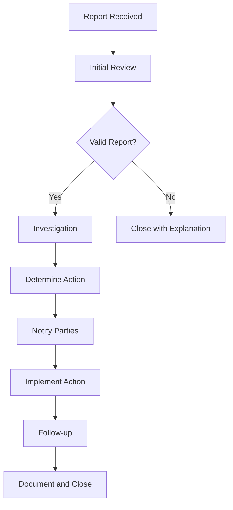
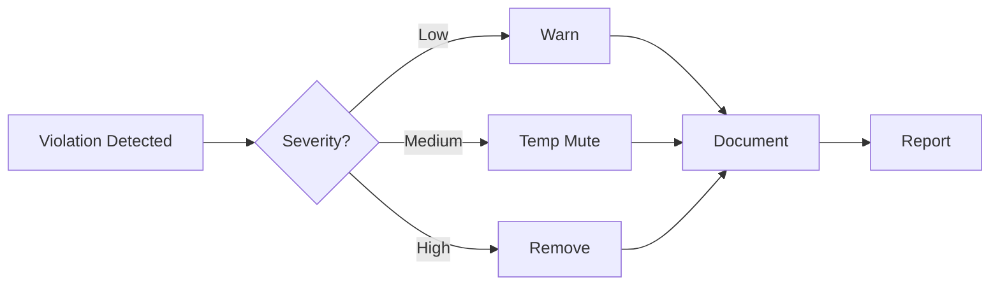

# UCID Code of Conduct

## Document Information

| Field | Value |
|-------|-------|
| Document Title | UCID Community Code of Conduct |
| Version | 1.0.5 |
| Last Updated | 2026-01-16 |
| Maintainer | UCID Foundation |
| Based On | Contributor Covenant 2.1 |

---

## Table of Contents

1. [Our Pledge](#our-pledge)
2. [Our Standards](#our-standards)
3. [Enforcement Responsibilities](#enforcement-responsibilities)
4. [Scope](#scope)
5. [Reporting Guidelines](#reporting-guidelines)
6. [Enforcement Process](#enforcement-process)
7. [Enforcement Guidelines](#enforcement-guidelines)
8. [Appeals Process](#appeals-process)
9. [Community Guidelines](#community-guidelines)
10. [Technical Conduct](#technical-conduct)
11. [Attribution](#attribution)

---

## Our Pledge

We as members, contributors, and leaders pledge to make participation in the UCID community a harassment-free experience for everyone, regardless of age, body size, visible or invisible disability, ethnicity, sex characteristics, gender identity and expression, level of experience, education, socio-economic status, nationality, personal appearance, race, caste, color, religion, or sexual identity and orientation.

We pledge to act and interact in ways that contribute to an open, welcoming, diverse, inclusive, and healthy community.

### Core Values

| Value | Description |
|-------|-------------|
| **Respect** | Treat all community members with dignity |
| **Inclusivity** | Welcome people of all backgrounds |
| **Collaboration** | Work together constructively |
| **Transparency** | Communicate openly and honestly |
| **Accountability** | Take responsibility for our actions |

---

## Our Standards

### Positive Behaviors

Examples of behavior that contributes to a positive environment:

| Category | Examples |
|----------|----------|
| **Communication** | Using welcoming and inclusive language |
| **Respect** | Being respectful of differing viewpoints and experiences |
| **Feedback** | Giving and gracefully accepting constructive feedback |
| **Collaboration** | Focusing on what is best for the community |
| **Empathy** | Showing empathy towards other community members |
| **Learning** | Being open to learning from others |
| **Recognition** | Acknowledging others' contributions |
| **Patience** | Being patient with newcomers |

### Positive Communication Examples

```
Good: "I think there might be a different approach we could try. What do you think about..."

Good: "Thank you for your contribution! I have some suggestions that might help..."

Good: "I don't fully understand this yet. Could you explain more about..."

Good: "That's an interesting perspective. Have you considered..."
```

### Unacceptable Behaviors

Examples of unacceptable behavior:

| Category | Examples |
|----------|----------|
| **Harassment** | Sexual language, imagery, or unwanted attention |
| **Attacks** | Trolling, insulting, or derogatory comments |
| **Personal** | Personal or political attacks |
| **Privacy** | Publishing others' private information |
| **Professional** | Conduct inappropriate in a professional setting |
| **Discrimination** | Any form of discrimination |
| **Intimidation** | Threatening or intimidating behavior |
| **Disruption** | Sustained disruption of discussions |

### Unacceptable Communication Examples

```
Bad: "That's a stupid question."

Bad: "You clearly don't know what you're doing."

Bad: "This code is garbage."

Bad: Any personal insults or attacks
```

---

## Enforcement Responsibilities

### Community Leaders

Community leaders are responsible for clarifying and enforcing our standards of acceptable behavior and will take appropriate and fair corrective action in response to any behavior that they deem inappropriate, threatening, offensive, or harmful.

### Leader Responsibilities

| Responsibility | Description |
|----------------|-------------|
| **Clarification** | Clearly explain community standards |
| **Enforcement** | Consistently apply standards fairly |
| **Privacy** | Protect reporter confidentiality |
| **Impartiality** | Remain neutral in disputes |
| **Documentation** | Record incidents and actions |
| **Communication** | Keep parties informed of process |

### Rights of Leaders

Community leaders have the right and responsibility to:

1. Remove, edit, or reject comments, commits, code, wiki edits, issues, and other contributions that are not aligned to this Code of Conduct
2. Temporarily or permanently ban any contributor for behaviors deemed inappropriate, threatening, offensive, or harmful
3. Communicate reasons for moderation decisions when appropriate

---

## Scope

### Where This Applies

This Code of Conduct applies within all community spaces, including:

| Space | Examples |
|-------|----------|
| **Code Repositories** | GitHub issues, pull requests, comments |
| **Communication** | Mailing lists, chat channels, forums |
| **Events** | Conferences, meetups, workshops |
| **Social Media** | Official accounts and hashtags |
| **Direct** | One-on-one communications in community context |

### External Representation

This Code of Conduct also applies when an individual is officially representing the community in public spaces. Examples include:

- Using an official project email address
- Posting via an official social media account
- Acting as an appointed representative at an online or offline event
- Representing UCID at conferences or meetups

---

## Reporting Guidelines

### How to Report

If you experience or witness unacceptable behavior, please report it by contacting the conduct team:

| Contact | Purpose |
|---------|---------|
| conduct@ucid.org | Primary conduct team email |
| security@ucid.org | Security-related conduct issues |

### What to Include

When reporting, please include:

1. **Your contact information** (if comfortable sharing)
2. **Names of people involved** (usernames, real names if known)
3. **Description of the incident** (what happened)
4. **When and where it occurred** (date, time, location/URL)
5. **Any witnesses** (usernames if applicable)
6. **Screenshots or logs** (if available)
7. **Additional context** (prior interactions, etc.)

### Report Template

```
Subject: Code of Conduct Report

1. Reporter Information (optional):
   Name:
   Email:

2. Incident Details:
   Date/Time:
   Location/URL:

3. People Involved:
   - [Person 1]:
   - [Person 2]:

4. Description:
   [Detailed description of what happened]

5. Witnesses:
   - [Witness 1]:

6. Evidence:
   [Links to screenshots, logs, etc.]

7. Additional Context:
   [Any other relevant information]
```

### Confidentiality

All reports will be handled with discretion. We will:

- Protect the identity of the reporter
- Only share information on a need-to-know basis
- Keep records secure and confidential
- Not retaliate against good-faith reporters

---

## Enforcement Process

### Process Overview



### Timeline

| Phase | Timeline | Description |
|-------|----------|-------------|
| Acknowledgment | 24 hours | Confirm receipt of report |
| Initial Review | 48 hours | Assess validity and urgency |
| Investigation | 1-2 weeks | Gather information |
| Decision | 72 hours | Determine appropriate action |
| Notification | 24 hours | Inform all parties |
| Implementation | Immediate | Apply consequences |
| Appeal Window | 14 days | Allow for appeals |

---

## Enforcement Guidelines

Community leaders will follow these Community Impact Guidelines in determining the consequences for any action they deem in violation of this Code of Conduct.

### Level 1: Correction

**Community Impact**: Use of inappropriate language or other behavior deemed unprofessional or unwelcome in the community.

**Consequence**: A private, written warning from community leaders, providing clarity around the nature of the violation and an explanation of why the behavior was inappropriate. A public apology may be requested.

| Aspect | Details |
|--------|---------|
| Duration | Immediate |
| Record | Kept for 6 months |
| Escalation | Level 2 if repeated |

### Level 2: Warning

**Community Impact**: A violation through a single incident or series of actions.

**Consequence**: A warning with consequences for continued behavior. No interaction with the people involved, including unsolicited interaction with those enforcing the Code of Conduct, for a specified period of time. This includes avoiding interactions in community spaces as well as external channels like social media. Violating these terms may lead to a temporary or permanent ban.

| Aspect | Details |
|--------|---------|
| Duration | 30 days |
| Record | Kept for 1 year |
| Escalation | Level 3 if violated |

### Level 3: Temporary Ban

**Community Impact**: A serious violation of community standards, including sustained inappropriate behavior.

**Consequence**: A temporary ban from any sort of interaction or public communication with the community for a specified period of time. No public or private interaction with the people involved, including unsolicited interaction with those enforcing the Code of Conduct, is allowed during this period. Violating these terms may lead to a permanent ban.

| Aspect | Details |
|--------|---------|
| Duration | 90 days |
| Record | Kept for 2 years |
| Escalation | Level 4 if violated |

### Level 4: Permanent Ban

**Community Impact**: Demonstrating a pattern of violation of community standards, including sustained inappropriate behavior, harassment of an individual, or aggression toward or disparagement of classes of individuals.

**Consequence**: A permanent ban from any sort of public interaction within the community.

| Aspect | Details |
|--------|---------|
| Duration | Permanent |
| Record | Kept indefinitely |
| Appeal | After 1 year minimum |

---

## Appeals Process

### How to Appeal

If you believe an enforcement decision was made in error, you may appeal:

1. **Submit appeal** to conduct-appeals@ucid.org within 14 days
2. **Include** the original incident reference number
3. **Explain** why you believe the decision was incorrect
4. **Provide** any new information or context

### Appeal Review

Appeals will be reviewed by community leaders who were not involved in the original decision. The appeal decision is final.

---

## Community Guidelines

### General Guidelines

| Guideline | Description |
|-----------|-------------|
| **Be Welcoming** | Help newcomers feel included |
| **Be Patient** | Remember everyone was new once |
| **Be Considerate** | Think about how your actions affect others |
| **Be Respectful** | Disagreement is not an excuse for poor behavior |
| **Be Careful with Words** | Sarcasm and jokes may be misunderstood |
| **Be Forgiving** | Assume good intentions |

### Communication Guidelines

1. **Use clear language**: Avoid jargon when possible
2. **Be concise**: Respect others' time
3. **Stay on topic**: Keep discussions focused
4. **Use proper channels**: Ask in appropriate forums
5. **Search first**: Check if questions have been answered

---

## Technical Conduct

### Code Review Conduct

| Do | Don't |
|----|-------|
| Focus on the code, not the person | Make personal attacks |
| Explain your reasoning | Be dismissive |
| Offer alternatives | Just say "this is wrong" |
| Be timely with reviews | Leave PRs hanging |
| Acknowledge good work | Only point out problems |

### Issue and PR Conduct

1. **Be descriptive**: Provide enough context
2. **Be responsive**: Reply to questions promptly
3. **Be patient**: Maintainers are often volunteers
4. **Be grateful**: Thank contributors for their work
5. **Be constructive**: Offer solutions, not just problems

---

## Online Event Guidelines

### Virtual Meetings

| Guideline | Description |
|-----------|-------------|
| Camera Optional | Participants may keep cameras off |
| Mute When Not Speaking | Reduce background noise |
| Use Chat | For questions and comments |
| Be Present | Minimize distractions |
| Respect Time Zones | Consider global participants |

### Online Chat Conduct

| Do | Don't |
|----|-------|
| Use threads for discussions | Spam the main channel |
| Keep topics focused | Go off-topic |
| Welcome new members | Ignore newcomers |
| Be patient with responses | Expect immediate replies |

---

## In-Person Event Guidelines

### Conference Conduct

| Guideline | Description |
|-----------|-------------|
| Wear Badge | Identification at all times |
| Respect Space | Personal boundaries matter |
| Report Issues | To event staff immediately |
| Follow Venue Rules | Adhere to local policies |

### Photography and Recording

1. **Ask Permission**: Before photographing individuals
2. **Opt-Out Stickers**: Respect those who don't want photos
3. **No Recording**: Without explicit consent
4. **Share Carefully**: Consider privacy when posting

---

## Moderation Guidelines

### For Moderators

| Responsibility | Action |
|----------------|--------|
| Monitor Channels | Watch for violations |
| Act Promptly | Address issues quickly |
| Document Everything | Keep records |
| Escalate When Needed | Contact leadership |

### Moderation Tools



---

## Translations

### Available Languages

| Language | Status | Maintainer |
|----------|--------|------------|
| English | Complete | UCID Foundation |
| German | In Progress | Community |
| French | In Progress | Community |
| Spanish | Planned | - |
| Turkish | Complete | UCID Foundation |

### Translation Guidelines

1. Maintain the spirit and intent of the original
2. Use culturally appropriate language
3. Keep legal terms accurate
4. Update translations with each revision

---

## FAQ

### General Questions

**Q: Who does this Code of Conduct apply to?**

A: All community members, including contributors, maintainers, users, and event attendees.

**Q: What if I witness a violation?**

A: Report it to conduct@ucid.org with details.

**Q: Can I remain anonymous when reporting?**

A: Yes, anonymous reports are accepted.

**Q: What happens after I report?**

A: You will receive acknowledgment within 24 hours and updates on the investigation.

### Enforcement Questions

**Q: How are decisions made?**

A: The conduct team reviews reports, investigates, and decides based on the enforcement guidelines.

**Q: Can I appeal a decision?**

A: Yes, within 14 days to conduct-appeals@ucid.org.

**Q: Are records kept permanently?**

A: Records are kept for the duration specified in the enforcement level.

---

## Resources

### External Resources

| Resource | URL |
|----------|-----|
| Contributor Covenant | https://www.contributor-covenant.org |
| Mozilla Participation Guidelines | https://www.mozilla.org/en-US/about/governance/policies/participation/ |
| Django Code of Conduct | https://www.djangoproject.com/conduct/ |

### Books and Articles

- "The Art of Community" by Jono Bacon
- "Working in Public" by Nadia Eghbal
- "Psychological Safety and Learning in Organizations" by Amy Edmondson

---

## Attribution

This Code of Conduct is adapted from the Contributor Covenant, version 2.1, available at https://www.contributor-covenant.org/version/2/1/code_of_conduct.html

Community Impact Guidelines were inspired by Mozilla's code of conduct enforcement ladder.

For answers to common questions about this code of conduct, see the FAQ at https://www.contributor-covenant.org/faq

---

## Contact Information

| Contact | Purpose |
|---------|---------|
| conduct@ucid.org | Code of Conduct issues |
| security@ucid.org | Security concerns |
| contact@ucid.org | General inquiries |

---

## Revision History

| Version | Date | Changes |
|---------|------|---------|
| 1.0.5 | 2026-01-16 | Added FAQ, translations, event guidelines |
| 1.0.0 | 2025-12-01 | Initial release |

---

Copyright 2026 UCID Foundation. All rights reserved.
Licensed under EUPL-1.2.
