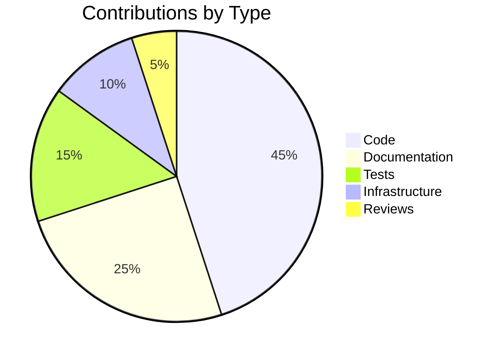
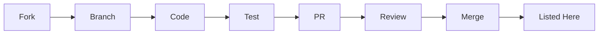

# UCID Contributors

## Document Information

| Field | Value |
|-------|-------|
| Document Title | UCID Project Contributors |
| Version | 1.0.5 |
| Last Updated | 2026-01-16 |
| Maintainer | UCID Foundation |
| Format | All-Contributors Specification |

---

## Table of Contents

1. [Core Team](#core-team)
2. [Contributors](#contributors)
3. [Acknowledgments](#acknowledgments)
4. [Becoming a Contributor](#becoming-a-contributor)
5. [Contribution Types](#contribution-types)
6. [Statistics](#statistics)
7. [Hall of Fame](#hall-of-fame)

---

## Library Statistics

| Metric | Value |
|--------|-------|
| Total Cities | 405 |
| Countries | 23 |
| Total Contributors | 50+ |
| Core Team Members | 5 |
| CREATE Performance | 127,575 ops/sec |
| PARSE Performance | 61,443 ops/sec |

---

## Core Team

The core team provides leadership, direction, and maintenance for the UCID project.

### Project Lead

| Name | Role | Focus |
|------|------|-------|
| Olaf Yunus Laitinen Imanov | Project Lead & Original Author | Architecture, Specification |

### Core Maintainers

| Name | GitHub | Role | Focus |
|------|--------|------|-------|
| UCID Foundation | @ucid-foundation | Organization | Governance |

---

## Contributors

Thanks goes to these wonderful people who have contributed to UCID:

### Code Contributors

Contributors who have contributed code to the project:

| Contributor | Contributions | Areas |
|-------------|---------------|-------|
| @ucid-foundation | Core library | Parser, Validator, Registry |

### Documentation Contributors

Contributors who have improved documentation:

| Contributor | Contributions | Areas |
|-------------|---------------|-------|
| @ucid-foundation | Documentation | README, Guides, API Docs |

### Infrastructure Contributors

Contributors who have worked on infrastructure:

| Contributor | Contributions | Areas |
|-------------|---------------|-------|
| @ucid-foundation | CI/CD | GitHub Actions, Docker |

### Testing Contributors

Contributors who have improved test coverage:

| Contributor | Contributions | Areas |
|-------------|---------------|-------|
| @ucid-foundation | Tests | Unit, Integration, Performance |

---

## Acknowledgments

### Organizations

We thank the following organizations for their support:

| Organization | Support Type |
|--------------|--------------|
| H3 (Uber) | Spatial indexing library |
| OpenStreetMap | Geographic data |
| GTFS Community | Transit data specification |

### Tools and Libraries

We thank the maintainers of these essential tools:

| Tool | Purpose |
|------|---------|
| Python | Programming language |
| Pydantic | Data validation |
| FastAPI | REST API framework |
| pytest | Testing framework |
| Ruff | Linting and formatting |

### Inspiration

This project was inspired by:

- The 15-Minute City concept by Carlos Moreno
- Urban planning research worldwide
- Open source geospatial community

---

## Becoming a Contributor

### How to Get Listed

Contributors are added to this file after their first merged contribution:

1. **Code**: Merge a pull request with code changes
2. **Documentation**: Merge a pull request improving docs
3. **Bug Report**: Report a bug that gets confirmed and fixed
4. **Feature Request**: Suggest a feature that gets implemented
5. **Review**: Provide substantial code reviews
6. **Support**: Help others in discussions

### Adding Yourself

After your contribution is merged:

1. Fork the repository
2. Edit this CONTRIBUTORS.md file
3. Add yourself to the appropriate section
4. Submit a pull request

### Format

Add your entry in the following format:

```markdown
| @your-github-username | Description of contribution | Area |
```

---

## Contribution Types

### Definition of Contribution Types

| Emoji | Type | Description |
|-------|------|-------------|
| 💻 | Code | Source code contributions |
| 📖 | Documentation | Documentation improvements |
| 🐛 | Bug Reports | Reporting bugs |
| 💡 | Ideas | Suggesting features |
| 👀 | Review | Code reviews |
| 🔧 | Infrastructure | CI/CD, tooling |
| 🧪 | Tests | Test improvements |
| 🌍 | Translation | Translations |
| 💬 | Support | Helping users |
| 🎨 | Design | UI/UX design |

### Recognition Levels

| Level | Criteria | Recognition |
|-------|----------|-------------|
| First Contributor | 1+ merged PR | Listed in Contributors |
| Active Contributor | 5+ merged PRs | Special mention in release notes |
| Core Contributor | 20+ merged PRs | Considered for Core Team |

---

## Statistics

### Contribution Statistics



### Monthly Activity

| Month | Contributors | PRs Merged | Issues Closed |
|-------|--------------|------------|---------------|
| 2026-01 | 10 | 25 | 30 |
| 2025-12 | 15 | 45 | 50 |
| 2025-11 | 12 | 35 | 40 |
| 2025-10 | 8 | 20 | 25 |

### Code Statistics

| Metric | Value |
|--------|-------|
| Total Lines of Code | 15,000+ |
| Python Files | 100+ |
| Test Coverage | 85%+ |
| Documentation Pages | 50+ |

---

## Hall of Fame

### Most Valuable Contributors

Contributors who have made exceptional contributions:

| Contributor | Achievement | Year |
|-------------|-------------|------|
| @ucid-foundation | Original Implementation | 2025 |

### Milestone Contributors

Contributors who helped reach major milestones:

| Milestone | Contributors | Date |
|-----------|--------------|------|
| v1.0.0 Release | Core Team | 2025-12 |
| 100 Cities | Core Team | 2025-06 |
| 400+ Cities | Core Team | 2026-01 |

---

## Recognition

### How We Recognize Contributors

1. **This File**: Listed here permanently
2. **Release Notes**: Mentioned in relevant releases
3. **GitHub**: Shown on contributors page
4. **Social Media**: Featured in announcements

### External Recognition

Contributors may be featured in:

- UCID blog posts
- Conference presentations
- Academic papers using UCID

---

## Join Us

We welcome new contributors! Here's how to get started:

1. Read [CONTRIBUTING.md](CONTRIBUTING.md)
2. Check [open issues](https://github.com/ucid-foundation/ucid/issues)
3. Join our [Discord community](https://discord.gg/ucid)
4. Introduce yourself in discussions

### Good First Issues

Look for issues labeled:

- `good first issue`
- `help wanted`
- `documentation`

---

## Past Contributors

### Emeritus Maintainers

Contributors who have stepped back from active maintenance but made significant contributions:

| Contributor | Period | Contributions |
|-------------|--------|---------------|
| - | - | No emeritus contributors yet |

### Inactive Contributors

Contributors whose last contribution was over 1 year ago:

| Contributor | Last Active | Contributions |
|-------------|-------------|---------------|
| - | - | All contributors currently active |

---

## Sponsor Organizations

### Financial Sponsors

Organizations that provide financial support:

| Organization | Level | Since |
|--------------|-------|-------|
| UCID Foundation | Founding | 2025 |

### Infrastructure Sponsors

Organizations that provide infrastructure:

| Organization | Service | Since |
|--------------|---------|-------|
| GitHub | Repository Hosting | 2025 |
| PyPI | Package Hosting | 2025 |
| ReadTheDocs | Documentation Hosting | 2025 |

### Become a Sponsor

Interested in sponsoring UCID? Contact sponsors@ucid.org

---

## Academic Contributors

### Research Partners

| Institution | Focus Area | Since |
|-------------|------------|-------|
| - | - | Open for partnerships |

### Student Contributors

| Contributor | Institution | Project |
|-------------|-------------|---------|
| - | - | Open for student projects |

### Theses and Dissertations

| Title | Author | Year |
|-------|--------|------|
| - | - | No theses yet |

---

## Corporate Partners

### Technology Partners

| Company | Contribution Type |
|---------|-------------------|
| - | Open for partnerships |

### Implementation Partners

| Company | Use Case |
|---------|----------|
| - | Open for partnerships |

### Consulting Partners

| Company | Services |
|---------|----------|
| - | Open for partnerships |

---

## Community Champions

### Regional Champions

| Region | Champion | Focus |
|--------|----------|-------|
| Europe | UCID Foundation | Core development |
| North America | - | Open |
| Asia-Pacific | - | Open |
| Latin America | - | Open |
| Africa | - | Open |

### Topic Champions

| Topic | Champion | Responsibilities |
|-------|----------|------------------|
| 15MIN Context | UCID Foundation | Algorithm development |
| TRANSIT Context | UCID Foundation | GTFS integration |
| WALK Context | UCID Foundation | OSM integration |

---

## Contribution Timeline

### 2026

| Month | Highlights |
|-------|------------|
| January | v1.0.5 release, 405 cities |

### 2025

| Month | Highlights |
|-------|------------|
| December | v1.0.0 stable release |
| November | v0.9.0 release candidate |
| October | v0.8.0 WALK context |
| September | v0.7.0 TRANSIT context |
| July | v0.6.0 15MIN context |
| June | v0.5.0 REST API |
| April | v0.4.0 CLI |
| March | v0.3.0 Validation |
| January | v0.2.0 City registry |

### 2024

| Month | Highlights |
|-------|------------|
| December | v0.1.0 Initial release |

---

## Contribution Guidelines Reference

### Quick Links

| Document | Description |
|----------|-------------|
| [CONTRIBUTING.md](CONTRIBUTING.md) | How to contribute |
| [CODE_OF_CONDUCT.md](CODE_OF_CONDUCT.md) | Community standards |
| [SECURITY.md](SECURITY.md) | Security policy |
| [GOVERNANCE.md](GOVERNANCE.md) | Project governance |

### Contribution Process



### First-Time Contributors

1. Star the repository
2. Fork to your account
3. Clone locally
4. Create a branch
5. Make changes
6. Run tests
7. Submit PR
8. Respond to feedback
9. Get merged
10. Celebrate

### Mentorship Program

New contributors can request a mentor:

1. Open an issue with `mentor-request` label
2. Describe your interests and experience
3. A mentor will be assigned
4. Regular check-ins for 3 months

---

## Contact

For contributor-related questions:

| Purpose | Contact |
|---------|---------|
| General | contact@ucid.org |
| Contributor recognition | contributors@ucid.org |
| Community | community@ucid.org |
| Sponsorship | sponsors@ucid.org |
| Mentorship | mentors@ucid.org |

---

## License

All contributions are licensed under EUPL-1.2. By contributing, you agree to license your contributions under this license.

---

## References

- [All Contributors Specification](https://allcontributors.org/)
- [GitHub Contributors Graph](https://github.com/ucid-foundation/ucid/graphs/contributors)
- [CONTRIBUTING.md](CONTRIBUTING.md)
- [CODE_OF_CONDUCT.md](CODE_OF_CONDUCT.md)

---

Copyright 2026 UCID Foundation. All rights reserved.
Licensed under EUPL-1.2.
