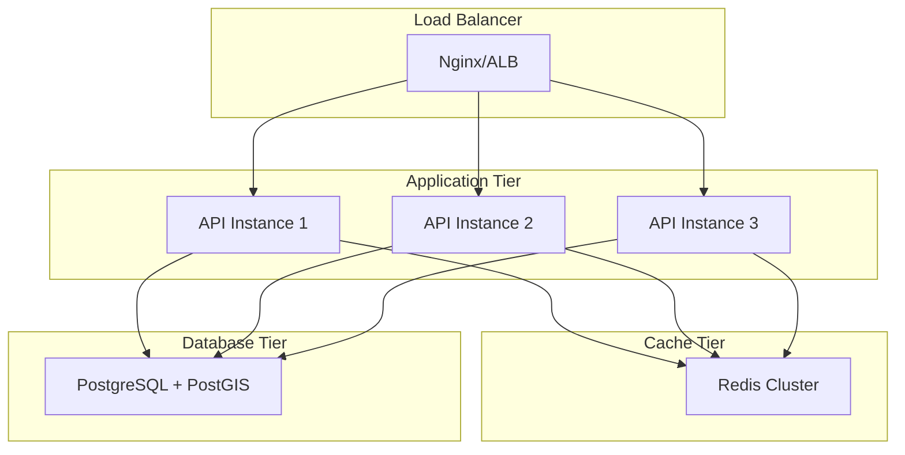

# Deployment Guide

This document provides comprehensive guidance for deploying the UCID (Urban Context Identifier) system in various environments.

---

## Table of Contents

1. [Overview](#overview)
2. [Prerequisites](#prerequisites)
3. [Local Development](#local-development)
4. [Docker Deployment](#docker-deployment)
5. [Kubernetes Deployment](#kubernetes-deployment)
6. [Cloud Deployment](#cloud-deployment)
7. [Database Setup](#database-setup)
8. [Configuration](#configuration)
9. [Monitoring](#monitoring)
10. [Maintenance](#maintenance)

---

## Overview

### Deployment Options

| Option | Best For | Complexity |
|--------|----------|------------|
| Local Development | Development, testing | Low |
| Docker Compose | Single server, demos | Low |
| Kubernetes | Production, scaling | High |
| Cloud Managed | Enterprise, SaaS | Medium |

### Architecture Overview



---

## Prerequisites

### System Requirements

| Resource | Minimum | Recommended |
|----------|---------|-------------|
| CPU | 2 cores | 4+ cores |
| RAM | 4 GB | 16+ GB |
| Storage | 20 GB | 100+ GB SSD |
| Network | 100 Mbps | 1 Gbps |

### Software Requirements

| Software | Version | Purpose |
|----------|---------|---------|
| Python | 3.11+ | Application runtime |
| PostgreSQL | 14+ | Database |
| PostGIS | 3.3+ | Spatial extension |
| Redis | 7+ | Caching |
| Docker | 24+ | Containerization |
| Kubernetes | 1.28+ | Orchestration |

---

## Local Development

### Quick Start

```bash
# Clone repository
git clone https://github.com/ucid-foundation/ucid.git
cd ucid

# Create virtual environment
python -m venv venv
source venv/bin/activate  # Linux/macOS
venv\Scripts\activate     # Windows

# Install dependencies
pip install -e ".[dev,contexts]"

# Run development server
uvicorn ucid.api:app --reload --port 8000
```

### Development Environment

```bash
# Start supporting services
docker-compose -f docker-compose.dev.yml up -d

# Set environment variables
export DATABASE_URL=postgresql://localhost/ucid_dev
export REDIS_URL=redis://localhost:6379

# Initialize database
python -m ucid.db init

# Run tests
pytest
```

---

## Docker Deployment

### Single Container

```bash
# Build image
docker build -t ucid/ucid-api:latest .

# Run container
docker run -d \
  --name ucid-api \
  -p 8000:8000 \
  -e DATABASE_URL=postgresql://host/db \
  -e REDIS_URL=redis://host:6379 \
  ucid/ucid-api:latest
```

### Docker Compose

```yaml
# docker-compose.yml
version: '3.8'

services:
  api:
    image: ucid/ucid-api:latest
    ports:
      - "8000:8000"
    environment:
      - DATABASE_URL=postgresql://postgres:password@db:5432/ucid
      - REDIS_URL=redis://redis:6379
    depends_on:
      - db
      - redis

  db:
    image: postgis/postgis:15-3.3
    environment:
      - POSTGRES_USER=postgres
      - POSTGRES_PASSWORD=password
      - POSTGRES_DB=ucid
    volumes:
      - postgres_data:/var/lib/postgresql/data

  redis:
    image: redis:7-alpine
    volumes:
      - redis_data:/data

volumes:
  postgres_data:
  redis_data:
```

### Running Docker Compose

```bash
# Start all services
docker-compose up -d

# View logs
docker-compose logs -f api

# Scale API instances
docker-compose up -d --scale api=3

# Stop services
docker-compose down
```

---

## Kubernetes Deployment

### Namespace and ConfigMap

```yaml
# k8s/namespace.yaml
apiVersion: v1
kind: Namespace
metadata:
  name: ucid

---
# k8s/configmap.yaml
apiVersion: v1
kind: ConfigMap
metadata:
  name: ucid-config
  namespace: ucid
data:
  LOG_LEVEL: "INFO"
  WORKERS: "4"
```

### Secret

```yaml
# k8s/secret.yaml
apiVersion: v1
kind: Secret
metadata:
  name: ucid-secrets
  namespace: ucid
type: Opaque
stringData:
  DATABASE_URL: postgresql://user:pass@db:5432/ucid
  REDIS_URL: redis://redis:6379
  API_KEY_SECRET: your-secret-key
```

### Deployment

```yaml
# k8s/deployment.yaml
apiVersion: apps/v1
kind: Deployment
metadata:
  name: ucid-api
  namespace: ucid
spec:
  replicas: 3
  selector:
    matchLabels:
      app: ucid-api
  template:
    metadata:
      labels:
        app: ucid-api
    spec:
      containers:
      - name: api
        image: ucid/ucid-api:1.0.0
        ports:
        - containerPort: 8000
        envFrom:
        - configMapRef:
            name: ucid-config
        - secretRef:
            name: ucid-secrets
        resources:
          requests:
            memory: "512Mi"
            cpu: "250m"
          limits:
            memory: "2Gi"
            cpu: "1000m"
        livenessProbe:
          httpGet:
            path: /health
            port: 8000
          initialDelaySeconds: 10
        readinessProbe:
          httpGet:
            path: /ready
            port: 8000
          initialDelaySeconds: 5
```

### Service and Ingress

```yaml
# k8s/service.yaml
apiVersion: v1
kind: Service
metadata:
  name: ucid-api
  namespace: ucid
spec:
  selector:
    app: ucid-api
  ports:
  - port: 80
    targetPort: 8000

---
# k8s/ingress.yaml
apiVersion: networking.k8s.io/v1
kind: Ingress
metadata:
  name: ucid-api
  namespace: ucid
  annotations:
    kubernetes.io/ingress.class: nginx
spec:
  rules:
  - host: api.ucid.org
    http:
      paths:
      - path: /
        pathType: Prefix
        backend:
          service:
            name: ucid-api
            port:
              number: 80
```

### Horizontal Pod Autoscaler

```yaml
# k8s/hpa.yaml
apiVersion: autoscaling/v2
kind: HorizontalPodAutoscaler
metadata:
  name: ucid-api
  namespace: ucid
spec:
  scaleTargetRef:
    apiVersion: apps/v1
    kind: Deployment
    name: ucid-api
  minReplicas: 3
  maxReplicas: 10
  metrics:
  - type: Resource
    resource:
      name: cpu
      target:
        type: Utilization
        averageUtilization: 70
```

---

## Cloud Deployment

### AWS

| Service | Purpose |
|---------|---------|
| EKS | Kubernetes cluster |
| RDS | PostgreSQL database |
| ElastiCache | Redis cache |
| ALB | Load balancer |
| ECR | Container registry |

### Google Cloud

| Service | Purpose |
|---------|---------|
| GKE | Kubernetes cluster |
| Cloud SQL | PostgreSQL database |
| Memorystore | Redis cache |
| Cloud Load Balancing | Load balancer |
| Artifact Registry | Container registry |

### Azure

| Service | Purpose |
|---------|---------|
| AKS | Kubernetes cluster |
| Azure Database | PostgreSQL database |
| Azure Cache | Redis cache |
| Azure LB | Load balancer |
| ACR | Container registry |

---

## Database Setup

### PostgreSQL with PostGIS

```sql
-- Create database
CREATE DATABASE ucid;

-- Enable extensions
\c ucid
CREATE EXTENSION IF NOT EXISTS postgis;
CREATE EXTENSION IF NOT EXISTS h3;

-- Create tables
CREATE TABLE ucid_scores (
    id SERIAL PRIMARY KEY,
    ucid_string TEXT UNIQUE NOT NULL,
    city TEXT NOT NULL,
    h3_index TEXT NOT NULL,
    lat DOUBLE PRECISION NOT NULL,
    lon DOUBLE PRECISION NOT NULL,
    geom GEOMETRY(Point, 4326),
    timestamp TIMESTAMP NOT NULL,
    context TEXT NOT NULL,
    score INTEGER NOT NULL,
    grade CHAR(1) NOT NULL,
    confidence INTEGER NOT NULL,
    created_at TIMESTAMP DEFAULT NOW()
);

-- Create indexes
CREATE INDEX idx_ucid_h3 ON ucid_scores USING GIST (h3_index);
CREATE INDEX idx_ucid_geom ON ucid_scores USING GIST (geom);
CREATE INDEX idx_ucid_city ON ucid_scores (city);
CREATE INDEX idx_ucid_context ON ucid_scores (context);
```

### Database Migrations

```bash
# Run migrations
alembic upgrade head

# Create new migration
alembic revision --autogenerate -m "Add new table"
```

---

## Configuration

### Environment Variables

| Variable | Required | Default | Description |
|----------|----------|---------|-------------|
| DATABASE_URL | Yes | - | PostgreSQL connection |
| REDIS_URL | No | - | Redis connection |
| API_KEY_SECRET | Yes | - | API key signing |
| LOG_LEVEL | No | INFO | Logging level |
| WORKERS | No | 4 | Gunicorn workers |

### Configuration File

```yaml
# config.yaml
server:
  host: 0.0.0.0
  port: 8000
  workers: 4

database:
  url: ${DATABASE_URL}
  pool_size: 10
  max_overflow: 20

cache:
  url: ${REDIS_URL}
  ttl: 3600

logging:
  level: INFO
  format: json
```

---

## Monitoring

### Health Endpoints

| Endpoint | Purpose |
|----------|---------|
| /health | Liveness check |
| /ready | Readiness check |
| /metrics | Prometheus metrics |

### Prometheus Metrics

```yaml
# prometheus.yml
scrape_configs:
  - job_name: 'ucid-api'
    static_configs:
      - targets: ['ucid-api:8000']
```

### Grafana Dashboard

Key metrics to monitor:

- Request rate
- Response latency
- Error rate
- Active connections
- Database queries
- Cache hit rate

---

## Maintenance

### Backup Strategy

| Component | Strategy | Frequency |
|-----------|----------|-----------|
| Database | pg_dump | Daily |
| Redis | RDB/AOF | Hourly |
| Logs | Archive | Weekly |

### Updates

```bash
# Pull latest image
docker pull ucid/ucid-api:latest

# Rolling update in Kubernetes
kubectl set image deployment/ucid-api \
  api=ucid/ucid-api:1.1.0 \
  --namespace ucid
```

---

## Troubleshooting

### Common Issues

| Issue | Solution |
|-------|----------|
| Connection refused | Check service is running |
| Database timeout | Check connection pool |
| Out of memory | Increase limits |
| Slow responses | Check indexes |

### Logs

```bash
# Docker logs
docker logs ucid-api -f

# Kubernetes logs
kubectl logs -f deployment/ucid-api -n ucid
```

---

Copyright 2026 UCID Foundation. All rights reserved.
