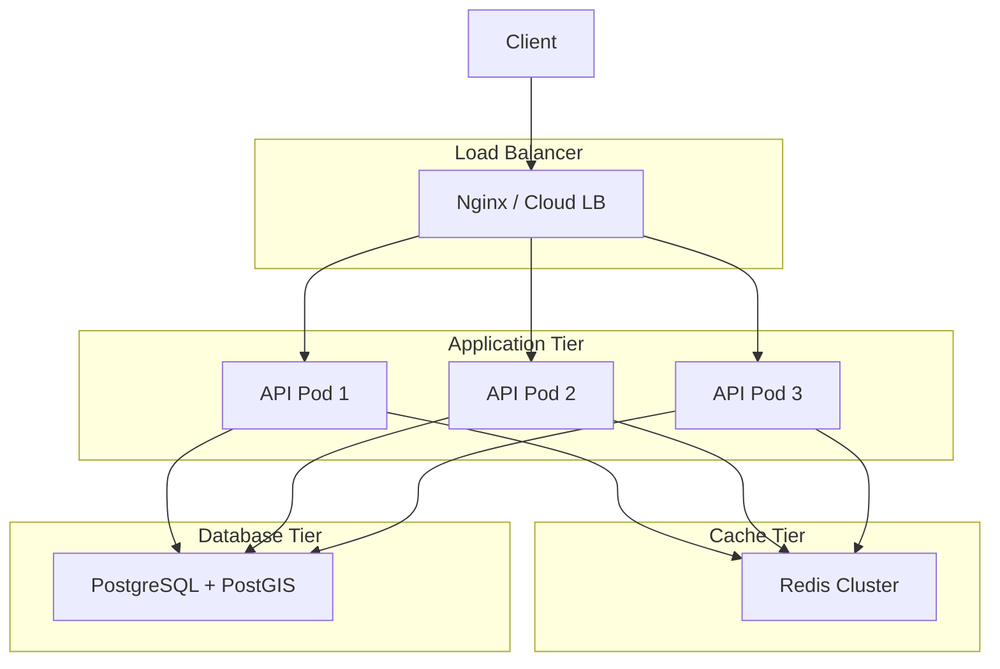

# UCID Deployment Guide

## Document Information

| Field | Value |
|-------|-------|
| Document Title | UCID Deployment and Operations Guide |
| Version | 1.0.5 |
| Last Updated | 2026-01-16 |
| Maintainer | UCID Foundation DevOps Team |

---

## Table of Contents

1. [Overview](#overview)
2. [Prerequisites](#prerequisites)
3. [Local Development](#local-development)
4. [Docker Deployment](#docker-deployment)
5. [Kubernetes Deployment](#kubernetes-deployment)
6. [Cloud Deployment](#cloud-deployment)
7. [Database Setup](#database-setup)
8. [Configuration](#configuration)
9. [Monitoring](#monitoring)
10. [Scaling](#scaling)
11. [Backup and Recovery](#backup-and-recovery)
12. [Maintenance](#maintenance)
13. [Troubleshooting](#troubleshooting)

---

## Overview

### Deployment Options

| Option | Complexity | Best For |
|--------|------------|----------|
| Local Development | Low | Development, testing |
| Docker Compose | Low | Single server, demos |
| Kubernetes | High | Production, scaling |
| Cloud Managed | Medium | Enterprise, SaaS |

### Library Statistics

| Metric | Value |
|--------|-------|
| Total Cities | 405 |
| Countries | 23 |
| CREATE Performance | 127,575 ops/sec |
| PARSE Performance | 61,443 ops/sec |

### Architecture Overview



---

## Prerequisites

### System Requirements

| Resource | Minimum | Recommended | Production |
|----------|---------|-------------|------------|
| CPU | 2 cores | 4 cores | 8+ cores |
| RAM | 4 GB | 8 GB | 16+ GB |
| Storage | 20 GB | 50 GB | 100+ GB SSD |
| Network | 100 Mbps | 1 Gbps | 10 Gbps |

### Software Requirements

| Software | Version | Purpose |
|----------|---------|---------|
| Python | 3.11+ | Application runtime |
| PostgreSQL | 15+ | Database |
| PostGIS | 3.4+ | Spatial extension |
| Redis | 7+ | Caching |
| Docker | 24+ | Containerization |
| Kubernetes | 1.28+ | Orchestration |

---

## Local Development

### Quick Start

```bash
# Clone repository
git clone https://github.com/ucid-foundation/ucid.git
cd ucid

# Create virtual environment
python -m venv venv
source venv/bin/activate  # Linux/macOS
venv\Scripts\activate     # Windows

# Install dependencies
pip install -e ".[dev]"

# Run tests
pytest tests/ -v

# Start development server
uvicorn ucid.api:app --reload --port 8000
```

### Development Environment

```bash
# Start supporting services
docker-compose -f docker-compose.dev.yml up -d

# Set environment variables
export UCID_DATABASE_URL=postgresql://localhost/ucid_dev
export UCID_REDIS_URL=redis://localhost:6379

# Initialize database
python -m ucid.db init

# Run development server
make dev
```

### Environment Variables

```bash
# Create .env from template
cp .env.example .env

# Edit configuration
nano .env
```

---

## Docker Deployment

### Single Container

```bash
# Build image
docker build -t ucid/ucid-api:latest .

# Run container
docker run -d \
  --name ucid-api \
  -p 8000:8000 \
  -e UCID_ENV=production \
  -e UCID_LOG_LEVEL=INFO \
  ucid/ucid-api:latest

# View logs
docker logs -f ucid-api
```

### Docker Compose

```yaml
# docker-compose.yml
version: '3.9'

services:
  api:
    image: ucid/ucid-api:latest
    ports:
      - "8000:8000"
    environment:
      - UCID_DATABASE_URL=postgresql://db/ucid
      - UCID_REDIS_URL=redis://redis:6379
    depends_on:
      - db
      - redis

  db:
    image: postgis/postgis:16-3.4
    environment:
      POSTGRES_DB: ucid
      POSTGRES_USER: ucid
      POSTGRES_PASSWORD: ${POSTGRES_PASSWORD}
    volumes:
      - postgres_data:/var/lib/postgresql/data

  redis:
    image: redis:7-alpine
    volumes:
      - redis_data:/data

volumes:
  postgres_data:
  redis_data:
```

### Running Docker Compose

```bash
# Start services
docker-compose up -d

# View logs
docker-compose logs -f

# Scale API
docker-compose up -d --scale api=3

# Stop services
docker-compose down
```

---

## Kubernetes Deployment

### Namespace

```yaml
# k8s/namespace.yaml
apiVersion: v1
kind: Namespace
metadata:
  name: ucid
  labels:
    app.kubernetes.io/name: ucid
```

### ConfigMap

```yaml
# k8s/configmap.yaml
apiVersion: v1
kind: ConfigMap
metadata:
  name: ucid-config
  namespace: ucid
data:
  UCID_ENV: "production"
  UCID_LOG_LEVEL: "INFO"
  UCID_API_WORKERS: "4"
```

### Secret

```yaml
# k8s/secret.yaml
apiVersion: v1
kind: Secret
metadata:
  name: ucid-secrets
  namespace: ucid
type: Opaque
stringData:
  UCID_DATABASE_URL: postgresql://user:pass@db:5432/ucid
  UCID_REDIS_URL: redis://redis:6379
```

### Deployment

```yaml
# k8s/deployment.yaml
apiVersion: apps/v1
kind: Deployment
metadata:
  name: ucid-api
  namespace: ucid
spec:
  replicas: 3
  selector:
    matchLabels:
      app: ucid-api
  template:
    metadata:
      labels:
        app: ucid-api
    spec:
      containers:
      - name: api
        image: ucid/ucid-api:1.0.5
        ports:
        - containerPort: 8000
        envFrom:
        - configMapRef:
            name: ucid-config
        - secretRef:
            name: ucid-secrets
        resources:
          requests:
            memory: "512Mi"
            cpu: "250m"
          limits:
            memory: "2Gi"
            cpu: "1000m"
        livenessProbe:
          httpGet:
            path: /health
            port: 8000
          initialDelaySeconds: 10
        readinessProbe:
          httpGet:
            path: /ready
            port: 8000
          initialDelaySeconds: 5
```

### Service

```yaml
# k8s/service.yaml
apiVersion: v1
kind: Service
metadata:
  name: ucid-api
  namespace: ucid
spec:
  selector:
    app: ucid-api
  ports:
  - port: 80
    targetPort: 8000
```

### Ingress

```yaml
# k8s/ingress.yaml
apiVersion: networking.k8s.io/v1
kind: Ingress
metadata:
  name: ucid-api
  namespace: ucid
  annotations:
    kubernetes.io/ingress.class: nginx
    cert-manager.io/cluster-issuer: letsencrypt
spec:
  tls:
  - hosts:
    - api.ucid.org
    secretName: ucid-tls
  rules:
  - host: api.ucid.org
    http:
      paths:
      - path: /
        pathType: Prefix
        backend:
          service:
            name: ucid-api
            port:
              number: 80
```

### HPA

```yaml
# k8s/hpa.yaml
apiVersion: autoscaling/v2
kind: HorizontalPodAutoscaler
metadata:
  name: ucid-api
  namespace: ucid
spec:
  scaleTargetRef:
    apiVersion: apps/v1
    kind: Deployment
    name: ucid-api
  minReplicas: 3
  maxReplicas: 20
  metrics:
  - type: Resource
    resource:
      name: cpu
      target:
        type: Utilization
        averageUtilization: 70
```

### Apply Kubernetes Resources

```bash
# Apply all resources
kubectl apply -f k8s/

# Check status
kubectl get pods -n ucid
kubectl get svc -n ucid

# View logs
kubectl logs -f deployment/ucid-api -n ucid
```

---

## Cloud Deployment

### AWS

| Service | Purpose |
|---------|---------|
| EKS | Kubernetes cluster |
| RDS | PostgreSQL database |
| ElastiCache | Redis cache |
| ALB | Load balancer |
| ECR | Container registry |
| CloudWatch | Monitoring |

### Google Cloud

| Service | Purpose |
|---------|---------|
| GKE | Kubernetes cluster |
| Cloud SQL | PostgreSQL database |
| Memorystore | Redis cache |
| Cloud Load Balancing | Load balancer |
| Artifact Registry | Container registry |
| Cloud Monitoring | Monitoring |

### Azure

| Service | Purpose |
|---------|---------|
| AKS | Kubernetes cluster |
| Azure Database | PostgreSQL database |
| Azure Cache | Redis cache |
| Azure LB | Load balancer |
| ACR | Container registry |
| Azure Monitor | Monitoring |

---

## Database Setup

### PostgreSQL with PostGIS

```sql
-- Create database
CREATE DATABASE ucid;

-- Connect and enable extensions
\c ucid
CREATE EXTENSION IF NOT EXISTS postgis;
CREATE EXTENSION IF NOT EXISTS h3;

-- Create tables
CREATE TABLE ucid_scores (
    id SERIAL PRIMARY KEY,
    ucid_string TEXT UNIQUE NOT NULL,
    city TEXT NOT NULL,
    h3_index TEXT NOT NULL,
    lat DOUBLE PRECISION NOT NULL,
    lon DOUBLE PRECISION NOT NULL,
    geom GEOMETRY(Point, 4326),
    timestamp TIMESTAMP NOT NULL,
    context TEXT NOT NULL,
    score INTEGER NOT NULL,
    grade CHAR(1) NOT NULL,
    confidence FLOAT NOT NULL,
    created_at TIMESTAMP DEFAULT NOW()
);

-- Create indexes
CREATE INDEX idx_ucid_h3 ON ucid_scores USING GIST (h3_index);
CREATE INDEX idx_ucid_geom ON ucid_scores USING GIST (geom);
CREATE INDEX idx_ucid_city ON ucid_scores (city);
CREATE INDEX idx_ucid_context ON ucid_scores (context);
```

### Database Migrations

```bash
# Run migrations
alembic upgrade head

# Create new migration
alembic revision --autogenerate -m "Add new table"

# Rollback
alembic downgrade -1
```

---

## Configuration

### Environment Variables

| Variable | Required | Default | Description |
|----------|----------|---------|-------------|
| UCID_ENV | No | development | Environment |
| UCID_DATABASE_URL | Yes | - | Database connection |
| UCID_REDIS_URL | No | - | Redis connection |
| UCID_API_PORT | No | 8000 | API port |
| UCID_LOG_LEVEL | No | INFO | Log level |

### Configuration File

```yaml
# config.yaml
server:
  host: 0.0.0.0
  port: 8000
  workers: 4

database:
  url: ${UCID_DATABASE_URL}
  pool_size: 10
  max_overflow: 20

cache:
  url: ${UCID_REDIS_URL}
  ttl: 3600

logging:
  level: INFO
  format: json
```

---

## Monitoring

### Health Endpoints

| Endpoint | Purpose |
|----------|---------|
| /health | Liveness check |
| /ready | Readiness check |
| /metrics | Prometheus metrics |

### Prometheus

```yaml
# prometheus.yml
scrape_configs:
  - job_name: 'ucid-api'
    static_configs:
      - targets: ['ucid-api:8000']
```

### Key Metrics

| Metric | Target |
|--------|--------|
| Request latency P99 | <200ms |
| Error rate | <0.1% |
| CPU usage | <70% |
| Memory usage | <80% |

---

## Scaling

### Horizontal Scaling

| Component | Strategy |
|-----------|----------|
| API | Multiple pods/containers |
| Workers | Queue-based scaling |
| Database | Read replicas |
| Cache | Redis cluster |

### Auto-scaling

```yaml
# HPA triggers
- CPU > 70%: Scale up
- CPU < 30%: Scale down
- Min replicas: 3
- Max replicas: 20
```

---

## Backup and Recovery

### Backup Strategy

| Component | Method | Frequency |
|-----------|--------|-----------|
| Database | pg_dump | Daily |
| Redis | RDB/AOF | Hourly |
| Logs | Archive | Weekly |
| Config | Git | On change |

### Recovery

```bash
# Restore database
pg_restore -d ucid backup.dump

# Restore Redis
redis-cli RESTORE ...
```

---

## Maintenance

### Updates

```bash
# Pull latest image
docker pull ucid/ucid-api:latest

# Rolling update
kubectl set image deployment/ucid-api \
  api=ucid/ucid-api:1.0.5 \
  --namespace ucid
```

### Health Checks

```bash
# Check API health
curl http://localhost:8000/health

# Check database
psql $DATABASE_URL -c "SELECT 1"

# Check Redis
redis-cli ping
```

---

## Troubleshooting

### Common Issues

| Issue | Solution |
|-------|----------|
| Connection refused | Check service is running |
| Database timeout | Check connection pool |
| Out of memory | Increase limits |
| Slow responses | Check indexes |

### Logs

```bash
# Docker logs
docker logs ucid-api -f

# Kubernetes logs
kubectl logs -f deployment/ucid-api -n ucid
```

---

## References

- [Docker Documentation](https://docs.docker.com/)
- [Kubernetes Documentation](https://kubernetes.io/docs/)
- [PostgreSQL Documentation](https://www.postgresql.org/docs/)

---

Copyright 2026 UCID Foundation. All rights reserved.
Licensed under EUPL-1.2.
