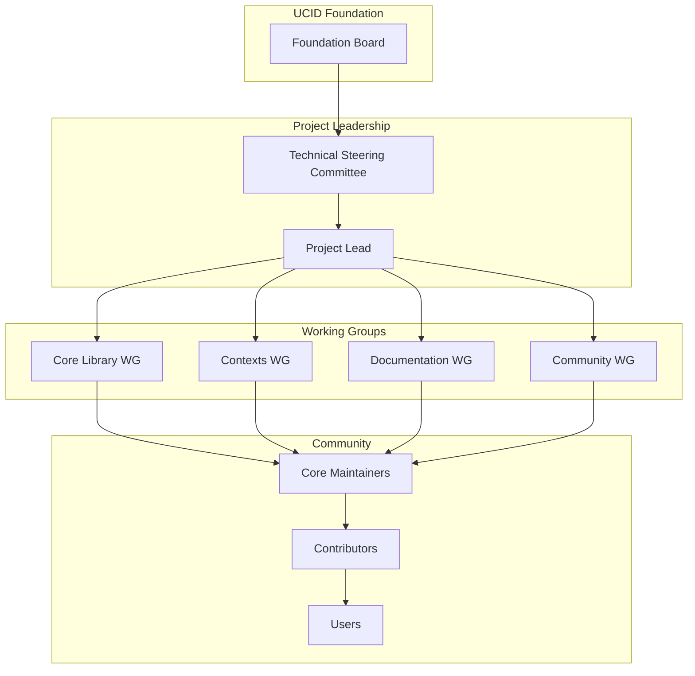
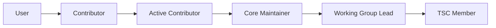
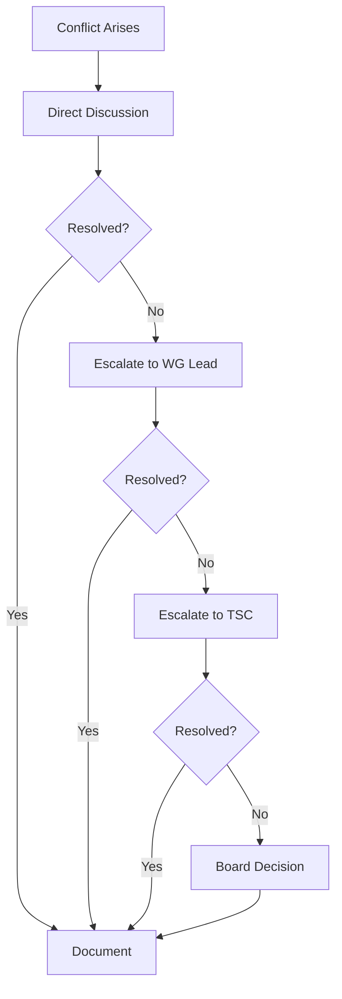
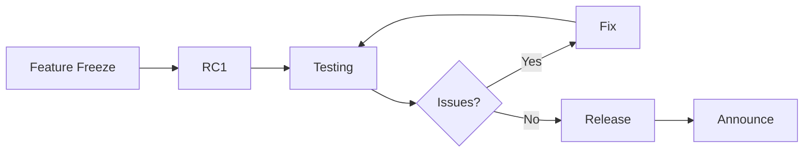

# UCID Governance

## Document Information

| Field | Value |
|-------|-------|
| Document Title | UCID Project Governance |
| Version | 1.0.5 |
| Last Updated | 2026-01-16 |
| Maintainer | UCID Foundation |

---

## Table of Contents

1. [Overview](#overview)
2. [Governance Model](#governance-model)
3. [Roles and Responsibilities](#roles-and-responsibilities)
4. [Decision Making](#decision-making)
5. [Contribution Path](#contribution-path)
6. [Working Groups](#working-groups)
7. [Meetings](#meetings)
8. [Conflict Resolution](#conflict-resolution)
9. [Changes to Governance](#changes-to-governance)
10. [Code of Conduct](#code-of-conduct)

---

## Overview

### Mission Statement

The UCID project exists to provide a standardized, open-source identifier system for urban context analysis, enabling researchers, planners, and developers to understand and improve cities worldwide.

### Core Values

| Value | Description |
|-------|-------------|
| **Openness** | Transparent processes and open source |
| **Inclusivity** | Welcome all contributors |
| **Quality** | High standards for code and documentation |
| **Collaboration** | Work together across boundaries |
| **Sustainability** | Long-term project health |

### Library Statistics

| Metric | Value |
|--------|-------|
| Total Cities | 405 |
| Countries | 23 |
| Contributors | 50+ |
| Test Coverage | 85%+ |

---

## Governance Model

### Structure Overview



### Principles

| Principle | Description |
|-----------|-------------|
| Meritocracy | Influence based on contributions |
| Transparency | Open discussions and decisions |
| Consensus | Seek agreement when possible |
| Documentation | Document all decisions |

---

## Roles and Responsibilities

### UCID Foundation Board

The Foundation Board provides organizational oversight:

| Responsibility | Description |
|----------------|-------------|
| Strategic Direction | Long-term vision and goals |
| Legal Oversight | Licensing and legal matters |
| Financial Oversight | Budget and resources |
| Community Health | Overall project health |

### Technical Steering Committee (TSC)

The TSC provides technical leadership:

| Responsibility | Description |
|----------------|-------------|
| Technical Direction | Architecture decisions |
| Release Management | Version releases |
| Standards | Technical standards |
| Review | Major changes review |

### Project Lead

The Project Lead coordinates daily operations:

| Responsibility | Description |
|----------------|-------------|
| Coordination | Coordinate work across teams |
| Prioritization | Set priorities for releases |
| Communication | Represent project externally |
| Mentorship | Guide new contributors |

### Core Maintainers

Core Maintainers have commit access and review responsibilities:

| Responsibility | Description |
|----------------|-------------|
| Code Review | Review and merge PRs |
| Quality | Maintain code quality |
| Support | Help contributors |
| Documentation | Keep docs updated |

### Contributors

Contributors make contributions without commit access:

| Responsibility | Description |
|----------------|-------------|
| Contributions | Submit PRs and issues |
| Reviews | Provide feedback on PRs |
| Support | Help other users |
| Testing | Test and report issues |

### Users

Users use the project and provide feedback:

| Responsibility | Description |
|----------------|-------------|
| Feedback | Report bugs and issues |
| Suggestions | Suggest improvements |
| Advocacy | Spread the word |

---

## Decision Making

### Decision Types

| Type | Process | Authority |
|------|---------|-----------|
| Day-to-day | Maintainer discretion | Core Maintainers |
| Features | Lazy consensus | Working Group |
| Architecture | TSC vote | TSC |
| Governance | Board approval | Foundation Board |

### Lazy Consensus

Most decisions use lazy consensus:

1. Proposal is made
2. Waiting period (typically 72 hours)
3. If no objections, proposal passes
4. If objections, discuss and resolve

### Voting

When consensus cannot be reached:

| Vote Type | Threshold | Voters |
|-----------|-----------|--------|
| Simple Majority | >50% | Eligible voters |
| Supermajority | >66% | Eligible voters |
| Unanimous | 100% | Eligible voters |

### Decision Documentation

All significant decisions are documented:

```markdown
## Decision Record: [Title]

**Date:** 2026-01-16
**Status:** Approved
**Participants:** [Names]

### Context
[Background information]

### Decision
[What was decided]

### Rationale
[Why this decision]

### Consequences
[Expected outcomes]
```

---

## Contribution Path

### Path to Maintainer



### Requirements

| Level | Requirements |
|-------|--------------|
| Contributor | 1+ merged PR |
| Active Contributor | 5+ merged PRs, active participation |
| Core Maintainer | Sustained contributions, nominated by maintainer |
| Working Group Lead | Core maintainer, domain expertise |
| TSC Member | Significant project impact, elected by TSC |

### Nomination Process

1. **Nomination**: Current maintainer nominates candidate
2. **Discussion**: TSC discusses nomination
3. **Vote**: TSC votes on nomination
4. **Onboarding**: New maintainer is onboarded

### Emeritus Status

Maintainers who step back receive emeritus status:

- Recognized for past contributions
- May return to active status later
- Listed in contributor recognition

---

## Working Groups

### Core Library Working Group

| Focus | Description |
|-------|-------------|
| Parser | UCID parsing and creation |
| Validator | Validation logic |
| Registry | City registry |
| Performance | Optimization |

### Contexts Working Group

| Focus | Description |
|-------|-------------|
| 15MIN | 15-Minute City context |
| TRANSIT | Transit context |
| WALK | Walkability context |
| New Contexts | Future contexts |

### Documentation Working Group

| Focus | Description |
|-------|-------------|
| User Docs | User documentation |
| API Docs | API reference |
| Tutorials | Learning materials |
| Translations | Localization |

### Community Working Group

| Focus | Description |
|-------|-------------|
| Outreach | Community growth |
| Events | Meetups, conferences |
| Support | User support |
| Onboarding | New contributor help |

---

## Meetings

### Regular Meetings

| Meeting | Frequency | Participants |
|---------|-----------|--------------|
| TSC Meeting | Monthly | TSC members |
| WG Meetings | Bi-weekly | WG members |
| Community Call | Monthly | Open to all |

### Meeting Guidelines

1. **Agenda**: Published 24 hours before
2. **Notes**: Taken and published
3. **Decisions**: Documented
4. **Recording**: Available when possible

### Participation

All meetings are open for observation. Speaking rights vary by meeting type.

---

## Conflict Resolution

### Process



### Escalation Path

| Level | Authority | Timeline |
|-------|-----------|----------|
| Direct | Parties involved | 1 week |
| WG Lead | Working Group | 2 weeks |
| TSC | Technical Steering Committee | 1 week |
| Board | Foundation Board | 2 weeks |

### Principles

- Assume good faith
- Focus on issues, not people
- Seek win-win solutions
- Document outcomes

---

## Changes to Governance

### Amendment Process

1. **Proposal**: Submit governance change proposal
2. **Discussion**: 2-week discussion period
3. **Vote**: TSC supermajority vote
4. **Board Approval**: Foundation Board approval
5. **Implementation**: Update documentation

### Version History

| Version | Date | Changes |
|---------|------|---------|
| 1.0.5 | 2026-01-16 | Updated structure |
| 1.0.0 | 2025-12-01 | Initial governance |

---

## Code of Conduct

All community members must follow the [Code of Conduct](CODE_OF_CONDUCT.md).

### Enforcement

Code of Conduct violations are handled separately from technical governance.

---

## Financial Governance

### Budget Process

| Phase | Timeline | Action |
|-------|----------|--------|
| Planning | Q4 | Develop next year budget |
| Review | December | TSC reviews proposal |
| Approval | January | Board approves budget |
| Execution | Ongoing | Execute within budget |
| Reporting | Quarterly | Financial reports |

### Funding Sources

| Source | Type | Governance |
|--------|------|------------|
| Donations | Individual | Foundation managed |
| Sponsorships | Corporate | Board approved |
| Grants | Institutional | Project specific |

### Expense Categories

| Category | Examples |
|----------|----------|
| Infrastructure | Hosting, CI/CD |
| Events | Conferences, meetups |
| Development | Bounties, contractors |
| Operations | Legal, accounting |

---

## Intellectual Property

### License

UCID is licensed under EUPL-1.2. All contributions must be compatible with this license.

### Trademarks

| Trademark | Owner | Usage |
|-----------|-------|-------|
| UCID | UCID Foundation | Open |
| UCID Logo | UCID Foundation | Guidelines apply |

### Patent Policy

The project follows a defensive patent stance:

1. No patent claims against the project
2. Contributors grant patent license
3. Patent trolls excluded

---

## Release Governance

### Release Schedule

| Release Type | Frequency | Examples |
|--------------|-----------|----------|
| Major (X.0.0) | Annual | Breaking changes |
| Minor (0.X.0) | Quarterly | New features |
| Patch (0.0.X) | As needed | Bug fixes |

### Release Process



### Release Criteria

| Criteria | Requirement |
|----------|-------------|
| Tests | All passing |
| Coverage | 80%+ |
| Documentation | Updated |
| Changelog | Complete |
| Security | No known vulnerabilities |

---

## Security Governance

### Security Team

| Role | Responsibility |
|------|----------------|
| Security Lead | Coordinate security efforts |
| Security Reviewers | Review security changes |
| Incident Response | Handle security incidents |

### Vulnerability Process

1. Report received at security@ucid.org
2. Acknowledged within 24 hours
3. Triaged and assigned
4. Fix developed and tested
5. Coordinated disclosure
6. Security advisory published

### Security Releases

Security releases are made outside the normal schedule when:

- Critical vulnerability discovered
- Active exploitation detected
- Dependency has critical CVE

---

## Communication Channels

### Official Channels

| Channel | Purpose | Moderation |
|---------|---------|------------|
| GitHub Issues | Bug reports, features | Core maintainers |
| GitHub Discussions | Q&A, community | Core maintainers |
| Discord | Real-time chat | Moderators |
| Mailing List | Announcements | TSC |

### External Communications

| Type | Approver |
|------|----------|
| Press releases | Board |
| Blog posts | TSC |
| Social media | Community WG |
| Conference talks | Individual |

---

## Trademark Policy

### Permitted Uses

- Referring to UCID software
- Indicating compatibility
- Community discussions
- Educational materials

### Prohibited Uses

- Modified versions without indication
- Commercial products without approval
- Misleading association
- Endorsement claims

### Logo Guidelines

| Usage | Permission |
|-------|------------|
| Documentation | Allowed |
| Presentations | Allowed |
| Commercial products | Requires approval |
| Merchandise | Requires approval |

---

## Contact

| Purpose | Contact |
|---------|---------|
| General | contact@ucid.org |
| Governance | governance@ucid.org |
| TSC | tsc@ucid.org |
| Security | security@ucid.org |
| Legal | legal@ucid.org |

---

## References

- [Apache Software Foundation Governance](https://www.apache.org/foundation/governance/)
- [Node.js Governance](https://github.com/nodejs/governance)
- [Kubernetes Governance](https://github.com/kubernetes/community/blob/master/governance.md)
- [Linux Foundation](https://www.linuxfoundation.org/governance/)

---

Copyright 2026 UCID Foundation. All rights reserved.
Licensed under EUPL-1.2.
