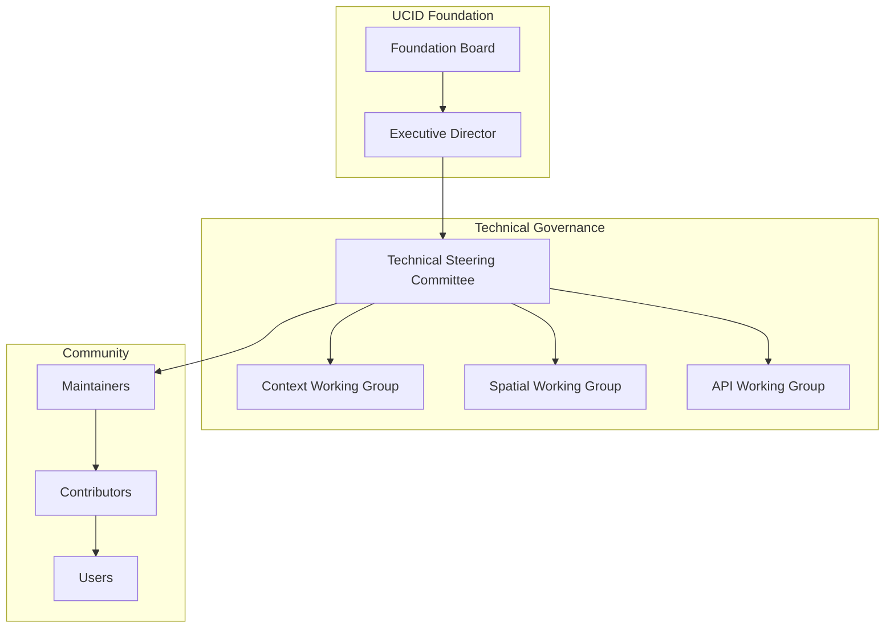
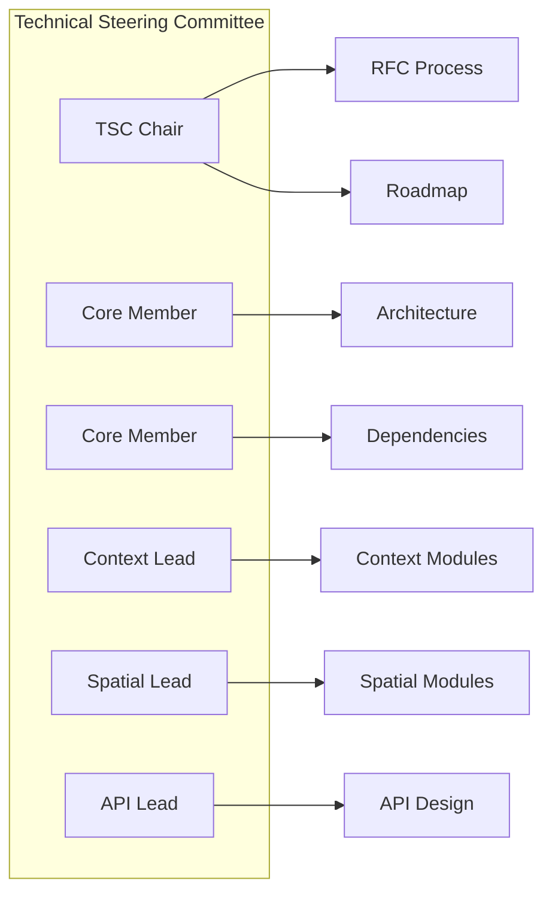
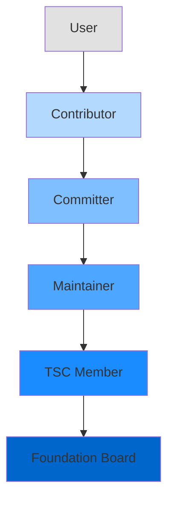
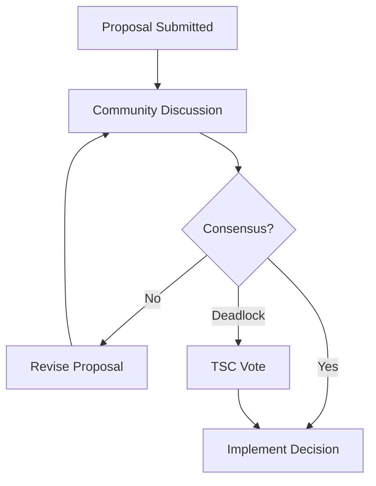
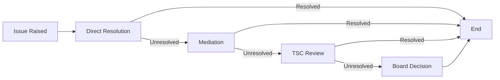

# UCID Governance

This document establishes the governance structure, decision-making processes, and organizational framework for the UCID (Urban Context Identifier) project. Effective governance ensures the project's long-term sustainability, community health, and technical excellence.

---

## Table of Contents

1. [Overview](#overview)
2. [Organizational Structure](#organizational-structure)
3. [Roles and Responsibilities](#roles-and-responsibilities)
4. [Decision-Making Process](#decision-making-process)
5. [Technical Governance](#technical-governance)
6. [Community Governance](#community-governance)
7. [Financial Governance](#financial-governance)
8. [Intellectual Property](#intellectual-property)
9. [Conflict Resolution](#conflict-resolution)
10. [Amendment Process](#amendment-process)

---

## Overview

### Mission Statement

The UCID project exists to provide a standardized, open source framework for urban context identification and analysis. Our mission is to democratize urban data science by making powerful spatial-temporal analysis tools accessible to researchers, urban planners, and developers worldwide.

### Guiding Principles

| Principle | Description |
|-----------|-------------|
| **Openness** | All development occurs in public; decisions are documented and transparent |
| **Meritocracy** | Influence is earned through consistent, high-quality contributions |
| **Consensus** | We seek broad agreement before making significant decisions |
| **Sustainability** | We prioritize long-term health over short-term gains |
| **Inclusivity** | We actively welcome contributors from all backgrounds |

### Governance Model

UCID follows a meritocratic governance model where decision-making authority is distributed based on demonstrated expertise and contribution history. The project is overseen by the UCID Foundation, a non-profit organization that provides legal and financial infrastructure.

---

## Organizational Structure

### UCID Foundation

The UCID Foundation is the legal entity that owns the UCID trademark, manages project funds, and provides organizational infrastructure. The Foundation operates as a non-profit organization registered in the European Union.

#### Foundation Board

The Foundation Board provides strategic oversight and ensures the project aligns with its mission. The Board consists of 5-7 members serving staggered 3-year terms.

| Position | Responsibilities | Term |
|----------|------------------|------|
| **Chairperson** | Lead board meetings, external representation | 3 years |
| **Vice-Chairperson** | Support chairperson, succession planning | 3 years |
| **Treasurer** | Financial oversight, budget approval | 3 years |
| **Secretary** | Meeting minutes, documentation | 3 years |
| **Members (2-3)** | Strategic input, committee participation | 3 years |

#### Election Process

Board members are elected through the following process:

1. **Nomination Period**: 30 days for community nominations
2. **Candidate Review**: Board reviews candidate eligibility
3. **Voting Period**: 14-day voting window for eligible voters
4. **Results**: Announced within 7 days of voting close

Eligible voters include all Contributors with at least 10 merged pull requests in the preceding 12 months.

### Technical Steering Committee

The Technical Steering Committee (TSC) is responsible for the technical direction of the project. TSC membership is based on sustained technical contributions and expertise.

#### TSC Responsibilities

| Area | Responsibilities |
|------|------------------|
| **Architecture** | Overall system design and technical direction |
| **Standards** | Code style, testing requirements, documentation standards |
| **Releases** | Release planning, versioning, deprecation policies |
| **Dependencies** | Dependency management and security updates |
| **Integrations** | External system integrations and partnerships |

#### TSC Meetings

- **Frequency**: Bi-weekly, 60-minute video calls
- **Agenda**: Published 48 hours in advance
- **Minutes**: Published within 72 hours
- **Quorum**: Majority of TSC members required

### Working Groups

Working groups focus on specific technical areas and report to the TSC.

| Working Group | Scope | Chair |
|---------------|-------|-------|
| **Context WG** | Context scoring algorithms, calibration | Elected |
| **Spatial WG** | H3, S2, spatial operations | Elected |
| **API WG** | REST API, client libraries | Elected |
| **Data WG** | Data sources, integration | Elected |
| **Docs WG** | Documentation, tutorials | Elected |

---

## Roles and Responsibilities

### Role Hierarchy

### Users

Anyone who uses UCID software is a user. Users may:

- Use UCID in any manner consistent with the license
- Report bugs and request features
- Participate in community discussions
- Provide feedback on releases

### Contributors

Contributors are users who have contributed to the project. Contributions include:

| Contribution Type | Examples |
|-------------------|----------|
| **Code** | Bug fixes, features, tests |
| **Documentation** | User guides, API docs, tutorials |
| **Design** | UI/UX, graphics, diagrams |
| **Support** | Answering questions, triage |
| **Translation** | Internationalization |
| **Advocacy** | Talks, blog posts, workshops |

Contributors may:

- Submit pull requests
- Participate in RFC discussions
- Vote in community elections
- Receive attribution in release notes

### Committers

Committers have commit access to the repository. Committer status is granted by TSC vote based on:

1. Sustained contribution history (typically 6+ months)
2. Demonstrated code quality and review skills
3. Adherence to project standards
4. Positive community interactions

Committers may:

- Merge pull requests within their area of expertise
- Create and manage branches
- Triage and label issues
- Mentor new contributors

### Maintainers

Maintainers are committers with additional responsibilities for project health. Maintainers:

- Serve as primary owners of specific modules
- Make binding decisions within their areas
- Participate in release management
- Represent the project externally

| Module | Maintainer(s) | Responsibilities |
|--------|---------------|------------------|
| **Core** | 2-3 | Parser, models, validation |
| **Contexts** | 2-3 | Scoring algorithms |
| **Spatial** | 1-2 | H3, S2, grid operations |
| **API** | 1-2 | REST API, clients |
| **Data** | 1-2 | Data source integrations |
| **ML** | 1-2 | Machine learning module |

### TSC Members

TSC members are maintainers elected to the Technical Steering Committee. Requirements:

- Active maintainer for at least 12 months
- Demonstrated technical leadership
- Commitment to project governance
- Community trust and respect

---

## Decision-Making Process

### Consensus Model

UCID uses a consensus-seeking model for decisions. We aim for broad agreement before proceeding with significant changes.

### Decision Categories

| Category | Process | Authority |
|----------|---------|-----------|
| **Routine** | Maintainer discretion | Individual maintainer |
| **Standard** | PR review and approval | 2 maintainers |
| **Significant** | RFC process | TSC consensus |
| **Strategic** | RFC + Board approval | Foundation Board |

### RFC Process

Significant technical decisions require an RFC (Request for Comments):

1. **Draft**: Author creates RFC document in `docs/rfcs/`
2. **Discussion**: 14-day comment period
3. **Revision**: Author addresses feedback
4. **Final Comment**: 7-day final review
5. **Decision**: TSC consensus or vote

### Voting

When consensus cannot be reached, the TSC may call a vote:

| Vote Type | Quorum | Threshold | Duration |
|-----------|--------|-----------|----------|
| **Standard** | 50% TSC | Simple majority | 7 days |
| **Significant** | 66% TSC | 66% approval | 14 days |
| **Strategic** | 75% TSC | 75% approval | 21 days |

---

## Technical Governance

### Release Management

UCID follows a time-based release schedule:

| Release Type | Frequency | Process |
|--------------|-----------|---------|
| **Major** (X.0.0) | 12-18 months | RFC, migration guide |
| **Minor** (0.X.0) | 6-8 weeks | Feature freeze, testing |
| **Patch** (0.0.X) | As needed | Bug fixes only |

### Security Response

Security vulnerabilities are handled through a dedicated process:

1. **Report**: Received via security@ucid.org
2. **Triage**: Severity assessment within 48 hours
3. **Fix**: Patch development in private fork
4. **Release**: Coordinated disclosure and patch release
5. **Post-mortem**: Root cause analysis and process improvement

---

## Community Governance

### Code of Conduct

All community members must adhere to our [Code of Conduct](CODE_OF_CONDUCT.md). The Code of Conduct Committee handles enforcement.

### Communication Channels

| Channel | Purpose | Moderation |
|---------|---------|------------|
| **GitHub Issues** | Bug reports, feature requests | Maintainers |
| **GitHub Discussions** | General questions, ideas | Maintainers |
| **Discord** | Real-time chat | Community moderators |
| **Mailing List** | Announcements, RFCs | TSC |

### Community Meetings

| Meeting | Frequency | Participants |
|---------|-----------|--------------|
| **Community Call** | Monthly | Open to all |
| **TSC Meeting** | Bi-weekly | TSC members |
| **Working Group** | As needed | WG members |

---

## Financial Governance

### Funding Sources

UCID accepts funding from:

1. Corporate sponsorships
2. Foundation grants
3. Individual donations
4. Conference revenue

### Budget Allocation

| Category | Allocation | Approval |
|----------|------------|----------|
| **Infrastructure** | 30% | Executive Director |
| **Development** | 40% | TSC + Board |
| **Community** | 20% | Community Manager |
| **Reserve** | 10% | Board |

---

## Intellectual Property

### Licensing

All UCID code is licensed under the European Union Public License 1.2 (EUPL-1.2). Contributors grant the UCID Foundation a perpetual, irrevocable license to their contributions.

### Trademark

The UCID name and logo are trademarks of the UCID Foundation. Usage guidelines:

| Use | Permitted |
|-----|-----------|
| Factual reference | Yes |
| Academic citation | Yes |
| Commercial product name | Requires approval |
| Modified versions | Must be clearly distinguished |

---

## Conflict Resolution

### Resolution Process

### Escalation Levels

| Level | Mediator | Timeline |
|-------|----------|----------|
| **1. Direct** | Parties involved | 7 days |
| **2. Mediation** | Neutral maintainer | 14 days |
| **3. TSC Review** | TSC committee | 21 days |
| **4. Board Decision** | Foundation Board | 30 days |

---

## Amendment Process

This governance document may be amended through:

1. **Proposal**: RFC submitted to TSC
2. **Review**: 30-day community review period
3. **Vote**: TSC vote (75% approval required)
4. **Ratification**: Board approval for significant changes
5. **Publication**: Updated document published

### Version History

| Version | Date | Changes |
|---------|------|---------|
| 1.0 | 2024-12-01 | Initial governance document |
| 1.1 | 2025-06-01 | Added working groups |
| 2.0 | 2026-01-01 | Major restructuring for Foundation |

---

## Contact

For governance-related inquiries:

- **Email**: governance@ucid.org
- **GitHub**: Open an issue with the `governance` label

---

Copyright 2026 UCID Foundation. All rights reserved.
