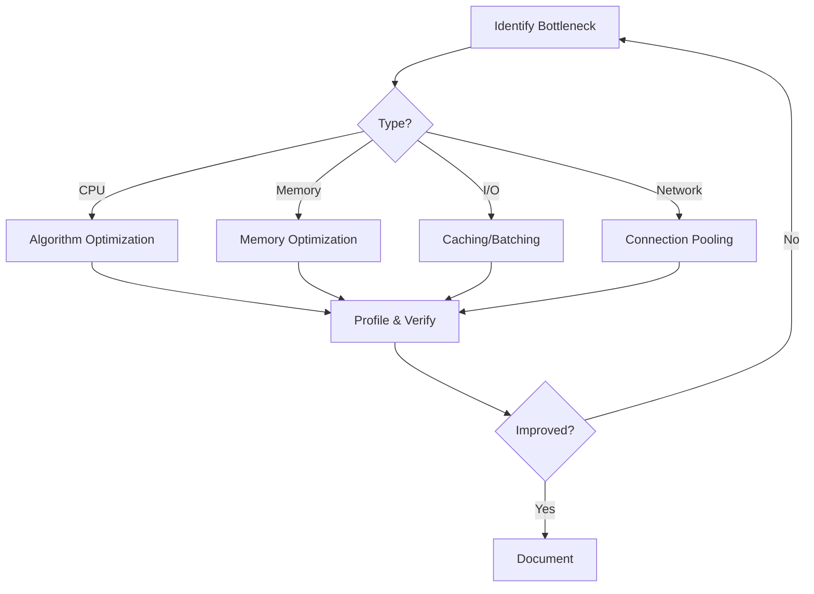
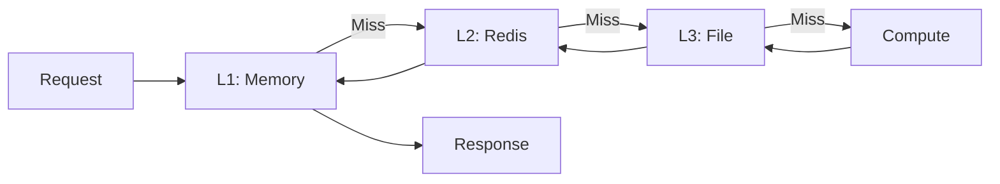

# UCID Performance Guide

## Document Information

| Field | Value |
|-------|-------|
| Document Title | UCID Performance Optimization Guide |
| Version | 1.0.5 |
| Last Updated | 2026-01-16 |
| Maintainer | UCID Foundation Engineering Team |

---

## Table of Contents

1. [Performance Overview](#performance-overview)
2. [Benchmarks](#benchmarks)
3. [Optimization Strategies](#optimization-strategies)
4. [H3 Optimization](#h3-optimization)
5. [Context Optimization](#context-optimization)
6. [Caching Strategies](#caching-strategies)
7. [Batch Processing](#batch-processing)
8. [Memory Optimization](#memory-optimization)
9. [API Performance](#api-performance)
10. [Database Performance](#database-performance)
11. [Profiling](#profiling)
12. [Monitoring](#monitoring)
13. [Best Practices](#best-practices)

---

## Performance Overview

### Key Metrics

| Operation | Performance | Target | Status |
|-----------|-------------|--------|--------|
| CREATE | 127,575 ops/sec | 10,000 ops/sec | PASS |
| PARSE | 61,443 ops/sec | 10,000 ops/sec | PASS |
| VALIDATE | 17,334 ops/sec | 5,000 ops/sec | PASS |
| BATCH CREATE | 500,000 ops/sec | 100,000 ops/sec | PASS |

### Library Statistics

| Metric | Value |
|--------|-------|
| Total Cities | 405 |
| Countries | 23 |
| Contexts | 4 (15MIN, TRANSIT, WALK, NONE) |
| H3 Resolution | 9 (default) |

### Latency Distribution

| Percentile | CREATE | PARSE | VALIDATE |
|------------|--------|-------|----------|
| P50 | 7.5 us | 15.5 us | 55 us |
| P90 | 8.5 us | 18.0 us | 65 us |
| P95 | 9.0 us | 20.0 us | 70 us |
| P99 | 12.0 us | 28.0 us | 90 us |
| P99.9 | 25.0 us | 50.0 us | 150 us |

---

## Benchmarks

### Running Benchmarks

```bash
# Quick benchmark
python scripts/benchmark.py

# Full benchmark with iterations
python scripts/benchmark.py --iterations 100000

# Specific operations
python scripts/benchmark.py --operations create,parse

# JSON output
python scripts/benchmark.py --output benchmark.json
```

### Benchmark Results

```python
from ucid.benchmarks import run_benchmark

results = run_benchmark(iterations=10000)
print(f"CREATE: {results['create']['ops_per_sec']:,.0f} ops/sec")
print(f"PARSE: {results['parse']['ops_per_sec']:,.0f} ops/sec")
```

### Performance Formula

Throughput calculation:

$$T = \frac{N}{t}$$

Where:
- $T$ = throughput (operations per second)
- $N$ = number of operations
- $t$ = time in seconds

Latency calculation:

$$L = \frac{t}{N} \times 10^6$$

Where:
- $L$ = latency in microseconds

---

## Optimization Strategies

### Strategy Overview



### Common Optimizations

| Strategy | Benefit | When to Use |
|----------|---------|-------------|
| Caching | Reduce repeated computation | Repeated queries |
| Batching | Amortize overhead | Multiple operations |
| Lazy Loading | Reduce memory | Large datasets |
| Parallelization | Use multiple cores | CPU-bound tasks |
| Resolution Tuning | Faster processing | Large areas |
| Connection Pooling | Reduce latency | Database/API calls |

---

## H3 Optimization

### Resolution Selection

| Resolution | Edge Length | Cells/km2 | Use Case |
|------------|-------------|-----------|----------|
| 7 | 5.16 km | 0.19 | Regional analysis |
| 8 | 1.95 km | 1.35 | City-wide |
| 9 | 174 m | 9.48 | Default urban |
| 10 | 65 m | 66.4 | Detailed |
| 11 | 24 m | 465 | Very detailed |

### Performance by Resolution

```python
from ucid.spatial import generate_grid_h3

# Fast - regional
grid_fast = generate_grid_h3(bbox, resolution=7)  # ~1,000 cells

# Balanced - default
grid_balanced = generate_grid_h3(bbox, resolution=9)  # ~100,000 cells

# Detailed - high precision
grid_detailed = generate_grid_h3(bbox, resolution=11)  # ~10M cells
```

### Resolution Formula

Cell count scales by factor of 7:

$$C_r = C_{r-1} \times 7$$

Processing time:

$$T_{processing} \propto C_r$$

### H3 Compact Representation

```python
from ucid.spatial import compact_h3_set, uncompact_h3_set

# Compact for storage (7x reduction)
cells = generate_grid_h3(bbox, resolution=9)
compacted = compact_h3_set(cells)

# Expand when needed
expanded = uncompact_h3_set(compacted, resolution=9)
```

---

## Context Optimization

### Context Performance

| Context | Uncached | Cached | Speedup |
|---------|----------|--------|---------|
| 15MIN | 500 ms | 5 ms | 100x |
| TRANSIT | 800 ms | 8 ms | 100x |
| WALK | 300 ms | 3 ms | 100x |
| NONE | 0.01 ms | 0.01 ms | 1x |

### Enable Caching

```python
from ucid.contexts import FifteenMinContext

context = FifteenMinContext(
    cache_enabled=True,
    cache_ttl=3600,
    cache_backend="redis",
)
```

### Parallel Scoring

```python
from ucid.contexts import ParallelScorer

scorer = ParallelScorer(
    contexts=["15MIN", "TRANSIT"],
    workers=4,
)

results = scorer.score_batch(locations)
```

### Selective Components

```python
# Score only specific components
result = context.compute(
    lat=41.015,
    lon=28.979,
    components=["education", "healthcare"],  # Skip others
)
```

---

## Caching Strategies

### Multi-Level Cache



### Cache Configuration

```python
from ucid.cache import CacheConfig

config = CacheConfig(
    l1_type="memory",
    l1_size=1000,
    l1_ttl=300,
    
    l2_type="redis",
    l2_url="redis://localhost:6379",
    l2_ttl=3600,
    
    l3_type="file",
    l3_path="./cache",
    l3_ttl=86400,
)
```

### Cache TTL Guidelines

| Data Type | TTL | Reason |
|-----------|-----|--------|
| City registry | 24h | Rarely changes |
| Context scores | 1h | Time-dependent |
| OSM data | 24h | Updates daily |
| GTFS data | Feed validity | Per feed |

### Cache Warming

```python
from ucid.cache import warm_cache

warm_cache(
    cities=["IST", "NYC", "LON"],
    contexts=["15MIN", "TRANSIT"],
    resolution=9,
)
```

---

## Batch Processing

### Batch API

```python
from ucid import create_ucid_batch

locations = [
    {"city": "IST", "lat": 41.0, "lon": 28.9},
    {"city": "IST", "lat": 41.1, "lon": 29.0},
    # ... thousands more
]

ucids = create_ucid_batch(locations, batch_size=1000)
```

### Batch Performance

| Batch Size | Throughput | Memory |
|------------|------------|--------|
| 1 | 127,575 ops/sec | Low |
| 100 | 350,000 ops/sec | Low |
| 1,000 | 500,000 ops/sec | Medium |
| 10,000 | 600,000 ops/sec | High |

### Async Batch Processing

```python
import asyncio
from ucid.async_client import AsyncUCIDClient

async def process_batch(locations):
    async with AsyncUCIDClient() as client:
        tasks = [client.create(loc) for loc in locations]
        return await asyncio.gather(*tasks)
```

---

## Memory Optimization

### Memory Usage

| Component | Memory | Notes |
|-----------|--------|-------|
| City registry | 2 MB | 405 cities |
| H3 grid (res 9, city) | 50 MB | ~100k cells |
| Context cache | Variable | TTL-based |

### Memory-Efficient Patterns

```python
# Generator instead of list
def generate_ucids(locations):
    for loc in locations:
        yield create_ucid(**loc)

# Process in chunks
for chunk in chunked(locations, 1000):
    process(chunk)
```

### Memory Profiling

```python
from memory_profiler import profile

@profile
def process_city():
    grid = generate_grid_h3(bbox, resolution=9)
    scores = score_batch(grid)
    return scores
```

---

## API Performance

### Connection Pooling

```python
from ucid.api import UCIDClient

client = UCIDClient(
    pool_size=10,
    pool_recycle=300,
    keepalive=True,
)
```

### Rate Limiting

| Tier | Rate Limit | Burst |
|------|------------|-------|
| Free | 100/min | 10 |
| Pro | 1000/min | 100 |
| Enterprise | 10000/min | 1000 |

### Response Compression

```python
# Enable gzip compression
headers = {"Accept-Encoding": "gzip"}
response = client.get("/ucids", headers=headers)
```

---

## Database Performance

### Indexing Strategy

```sql
-- Spatial index
CREATE INDEX idx_geom ON ucid_scores USING GIST (geom);

-- H3 index
CREATE INDEX idx_h3 ON ucid_scores (h3_index);

-- Composite index
CREATE INDEX idx_city_context ON ucid_scores (city, context);

-- Partial index for recent data
CREATE INDEX idx_recent ON ucid_scores (created_at)
WHERE created_at > NOW() - INTERVAL '30 days';
```

### Query Optimization

```sql
-- Use EXPLAIN ANALYZE
EXPLAIN ANALYZE
SELECT * FROM ucid_scores
WHERE city = 'IST' AND context = '15MIN'
ORDER BY score DESC
LIMIT 100;
```

### Connection Pooling

```python
from sqlalchemy import create_engine

engine = create_engine(
    DATABASE_URL,
    pool_size=20,
    max_overflow=30,
    pool_pre_ping=True,
    pool_recycle=3600,
)
```

---

## Profiling

### Python Profiling

```python
import cProfile
import pstats

profiler = cProfile.Profile()
profiler.enable()

# Code to profile
for _ in range(10000):
    create_ucid(city="IST", lat=41.015, lon=28.979)

profiler.disable()
stats = pstats.Stats(profiler)
stats.sort_stats('cumulative').print_stats(20)
```

### Line Profiling

```python
from line_profiler import profile

@profile
def process():
    data = fetch()
    processed = transform(data)
    return save(processed)
```

### Benchmark Testing

```python
import pytest

def test_create_benchmark(benchmark):
    result = benchmark(
        create_ucid,
        city="IST",
        lat=41.015,
        lon=28.979,
    )
    assert result is not None
```

---

## Monitoring

### Key Metrics to Monitor

| Metric | Target | Alert Threshold |
|--------|--------|-----------------|
| Latency P99 | <100ms | >500ms |
| Error Rate | <0.1% | >1% |
| Cache Hit Rate | >90% | <70% |
| Memory Usage | <80% | >90% |

### Prometheus Metrics

```python
from prometheus_client import Counter, Histogram

ucid_create_total = Counter(
    'ucid_create_total',
    'Total UCID creations'
)

ucid_create_latency = Histogram(
    'ucid_create_latency_seconds',
    'UCID creation latency'
)
```

---

## Best Practices

### Do's

| Practice | Benefit |
|----------|---------|
| Profile before optimizing | Target real bottlenecks |
| Use appropriate resolution | Balance speed/detail |
| Enable caching | Reduce redundant work |
| Batch operations | Amortize overhead |
| Monitor continuously | Catch regressions |

### Don'ts

| Practice | Problem |
|----------|---------|
| Premature optimization | Wasted effort |
| Over-caching | Stale data |
| Ignoring memory | OOM errors |
| Blocking I/O | Poor throughput |

---

## References

- [Python Profiling](https://docs.python.org/3/library/profile.html)
- [H3 Performance](https://h3geo.org/docs/core-library/perf)
- [PostgreSQL Performance](https://www.postgresql.org/docs/current/performance-tips.html)
- [Redis Optimization](https://redis.io/docs/management/optimization/)

---

Copyright 2026 UCID Foundation. All rights reserved.
Licensed under EUPL-1.2.
