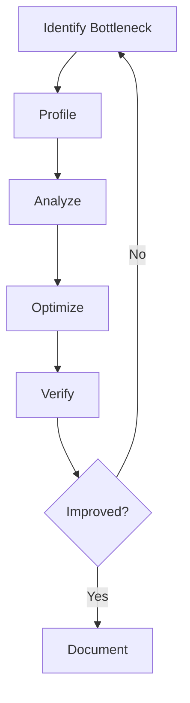

# Performance Guide

This document provides comprehensive guidance on optimizing the performance of UCID (Urban Context Identifier) applications.

---

## Table of Contents

1. [Overview](#overview)
2. [Performance Metrics](#performance-metrics)
3. [Optimization Strategies](#optimization-strategies)
4. [H3 Grid Optimization](#h3-grid-optimization)
5. [Context Scoring Optimization](#context-scoring-optimization)
6. [Data Integration Optimization](#data-integration-optimization)
7. [API Optimization](#api-optimization)
8. [Database Optimization](#database-optimization)
9. [Caching Strategies](#caching-strategies)
10. [Profiling and Monitoring](#profiling-and-monitoring)

---

## Overview

### Performance Goals

| Metric | Target | Critical |
|--------|--------|----------|
| UCID Creation | < 1ms | < 10ms |
| UCID Parsing | < 0.1ms | < 1ms |
| Context Scoring (cached) | < 100ms | < 500ms |
| Context Scoring (uncached) | < 2s | < 10s |
| Batch Processing | 1000/s | 100/s |
| API Response (p99) | < 200ms | < 1s |

### Performance Principles

| Principle | Description |
|-----------|-------------|
| **Measure First** | Profile before optimizing |
| **Cache Aggressively** | Reduce repeated computation |
| **Lazy Loading** | Load data only when needed |
| **Batch Operations** | Amortize overhead |
| **Appropriate Resolution** | Balance detail vs. speed |

---

## Performance Metrics

### Key Metrics

```python
from ucid.metrics import PerformanceMetrics

metrics = PerformanceMetrics()

# Track UCID creation
with metrics.timer("ucid_creation"):
    ucid = create_ucid(city="IST", lat=41.015, lon=28.979)

# View statistics
print(metrics.summary())
```

### Metric Types

| Metric | Description | Unit |
|--------|-------------|------|
| Latency | Time for operation | ms |
| Throughput | Operations per second | ops/s |
| Memory | Peak memory usage | MB |
| Cache Hit Rate | Cache effectiveness | % |
| Error Rate | Failed operations | % |

---

## Optimization Strategies

### Common Optimizations

| Strategy | Benefit | When to Use |
|----------|---------|-------------|
| Caching | Reduce compute | Repeated queries |
| Batching | Reduce overhead | Many operations |
| Lazy loading | Reduce memory | Large datasets |
| Parallelization | Use all cores | CPU-bound |
| Resolution tuning | Faster processing | Large areas |

### Optimization Process



---

## H3 Grid Optimization

### Resolution Selection

| Resolution | Avg. Hex Area | Cells per km2 | Use Case |
|------------|---------------|---------------|----------|
| 7 | 5.16 km2 | 0.19 | Regional analysis |
| 8 | 0.74 km2 | 1.35 | City-wide |
| 9 | 0.11 km2 | 9.48 | Default, urban |
| 10 | 0.015 km2 | 66.4 | Detailed |
| 11 | 0.002 km2 | 465 | Very detailed |

### Performance by Resolution

```python
# Use lowest resolution that meets requirements
from ucid.spatial import generate_grid_h3

# Fast - regional overview
grid_fast = generate_grid_h3(bbox, resolution=7)  # ~1000 cells

# Balanced - default
grid_balanced = generate_grid_h3(bbox, resolution=9)  # ~100,000 cells

# Detailed - high precision
grid_detailed = generate_grid_h3(bbox, resolution=11)  # ~10M cells
```

### Compact Representation

```python
from ucid.spatial import compact_h3_set, uncompact_h3_set

# Compact cells for storage
cells = generate_grid_h3(bbox, resolution=9)
compacted = compact_h3_set(cells)  # Reduces count by 7x

# Expand when needed
expanded = uncompact_h3_set(compacted, target_resolution=9)
```

---

## Context Scoring Optimization

### Enable Caching

```python
from ucid.contexts import ClimateContext

context = ClimateContext(
    cache_enabled=True,
    cache_ttl=3600,          # 1 hour
    cache_backend="redis",    # Or "memory", "file"
)
```

### Batch Processing

```python
from ucid.contexts import BatchScorer

scorer = BatchScorer(contexts=["15MIN", "TRANSIT"])

# Process in batches
locations = [(lat, lon) for lat, lon in grid]
results = scorer.score_batch(locations, batch_size=1000)
```

### Parallel Scoring

```python
from ucid.contexts import ParallelScorer

scorer = ParallelScorer(
    workers=4,
    contexts=["CLIMATE", "VITALITY"],
)

# Score in parallel
results = scorer.score_parallel(locations)
```

### Selective Components

```python
# Score only specific components
result = context.compute(
    lat=41.015,
    lon=28.979,
    components=["green_coverage", "tree_canopy"],  # Skip others
)
```

---

## Data Integration Optimization

### OSM Data Caching

```python
from ucid.data import OSMFetcher

fetcher = OSMFetcher(
    cache_path="./cache/osm",
    cache_ttl=86400,  # 24 hours
    use_pbf=True,     # Faster format
)
```

### GTFS Pre-processing

```python
from ucid.data import GTFSLoader

# Pre-process GTFS for faster queries
loader = GTFSLoader()
feed = loader.load("city.gtfs.zip")

# Build spatial index
loader.build_stop_index(feed)  # O(1) stop lookups
loader.build_route_index(feed)  # O(1) route lookups

# Save processed data
loader.save_processed("city_processed.pkl")
```

### Lazy Data Loading

```python
from ucid.data import LazyDataLoader

loader = LazyDataLoader()

# Data loaded only when accessed
data = loader.get("satellite_ndvi", bounds=bbox)
```

---

## API Optimization

### Connection Pooling

```python
from ucid.api import UCIDClient

client = UCIDClient(
    pool_size=10,
    pool_recycle=300,
    keepalive=True,
)
```

### Request Batching

```python
# Batch API requests
locations = [
    {"city": "IST", "lat": 41.0, "lon": 28.9},
    {"city": "IST", "lat": 41.1, "lon": 29.0},
    # ... more locations
]

response = client.batch_create(locations)
```

### Async Operations

```python
import asyncio
from ucid.api import AsyncUCIDClient

async def score_locations(locations):
    async with AsyncUCIDClient() as client:
        tasks = [client.score(loc) for loc in locations]
        results = await asyncio.gather(*tasks)
    return results
```

---

## Database Optimization

### Indexing Strategy

```sql
-- Spatial index for geometry queries
CREATE INDEX idx_geom ON ucid_scores USING GIST (geom);

-- H3 index for cell lookups
CREATE INDEX idx_h3 ON ucid_scores (h3_index);

-- Composite index for common queries
CREATE INDEX idx_city_context ON ucid_scores (city, context);

-- Partial index for recent data
CREATE INDEX idx_recent ON ucid_scores (created_at)
WHERE created_at > NOW() - INTERVAL '30 days';
```

### Query Optimization

```sql
-- Use EXPLAIN ANALYZE
EXPLAIN ANALYZE
SELECT * FROM ucid_scores
WHERE city = 'IST' AND context = '15MIN'
ORDER BY score DESC
LIMIT 100;

-- Avoid SELECT *
SELECT ucid_string, score, grade
FROM ucid_scores
WHERE city = 'IST';
```

### Connection Pooling

```python
from sqlalchemy import create_engine

engine = create_engine(
    DATABASE_URL,
    pool_size=20,
    max_overflow=30,
    pool_pre_ping=True,
    pool_recycle=3600,
)
```

---

## Caching Strategies

### Multi-Level Cache


### Cache Configuration

```python
from ucid.cache import CacheConfig

config = CacheConfig(
    l1_type="memory",
    l1_size=1000,
    l1_ttl=300,
    
    l2_type="redis",
    l2_url="redis://localhost:6379",
    l2_ttl=3600,
    
    l3_type="file",
    l3_path="./cache",
    l3_ttl=86400,
)
```

### Cache Warming

```python
from ucid.cache import warm_cache

# Pre-populate cache for common queries
warm_cache(
    cities=["IST", "NYC", "LON"],
    contexts=["15MIN", "TRANSIT"],
    resolution=9,
)
```

---

## Profiling and Monitoring

### Python Profiling

```python
import cProfile
import pstats

# Profile function
profiler = cProfile.Profile()
profiler.enable()

# Run code
for _ in range(1000):
    create_ucid(city="IST", lat=41.015, lon=28.979)

profiler.disable()

# Analyze
stats = pstats.Stats(profiler)
stats.sort_stats('cumulative')
stats.print_stats(20)
```

### Memory Profiling

```python
from memory_profiler import profile

@profile
def process_city_grid():
    grid = generate_grid_h3(bbox, resolution=9)
    scores = score_batch(grid)
    return scores
```

### Line Profiling

```python
from line_profiler import profile

@profile
def compute_context():
    # Each line is profiled
    data = fetch_data()
    processed = process_data(data)
    score = calculate_score(processed)
    return score
```

### Benchmarking

```python
import pytest

def test_create_ucid_benchmark(benchmark):
    result = benchmark(
        create_ucid,
        city="IST",
        lat=41.015,
        lon=28.979,
    )
    assert result is not None
```

---

## Best Practices

### Do's

| Practice | Benefit |
|----------|---------|
| Profile before optimizing | Target real bottlenecks |
| Use appropriate resolution | Balance speed/detail |
| Enable caching | Reduce redundant work |
| Batch operations | Amortize overhead |
| Monitor continuously | Catch regressions |

### Don'ts

| Practice | Problem |
|----------|---------|
| Premature optimization | Wasted effort |
| Over-caching | Stale data |
| Ignoring memory | OOM errors |
| Blocking I/O | Poor throughput |

---

## Resources

- [Python Profiling](https://docs.python.org/3/library/profile.html)
- [H3 Performance](https://h3geo.org/docs/core-library/perf)
- [PostgreSQL Performance](https://www.postgresql.org/docs/current/performance-tips.html)

---

Copyright 2026 UCID Foundation. All rights reserved.
