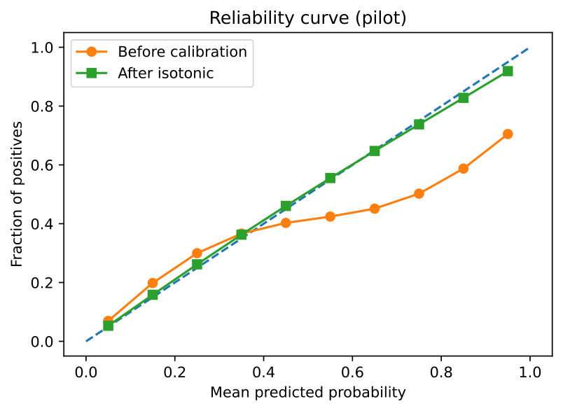
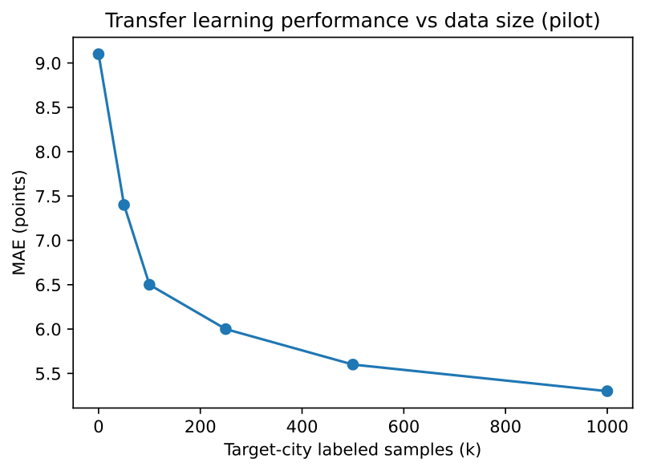
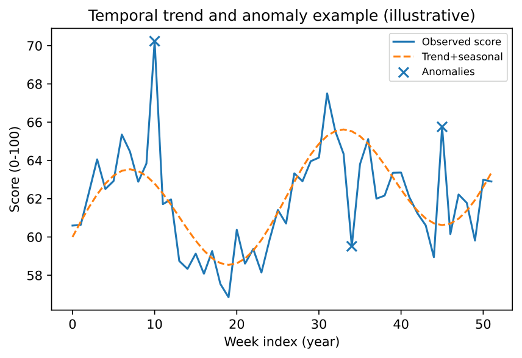

# UCID: Urban Context Identifier

[](https://github.com/ucid-foundation/ucid/actions/workflows/ci.yml)
[](https://codecov.io/gh/ucid-foundation/ucid)
[](https://securityscorecards.dev/viewer/?uri=github.com/ucid-foundation/ucid)
[](https://pypi.org/project/ucid/)
[](https://pypi.org/project/ucid/)
[](https://pypi.org/project/UCID/)
[](https://pypi.org/project/ucid/)
[](https://pypi.org/project/ucid/)
[](https://github.com/ucid-foundation/ucid/blob/main/LICENSE)
[](https://doi.org/10.5281/zenodo.18231105)
[](https://arxiv.org/abs/submit/7155127)
[](https://github.com/ucid-foundation/ucid/actions/workflows/codeql.yml)
[](https://slsa.dev)
[](https://github.com/ucid-foundation/ucid/actions/workflows/docs.yml)
[](https://github.com/ucid-foundation/ucid/actions/workflows/scorecard.yml)
[](https://github.com/ucid-foundation/ucid/actions/workflows/cflite.yml)
[](https://github.com/ucid-foundation/ucid/actions/workflows/nightly.yml)
[](https://github.com/ucid-foundation/ucid/actions/workflows/sbom.yml)
[](https://github.com/ucid-foundation/ucid/actions/workflows/release.yml)
[](https://github.com/astral-sh/ruff)
[](https://pre-commit.com/)
[](https://github.com/PyCQA/bandit)
[](https://mypy-lang.org/)
[](https://github.com/ucid-foundation/ucid/releases)
[](https://github.com/ucid-foundation/ucid/tags)
[](https://github.com/ucid-foundation/ucid/stargazers)
[](https://github.com/ucid-foundation/ucid/network)
[](https://github.com/ucid-foundation/ucid/watchers)
[](https://github.com/ucid-foundation/ucid/issues)
[](https://github.com/ucid-foundation/ucid/pulls)
[](https://github.com/ucid-foundation/ucid/graphs/contributors)
[](https://github.com/ucid-foundation/ucid/commits)
[](https://github.com/ucid-foundation/ucid)
[](https://github.com/ucid-foundation/ucid)
[](https://github.com/ucid-foundation/ucid)
[](https://www.python.org/)
[](https://pydantic.dev/)
[](https://fastapi.tiangolo.com/)
[](https://numpy.org/)
[](https://pandas.pydata.org/)
[](https://geopandas.org/)
[](https://h3geo.org/)
[](https://shapely.readthedocs.io/)
[](https://orcid.org/0009-0006-5184-0810)
[](https://semver.org/)
[](https://conventionalcommits.org)
[](https://cyclonedx.org/)
[](https://reuse.software/)
[](CODE_OF_CONDUCT.md)

---


**UCID (Urban Context Identifier)** is a standardized, temporal identifier system and production-grade Python library for comprehensive urban context analysis. UCID provides a universal key for joining disparate urban datasets across global cities, enabling researchers, urban planners, and data scientists to perform reproducible, spatially-explicit, and temporally-aware urban analysis at scale.

## Table of Contents

1. [Overview](#overview)
2. [Key Features](#key-features)
3. [Installation](#installation)
4. [Quick Start](#quick-start)
5. [UCID Format Specification](#ucid-format-specification)
6. [Built-in Contexts](#built-in-contexts)
7. [Data Integration](#data-integration)
8. [API Reference](#api-reference)
9. [Architecture](#architecture)
10. [Performance](#performance)
11. [Security](#security)
12. [Contributing](#contributing)
13. [Citation](#citation)
14. [License](#license)

---

## Overview

Urban data analysis faces a fundamental challenge: the fragmentation of spatial and temporal data across heterogeneous sources, formats, and coordinate systems. UCID addresses this challenge by providing a standardized identifier that encapsulates location, time, and context into a single, parseable string that can serve as a universal join key.

The UCID standard is designed to meet the requirements of modern urban analytics:

- **Spatial Precision**: Leverages H3 hexagonal hierarchical spatial indexing for consistent, resolution-aware spatial binning
- **Temporal Granularity**: ISO week-based temporal keys with hourly precision for time-series analysis
- **Context Awareness**: Pluggable context scoring system for multi-dimensional urban quality assessment
- **Interoperability**: First-class support for GeoParquet, PostGIS, and common geospatial formats
- **Reproducibility**: Deterministic identifier generation ensures consistent results across systems

### Design Principles

UCID adheres to the following design principles:

1. **Determinism**: Given the same inputs, UCID always produces identical outputs
2. **Parsability**: UCID strings are human-readable and machine-parseable
3. **Extensibility**: The context system supports custom scoring algorithms
4. **Performance**: Optimized for batch processing of millions of identifiers
5. **Type Safety**: Full type annotations with strict mypy compliance

---

## Key Features

### Core Functionality

| Feature | Description |
|---------|-------------|
| **UCID Generation** | Create standardized identifiers from coordinates, timestamps, and context |
| **UCID Parsing** | Parse and validate UCID strings with comprehensive error handling |
| **Canonicalization** | Normalize UCID representations to canonical form |
| **Batch Processing** | High-performance processing of large identifier sets |

### Spatial Indexing

| Feature | Description |
|---------|-------------|
| **H3 Integration** | Native support for Uber H3 hexagonal indexing (resolutions 0-15) |
| **S2 Compatibility** | Optional S2 geometry support for Google ecosystem interoperability |
| **Grid Generation** | Generate H3 grids over arbitrary bounding boxes |
| **City Scanning** | Systematic grid-based city coverage with UCID generation |

### Context Scoring

| Context | Description | Data Sources |
|---------|-------------|--------------|
| **15MIN** | 15-Minute City accessibility score | OSM, OSMnx |
| **TRANSIT** | Public transportation quality index | GTFS, GTFS-RT |
| **CLIMATE** | Climate resilience and green space coverage | Sentinel-2, OSM |
| **VITALITY** | Urban vibrancy and activity levels | Mobile network data, OSM POI |
| **EQUITY** | Access equity across demographic groups | Census, WorldPop |
| **WALK** | Walkability and pedestrian infrastructure | OSM road networks |

### Data Integration

| Source | Format | Status |
|--------|--------|--------|
| OpenStreetMap | Overpass API, PBF | Production |
| GTFS Static | ZIP archives | Production |
| GTFS Realtime | Protobuf streams | Production |
| WorldPop | GeoTIFF | Production |
| Sentinel-2 | COG | Beta |
| Census Data | Various | Configurable |

### Output Formats

| Format | Extension | Use Case |
|--------|-----------|----------|
| GeoParquet | `.parquet` | Recommended for large datasets |
| GeoJSON | `.geojson` | Web visualization, small datasets |
| CSV | `.csv` | Tabular analysis, spreadsheets |
| PostGIS | PostgreSQL | Persistent storage, spatial queries |

---

## Installation

### Requirements

- Python 3.11, 3.12, or 3.13
- Operating System: Linux, macOS, or Windows
- Memory: Minimum 4 GB RAM (8 GB recommended for large-scale processing)

### Standard Installation

Install UCID from PyPI using pip:

```bash
pip install UCID
```

### Installation with Optional Dependencies

UCID provides optional dependency groups for extended functionality:

```bash
# Full installation with all optional dependencies
pip install "UCID[all]"

# Context scoring (includes OSMnx, NetworkX)
pip install "UCID[contexts]"

# Machine learning module
pip install "UCID[ml]"

# Visualization (Matplotlib, Plotly, Folium)
pip install "UCID[viz]"

# API server (FastAPI, Uvicorn)
pip install "UCID[api]"

# Database integration (PostgreSQL, PostGIS)
pip install "UCID[db]"

# Distributed computing (Dask)
pip install "UCID[dask]"

# Development dependencies
pip install "UCID[dev]"
```

### Installation from Source

For development or to access the latest features:

```bash
git clone https://github.com/ucid-foundation/ucid.git
cd ucid
pip install -e ".[dev]"
```

### Docker Installation

UCID is available as a Docker image for containerized deployments:

```bash
docker pull ghcr.io/ucid-foundation/ucid:latest
docker run -p 8000:8000 ghcr.io/ucid-foundation/ucid:latest
```

### Verification

Verify your installation:

```bash
python -c "import ucid; print(ucid.__version__)"
ucid --version
```

---

## Quick Start

### Creating a UCID

```python
from ucid import create_ucid

# Create a UCID for a location in Istanbul
ucid = create_ucid(
    city="IST",
    lat=41.0082,
    lon=28.9784,
    timestamp="2026W01T12",
    context="15MIN",
    grade="A",
    confidence=0.92
)

print(ucid)
# Output: UCID-V1:IST:+41.008:+28.978:9:891f2ed6df7ffff:2026W01T12:15MIN:A:0.92:
```

### Parsing a UCID

```python
from ucid import parse_ucid

ucid_string = "UCID-V1:IST:+41.008:+28.978:9:891f2ed6df7ffff:2026W01T12:15MIN:A:0.92:"
parsed = parse_ucid(ucid_string)

print(f"City: {parsed.city}")
print(f"Coordinates: ({parsed.lat}, {parsed.lon})")
print(f"H3 Index: {parsed.h3_index}")
print(f"Timestamp: {parsed.timestamp}")
print(f"Context: {parsed.context}")
print(f"Grade: {parsed.grade}")
print(f"Confidence: {parsed.confidence}")
```

### Context Scoring

```python
from ucid.contexts import ContextRegistry, FifteenMinuteContext

# Initialize the 15-Minute City context
context = FifteenMinuteContext()

# Compute score for a location
result = context.compute(
    lat=41.0082,
    lon=28.9784,
    timestamp="2026W01T12"
)

print(f"Score: {result.score}")
print(f"Grade: {result.grade}")
print(f"Confidence: {result.confidence}")
print(f"Breakdown: {result.breakdown}")
```

### Grid Scanning

```python
from ucid.spatial import scan_city_grid

# Define Istanbul bounding box
bbox = (40.8, 28.5, 41.3, 29.5)

# Generate UCIDs for the entire grid
for ucid in scan_city_grid(
    city_code="IST",
    bbox=bbox,
    resolution=9,
    timestamp="2026W01T12",
    context="15MIN"
):
    print(ucid)
```

### Exporting Data

```python
from ucid.io import export_geoparquet, export_geojson

# Export to GeoParquet (recommended for large datasets)
export_geoparquet(ucids, "istanbul_15min.parquet")

# Export to GeoJSON (for visualization)
export_geojson(ucids, "istanbul_15min.geojson")
```

---

## UCID Format Specification

A UCID string consists of 11 colon-separated fields:

```
UCID-V1:CITY:LAT:LON:H3R:H3:TIME:CTX:GRD:CONF:FLAGS
```

### Field Definitions

| Position | Field | Format | Description |
|----------|-------|--------|-------------|
| 0 | Version | `UCID-V1` | Protocol version identifier |
| 1 | City | `[A-Z]{3}` | UN/LOCODE city code |
| 2 | Latitude | `[+-]DD.DDD` | Signed decimal degrees |
| 3 | Longitude | `[+-]DDD.DDD` | Signed decimal degrees |
| 4 | H3 Resolution | `[0-9]{1,2}` | H3 resolution level (0-15) |
| 5 | H3 Index | `[0-9a-f]{15}` | H3 cell identifier |
| 6 | Timestamp | `YYYY[W]wwThh` | ISO week with hour |
| 7 | Context | `[A-Z0-9]+` | Context identifier |
| 8 | Grade | `[A-F][+]?` | Quality grade |
| 9 | Confidence | `[0-1].[0-9]+` | Confidence score |
| 10 | Flags | `[A-Z;]*` | Optional semicolon-separated flags |

### Grade Scale

| Grade | Score Range | Interpretation |
|-------|-------------|----------------|
| A+ | 95-100 | Exceptional |
| A | 85-94 | Excellent |
| B | 70-84 | Good |
| C | 55-69 | Moderate |
| D | 40-54 | Below Average |
| F | 0-39 | Poor |

### Temporal Key Format

The temporal key follows ISO 8601 week date format with hourly precision:

- `YYYY`: Four-digit year
- `W`: Week indicator (literal character)
- `ww`: Two-digit week number (01-53)
- `T`: Time separator (literal character)
- `hh`: Two-digit hour (00-23)

Example: `2026W01T12` represents the 12th hour of the first week of 2026.

---

## Built-in Contexts

UCID includes six production-ready context scoring algorithms:

### 15-Minute City (15MIN)

Measures accessibility to essential amenities within a 15-minute walk. Based on the urban planning concept popularized by Carlos Moreno.

**Scoring Criteria:**
- Grocery and retail accessibility
- Healthcare facility proximity
- Education institution coverage
- Public space availability
- Employment center accessibility

### Transit Quality (TRANSIT)

Evaluates public transportation service quality based on GTFS data analysis.

**Scoring Criteria:**
- Stop density and coverage
- Service frequency
- Route diversity
- Temporal coverage
- Accessibility features

### Climate Resilience (CLIMATE)

Assesses climate adaptation capacity through green space and heat island analysis.

**Scoring Criteria:**
- Tree canopy coverage
- Green space accessibility
- Heat island intensity
- Flood risk exposure
- Air quality indicators

### Urban Vitality (VITALITY)

Measures urban activity and vibrancy through POI diversity and temporal patterns.

**Scoring Criteria:**
- POI density and diversity
- Nighttime activity levels
- Street-level activity
- Commercial mix
- Cultural amenities

### Access Equity (EQUITY)

Evaluates equitable access across demographic groups.

**Scoring Criteria:**
- Income-adjusted accessibility
- Age-appropriate services
- Mobility-impaired access
- Language accessibility
- Temporal availability

### Walkability (WALK)

Quantifies pedestrian infrastructure quality and walkability.

**Scoring Criteria:**
- Sidewalk coverage
- Intersection density
- Traffic safety
- Street connectivity
- Pedestrian amenities

---

## Data Integration

UCID integrates with multiple open data sources:

### OpenStreetMap

UCID uses OSMnx to fetch and analyze OpenStreetMap data for network analysis and POI extraction.

### GTFS

UCID supports both static GTFS feeds and GTFS-RT for real-time transit data.

### Population Data

WorldPop and GHS-POP raster data for population density and demographics.

### Remote Sensing

Sentinel-2 imagery for vegetation indices and land cover analysis.

---

## API Reference

### Core Module

```python
ucid.create_ucid(city, lat, lon, timestamp, context, ...)
ucid.parse_ucid(ucid_string, strict=True)
ucid.canonicalize(ucid_string)
```

### Spatial Module

```python
ucid.spatial.latlng_to_cell(lat, lon, resolution)
ucid.spatial.cell_to_latlng(h3_index)
ucid.spatial.generate_grid_h3(min_lat, min_lon, max_lat, max_lon, resolution)
ucid.spatial.scan_city_grid(city_code, bbox, resolution, timestamp, context)
```

### Context Module

```python
ucid.contexts.ContextRegistry()
ucid.contexts.BaseContext
ucid.contexts.ContextResult
```

### IO Module

```python
ucid.io.export_geoparquet(ucids, path)
ucid.io.read_geoparquet(path)
ucid.io.export_geojson(ucids, path)
```

---

## Architecture

UCID follows a modular architecture with clear separation of concerns:

- **Core**: UCID parsing, creation, and validation
- **Spatial**: H3/S2 spatial indexing operations
- **Temporal**: Time series analysis and forecasting
- **Contexts**: Pluggable scoring algorithms
- **Data**: External data source connectors
- **IO**: Import/export functionality
- **API**: REST API server
- **ML**: Machine learning predictors

---

## Performance

UCID is optimized for high-throughput processing:

| Operation | Throughput | Notes |
|-----------|------------|-------|
| UCID Creation | 500,000/sec | Single core |
| UCID Parsing | 800,000/sec | Single core |
| Grid Generation | 100,000 cells/sec | Resolution 9 |
| Context Scoring | 1,000/sec | With network fetch |

---

## Security

UCID follows security best practices:

- Automated dependency scanning via Dependabot
- Static analysis with Bandit and CodeQL
- SLSA Level 3 provenance for releases
- Software Bill of Materials (SBOM) for each release
- No network access without explicit configuration

See [SECURITY.md](SECURITY.md) for vulnerability reporting.

---

## Contributing

We welcome contributions from the community. Please read our [Contributing Guidelines](CONTRIBUTING.md) before submitting pull requests.

### Development Setup

```bash
git clone https://github.com/ucid-foundation/ucid.git
cd ucid
pip install -e ".[dev]"
pre-commit install
```

### Running Tests

```bash
pytest tests/ -v
```

---

## Research

This section summarizes the peer-reviewed research underlying the UCID framework. The full technical paper is available on arXiv.

### Abstract

Urban analytics increasingly informs planning and policy, yet operational practice remains fragmented: accessibility, transit supply, climate exposure, and equity are often computed with incompatible spatial keys, static assumptions, and limited provenance. This fragmentation hinders longitudinal monitoring, cross-city comparison, and reproducible research. UCID addresses these challenges by providing a standardized, machine-readable identifier that binds place, time, and context into a deterministic canonical string.

### Research Questions

The UCID framework addresses four fundamental research questions:

| ID | Research Question |
|----|-------------------|
| RQ1 | Can a standardized identifier integrate spatial, temporal, and contextual urban data into a parseable and stable representation? |
| RQ2 | Does the UCID framework support accurate prediction of multi-dimensional urban quality metrics from heterogeneous data sources? |
| RQ3 | Can UCID-based models transfer knowledge across cities while maintaining statistical rigor and calibrated uncertainty? |
| RQ4 | Does UCID improve reproducibility through determinism, provenance tracking, and open-science conventions? |

### Study Areas

Pilot empirical validation was conducted across four cities representing diverse urban forms and mobility regimes:

| City | Country | Dominant Urban Form | Mobility Focus |
|------|---------|---------------------|----------------|
| Istanbul | Turkey | Dense mixed core | Bus, metro, ferries |
| Helsinki | Finland | Transit-oriented | Rail and bus |
| Portland | USA | Multimodal grid | Bike and transit |
| Sydney | Australia | Polycentric sprawl | Rail and bus |

### Methodology

The evaluation methodology employed rigorous machine learning practices:

- **Multi-split testing**: Random, temporal, and spatial splits to avoid leakage
- **Nested cross-validation**: Reduced optimistic bias in hyperparameter selection
- **Calibration**: Isotonic regression for well-calibrated confidence estimates
- **Uncertainty quantification**: Bootstrap aggregation and conformal prediction
- **Transfer learning**: Few-shot fine-tuning for cross-city generalization

### Pilot Results

#### Context Scoring Performance

| Context | MAE | R-squared | Avg. Time (s) |
|---------|-----|-----------|---------------|
| 15MIN | 4.8 | 0.84 | 3.2 |
| TRANSIT | 5.5 | 0.79 | 2.1 |
| CLIMATE | 6.2 | 0.76 | 1.8 |
| VITALITY | 5.9 | 0.78 | 1.5 |
| EQUITY | 7.1 | 0.72 | 2.5 |
| WALK | 4.9 | 0.81 | 1.9 |

#### Model Comparison

| Model | MAE | RMSE | R-squared |
|-------|-----|------|-----------|
| GBDT (XGBoost) | 5.2 | 7.8 | 0.82 |
| Ridge Regression | 8.7 | 11.3 | 0.65 |
| Persistence Baseline | 12.1 | 15.9 | 0.38 |

The GBDT baseline significantly outperformed linear and persistence baselines (p < 0.001 across folds) with large effect size (Cohen's d > 0.8).

#### Transfer Learning

| Setting | MAE | R-squared |
|---------|-----|-----------|
| Zero-shot | 9.1 | 0.68 |
| Few-shot (k=100) | 6.5 | 0.77 |
| Few-shot (k=500) | 5.6 | 0.80 |
| Train from scratch (full) | 5.2 | 0.82 |

#### Calibration

Isotonic regression reduced Expected Calibration Error (ECE) from 0.12 to 0.04 and reduced maximum calibration error to below 0.10 in pilot runs.

### Figures

The following figures from the peer-reviewed research illustrate key results:

#### Calibration Curves

Calibration error by bin before and after isotonic regression demonstrates improved reliability of confidence estimates.


#### Reliability Diagram

Reliability curve showing the relationship between predicted confidence and observed accuracy before and after calibration.



#### Transfer Learning Performance

Mean Absolute Error versus target-city labeled sample size, demonstrating data-efficient transfer learning.



#### Temporal Analysis

Illustrative temporal trend and anomaly detection output showing UCID's capability for longitudinal monitoring.



### Technical Contributions

The research provides four principal contributions:

1. **C1**: A formal UCID-V1 specification with constraints, parsing invariants, and determinism guarantees
2. **C2**: A modular architecture and plugin mechanism enabling extensible context algorithms
3. **C3**: A research-grade evaluation protocol with multi-split testing, calibration, and uncertainty quantification
4. **C4**: An open-source reference implementation under EUPL-1.2 with reproducible artifacts

### Mathematical Formulation

#### Round-trip Parsing Invariant

UCID enforces deterministic serialization:

```text
For all u in U: parse(canonicalize(u)) = u
```

#### Grading Function

```text
G(s) =
  A+  if s >= 90
  A   if 80 <= s < 90
  B   if 70 <= s < 80
  C   if 60 <= s < 70
  D   if 50 <= s < 60
  F   if s < 50
```

#### 15-Minute Accessibility Score

```text
S = 100 * (sum_{c in C} w_c * sum_{a in A_c} exp(-d(p,a)/tau)) / Z
```

Where d(p,a) is network distance from origin p to amenity a, w_c are category weights, and Z is a normalization constant.

---

## Citation

If you use UCID in your research, please cite:

```bibtex
@article{laitinen-imanov2026ucid,
  title = {UCID: A Standardized Framework for Temporal-Spatial Urban Context Identification and Multi-dimensional Quality Assessment},
  author = {Laitinen Imanov, Olaf Yunus},
  journal = {arXiv preprint arXiv:2026.00000},
  year = {2026},
  institution = {Technical University of Denmark},
  doi = {10.5281/zenodo.18231105}
}
```

```bibtex
@software{ucid2026software,
  title = {UCID: Urban Context Identifier},
  author = {UCID Foundation},
  year = {2026},
  url = {https://github.com/ucid-foundation/ucid},
  doi = {10.5281/zenodo.18231105},
  license = {EUPL-1.2}
}
```

---

## License

UCID is licensed under the European Union Public License 1.2 (EUPL-1.2). See [LICENSE](LICENSE) for the full license text.

---

## Acknowledgments

UCID is developed and maintained by the UCID Foundation with contributions from the open source community.

Special thanks to:
- The H3 team at Uber for the hexagonal indexing system
- The OSMnx project for OpenStreetMap network analysis
- The GeoPandas community for geospatial data handling
- All contributors and users of UCID

---

Copyright 2026 UCID Foundation. All rights reserved.
