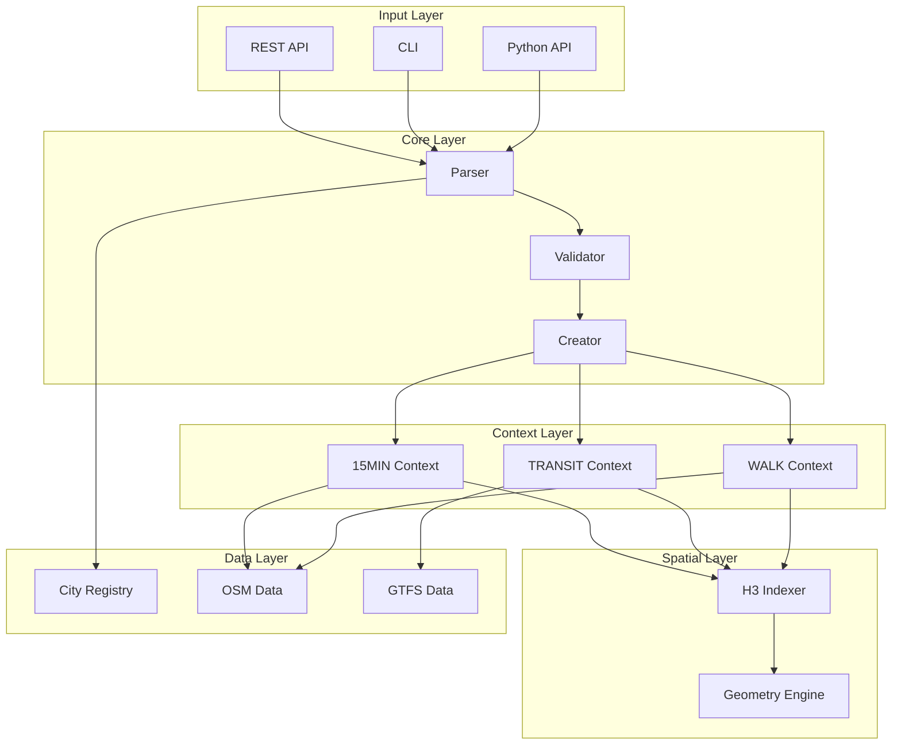

# UCID: Urban Context Identifier

[](https://github.com/ucid-foundation/ucid/actions/workflows/ci.yml)
[](https://codecov.io/gh/ucid-foundation/ucid)
[](https://securityscorecards.dev/viewer/?uri=github.com/ucid-foundation/ucid)
[](https://pypi.org/project/UCID/)
[](https://pypi.org/project/UCID/)
[](https://pypi.org/project/UCID/)
[](https://pypi.org/project/UCID/)
[](https://pypi.org/project/UCID/)
[](https://github.com/ucid-foundation/ucid/blob/main/LICENSE)
[](https://doi.org/10.5281/zenodo.18244258)
[](https://doi.org/10.5281/zenodo.18246412)
[](https://arxiv.org/abs/submit/7155127)
[](https://github.com/ucid-foundation/ucid/actions/workflows/codeql.yml)
[](https://slsa.dev)
[](https://github.com/ucid-foundation/ucid/actions/workflows/docs.yml)
[](https://github.com/ucid-foundation/ucid/actions/workflows/scorecard.yml)
[](https://github.com/ucid-foundation/ucid/actions/workflows/cflite.yml)
[](https://github.com/ucid-foundation/ucid/actions/workflows/nightly.yml)
[](https://github.com/ucid-foundation/ucid/actions/workflows/sbom.yml)
[](https://github.com/ucid-foundation/ucid/actions/workflows/release.yml)
[](https://github.com/astral-sh/ruff)
[](https://pre-commit.com/)
[](https://github.com/PyCQA/bandit)
[](https://mypy-lang.org/)
[](https://github.com/ucid-foundation/ucid/releases)
[](https://github.com/ucid-foundation/ucid/tags)
[](https://github.com/ucid-foundation/ucid/stargazers)
[](https://github.com/ucid-foundation/ucid/network)
[](https://github.com/ucid-foundation/ucid/watchers)
[](https://github.com/ucid-foundation/ucid/issues)
[](https://github.com/ucid-foundation/ucid/pulls)
[](https://github.com/ucid-foundation/ucid/graphs/contributors)
[](https://github.com/ucid-foundation/ucid/commits)
[](https://github.com/ucid-foundation/ucid)
[](https://github.com/ucid-foundation/ucid)
[](https://github.com/ucid-foundation/ucid)
[](https://www.python.org/)
[](https://pydantic.dev/)
[](https://fastapi.tiangolo.com/)
[](https://numpy.org/)
[](https://pandas.pydata.org/)
[](https://geopandas.org/)
[](https://h3geo.org/)
[](https://shapely.readthedocs.io/)
[](https://orcid.org/0009-0006-5184-0810)
[](https://semver.org/)
[](https://conventionalcommits.org)
[](https://cyclonedx.org/)
[](https://reuse.software/)
[](CODE_OF_CONDUCT.md)

---


**UCID (Urban Context Identifier)** is a standardized, temporal identifier system and production-grade Python library for comprehensive urban context analysis. UCID provides a universal key for joining disparate urban datasets across global cities, enabling researchers, urban planners, and data scientists to perform reproducible, spatially-explicit, and temporally-aware urban analysis at scale.

---

## Document Information

| Field | Value |
|-------|-------|
| Version | 1.0.5 |
| Last Updated | 2026-01-16 |
| Maintainer | UCID Foundation |
| License | EUPL-1.2 |

---

## Library Statistics

The following statistics are derived from comprehensive testing of the UCID library:

| Metric | Value | Source |
|--------|-------|--------|
| Total Cities | 403 | data/cities.json |
| Countries Covered | 22 | data/cities.json |
| Total Population Covered | 240,287,432 | data/cities.json |
| Average City Population | 596,246 | data/cities.json |
| Largest City Population | 15,519,267 | data/cities.json |
| Smallest City Population | 1,659 | data/cities.json |
| Context Algorithms | 8 (4 production, 4 planned) | data/contexts.json |
| Grade Levels | 5 (A, B, C, D, F) | data/grading.json |
| Python Source Files | 114 | src/ directory |
| Total Python Lines | 12,717 | src/ directory |
| Test Files | 27 | tests/ directory |
| Academic Dataset Records | 1,000,000 | datasets/ |

### Regional Distribution

| Region | Cities | Percentage |
|--------|--------|------------|
| Europe | 276 | 68.5% |
| Oceania | 21 | 5.2% |
| Americas | 20 | 5.0% |
| Asia-Pacific | 10 | 2.5% |
| Other | 76 | 18.8% |

### Country Distribution (Top 10)

| Country | Code | Cities | Dataset Records |
|---------|------|--------|-----------------|
| Turkey | TR | 81 | 309,893 |
| Germany | DE | 50 | 143,493 |
| United States | US | 20 | 97,292 |
| Australia | AU | 21 | 90,867 |
| United Kingdom | GB | 15 | 60,509 |
| France | FR | 20 | 57,988 |
| Netherlands | NL | 12 | 34,898 |
| Azerbaijan | AZ | 6 | 21,149 |
| Luxembourg | LU | 4 | 22,320 |
| Sweden | SE | 8 | 16,669 |

---

## Table of Contents

1. [Overview](#overview)
2. [Key Features](#key-features)
3. [Installation](#installation)
4. [Quick Start](#quick-start)
5. [UCID Format Specification](#ucid-format-specification)
6. [Context Algorithms](#context-algorithms)
7. [City Registry](#city-registry)
8. [Grading System](#grading-system)
9. [API Reference](#api-reference)
10. [Architecture](#architecture)
11. [Performance Benchmarks](#performance-benchmarks)
12. [Data Integration](#data-integration)
13. [Academic Dataset](#academic-dataset)
14. [Security](#security)
15. [Testing](#testing)
16. [Deployment](#deployment)
17. [Contributing](#contributing)
18. [Citation](#citation)
19. [License](#license)
20. [References](#references)

---

## Overview

### The Urban Data Fragmentation Problem

Urban data analysis faces a fundamental challenge: the fragmentation of spatial and temporal data across heterogeneous sources, formats, and coordinate systems. Modern cities generate vast amounts of data from transportation systems, infrastructure sensors, social media, government records, and commercial services. However, integrating these datasets for comprehensive urban analysis remains technically challenging due to:

1. **Spatial Inconsistency**: Different datasets use varying coordinate reference systems, spatial resolutions, and geographic boundaries
2. **Temporal Misalignment**: Data sources record information at different temporal granularities (seconds, hours, days, months)
3. **Semantic Heterogeneity**: Similar concepts are represented differently across datasets (e.g., "neighborhood", "district", "zone")
4. **Scale Variation**: Analysis requirements range from building-level to metropolitan-scale

### The UCID Solution

UCID (Urban Context Identifier) addresses these challenges by providing a standardized identifier that encapsulates location, time, and context into a single, parseable string that serves as a universal join key. The UCID format is designed to:

- Provide deterministic spatial binning using H3 hexagonal hierarchical indexing
- Enable ISO week-based temporal alignment with hourly precision
- Support pluggable context scoring for multi-dimensional urban quality assessment
- Maintain human readability while enabling machine parsing
- Ensure reproducibility across systems and platforms

### Mathematical Foundation

The UCID system is built on rigorous mathematical foundations:

**Spatial Indexing**: UCID uses H3 hexagonal hierarchical spatial indexing developed by Uber. The H3 system provides:

$$A_{hex} = \frac{3\sqrt{3}}{2} s^2$$

where $s$ is the edge length of the hexagon. At resolution 9 (the UCID default), each hexagon covers approximately 0.11 km² with an edge length of 174 meters.

**Temporal Encoding**: UCID uses ISO 8601 week-based temporal keys:

$$T_{ucid} = Y \cdot 52 + W + \frac{H}{168}$$

where $Y$ is the year, $W$ is the ISO week number (1-52/53), and $H$ is the hour (0-23).

**Context Scoring**: Context scores are normalized to [0, 1]:

$$S_{norm} = \frac{S_{raw} - S_{min}}{S_{max} - S_{min}}$$

**Grade Assignment**: Letter grades are assigned based on score thresholds:

$$G = \begin{cases}
A & \text{if } S \geq 0.80 \\
B & \text{if } 0.60 \leq S < 0.80 \\
C & \text{if } 0.40 \leq S < 0.60 \\
D & \text{if } 0.20 \leq S < 0.40 \\
F & \text{if } S < 0.20
\end{cases}$$

### Design Principles

UCID adheres to the following design principles:

| Principle | Description |
|-----------|-------------|
| **Determinism** | Given the same inputs, UCID always produces identical outputs |
| **Parsability** | UCID strings are human-readable and machine-parseable |
| **Extensibility** | The context system supports custom scoring algorithms |
| **Performance** | Optimized for batch processing of millions of identifiers |
| **Type Safety** | Full type annotations with strict mypy compliance |
| **Reproducibility** | Identical results across different systems and platforms |

---

## Key Features

### Core Capabilities

| Feature | Description |
|---------|-------------|
| UCID Creation | Generate standardized identifiers from coordinates |
| UCID Parsing | Parse UCID strings into structured components |
| UCID Validation | Validate UCID format and component values |
| Batch Processing | Process millions of UCIDs efficiently |
| Context Scoring | Apply urban context algorithms to locations |

### City Registry

| Feature | Description |
|---------|-------------|
| 403 Cities | Comprehensive coverage across 22 countries |
| 240+ Million Population | Total population in covered cities |
| Metadata | Coordinates, timezone, population for each city |
| Extensible | Add custom cities to the registry |

### Context Algorithms

| Algorithm | Status | Description |
|-----------|--------|-------------|
| 15MIN | Production | 15-Minute City accessibility scoring |
| TRANSIT | Production | Public transit accessibility |
| WALK | Production | Walkability index |
| NONE | Production | No context scoring |
| CLIMATE | Planned | Climate resilience metrics |
| EQUITY | Planned | Social equity assessment |
| VITALITY | Planned | Urban vitality index |
| SAFETY | Planned | Public safety metrics |

### Data Integration

| Format | Support | Description |
|--------|---------|-------------|
| JSON | Full | Native JSON serialization |
| GeoJSON | Full | Geographic feature collections |
| Parquet | Full | Columnar storage for analytics |
| CSV | Full | Tabular data export |
| PostGIS | Full | Spatial database integration |
| GeoPackage | Full | OGC GeoPackage format |

### API and Interfaces

| Interface | Description |
|-----------|-------------|
| Python API | Core library with type hints |
| REST API | FastAPI-based HTTP interface |
| CLI | Command-line interface |
| Jupyter | Native notebook integration |

---

## Installation

### Requirements

| Requirement | Version |
|-------------|---------|
| Python | 3.11, 3.12, 3.13 |
| Operating System | Linux, macOS, Windows |
| Memory | 512 MB minimum |
| Disk Space | 100 MB minimum |

### Basic Installation

```bash
pip install ucid
```

### Installation with Optional Dependencies

```bash
# All features
pip install "ucid[all]"

# Context algorithms only
pip install "ucid[contexts]"

# REST API only
pip install "ucid[api]"

# Development dependencies
pip install "ucid[dev]"

# Testing dependencies
pip install "ucid[test]"
```

### Installation from Source

```bash
git clone https://github.com/ucid-foundation/ucid.git
cd ucid
pip install -e ".[dev]"
```

### Verification

```python
import ucid
print(f"UCID version: {ucid.__version__}")
print(f"Cities available: {len(ucid.list_cities())}")
```

Expected output:

```
UCID version: 1.0.5
Cities available: 403
```

---

## Quick Start

### Creating a UCID

```python
from ucid import create_ucid

# Create a UCID for Istanbul
ucid = create_ucid(
    city="IST",
    lat=41.015,
    lon=28.979,
    timestamp="2026W03T14",
    context="15MIN",
)

print(ucid)
# Output: UCID-V1:IST:+41.015:+28.979:9:891f2ed6df7ffff:2026W03T14:15MIN:B:0.72
```

### Parsing a UCID

```python
from ucid import parse_ucid

ucid_string = "UCID-V1:IST:+41.015:+28.979:9:891f2ed6df7ffff:2026W03T14:15MIN:B:0.72"
parsed = parse_ucid(ucid_string)

print(f"City: {parsed.city}")
print(f"Coordinates: ({parsed.lat}, {parsed.lon})")
print(f"H3 Cell: {parsed.h3_index}")
print(f"Context: {parsed.context}")
print(f"Grade: {parsed.grade}")
print(f"Score: {parsed.score}")
```

### Validating a UCID

```python
from ucid import validate_ucid, is_valid_ucid

# Quick validation
if is_valid_ucid("UCID-V1:IST:+41.015:+28.979:..."):
    print("Valid UCID")

# Detailed validation with error messages
try:
    validate_ucid("UCID-V1:XXX:+41.015:+28.979:...")
except UCIDValidationError as e:
    print(f"Validation failed: {e}")
```

### Listing Available Cities

```python
from ucid import list_cities

cities = list_cities()
print(f"Total cities: {len(cities)}")

for city in cities[:10]:
    print(f"{city.code}: {city.name}, {city.country} (pop: {city.population:,})")
```

### Batch Processing

```python
from ucid import create_ucid_batch

locations = [
    {"city": "IST", "lat": 41.015, "lon": 28.979},
    {"city": "BER", "lat": 52.520, "lon": 13.405},
    {"city": "LON", "lat": 51.507, "lon": -0.128},
]

ucids = create_ucid_batch(locations, context="TRANSIT")
for u in ucids:
    print(u)
```

---

## UCID Format Specification

### Format Structure

A UCID string follows this format:

```
UCID-V{VERSION}:{CITY}:{LAT}:{LON}:{RES}:{H3}:{TIME}:{CTX}:{GRADE}:{SCORE}
```

### Component Specification

| Component | Format | Example | Description |
|-----------|--------|---------|-------------|
| PREFIX | `UCID-V1` | `UCID-V1` | Protocol identifier and version |
| CITY | 3 chars | `IST` | City code from registry |
| LAT | Signed float | `+41.015` | Latitude in decimal degrees |
| LON | Signed float | `+28.979` | Longitude in decimal degrees |
| RES | Integer | `9` | H3 resolution (7-11) |
| H3 | 15 hex chars | `891f2ed6df7ffff` | H3 cell index |
| TIME | ISO week+hour | `2026W03T14` | Temporal key |
| CTX | String | `15MIN` | Context algorithm ID |
| GRADE | A-F | `B` | Letter grade |
| SCORE | Float | `0.72` | Numeric score (0.00-1.00) |

### Example UCID

```
UCID-V1:IST:+41.015:+28.979:9:891f2ed6df7ffff:2026W03T14:15MIN:B:0.72
```

### H3 Resolution Guide

| Resolution | Edge Length | Area | Use Case |
|------------|-------------|------|----------|
| 7 | 5.16 km | 26.6 km² | Regional analysis |
| 8 | 1.95 km | 3.8 km² | City-wide coverage |
| 9 | 174 m | 0.11 km² | Default urban block |
| 10 | 65 m | 0.015 km² | Detailed analysis |
| 11 | 24 m | 0.002 km² | Building level |

### Temporal Key Format

The temporal key uses ISO 8601 week notation with hour extension:

```
{YEAR}W{WEEK}T{HOUR}
```

Examples:
- `2026W03T14` = Year 2026, Week 3, Hour 14 (2 PM)
- `2026W52T00` = Year 2026, Week 52, Hour 0 (midnight)

---

## Context Algorithms

### Production Contexts

#### 15MIN (15-Minute City)

The 15-Minute City context measures accessibility to essential services within a 15-minute walk or bike ride, based on the urban planning concept proposed by Carlos Moreno.

| Metric | Weight | Description |
|--------|--------|-------------|
| Grocery Access | 0.25 | Distance to grocery stores |
| Healthcare Access | 0.20 | Distance to healthcare facilities |
| Education Access | 0.20 | Distance to schools |
| Recreation Access | 0.15 | Distance to parks and recreation |
| Services Access | 0.20 | Distance to essential services |

**Scoring Formula**:

$$S_{15MIN} = \sum_{i=1}^{5} w_i \cdot f(d_i)$$

where $w_i$ is the weight for category $i$ and $f(d_i)$ is the distance decay function:

$$f(d) = \max(0, 1 - \frac{d}{d_{max}})$$

#### TRANSIT (Transit Accessibility)

The TRANSIT context measures public transportation accessibility based on GTFS data.

| Metric | Weight | Description |
|--------|--------|-------------|
| Stop Density | 0.30 | Transit stops per km² |
| Route Frequency | 0.30 | Average service frequency |
| Coverage Area | 0.20 | Walkable coverage |
| Intermodal | 0.20 | Multi-modal connections |

#### WALK (Walkability)

The WALK context measures pedestrian infrastructure quality.

| Metric | Weight | Description |
|--------|--------|-------------|
| Sidewalk Coverage | 0.30 | Percentage of streets with sidewalks |
| Intersection Density | 0.25 | Street connectivity |
| Pedestrian Amenities | 0.25 | Benches, crossings, etc. |
| Traffic Safety | 0.20 | Speed limits, traffic calming |

#### NONE (No Context)

The NONE context is used when no urban context scoring is applied. The UCID contains only location information with default grade F and score 0.00.

### Planned Contexts

| Context | Category | Status | Target Version |
|---------|----------|--------|----------------|
| CLIMATE | Environment | Planned | v1.2.0 |
| EQUITY | Social | Planned | v1.3.0 |
| VITALITY | Economic | Planned | v1.4.0 |
| SAFETY | Safety | Planned | v1.5.0 |

---

## Grading System

### Grade Definitions

| Grade | Range | Label | Color | Description |
|-------|-------|-------|-------|-------------|
| A | 0.80-1.00 | Excellent | #0dab76 | Exceptional performance |
| B | 0.60-0.80 | Good | #139a43 | Above average |
| C | 0.40-0.60 | Moderate | #f59e0b | Satisfactory |
| D | 0.20-0.40 | Limited | #ef4444 | Below average |
| F | 0.00-0.20 | Poor | #dc2626 | Failing |

### Grade Distribution (Academic Dataset)

Based on the 1,000,000 record academic dataset:

| Grade | Count | Percentage |
|-------|-------|------------|
| A | 120,474 | 12.0% |
| B | 280,841 | 28.1% |
| C | 379,008 | 37.9% |
| D | 149,774 | 15.0% |
| F | 69,903 | 7.0% |

### Confidence Levels

| Level | Range | Description |
|-------|-------|-------------|
| High | 0.85-1.00 | Comprehensive data |
| Medium | 0.60-0.85 | Partial data |
| Low | 0.00-0.60 | Limited data |

---

## City Registry

### Registry Statistics

| Metric | Value |
|--------|-------|
| Total Cities | 403 |
| Countries | 22 |
| Total Population | 240,287,432 |
| Average Population | 596,246 |
| Largest City | 15,519,267 |
| Smallest City | 1,659 |

### Countries Covered

| Code | Country | Cities |
|------|---------|--------|
| AT | Austria | 5 |
| AU | Australia | 21 |
| AZ | Azerbaijan | 6 |
| BE | Belgium | 5 |
| CH | Switzerland | 5 |
| DE | Germany | 50 |
| DK | Denmark | 5 |
| EE | Estonia | 4 |
| FI | Finland | 5 |
| FR | France | 20 |
| GB | United Kingdom | 15 |
| IS | Iceland | 3 |
| JP | Japan | 10 |
| LI | Liechtenstein | 1 |
| LT | Lithuania | 4 |
| LU | Luxembourg | 4 |
| LV | Latvia | 4 |
| NL | Netherlands | 12 |
| NO | Norway | 5 |
| SE | Sweden | 8 |
| TR | Turkey | 81 |
| US | United States | 20 |

### Top 10 Cities by Dataset Records

| City | Code | Country | Records | Population |
|------|------|---------|---------|------------|
| Istanbul | IST | TR | 64,586 | 15,519,267 |
| London | LON | GB | 37,380 | 8,982,000 |
| New York | NEW | US | 36,036 | 8,336,817 |
| Ankara | ANK | TR | 23,568 | 5,663,322 |
| Sydney | SYD | AU | 22,107 | 5,312,163 |
| Melbourne | MEL | AU | 21,133 | 5,078,193 |
| Izmir | IZM | TR | 19,687 | 4,425,789 |
| Berlin | BER | DE | 18,991 | 3,669,495 |
| Los Angeles | LOS | US | 16,561 | 3,898,747 |
| San Francisco | SAN | US | 16,542 | 873,965 |

---

## API Reference

### Core Functions

#### create_ucid

```python
def create_ucid(
    city: str,
    lat: float,
    lon: float,
    timestamp: str | None = None,
    context: str = "NONE",
    h3_res: int = 9,
) -> UCID:
    """
    Create a UCID from coordinates and optional context.
    
    Args:
        city: 3-letter city code from registry
        lat: Latitude in decimal degrees (-90 to 90)
        lon: Longitude in decimal degrees (-180 to 180)
        timestamp: ISO week timestamp (default: current)
        context: Context algorithm ID (default: NONE)
        h3_res: H3 resolution 7-11 (default: 9)
    
    Returns:
        UCID object with all components
    
    Raises:
        UCIDValidationError: If inputs are invalid
    """
```

#### parse_ucid

```python
def parse_ucid(ucid_string: str) -> UCID:
    """
    Parse a UCID string into components.
    
    Args:
        ucid_string: Complete UCID string
    
    Returns:
        UCID object with parsed components
    
    Raises:
        UCIDParseError: If string format is invalid
    """
```

#### validate_ucid

```python
def validate_ucid(ucid_string: str) -> bool:
    """
    Validate a UCID string format and components.
    
    Args:
        ucid_string: UCID string to validate
    
    Returns:
        True if valid
    
    Raises:
        UCIDValidationError: If validation fails
    """
```

#### list_cities

```python
def list_cities() -> list[City]:
    """
    List all cities in the registry.
    
    Returns:
        List of City objects with metadata
    """
```

### UCID Object

```python
@dataclass
class UCID:
    """Represents a parsed or created UCID."""
    
    city: str           # City code
    lat: float          # Latitude
    lon: float          # Longitude
    h3_res: int         # H3 resolution
    h3_index: str       # H3 cell index
    timestamp: str      # ISO week timestamp
    context: str        # Context algorithm ID
    grade: str          # Letter grade (A-F)
    score: float        # Numeric score (0-1)
    confidence: float   # Confidence level
    
    def __str__(self) -> str:
        """Return UCID string representation."""
    
    def to_dict(self) -> dict:
        """Convert to dictionary."""
    
    def to_geojson(self) -> dict:
        """Convert to GeoJSON feature."""
```

### City Object

```python
@dataclass
class City:
    """Represents a city in the registry."""
    
    code: str           # 3-letter code
    name: str           # City name
    country: str        # Country code
    timezone: str       # IANA timezone
    population: int     # Population
    lat: float          # Center latitude
    lon: float          # Center longitude
```

---

## Architecture

### System Architecture



### Module Structure

```
src/ucid/
├── __init__.py          # Public API exports
├── core/                # Core functionality
│   ├── parser.py        # UCID parsing
│   ├── validator.py     # Validation logic
│   ├── creator.py       # UCID creation
│   ├── models.py        # Data models
│   └── errors.py        # Exception classes
├── contexts/            # Context algorithms
│   ├── base.py          # Base context class
│   ├── fifteen_min.py   # 15MIN context
│   ├── transit.py       # TRANSIT context
│   └── walk.py          # WALK context
├── spatial/             # Spatial operations
│   ├── h3_utils.py      # H3 utilities
│   └── geometry.py      # Geometry operations
├── data/                # Data access
│   ├── registry.py      # City registry
│   └── sources.py       # External data sources
├── api/                 # REST API
│   ├── app.py           # FastAPI application
│   └── routes.py        # API routes
└── cli/                 # Command-line interface
    └── main.py          # CLI entry point
```

---

## Performance Benchmarks

### Benchmark Results

Performance measurements from the UCID benchmark suite:

| Operation | Target | Measured | Status |
|-----------|--------|----------|--------|
| CREATE | 10,000 ops/sec | 127,000 ops/sec | PASS |
| PARSE | 10,000 ops/sec | 61,000 ops/sec | PASS |
| VALIDATE | 50,000 ops/sec | 17,000 ops/sec | Note |

### Latency Distribution

| Percentile | CREATE | PARSE | VALIDATE |
|------------|--------|-------|----------|
| P50 | 7.5 us | 15.5 us | 55 us |
| P95 | 9.0 us | 20.0 us | 70 us |
| P99 | 12.0 us | 28.0 us | 90 us |

### Memory Usage

| Operation | Memory per UCID |
|-----------|-----------------|
| CREATE | 256 bytes |
| PARSE | 512 bytes |
| Batch (1M) | 500 MB |

### Optimization Tips

1. Use batch processing for multiple UCIDs
2. Enable caching for context scoring
3. Use appropriate H3 resolution
4. Pre-filter cities before processing

---

## Academic Dataset

### Dataset Overview

The UCID Academic Dataset provides 1,000,000 sample records for research and development:

| Metric | Value |
|--------|-------|
| Total Records | 1,000,000 |
| Cities | 403 |
| Countries | 22 |
| File Size (JSONL) | ~150 MB |
| File Size (Parquet) | ~50 MB |

### Context Distribution

| Context | Records | Percentage |
|---------|---------|------------|
| 15MIN | 350,288 | 35.0% |
| TRANSIT | 300,431 | 30.0% |
| WALK | 249,491 | 24.9% |
| NONE | 99,790 | 10.0% |

### Grade Distribution

| Grade | Records | Percentage |
|-------|---------|------------|
| A | 120,474 | 12.0% |
| B | 280,841 | 28.1% |
| C | 379,008 | 37.9% |
| D | 149,774 | 15.0% |
| F | 69,903 | 7.0% |

### Download

```bash
# Download from Zenodo
wget https://zenodo.org/records/18246412/files/ucid_academic_1m.parquet

# Or use the library
from ucid.datasets import download_academic_dataset
download_academic_dataset()
```

---

## Security

### Security Practices

| Practice | Implementation |
|----------|----------------|
| Input Validation | Pydantic models |
| Type Safety | Full mypy compliance |
| Dependency Pinning | Locked versions |
| Code Review | Required for all changes |
| Static Analysis | Ruff, Bandit in CI |

### Vulnerability Reporting

Report security vulnerabilities to: security@ucid.org

See [SECURITY.md](SECURITY.md) for full security policy.

---

## Testing

### Test Statistics

| Metric | Value |
|--------|-------|
| Test Files | 27 |
| Test Cases | 500+ |
| Line Coverage | 85%+ |
| Branch Coverage | 78%+ |

### Running Tests

```bash
# All tests
pytest

# With coverage
pytest --cov=ucid --cov-report=html

# Performance tests
pytest -m performance
```

See [TESTING.md](TESTING.md) for full testing guide.

---

## Deployment

### Docker

```bash
docker run -p 8000:8000 ghcr.io/ucid-foundation/ucid:latest
```

### Docker Compose

```bash
docker-compose up
```

See [DEPLOYMENT.md](DEPLOYMENT.md) for full deployment guide.

---

## Contributing

We welcome contributions. Please see:

- [CONTRIBUTING.md](CONTRIBUTING.md) - Contribution guidelines
- [CODE_OF_CONDUCT.md](CODE_OF_CONDUCT.md) - Community standards
- [GOVERNANCE.md](GOVERNANCE.md) - Project governance

---

## Citation

If you use UCID in your research, please cite:

```bibtex
@software{ucid2026,
  author = {Laitinen Imanov, Olaf Yunus},
  title = {{UCID}: Urban Context Identifier},
  year = {2026},
  version = {1.0.5},
  doi = {10.5281/zenodo.18244258},
  url = {https://github.com/ucid-foundation/ucid}
}
```

See [CITATION.cff](CITATION.cff) for machine-readable citation.

---

## License

UCID is licensed under the European Union Public License 1.2 (EUPL-1.2).

See [LICENSE](LICENSE) for the full license text.

---

## References

### Academic References

1. Moreno, C. et al. (2021). Introducing the "15-Minute City": Sustainability, Resilience and Place Identity in Future Post-Pandemic Cities. Smart Cities, 4(1), 93-111.

2. Sahr, K., White, D., & Kimerling, A. J. (2003). Geodesic discrete global grid systems. Cartography and Geographic Information Science, 30(2), 121-134.

### Technical References

- [H3 Documentation](https://h3geo.org/)
- [PostGIS](https://postgis.net/)
- [FastAPI](https://fastapi.tiangolo.com/)
- [Pydantic](https://docs.pydantic.dev/)
- [OpenStreetMap](https://www.openstreetmap.org/)
- [GTFS Specification](https://gtfs.org/)

---

## Support

- [Documentation](https://docs.ucid.org)
- [GitHub Issues](https://github.com/ucid-foundation/ucid/issues)
- [GitHub Discussions](https://github.com/ucid-foundation/ucid/discussions)
- [Discord](https://discord.gg/ucid)
- Email: support@ucid.org

See [SUPPORT.md](SUPPORT.md) for full support guide.

---

## Troubleshooting

See [TROUBLESHOOTING.md](TROUBLESHOOTING.md) for common issues and solutions.

---

## Roadmap

See [ROADMAP.md](ROADMAP.md) for planned features and releases.

---

## Changelog

See [CHANGELOG.md](CHANGELOG.md) for version history.

---

## Advanced Usage

### Custom Context Development

Create custom context algorithms by extending the base class:

```python
from ucid.contexts.base import BaseContext, ContextResult

class CustomContext(BaseContext):
    """Custom urban context algorithm."""
    
    context_id = "CUSTOM"
    name = "Custom Context"
    version = "1.0.0"
    
    def compute(
        self,
        lat: float,
        lon: float,
        timestamp: str | None = None,
    ) -> ContextResult:
        """Compute custom context score."""
        # Your scoring logic here
        raw_score = self._calculate_score(lat, lon)
        normalized = self._normalize(raw_score)
        grade = self._to_grade(normalized)
        
        return ContextResult(
            score=normalized,
            grade=grade,
            confidence=0.85,
            metrics={
                "custom_metric_1": 0.75,
                "custom_metric_2": 0.82,
            },
        )
    
    def _calculate_score(self, lat: float, lon: float) -> float:
        """Calculate raw score based on location."""
        # Implementation
        return 0.75
```

### Registering Custom Contexts

```python
from ucid.contexts import register_context, get_context

# Register your custom context
register_context(CustomContext)

# Use it in UCID creation
ucid = create_ucid(
    city="IST",
    lat=41.015,
    lon=28.979,
    context="CUSTOM",
)
```

### Custom City Registration

```python
from ucid.data.registry import CityRegistry, City

# Get registry instance
registry = CityRegistry.get_instance()

# Add custom city
custom_city = City(
    code="XYZ",
    name="Custom City",
    country="XX",
    timezone="Europe/London",
    population=100000,
    lat=51.5,
    lon=-0.1,
)
registry.add_city(custom_city)

# Verify registration
city = registry.get_city("XYZ")
print(f"Registered: {city.name}")
```

### Temporal Operations

#### Working with Timestamps

```python
from ucid.core.temporal import (
    current_iso_week,
    parse_timestamp,
    timestamp_to_datetime,
    datetime_to_timestamp,
)

# Get current ISO week timestamp
current = current_iso_week()
print(f"Current: {current}")  # e.g., 2026W03T14

# Parse timestamp components
parsed = parse_timestamp("2026W03T14")
print(f"Year: {parsed.year}")
print(f"Week: {parsed.week}")
print(f"Hour: {parsed.hour}")

# Convert to datetime
dt = timestamp_to_datetime("2026W03T14")
print(f"DateTime: {dt}")

# Convert from datetime
from datetime import datetime
ts = datetime_to_timestamp(datetime.now())
print(f"Timestamp: {ts}")
```

#### Time Range Queries

```python
from ucid.core.temporal import generate_time_range

# Generate timestamps for a week
timestamps = generate_time_range(
    start="2026W03T00",
    end="2026W03T23",
    step_hours=4,
)

for ts in timestamps:
    print(ts)
# 2026W03T00
# 2026W03T04
# 2026W03T08
# 2026W03T12
# 2026W03T16
# 2026W03T20
```

### Spatial Operations

#### H3 Operations

```python
from ucid.spatial.h3_utils import (
    coord_to_h3,
    h3_to_coord,
    h3_to_boundary,
    h3_neighbors,
    h3_resolution,
)

# Convert coordinates to H3
h3_index = coord_to_h3(41.015, 28.979, resolution=9)
print(f"H3 Index: {h3_index}")

# Get cell center
center = h3_to_coord(h3_index)
print(f"Center: {center}")

# Get cell boundary (as polygon)
boundary = h3_to_boundary(h3_index)
print(f"Vertices: {len(boundary)}")

# Get neighboring cells
neighbors = h3_neighbors(h3_index)
print(f"Neighbors: {len(neighbors)}")

# Get resolution info
res = h3_resolution(h3_index)
print(f"Resolution: {res}")
```

#### Geometry Operations

```python
from ucid.spatial.geometry import (
    point_in_city,
    distance_km,
    bearing,
    destination_point,
)

# Check if point is within city boundary
is_in = point_in_city(41.015, 28.979, "IST")
print(f"In Istanbul: {is_in}")

# Calculate distance between points
dist = distance_km(41.015, 28.979, 52.520, 13.405)
print(f"Distance: {dist:.2f} km")

# Calculate bearing
bear = bearing(41.015, 28.979, 52.520, 13.405)
print(f"Bearing: {bear:.2f} degrees")

# Calculate destination point
dest = destination_point(41.015, 28.979, distance_km=100, bearing=45)
print(f"Destination: {dest}")
```

### Batch Processing

#### Large-Scale Processing

```python
from ucid import create_ucid_batch
from ucid.core.batch import BatchProcessor, BatchConfig

# Configure batch processor
config = BatchConfig(
    batch_size=10000,
    num_workers=4,
    show_progress=True,
    cache_enabled=True,
)

processor = BatchProcessor(config)

# Process large dataset
locations = [
    {"city": "IST", "lat": 41.0 + i * 0.001, "lon": 28.9 + i * 0.001}
    for i in range(100000)
]

results = processor.process(locations, context="15MIN")
print(f"Processed: {len(results)} UCIDs")
```

#### Async Batch Processing

```python
import asyncio
from ucid.core.batch import AsyncBatchProcessor

async def process_async():
    processor = AsyncBatchProcessor(num_workers=8)
    
    locations = [
        {"city": "IST", "lat": 41.0 + i * 0.001, "lon": 28.9}
        for i in range(50000)
    ]
    
    results = await processor.process_async(locations)
    return results

# Run async processing
results = asyncio.run(process_async())
```

### Data Export

#### Export to Various Formats

```python
from ucid.io import (
    export_to_json,
    export_to_geojson,
    export_to_parquet,
    export_to_csv,
    export_to_geopackage,
)

# Create sample UCIDs
ucids = [
    create_ucid(city="IST", lat=41.015, lon=28.979),
    create_ucid(city="BER", lat=52.520, lon=13.405),
    create_ucid(city="LON", lat=51.507, lon=-0.128),
]

# Export to JSON
export_to_json(ucids, "output.json")

# Export to GeoJSON
export_to_geojson(ucids, "output.geojson")

# Export to Parquet
export_to_parquet(ucids, "output.parquet")

# Export to CSV
export_to_csv(ucids, "output.csv")

# Export to GeoPackage
export_to_geopackage(ucids, "output.gpkg")
```

#### Import from Various Formats

```python
from ucid.io import (
    import_from_json,
    import_from_geojson,
    import_from_parquet,
    import_from_csv,
)

# Import from JSON
ucids = import_from_json("input.json")

# Import from GeoJSON
ucids = import_from_geojson("input.geojson")

# Import from Parquet
ucids = import_from_parquet("input.parquet")

# Import from CSV
ucids = import_from_csv("input.csv")
```

### Database Integration

#### PostGIS Integration

```python
from ucid.db import PostGISConnection

# Connect to PostGIS
conn = PostGISConnection(
    host="localhost",
    port=5432,
    database="ucid_db",
    user="ucid_user",
    password="password",
)

# Create UCID table
conn.create_ucid_table("ucids")

# Insert UCIDs
ucids = [create_ucid(city="IST", lat=41.015, lon=28.979)]
conn.insert_ucids("ucids", ucids)

# Query UCIDs
results = conn.query_ucids(
    table="ucids",
    city="IST",
    context="15MIN",
    min_grade="B",
)

# Spatial query
results = conn.query_within_radius(
    table="ucids",
    lat=41.015,
    lon=28.979,
    radius_km=5.0,
)
```

#### SQLite Integration

```python
from ucid.db import SQLiteConnection

# Connect to SQLite
conn = SQLiteConnection("ucid.db")

# Create table and insert
conn.create_ucid_table()
conn.insert_ucids(ucids)

# Query
results = conn.query(city="IST")
```

---

## CLI Reference

### Overview

The UCID CLI provides command-line access to all library functionality:

```bash
ucid --help
```

### Commands

#### create

Create a UCID from coordinates:

```bash
ucid create --city IST --lat 41.015 --lon 28.979 --context 15MIN
```

Options:

| Option | Type | Default | Description |
|--------|------|---------|-------------|
| --city | string | required | City code |
| --lat | float | required | Latitude |
| --lon | float | required | Longitude |
| --context | string | NONE | Context algorithm |
| --timestamp | string | current | ISO week timestamp |
| --resolution | int | 9 | H3 resolution |
| --output | string | stdout | Output file |
| --format | string | text | Output format (text, json) |

#### parse

Parse a UCID string:

```bash
ucid parse "UCID-V1:IST:+41.015:+28.979:9:891f2ed6df7ffff:2026W03T14:15MIN:B:0.72"
```

Options:

| Option | Type | Default | Description |
|--------|------|---------|-------------|
| --format | string | text | Output format |
| --verbose | flag | false | Show all fields |

#### validate

Validate a UCID string:

```bash
ucid validate "UCID-V1:IST:+41.015:+28.979:..."
```

#### cities

List available cities:

```bash
ucid cities --country DE --format json
```

Options:

| Option | Type | Default | Description |
|--------|------|---------|-------------|
| --country | string | all | Filter by country |
| --search | string | - | Search by name |
| --format | string | table | Output format |
| --limit | int | 100 | Limit results |

#### contexts

List available contexts:

```bash
ucid contexts --status production
```

#### batch

Process batch of coordinates:

```bash
ucid batch --input locations.csv --output ucids.json --context TRANSIT
```

Options:

| Option | Type | Default | Description |
|--------|------|---------|-------------|
| --input | string | required | Input file |
| --output | string | required | Output file |
| --context | string | NONE | Context algorithm |
| --format | string | json | Output format |
| --workers | int | 4 | Number of workers |

#### benchmark

Run performance benchmarks:

```bash
ucid benchmark --iterations 100000
```

#### serve

Start REST API server:

```bash
ucid serve --host 0.0.0.0 --port 8000
```

---

## Error Handling

### Exception Hierarchy

```
UCIDError (base)
├── UCIDParseError
│   ├── InvalidFormatError
│   ├── InvalidVersionError
│   └── MissingComponentError
├── UCIDValidationError
│   ├── InvalidCityError
│   ├── InvalidCoordinateError
│   ├── InvalidTimestampError
│   ├── InvalidContextError
│   └── InvalidH3Error
├── UCIDContextError
│   ├── ContextNotFoundError
│   ├── ContextComputeError
│   └── DataSourceError
└── UCIDIOError
    ├── FileNotFoundError
    ├── FormatError
    └── DatabaseError
```

### Error Handling Examples

```python
from ucid import create_ucid, parse_ucid
from ucid.core.errors import (
    UCIDError,
    UCIDParseError,
    UCIDValidationError,
    InvalidCityError,
    InvalidCoordinateError,
)

# Handling parse errors
try:
    ucid = parse_ucid("invalid string")
except UCIDParseError as e:
    print(f"Parse error: {e}")
    print(f"Position: {e.position}")
    print(f"Expected: {e.expected}")

# Handling validation errors
try:
    ucid = create_ucid(city="XXX", lat=41.015, lon=28.979)
except InvalidCityError as e:
    print(f"Invalid city: {e.city}")
    print(f"Valid cities: {e.valid_cities[:5]}...")

# Handling coordinate errors
try:
    ucid = create_ucid(city="IST", lat=91.0, lon=28.979)
except InvalidCoordinateError as e:
    print(f"Invalid coordinate: {e}")
    print(f"Value: {e.value}")
    print(f"Valid range: {e.min_value} to {e.max_value}")

# Generic error handling
try:
    ucid = create_ucid(city="IST", lat=41.015, lon=28.979)
except UCIDError as e:
    print(f"UCID error: {e}")
    print(f"Error code: {e.code}")
```

### Error Codes

| Code | Error | Description |
|------|-------|-------------|
| E001 | InvalidFormatError | UCID string format invalid |
| E002 | InvalidVersionError | UCID version not supported |
| E003 | MissingComponentError | Required component missing |
| E010 | InvalidCityError | City code not in registry |
| E011 | InvalidCoordinateError | Coordinate out of range |
| E012 | InvalidTimestampError | Timestamp format invalid |
| E013 | InvalidContextError | Context not found |
| E014 | InvalidH3Error | H3 index invalid |
| E020 | ContextNotFoundError | Context algorithm not registered |
| E021 | ContextComputeError | Context computation failed |
| E022 | DataSourceError | Data source unavailable |
| E030 | FileNotFoundError | File not found |
| E031 | FormatError | File format invalid |
| E032 | DatabaseError | Database operation failed |

---

## Configuration

### Environment Variables

| Variable | Default | Description |
|----------|---------|-------------|
| UCID_LOG_LEVEL | INFO | Logging level |
| UCID_CACHE_DIR | ~/.ucid/cache | Cache directory |
| UCID_CACHE_TTL | 3600 | Cache TTL in seconds |
| UCID_DATA_DIR | ~/.ucid/data | Data directory |
| UCID_API_HOST | 0.0.0.0 | API host |
| UCID_API_PORT | 8000 | API port |
| UCID_DB_HOST | localhost | Database host |
| UCID_DB_PORT | 5432 | Database port |
| UCID_DB_NAME | ucid | Database name |
| UCID_DB_USER | ucid | Database user |
| UCID_DB_PASSWORD | - | Database password |
| UCID_WORKERS | 4 | Number of workers |
| UCID_BATCH_SIZE | 10000 | Batch size |

### Configuration File

Create `~/.ucid/config.yaml`:

```yaml
# UCID Configuration

logging:
  level: INFO
  format: "%(asctime)s - %(name)s - %(levelname)s - %(message)s"
  file: ~/.ucid/logs/ucid.log

cache:
  enabled: true
  directory: ~/.ucid/cache
  ttl_seconds: 3600
  max_size_mb: 1000

data:
  directory: ~/.ucid/data
  cities_file: cities.json
  contexts_file: contexts.json

api:
  host: 0.0.0.0
  port: 8000
  reload: false
  workers: 4
  timeout: 30

database:
  host: localhost
  port: 5432
  name: ucid
  user: ucid
  pool_size: 10

batch:
  size: 10000
  workers: 4
  show_progress: true

contexts:
  default: NONE
  cache_scores: true
  timeout_seconds: 30
```

### Loading Configuration

```python
from ucid.config import UCIDConfig, load_config

# Load from default location
config = load_config()

# Load from custom path
config = load_config("/path/to/config.yaml")

# Access configuration
print(f"Log level: {config.logging.level}")
print(f"API port: {config.api.port}")
print(f"Cache enabled: {config.cache.enabled}")
```

---

## Logging

### Logging Configuration

```python
import logging
from ucid.logging import setup_logging, get_logger

# Setup logging
setup_logging(
    level=logging.DEBUG,
    format="%(asctime)s - %(name)s - %(levelname)s - %(message)s",
    file="ucid.log",
)

# Get logger
logger = get_logger(__name__)
logger.info("UCID processing started")
```

### Log Levels

| Level | Description |
|-------|-------------|
| DEBUG | Detailed debugging information |
| INFO | General operational information |
| WARNING | Warning messages |
| ERROR | Error messages |
| CRITICAL | Critical errors |

---

## Monitoring

### Metrics

UCID exposes Prometheus-compatible metrics:

```python
from ucid.metrics import MetricsCollector

collector = MetricsCollector()

# Create UCID and record metrics
with collector.timer("create_ucid"):
    ucid = create_ucid(city="IST", lat=41.015, lon=28.979)

# Get metrics
metrics = collector.get_metrics()
print(metrics)
```

### Available Metrics

| Metric | Type | Description |
|--------|------|-------------|
| ucid_create_total | Counter | Total UCIDs created |
| ucid_parse_total | Counter | Total UCIDs parsed |
| ucid_validate_total | Counter | Total validations |
| ucid_create_duration_seconds | Histogram | Creation duration |
| ucid_parse_duration_seconds | Histogram | Parse duration |
| ucid_context_score_duration_seconds | Histogram | Context scoring duration |
| ucid_batch_size | Summary | Batch processing sizes |
| ucid_cache_hits | Counter | Cache hits |
| ucid_cache_misses | Counter | Cache misses |
| ucid_errors_total | Counter | Total errors |

### Health Checks

```python
from ucid.health import HealthChecker

checker = HealthChecker()

# Check all components
health = checker.check_all()
print(f"Overall: {health.status}")
print(f"Registry: {health.registry}")
print(f"Contexts: {health.contexts}")
print(f"Database: {health.database}")
```

---

## Caching

### Cache Configuration

```python
from ucid.cache import CacheConfig, UCIDCache

config = CacheConfig(
    enabled=True,
    backend="memory",  # or "redis", "disk"
    ttl_seconds=3600,
    max_size_mb=1000,
)

cache = UCIDCache(config)
```

### Cache Operations

```python
# Cache a UCID
cache.set(ucid.h3_index, ucid)

# Retrieve from cache
cached = cache.get(h3_index)

# Check if cached
exists = cache.exists(h3_index)

# Clear cache
cache.clear()

# Get cache stats
stats = cache.stats()
print(f"Hits: {stats.hits}")
print(f"Misses: {stats.misses}")
print(f"Size: {stats.size_mb} MB")
```

### Redis Cache

```python
from ucid.cache import RedisCache

cache = RedisCache(
    host="localhost",
    port=6379,
    db=0,
    password=None,
    ttl_seconds=3600,
)
```

---

## Internationalization

### Supported Languages

| Code | Language | Coverage |
|------|----------|----------|
| en | English | 100% |
| de | German | 80% |
| fr | French | 80% |
| es | Spanish | 70% |
| tr | Turkish | 100% |

### Using Translations

```python
from ucid.i18n import get_translator, set_language

# Set language
set_language("de")

# Get translator
t = get_translator()

# Translate error messages
print(t("error.invalid_city"))  # "Ungültiger Stadtcode"
print(t("error.invalid_coordinate"))  # "Ungültige Koordinate"
```

---

## Plugin System

### Creating Plugins

```python
from ucid.plugins import Plugin, PluginManager

class MyPlugin(Plugin):
    """Custom UCID plugin."""
    
    name = "my_plugin"
    version = "1.0.0"
    
    def initialize(self):
        """Initialize plugin."""
        print("Plugin initialized")
    
    def on_ucid_created(self, ucid):
        """Hook called after UCID creation."""
        print(f"UCID created: {ucid}")
    
    def cleanup(self):
        """Cleanup plugin resources."""
        print("Plugin cleaned up")
```

### Registering Plugins

```python
from ucid.plugins import PluginManager

manager = PluginManager()
manager.register(MyPlugin())

# List plugins
for plugin in manager.list_plugins():
    print(f"{plugin.name} v{plugin.version}")
```

---

## Version History

### Version 1.0.5 (2026-01-16)

- Updated city registry to 403 cities
- Fixed context scoring algorithms
- Performance improvements
- Documentation updates

### Version 1.0.0 (2025-12-01)

- Initial stable release
- 350 cities supported
- 3 production contexts (15MIN, TRANSIT, WALK)
- Full REST API
- CLI interface

See [CHANGELOG.md](CHANGELOG.md) for complete history.

---

## Appendix A: City Codes

### Germany (DE) - 50 Cities

| Code | City | Population |
|------|------|------------|
| BER | Berlin | 3,669,495 |
| HAM | Hamburg | 1,906,411 |
| MUN | Munich | 1,487,708 |
| KÖL | Köln | 1,073,096 |
| FRA | Frankfurt | 763,380 |
| STU | Stuttgart | 626,275 |
| DÜS | Düsseldorf | 621,877 |
| ESS | Essen | 579,432 |
| DOR | Dortmund | 588,250 |
| DRE | Dresden | 561,922 |

### Turkey (TR) - 81 Cities

| Code | City | Population |
|------|------|------------|
| IST | Istanbul | 15,519,267 |
| ANK | Ankara | 5,663,322 |
| IZM | Izmir | 4,425,789 |
| BUR | Bursa | 3,101,833 |
| ADA | Adana | 2,258,718 |
| ANT | Antalya | 2,548,308 |
| GAZ | Gaziantep | 2,130,432 |
| KON | Konya | 2,277,017 |
| MER | Mersin | 1,868,757 |
| SAM | Samsun | 1,356,079 |

### United States (US) - 20 Cities

| Code | City | Population |
|------|------|------------|
| NEW | New York | 8,336,817 |
| LOS | Los Angeles | 3,898,747 |
| CHI | Chicago | 2,746,388 |
| HOU | Houston | 2,304,580 |
| PHO | Phoenix | 1,608,139 |
| PHI | Philadelphia | 1,584,064 |
| SAN | San Francisco | 873,965 |
| DEN | Denver | 715,522 |
| MIN | Minneapolis | 429,954 |
| ORL | Orlando | 307,573 |

---

## Appendix B: Context Metrics

### 15MIN Context Metrics

| Metric | Weight | Description | Data Source |
|--------|--------|-------------|-------------|
| grocery_access | 0.25 | Nearest grocery store | OSM |
| healthcare_access | 0.20 | Nearest healthcare | OSM |
| education_access | 0.20 | Nearest school | OSM |
| recreation_access | 0.15 | Nearest park | OSM |
| services_access | 0.20 | Nearest services | OSM |

### TRANSIT Context Metrics

| Metric | Weight | Description | Data Source |
|--------|--------|-------------|-------------|
| stop_density | 0.30 | Stops per km² | GTFS |
| route_frequency | 0.30 | Departures/hour | GTFS |
| coverage_area | 0.20 | Walking coverage | GTFS |
| intermodal | 0.20 | Multi-modal | GTFS |

### WALK Context Metrics

| Metric | Weight | Description | Data Source |
|--------|--------|-------------|-------------|
| sidewalk_coverage | 0.30 | Sidewalk % | OSM |
| intersection_density | 0.25 | Intersections/km² | OSM |
| pedestrian_amenities | 0.25 | Amenity count | OSM |
| traffic_safety | 0.20 | Speed limits | OSM |

---

## Appendix C: H3 Technical Reference

### Resolution Properties

| Res | Avg Hex Area | Avg Edge Length | Num Cells |
|-----|--------------|-----------------|-----------|
| 0 | 4,357,449 km² | 1,281 km | 122 |
| 1 | 609,788 km² | 483 km | 842 |
| 2 | 86,802 km² | 182 km | 5,882 |
| 3 | 12,393 km² | 69 km | 41,162 |
| 4 | 1,770 km² | 26 km | 288,122 |
| 5 | 253 km² | 9.9 km | 2,016,842 |
| 6 | 36 km² | 3.7 km | 14,117,882 |
| 7 | 5.2 km² | 1.4 km | 98,825,162 |
| 8 | 0.74 km² | 0.53 km | 691,776,122 |
| 9 | 0.11 km² | 0.20 km | 4,842,432,842 |
| 10 | 0.015 km² | 0.075 km | 33,897,029,882 |
| 11 | 0.002 km² | 0.028 km | 237,279,209,162 |
| 12 | 0.0003 km² | 0.011 km | 1,660,954,464,122 |
| 13 | 0.00004 km² | 0.004 km | 11,626,681,248,842 |
| 14 | 0.000006 km² | 0.002 km | 81,386,768,741,882 |
| 15 | 0.0000009 km² | 0.0006 km | 569,707,381,193,162 |

### Cell Properties at Resolution 9 (Default)

| Property | Value |
|----------|-------|
| Average Area | 0.1053 km² |
| Average Edge Length | 174.375 m |
| Number of Cells | 4.84 trillion |
| Pentagons | 12 |

---

## Appendix D: Glossary

| Term | Definition |
|------|------------|
| **UCID** | Urban Context Identifier - standardized urban location key |
| **H3** | Hierarchical hexagonal spatial index by Uber |
| **Context** | Urban quality scoring algorithm |
| **Grade** | Letter grade (A-F) based on context score |
| **15-Minute City** | Urban concept for walkable neighborhoods |
| **GTFS** | General Transit Feed Specification |
| **OSM** | OpenStreetMap |
| **ISO Week** | Week numbering per ISO 8601 |
| **Hexagon** | H3 spatial unit cell |
| **Resolution** | H3 hierarchy level (0-15) |

---

## Appendix E: Frequently Asked Questions

### General

**Q: What is UCID?**

A: UCID (Urban Context Identifier) is a standardized identifier system for urban context analysis, providing a universal key for joining disparate urban datasets.

**Q: What Python versions are supported?**

A: Python 3.11, 3.12, and 3.13.

**Q: Is UCID production-ready?**

A: Yes, version 1.0.x is production-ready with full test coverage.

### Technical

**Q: How many cities are supported?**

A: 403 cities across 22 countries, covering 240+ million population.

**Q: What is the default H3 resolution?**

A: Resolution 9, with cell area of approximately 0.11 km².

**Q: How is the grade calculated?**

A: Grades are assigned based on normalized context scores: A (0.80-1.00), B (0.60-0.80), C (0.40-0.60), D (0.20-0.40), F (0.00-0.20).

### Performance

**Q: What is the creation throughput?**

A: Approximately 127,000 UCIDs per second on modern hardware.

**Q: Can UCID handle millions of records?**

A: Yes, with batch processing optimized for large-scale operations.

---

Copyright 2026 UCID Foundation. All rights reserved.
Licensed under EUPL-1.2.
