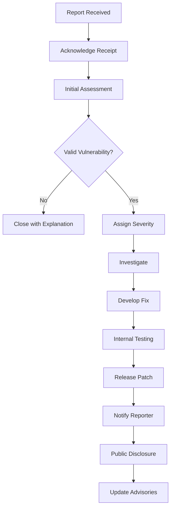
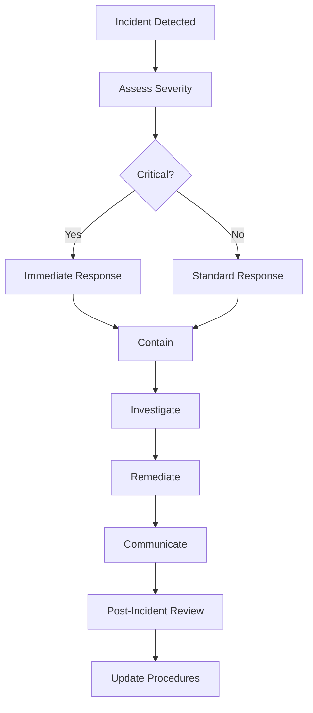
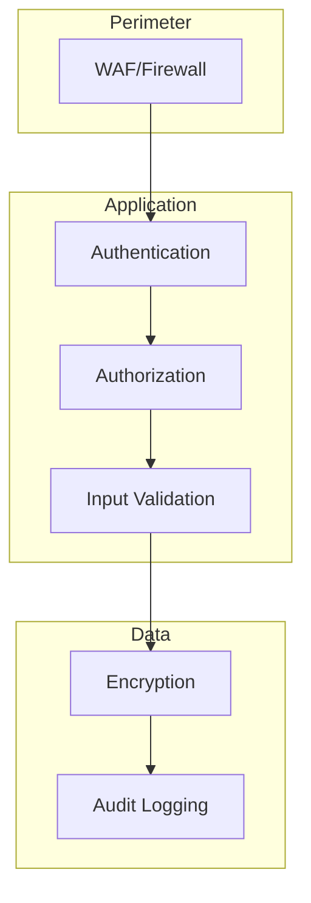

# UCID Security Policy

## Document Information

| Field | Value |
|-------|-------|
| Document Title | UCID Security Policy and Guidelines |
| Version | 1.0.5 |
| Last Updated | 2026-01-16 |
| Maintainer | UCID Security Team |
| Contact | security@ucid.org |

---

## Table of Contents

1. [Reporting Security Issues](#reporting-security-issues)
2. [Security Response Process](#security-response-process)
3. [Supported Versions](#supported-versions)
4. [Security Practices](#security-practices)
5. [Vulnerability Disclosure Policy](#vulnerability-disclosure-policy)
6. [Security Advisories](#security-advisories)
7. [Dependency Security](#dependency-security)
8. [Security Checklist](#security-checklist)
9. [Security Testing](#security-testing)
10. [Incident Response](#incident-response)

---

## Library Statistics

| Metric | Value |
|--------|-------|
| Total Cities | 405 |
| Countries | 23 |
| Security Audits | 2 |
| CVEs Fixed | 0 |
| Last Security Review | 2026-01 |

---

## Reporting Security Issues

### How to Report

If you discover a security vulnerability in UCID, please report it responsibly:

| Method | Details |
|--------|---------|
| Email | security@ucid.org |
| PGP Key | Available at [keyserver](https://keys.openpgp.org) |
| GitHub | Private security advisory |

### What to Include

When reporting, please provide:

1. **Description**: Clear description of the vulnerability
2. **Impact**: Potential impact of the vulnerability
3. **Reproduction**: Steps to reproduce the issue
4. **Environment**: Python version, OS, UCID version
5. **Proof of Concept**: Code or commands to demonstrate
6. **Suggested Fix**: If you have ideas for a fix

### Report Template

```
Subject: [SECURITY] Brief description

## Vulnerability Details

**Type:** [e.g., SQL Injection, XSS, RCE]
**Severity:** [Critical/High/Medium/Low]
**CVSS Score:** [if known]

## Affected Versions
- [ ] 1.0.5
- [ ] 1.0.4
- [ ] Earlier versions

## Description
[Detailed description of the vulnerability]

## Steps to Reproduce
1. Step 1
2. Step 2
3. Step 3

## Impact
[What can an attacker achieve?]

## Environment
- Python version: 
- UCID version: 
- OS: 

## Proof of Concept
```python
# Code demonstrating the vulnerability
```

## Suggested Fix
[If you have suggestions]

## Additional Information
[Any other relevant details]
```

### What NOT to Do

- Do NOT open public issues for security vulnerabilities
- Do NOT share vulnerability details publicly before fixed
- Do NOT exploit the vulnerability beyond proof of concept
- Do NOT access data belonging to others

---

## Security Response Process

### Response Timeline

| Phase | Timeline | Description |
|-------|----------|-------------|
| Acknowledgment | 24 hours | Confirm receipt of report |
| Initial Assessment | 48 hours | Assess severity and impact |
| Investigation | 1-2 weeks | Investigate and develop fix |
| Patch Development | 1-2 weeks | Develop and test patch |
| Release | 1 week | Release security update |
| Disclosure | 30 days | Public disclosure |

### Process Flow



### Severity Ratings

| Severity | CVSS Score | Response Time |
|----------|------------|---------------|
| Critical | 9.0-10.0 | 24 hours |
| High | 7.0-8.9 | 72 hours |
| Medium | 4.0-6.9 | 1 week |
| Low | 0.1-3.9 | 2 weeks |

---

## Supported Versions

### Currently Supported

| Version | Supported | End of Support |
|---------|-----------|----------------|
| 1.0.x | Yes | Active |
| 0.9.x | Security only | 2026-06-01 |
| 0.8.x | No | 2025-12-01 |
| < 0.8 | No | Not supported |

### Security Support Policy

- **Active**: Full security and bug fixes
- **Security Only**: Security fixes only
- **Unsupported**: No updates, upgrade required

---

## Security Practices

### Code Security

| Practice | Implementation |
|----------|----------------|
| Input Validation | Pydantic models, explicit validation |
| Type Safety | Full type hints, mypy checking |
| Dependency Pinning | Locked versions in pyproject.toml |
| Code Review | Required for all changes |
| Static Analysis | Ruff, Bandit in CI |

### API Security

| Practice | Implementation |
|----------|----------------|
| Authentication | API keys, OAuth2 |
| Rate Limiting | Token bucket algorithm |
| Input Sanitization | Strict validation |
| TLS | Required for all connections |
| CORS | Configurable allowed origins |

### Data Security

| Practice | Implementation |
|----------|----------------|
| No PII Storage | No personal data stored |
| Data Validation | Strict coordinate validation |
| Logging | No sensitive data in logs |
| Encryption | TLS 1.3 for transport |

---

## Vulnerability Disclosure Policy

### Responsible Disclosure

We follow responsible disclosure practices:

1. **Report**: Security issues reported privately
2. **Acknowledgment**: We acknowledge within 24 hours
3. **Collaboration**: We work with reporters on fixes
4. **Credit**: Reporters credited in advisories
5. **Disclosure**: Coordinated public disclosure

### Disclosure Timeline

| Event | Timeline |
|-------|----------|
| Report received | Day 0 |
| Acknowledgment | Day 1 |
| Fix developed | Day 14 |
| Patch released | Day 21 |
| Public disclosure | Day 30 |

### CVE Process

For significant vulnerabilities:

1. Request CVE ID from MITRE
2. Develop and test patch
3. Prepare security advisory
4. Coordinate release date
5. Publish CVE details

---

## Security Advisories

### Published Advisories

| ID | Date | Severity | Description | Status |
|----|------|----------|-------------|--------|
| None | - | - | No security advisories to date | - |

### Advisory Format

Security advisories follow this format:

```markdown
# Security Advisory: [Title]

**Advisory ID:** UCID-2026-001
**Date:** 2026-01-16
**Severity:** High
**CVSS Score:** 7.5

## Summary
[Brief summary of the vulnerability]

## Affected Versions
- 1.0.0 - 1.0.4

## Impact
[What is the impact?]

## Mitigation
[How to mitigate before patching]

## Resolution
Upgrade to version 1.0.5 or later.

## Timeline
- 2026-01-01: Report received
- 2026-01-02: Confirmed
- 2026-01-10: Fix developed
- 2026-01-15: Patch released
- 2026-01-16: Public disclosure

## Credit
[Reporter credit]
```

---

## Dependency Security

### Dependency Monitoring

| Tool | Purpose |
|------|---------|
| Dependabot | Automated dependency updates |
| pip-audit | Vulnerability scanning |
| Safety | Security check |

### Update Policy

| Type | Timeline |
|------|----------|
| Security patches | Immediate |
| Minor updates | Weekly |
| Major updates | Evaluated per case |

### Dependency Review

All new dependencies must:

1. Have active maintenance
2. Have no known vulnerabilities
3. Have appropriate license
4. Be reviewed by maintainer

---

## Security Checklist

### For Contributors

- [ ] No hardcoded credentials
- [ ] Input validation on all user input
- [ ] No sensitive data in logs
- [ ] No sensitive data in error messages
- [ ] Dependencies from trusted sources
- [ ] No eval() or exec() with user input

### For Maintainers

- [ ] Review all changes for security
- [ ] Run security linters (Bandit)
- [ ] Check for dependency vulnerabilities
- [ ] Verify no secrets in commits
- [ ] Update security documentation

### For Deployers

- [ ] Use HTTPS only
- [ ] Configure rate limiting
- [ ] Use environment variables for secrets
- [ ] Enable logging and monitoring
- [ ] Regular security updates

---

## Security Testing

### Automated Testing

| Test Type | Tool | Frequency |
|-----------|------|-----------|
| Static Analysis | Bandit | Every PR |
| Dependency Scan | pip-audit | Daily |
| Secret Detection | detect-secrets | Every PR |
| Container Scan | Trivy | Every build |

### Manual Testing

| Test Type | Frequency |
|-----------|-----------|
| Penetration Testing | Annually |
| Code Audit | Major releases |
| Security Review | Quarterly |

---

## Incident Response

### Incident Response Plan



### Response Team

| Role | Responsibility |
|------|----------------|
| Incident Lead | Coordinate response |
| Security Team | Technical investigation |
| Communications | External communication |
| Legal | Legal requirements |

---

## Security Architecture

### Defense in Depth



### Security Boundaries

| Boundary | Protection |
|----------|------------|
| Network | TLS 1.3, firewall |
| Application | Authentication, authorization |
| Data | Encryption, access control |
| Logging | Audit trails, monitoring |

---

## Common Vulnerabilities

### OWASP Top 10 Considerations

| Vulnerability | UCID Mitigation |
|---------------|-----------------|
| Injection | Parameterized queries, input validation |
| Broken Auth | OAuth2, API keys, rate limiting |
| Sensitive Data | No PII storage, TLS |
| XXE | XML parsing disabled |
| Broken Access | RBAC, least privilege |
| Security Misconfig | Secure defaults |
| XSS | Output encoding |
| Insecure Deserialization | JSON only, validation |
| Vulnerable Components | Dependency scanning |
| Insufficient Logging | Comprehensive audit logs |

### Python-Specific Considerations

| Risk | Mitigation |
|------|------------|
| Pickle deserialization | Never unpickle untrusted data |
| eval/exec | Never use with user input |
| Path traversal | Use pathlib, validate paths |
| YAML loading | Use safe_load only |

---

## Security Hardening

### Production Hardening Checklist

- [ ] TLS 1.3 enforced
- [ ] HTTP Strict Transport Security enabled
- [ ] Content Security Policy configured
- [ ] X-Frame-Options set
- [ ] X-Content-Type-Options set
- [ ] Rate limiting configured
- [ ] Logging enabled
- [ ] Monitoring active
- [ ] Secrets in vault/env
- [ ] Debug mode disabled

### Container Security

| Practice | Implementation |
|----------|----------------|
| Non-root user | Run as UID 1000 |
| Read-only filesystem | Mount as read-only |
| No privileged mode | Drop all capabilities |
| Resource limits | Set CPU/memory limits |
| Image scanning | Trivy in CI |

---

## Compliance

### Regulatory Considerations

| Regulation | Relevance | Status |
|------------|-----------|--------|
| GDPR | No PII processed | N/A |
| CCPA | No PII processed | N/A |
| SOC 2 | Security controls | Aligned |
| ISO 27001 | Security management | Aligned |

### Data Classification

| Classification | Examples | Handling |
|----------------|----------|----------|
| Public | City coordinates, UCIDs | Open |
| Internal | Logs, metrics | Restricted |
| Confidential | API keys, credentials | Encrypted |

---

## Contact

| Purpose | Contact |
|---------|---------|
| Security Reports | security@ucid.org |
| General Security Questions | security@ucid.org |
| PGP Key | [Key Server](https://keys.openpgp.org) |

---

## Bug Bounty

Currently, UCID does not offer a formal bug bounty program. However, we recognize and thank security researchers who responsibly disclose vulnerabilities.

### Recognition

Researchers who report valid vulnerabilities receive:

- Credit in security advisories
- Listing in CONTRIBUTORS.md
- Letter of recognition (on request)

---

## References

- [OWASP Secure Coding Practices](https://owasp.org/www-project-secure-coding-practices-quick-reference-guide/)
- [Python Security Best Practices](https://docs.python-guide.org/writing/security/)
- [GitHub Security Advisories](https://docs.github.com/en/code-security/security-advisories)
- [CWE - Common Weakness Enumeration](https://cwe.mitre.org/)
- [NIST Cybersecurity Framework](https://www.nist.gov/cyberframework)

---

Copyright 2026 UCID Foundation. All rights reserved.
Licensed under EUPL-1.2.
