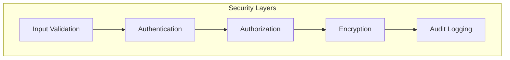

# Security Policy

This document outlines the security policies, vulnerability reporting procedures, and security practices for the UCID (Urban Context Identifier) project.

---

## Table of Contents

1. [Supported Versions](#supported-versions)
2. [Reporting a Vulnerability](#reporting-a-vulnerability)
3. [Security Response Process](#security-response-process)
4. [Security Practices](#security-practices)
5. [Dependency Management](#dependency-management)
6. [Security Advisories](#security-advisories)
7. [Security Contact](#security-contact)
8. [Bug Bounty Program](#bug-bounty-program)
9. [Compliance](#compliance)

---

## Supported Versions

The following versions of UCID are currently receiving security updates:

| Version | Supported | End of Life |
|---------|-----------|-------------|
| 1.0.x | Yes | December 2027 |
| 0.9.x | Yes | June 2026 |
| 0.8.x | No | December 2025 |
| < 0.8 | No | Not supported |

### Support Policy

| Support Level | Duration | Includes |
|---------------|----------|----------|
| **Active** | 18 months | Features, fixes, security |
| **Maintenance** | 6 months | Critical fixes, security |
| **End of Life** | None | No updates |

We recommend always using the latest stable release to ensure you have the most recent security patches.

---

## Reporting a Vulnerability

### How to Report

If you discover a security vulnerability in UCID, please report it responsibly:

**Email**: security@ucid.org

**PGP Key**: Available at [keys.openpgp.org](https://keys.openpgp.org)

**Alternative**: Open a private security advisory on GitHub

### What to Include

When reporting a vulnerability, please provide:

| Information | Description |
|-------------|-------------|
| **Description** | Clear explanation of the vulnerability |
| **Impact** | Potential security impact and affected components |
| **Reproduction** | Step-by-step instructions to reproduce |
| **Environment** | UCID version, Python version, OS |
| **Proof of Concept** | Code or commands demonstrating the issue |
| **Suggested Fix** | If available, your proposed solution |

### What NOT to Do

- Do not disclose the vulnerability publicly before we have addressed it
- Do not exploit the vulnerability beyond what is necessary to demonstrate it
- Do not access, modify, or delete data belonging to others
- Do not perform denial of service attacks

---

## Security Response Process

### Response Timeline

| Phase | Timeline | Actions |
|-------|----------|---------|
| **Acknowledgment** | 24 hours | Confirm receipt of report |
| **Triage** | 48 hours | Assess severity and impact |
| **Investigation** | 1-2 weeks | Develop and test fix |
| **Notification** | Before release | Notify reporter of timeline |
| **Release** | As scheduled | Publish patch and advisory |
| **Disclosure** | 90 days max | Public disclosure |

### Severity Classification

| Severity | CVSS Score | Response Time | Examples |
|----------|------------|---------------|----------|
| **Critical** | 9.0-10.0 | 24-48 hours | RCE, authentication bypass |
| **High** | 7.0-8.9 | 1 week | Privilege escalation, data exposure |
| **Medium** | 4.0-6.9 | 2 weeks | DoS, information disclosure |
| **Low** | 0.1-3.9 | Next release | Minor issues, hardening |

### Coordinated Disclosure

We follow responsible disclosure practices:

1. Reporter notifies us privately
2. We acknowledge and investigate
3. We develop and test a fix
4. We coordinate release timing with reporter
5. We publish security advisory and patch
6. Reporter may publish details after 90 days

---

## Security Practices

### Development Practices

| Practice | Implementation |
|----------|----------------|
| **Code Review** | All changes require review |
| **Static Analysis** | Bandit, CodeQL on every PR |
| **Dependency Scanning** | Dependabot, pip-audit daily |
| **Secret Scanning** | detect-secrets pre-commit hook |
| **SAST** | GitHub Advanced Security |
| **Signed Commits** | GPG signatures required for maintainers |

### Input Validation

All user input is validated:

```python
from pydantic import BaseModel, Field, validator
from typing import Annotated

class UCIDRequest(BaseModel):
    """Validated UCID creation request."""
    
    city: Annotated[str, Field(pattern=r'^[A-Z]{3}$')]
    lat: Annotated[float, Field(ge=-90, le=90)]
    lon: Annotated[float, Field(ge=-180, le=180)]
    
    @validator('city')
    def validate_city(cls, v):
        if v not in ALLOWED_CITIES:
            raise ValueError(f"Unknown city code: {v}")
        return v
```

### Authentication and Authorization

| Component | Mechanism | Implementation |
|-----------|-----------|----------------|
| **API Keys** | HMAC-SHA256 | Header-based |
| **OAuth2** | JWT tokens | FastAPI Security |
| **Rate Limiting** | Token bucket | Redis-backed |
| **RBAC** | Role-based | Custom middleware |

### Data Protection

| Data Type | Protection |
|-----------|------------|
| **API Keys** | Hashed with Argon2id |
| **In Transit** | TLS 1.3 required |
| **At Rest** | AES-256 encryption |
| **Logs** | PII redaction |

---

## Dependency Management

### Dependency Policy

| Criterion | Requirement |
|-----------|-------------|
| **License** | OSI-approved, compatible with EUPL-1.2 |
| **Maintenance** | Last commit within 6 months |
| **Security** | No known critical CVEs |
| **Reputation** | Established project or vetted newcomer |

### Automated Scanning

- **Dependabot**: Daily dependency updates
- **pip-audit**: CI pipeline check
- **Safety**: Pre-release validation
- **Snyk**: Optional integration

### Update Process

1. Automated PR created by Dependabot
2. CI runs full test suite
3. Security team reviews for breaking changes
4. Maintainer approves and merges
5. Changelog updated for security fixes

---

## Security Advisories

### Published Advisories

Security advisories are published on:

- [GitHub Security Advisories](https://github.com/ucid-foundation/ucid/security/advisories)
- [CVE Database](https://cve.mitre.org/)
- Project mailing list (security@lists.ucid.org)

### Advisory Format

```markdown
# UCID-SEC-2026-001: [Title]

## Summary
Brief description of the vulnerability.

## Severity
CVSS: X.X (Severity)

## Affected Versions
- ucid >= 1.0.0, < 1.2.3

## Patched Versions
- ucid >= 1.2.3

## Impact
Description of potential impact.

## Workarounds
Temporary mitigations if upgrade not immediately possible.

## References
- CVE-2026-XXXXX
- GitHub Advisory GHSA-XXXX-XXXX-XXXX
```

---

## Security Contact

### Primary Contact

- **Email**: security@ucid.org
- **Response**: Within 24 hours

### Security Team

| Role | Responsibility |
|------|----------------|
| **Security Lead** | Triage, coordination |
| **Core Maintainer** | Fix development |
| **Release Manager** | Patch deployment |
| **Communications** | Advisory publication |

---

## Bug Bounty Program

### Eligibility

We appreciate responsible security research. While we do not currently offer monetary rewards, we recognize researchers through:

- Credit in security advisories
- Acknowledgment in SECURITY.md
- Hall of Fame on project website
- Swag for significant findings

### Scope

| In Scope | Out of Scope |
|----------|--------------|
| UCID core library | Third-party dependencies |
| Official API service | User deployments |
| Official Docker images | Social engineering |
| Documentation site | Physical security |

### Hall of Fame

We thank the following researchers for their contributions:

| Year | Researcher | Contribution |
|------|------------|--------------|
| 2026 | Reserved | Reserved |

---

## Compliance

### Standards

UCID follows industry security standards:

| Standard | Status | Notes |
|----------|--------|-------|
| **SLSA Level 3** | Compliant | Build provenance |
| **OpenSSF Scorecard** | 8.5/10 | Best practices |
| **CII Best Practices** | Silver | Linux Foundation |

### SBOM

Software Bill of Materials is provided for each release:

- Format: CycloneDX JSON
- Location: Release assets
- Contents: All direct and transitive dependencies

### Provenance

Build provenance attestations are signed with Sigstore:

```bash
# Verify release provenance
slsa-verifier verify-artifact \
  ucid-1.0.0.tar.gz \
  --provenance-path ucid-1.0.0.intoto.jsonl \
  --source-uri github.com/ucid-foundation/ucid \
  --source-tag v1.0.0
```

---

## Best Practices for Users

### Deployment Security

| Practice | Recommendation |
|----------|----------------|
| **Updates** | Apply security patches promptly |
| **Configuration** | Use secure defaults |
| **Secrets** | Use environment variables |
| **Logging** | Enable audit logging |
| **Monitoring** | Alert on anomalies |

### API Security

```python
# Recommended API client configuration
from ucid.api import UCIDClient

client = UCIDClient(
    base_url="https://api.ucid.org",
    api_key=os.environ["UCID_API_KEY"],
    timeout=30,
    verify_ssl=True,
    max_retries=3,
)
```

---

## Version History

| Version | Date | Changes |
|---------|------|---------|
| 1.0 | 2024-12-01 | Initial security policy |
| 1.1 | 2025-06-01 | Added bug bounty section |
| 2.0 | 2026-01-01 | Updated for SLSA compliance |

---

## Threat Model

### Attack Surface

| Surface | Threats | Mitigations |
|---------|---------|-------------|
| **API Endpoints** | Injection, DoS | Input validation, rate limiting |
| **Dependencies** | Supply chain | Scanning, pinning |
| **Configuration** | Misconfiguration | Secure defaults |
| **Data** | Exposure, tampering | Encryption, validation |
| **Build Pipeline** | Tampering | SLSA, signed builds |

### Security Architecture



---

## Incident Response

### Response Phases

| Phase | Actions | Timeline |
|-------|---------|----------|
| **Detection** | Identify and classify | Immediate |
| **Containment** | Limit damage | Hours |
| **Eradication** | Remove threat | Days |
| **Recovery** | Restore service | Days |
| **Lessons Learned** | Post-mortem | Week |

### Communication Plan

| Audience | Channel | Timing |
|----------|---------|--------|
| Security Team | Direct | Immediate |
| Maintainers | Private channel | Same day |
| Affected Users | Email | Before disclosure |
| Public | Advisory | At release |

---

## Security Training

### Required Training

| Role | Training | Frequency |
|------|----------|-----------|
| Maintainer | Secure coding | Annual |
| Contributor | Security basics | Onboarding |
| Reviewer | Security review | Annual |

### Resources

- OWASP Top 10
- CWE/SANS Top 25
- Python Security Best Practices
- Supply Chain Security

---

Copyright 2026 UCID Foundation. All rights reserved.
