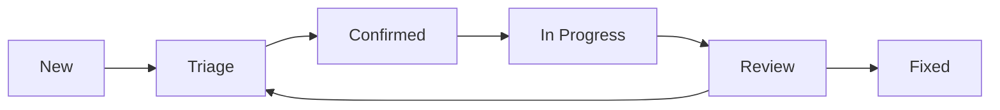

# Support

This document provides information about how to get help and support for the UCID (Urban Context Identifier) project.

---

## Table of Contents

1. [Overview](#overview)
2. [Getting Help](#getting-help)
3. [Community Support](#community-support)
4. [Professional Support](#professional-support)
5. [Bug Reports](#bug-reports)
6. [Feature Requests](#feature-requests)
7. [Security Issues](#security-issues)
8. [Documentation](#documentation)
9. [Training](#training)
10. [FAQ](#faq)

---

## Overview

UCID is an open source project maintained by the UCID Foundation and community contributors. We offer multiple support channels to help you use UCID effectively.

### Support Philosophy

| Principle | Description |
|-----------|-------------|
| **Community First** | Community support is the primary support channel |
| **Documentation** | Comprehensive docs to enable self-service |
| **Responsiveness** | We strive to respond promptly to all requests |
| **Accessibility** | Support available in multiple formats |

### Support Matrix

| Support Type | Availability | Response Time |
|--------------|--------------|---------------|
| GitHub Issues | 24/7 | 2-5 business days |
| GitHub Discussions | 24/7 | Best effort |
| Discord | 24/7 | Best effort |
| Security Reports | 24/7 | 24-48 hours |
| Professional Support | Business hours | SLA-based |

---

## Getting Help

### Before Asking for Help

Before reaching out for support, please:

1. **Check the Documentation**: Review the [official documentation](https://ucid.readthedocs.io/)
2. **Search Existing Issues**: Look for similar issues on [GitHub](https://github.com/ucid-foundation/ucid/issues)
3. **Check Discussions**: Browse [GitHub Discussions](https://github.com/ucid-foundation/ucid/discussions)
4. **Review the FAQ**: Check the FAQ section below
5. **Prepare Details**: Gather relevant information about your issue

### Required Information

When asking for help, please include:

| Information | Description |
|-------------|-------------|
| **UCID Version** | Output of `python -c "import ucid; print(ucid.__version__)"` |
| **Python Version** | Output of `python --version` |
| **Operating System** | Windows, macOS, Linux distribution |
| **Error Message** | Complete error traceback if applicable |
| **Minimal Example** | Smallest code that reproduces the issue |
| **Expected Behavior** | What you expected to happen |
| **Actual Behavior** | What actually happened |

### Example Support Request

```markdown
## Environment
- UCID Version: 1.0.0
- Python Version: 3.12.0
- OS: Ubuntu 22.04

## Issue Description
When trying to create a UCID with a specific city code, I get a validation error.

## Code to Reproduce
```python
from ucid import create_ucid

ucid = create_ucid(
    city="XYZ",
    lat=41.015,
    lon=28.979,
    timestamp="2026W01T12",
    context="15MIN",
)
```

## Error Message
```
UCIDValidationError: Unknown city code: XYZ
```

## Expected Behavior
UCID should be created with the city code XYZ.

## Additional Context
XYZ is a custom city code we use internally.
```

---

## Community Support

### GitHub Discussions

For general questions, ideas, and discussions:

- **Q&A**: Ask questions about using UCID
- **Ideas**: Share ideas for new features
- **Show and Tell**: Share projects using UCID
- **General**: General discussions about urban data

URL: https://github.com/ucid-foundation/ucid/discussions

### Discord Server

Join our Discord for real-time community chat:

- **#general**: General discussion
- **#help**: Get help from the community
- **#showcase**: Share your projects
- **#development**: Development discussions

### Mailing List

Subscribe to our mailing list for announcements:

- **ucid-announce**: Low-traffic, major announcements only
- **ucid-users**: User discussions and questions
- **ucid-dev**: Development discussions

---

## Professional Support

### Enterprise Support

For organizations requiring guaranteed support:

| Tier | Response Time | Includes |
|------|---------------|----------|
| **Bronze** | 5 business days | Email support |
| **Silver** | 2 business days | Email + video calls |
| **Gold** | 1 business day | Priority support + training |
| **Platinum** | 4 hours | 24/7 support + dedicated engineer |

### Consulting Services

The UCID Foundation offers consulting services:

- Custom context development
- Performance optimization
- Architecture review
- Training and workshops
- Integration support

Contact: enterprise@ucid.org

### Training Programs

| Program | Duration | Format |
|---------|----------|--------|
| UCID Fundamentals | 1 day | Online/In-person |
| Advanced Contexts | 2 days | Online/In-person |
| Custom Development | 3 days | In-person |
| Administrator Training | 1 day | Online |

---

## Bug Reports

### How to Report a Bug

1. Check if the issue already exists
2. Create a new issue using the bug template
3. Provide all required information
4. Be patient while we investigate

### Bug Report Template

Use the issue template at: `.github/ISSUE_TEMPLATE/bug_report.md`

### Bug Lifecycle



### Bug Severity Levels

| Severity | Description | Target Resolution |
|----------|-------------|-------------------|
| **Critical** | System unusable | 24-48 hours |
| **High** | Major functionality broken | 1 week |
| **Medium** | Minor functionality affected | 2 weeks |
| **Low** | Cosmetic or minor issues | Next release |

---

## Feature Requests

### How to Request a Feature

1. Check existing feature requests
2. Create a new discussion in "Ideas"
3. Describe the problem you're solving
4. Propose a solution
5. Engage with community feedback

### Feature Request Template

```markdown
## Problem Statement
What problem does this feature solve?

## Proposed Solution
How would you like this to work?

## Alternatives Considered
What other approaches have you considered?

## Additional Context
Any other relevant information.
```

### Feature Prioritization

| Factor | Weight | Description |
|--------|--------|-------------|
| User Impact | 30% | How many users benefit |
| Strategic Alignment | 25% | Fits project direction |
| Implementation Effort | 20% | Development cost |
| Community Interest | 15% | Votes and comments |
| Maintainability | 10% | Long-term support cost |

---

## Security Issues

### Reporting Security Issues

**Do NOT report security issues publicly.**

Email: security@ucid.org

See [SECURITY.md](SECURITY.md) for full details.

### Response Timeline

| Phase | Timeline |
|-------|----------|
| Acknowledgment | 24 hours |
| Triage | 48 hours |
| Fix Development | 1-2 weeks |
| Release | Coordinated |

---

## Documentation

### Available Documentation

| Resource | URL | Description |
|----------|-----|-------------|
| User Guide | ucid.readthedocs.io | Complete user documentation |
| API Reference | ucid.readthedocs.io/api | Python API docs |
| Tutorials | notebooks/ | Jupyter notebooks |
| Examples | examples/ | Example code |

### Documentation Issues

Report documentation issues:

1. Create an issue with the `documentation` label
2. Or submit a PR with the fix

---

## Training

### Self-Paced Learning

| Resource | Level | Duration |
|----------|-------|----------|
| Getting Started Guide | Beginner | 30 min |
| Tutorial Notebooks | Beginner-Intermediate | 2-4 hours |
| Advanced Documentation | Advanced | Self-paced |

### Instructor-Led Training

Contact training@ucid.org for:

- Corporate training
- University courses
- Workshop facilitation

---

## FAQ

### General Questions

**Q: Is UCID free to use?**
A: Yes, UCID is open source under the EUPL-1.2 license.

**Q: Can I use UCID commercially?**
A: Yes, the EUPL-1.2 allows commercial use.

**Q: What Python versions are supported?**
A: Python 3.11 and later.

### Technical Questions

**Q: How do I add a custom city?**
A: Use `register_city()` to add custom cities.

**Q: Can I use S2 instead of H3?**
A: S2 support is experimental in v1.1+.

**Q: How do I improve scoring performance?**
A: Enable caching and reduce H3 resolution for faster results.

### Support Questions

**Q: How long until my issue is addressed?**
A: We aim for initial triage within 2-5 business days.

**Q: Can I get paid support?**
A: Yes, see the Professional Support section.

**Q: How do I contribute to UCID?**
A: See [CONTRIBUTING.md](CONTRIBUTING.md).

---

## Contact

### General Inquiries

- **Email**: info@ucid.org
- **Website**: https://ucid.org

### Technical Support

- **GitHub Issues**: For bugs and features
- **GitHub Discussions**: For questions

### Security

- **Email**: security@ucid.org

### Enterprise

- **Email**: enterprise@ucid.org

---

## Version History

| Version | Date | Changes |
|---------|------|---------|
| 1.0 | 2026-01-01 | Initial support document |

---

## Additional Resources

### Community Events

| Event | Frequency | Description |
|-------|-----------|-------------|
| Community Call | Monthly | Open community discussion |
| Office Hours | Weekly | Ask maintainers questions |
| Hackathons | Quarterly | Build projects together |
| Conference Talks | Annual | Presentations at events |

### Learning Materials

| Resource | Format | Level |
|----------|--------|-------|
| Getting Started Video | Video | Beginner |
| Context Deep Dives | Blog | Intermediate |
| Architecture Overview | Documentation | Advanced |
| Research Papers | Academic | Expert |

### Partner Programs

| Program | Description | Contact |
|---------|-------------|---------|
| Academic Partner | Research collaboration | research@ucid.org |
| City Partner | Municipal integration | cities@ucid.org |
| Technology Partner | Integration partnership | partners@ucid.org |

---

## Support Metrics

### Response Time Goals

| Priority | First Response | Resolution |
|----------|----------------|------------|
| Critical | 4 hours | 24 hours |
| High | 1 day | 1 week |
| Medium | 3 days | 2 weeks |
| Low | 5 days | Next release |

### Satisfaction Metrics

| Metric | Target | Current |
|--------|--------|---------|
| First Response Time | < 24h | - |
| Resolution Time | < 5 days | - |
| User Satisfaction | > 90% | - |
| Repeat Issues | < 5% | - |

---

Copyright 2026 UCID Foundation. All rights reserved.
