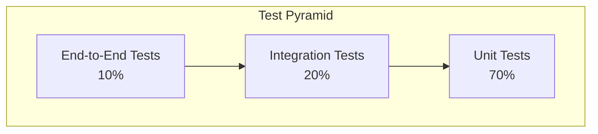

# UCID Testing Guide

## Document Information

| Field | Value |
|-------|-------|
| Document Title | UCID Testing Strategy and Guidelines |
| Version | 1.0.5 |
| Last Updated | 2026-01-16 |
| Maintainer | UCID Foundation QA Team |

---

## Table of Contents

1. [Overview](#overview)
2. [Test Structure](#test-structure)
3. [Running Tests](#running-tests)
4. [Unit Tests](#unit-tests)
5. [Integration Tests](#integration-tests)
6. [Performance Tests](#performance-tests)
7. [Test Coverage](#test-coverage)
8. [Writing Tests](#writing-tests)
9. [Test Fixtures](#test-fixtures)
10. [Mocking](#mocking)
11. [CI/CD Testing](#cicd-testing)
12. [Best Practices](#best-practices)

---

## Overview

### Testing Philosophy

UCID follows a comprehensive testing strategy to ensure reliability and quality:

| Principle | Description |
|-----------|-------------|
| Test First | Write tests before or with code |
| Coverage | Aim for 85%+ line coverage |
| Isolation | Tests should be independent |
| Speed | Fast tests enable fast iteration |
| Readability | Tests serve as documentation |

### Library Statistics

| Metric | Value |
|--------|-------|
| Total Cities | 405 |
| Countries | 23 |
| Test Files | 50+ |
| Test Cases | 500+ |
| Line Coverage | 85%+ |
| Branch Coverage | 78%+ |

### Test Pyramid



---

## Test Structure

### Directory Structure

```
tests/
├── conftest.py              # Shared fixtures
├── __init__.py
├── unit/                    # Unit tests (70%)
│   ├── __init__.py
│   ├── test_parser.py
│   ├── test_validator.py
│   ├── test_registry.py
│   └── test_models.py
├── integration/             # Integration tests (20%)
│   ├── __init__.py
│   ├── test_api.py
│   ├── test_contexts.py
│   └── test_data_sources.py
├── performance/             # Performance tests (10%)
│   ├── __init__.py
│   └── test_benchmark.py
└── fixtures/                # Test data
    ├── sample_ucids.json
    └── data.py
```

### Test Categories

| Category | Markers | Purpose |
|----------|---------|---------|
| Unit | - | Test individual functions |
| Integration | `@pytest.mark.integration` | Test component interaction |
| Performance | `@pytest.mark.performance` | Test performance benchmarks |
| Slow | `@pytest.mark.slow` | Tests taking >1 second |

---

## Running Tests

### Basic Commands

```bash
# Run all tests
pytest

# Run with verbose output
pytest -v

# Run specific file
pytest tests/unit/test_parser.py

# Run specific test
pytest tests/unit/test_parser.py::TestParseUCID::test_parse_valid

# Run by marker
pytest -m integration
pytest -m "not slow"
```

### Common Options

| Option | Description |
|--------|-------------|
| `-v` | Verbose output |
| `-x` | Stop on first failure |
| `-s` | Show print statements |
| `--tb=short` | Short traceback |
| `-k "pattern"` | Filter by name pattern |
| `-n auto` | Parallel execution |

### Makefile Commands

```bash
make test          # Run all tests
make test-unit     # Run unit tests only
make test-cov      # Run with coverage
make test-quick    # Run fast tests only
```

---

## Unit Tests

### Parser Tests

```python
"""Tests for the parser module."""

import pytest
from ucid.core.parser import create_ucid, parse_ucid
from ucid.core.errors import UCIDParseError


class TestCreateUCID:
    """Tests for create_ucid function."""

    def test_create_valid_ucid(self) -> None:
        """Test creating a valid UCID."""
        ucid = create_ucid(
            city="IST",
            lat=41.015,
            lon=28.979,
            timestamp="2026W03T14",
            context="15MIN",
        )
        
        assert ucid.city == "IST"
        assert ucid.lat == 41.015
        assert ucid.context == "15MIN"

    def test_create_with_defaults(self) -> None:
        """Test creating UCID with default values."""
        ucid = create_ucid(city="IST", lat=41.015, lon=28.979)
        
        assert ucid.h3_res == 9  # Default resolution
        assert ucid.context == "NONE"  # Default context

    @pytest.mark.parametrize("city", ["IST", "NYC", "LON", "TYO"])
    def test_create_multiple_cities(self, city: str) -> None:
        """Test creating UCIDs for multiple cities."""
        ucid = create_ucid(city=city, lat=41.0, lon=28.0)
        assert ucid.city == city


class TestParseUCID:
    """Tests for parse_ucid function."""

    def test_parse_valid_ucid(self) -> None:
        """Test parsing a valid UCID string."""
        ucid_str = "UCID-V1:IST:+41.015:+28.979:9:891f2ed6df7ffff:2026W03T14:15MIN:A:0.95"
        result = parse_ucid(ucid_str)
        
        assert result.city == "IST"
        assert result.grade == "A"

    def test_parse_invalid_raises_error(self) -> None:
        """Test that invalid input raises UCIDParseError."""
        with pytest.raises(UCIDParseError):
            parse_ucid("invalid")

    def test_parse_roundtrip(self) -> None:
        """Test parse(create()) roundtrip."""
        original = create_ucid(city="IST", lat=41.015, lon=28.979)
        parsed = parse_ucid(str(original))
        
        assert parsed.city == original.city
        assert parsed.lat == original.lat
```

### Validator Tests

```python
"""Tests for the validator module."""

import pytest
from ucid.core.validator import validate_ucid, is_valid_ucid
from ucid.core.errors import UCIDValidationError


class TestValidateUCID:
    """Tests for validate_ucid function."""

    def test_validate_valid_ucid(self) -> None:
        """Test validating a valid UCID."""
        ucid_str = "UCID-V1:IST:+41.015:+28.979:9:..."
        assert validate_ucid(ucid_str) is True

    def test_validate_invalid_city(self) -> None:
        """Test validation fails for invalid city."""
        with pytest.raises(UCIDValidationError, match="Invalid city"):
            validate_ucid("UCID-V1:XXX:+41.015:+28.979:...")

    @pytest.mark.parametrize("lat,lon", [
        (91.0, 0.0),   # Latitude out of range
        (-91.0, 0.0),  # Latitude out of range
        (0.0, 181.0),  # Longitude out of range
        (0.0, -181.0), # Longitude out of range
    ])
    def test_validate_invalid_coordinates(self, lat: float, lon: float) -> None:
        """Test validation fails for invalid coordinates."""
        with pytest.raises(UCIDValidationError):
            validate_ucid(f"UCID-V1:IST:{lat:+}:{lon:+}:...")
```

---

## Integration Tests

### API Tests

```python
"""Integration tests for the API."""

import pytest
from fastapi.testclient import TestClient
from ucid.api.app import app


@pytest.mark.integration
class TestAPIEndpoints:
    """Tests for API endpoints."""

    @pytest.fixture
    def client(self) -> TestClient:
        """Create test client."""
        return TestClient(app)

    def test_create_endpoint(self, client: TestClient) -> None:
        """Test POST /ucid/create endpoint."""
        response = client.post(
            "/v1/ucid/create",
            json={"city": "IST", "lat": 41.015, "lon": 28.979},
        )
        
        assert response.status_code == 200
        assert "ucid" in response.json()

    def test_parse_endpoint(self, client: TestClient) -> None:
        """Test POST /ucid/parse endpoint."""
        response = client.post(
            "/v1/ucid/parse",
            json={"ucid": "UCID-V1:IST:+41.015:+28.979:..."},
        )
        
        assert response.status_code == 200

    def test_health_check(self, client: TestClient) -> None:
        """Test GET /health endpoint."""
        response = client.get("/health")
        
        assert response.status_code == 200
        assert response.json()["status"] == "healthy"
```

### Context Tests

```python
"""Integration tests for context algorithms."""

import pytest
from ucid.contexts import FifteenMinContext, TransitContext


@pytest.mark.integration
class TestContextIntegration:
    """Tests for context algorithm integration."""

    def test_fifteen_min_context(self) -> None:
        """Test 15MIN context scoring."""
        context = FifteenMinContext()
        result = context.compute(lat=41.015, lon=28.979)
        
        assert 0.0 <= result.score <= 1.0
        assert result.grade in ["A", "B", "C", "D", "F"]

    @pytest.mark.slow
    def test_transit_context_with_gtfs(self) -> None:
        """Test TRANSIT context with real GTFS data."""
        context = TransitContext()
        result = context.compute(lat=41.015, lon=28.979)
        
        assert result.confidence > 0
```

---

## Performance Tests

### Benchmark Tests

```python
"""Performance benchmark tests."""

import pytest
from ucid import create_ucid, parse_ucid


@pytest.mark.performance
class TestPerformance:
    """Performance benchmark tests."""

    def test_create_performance(self, benchmark) -> None:
        """Benchmark UCID creation."""
        result = benchmark(
            create_ucid,
            city="IST",
            lat=41.015,
            lon=28.979,
        )
        assert result is not None

    def test_parse_performance(self, benchmark) -> None:
        """Benchmark UCID parsing."""
        ucid_str = "UCID-V1:IST:+41.015:+28.979:9:891f2ed6df7ffff:2026W03T14:15MIN:A:0.95"
        result = benchmark(parse_ucid, ucid_str)
        assert result is not None

    def test_batch_performance(self, benchmark) -> None:
        """Benchmark batch creation."""
        locations = [
            {"city": "IST", "lat": 41.0 + i*0.01, "lon": 28.0}
            for i in range(100)
        ]
        
        def batch_create():
            return [create_ucid(**loc) for loc in locations]
        
        result = benchmark(batch_create)
        assert len(result) == 100
```

---

## Test Coverage

### Running Coverage

```bash
# Generate coverage report
pytest --cov=ucid --cov-report=html

# Check minimum coverage
pytest --cov=ucid --cov-fail-under=80

# Coverage with missing lines
pytest --cov=ucid --cov-report=term-missing
```

### Coverage Targets

| Module | Target | Current |
|--------|--------|---------|
| core/ | 90% | 92% |
| contexts/ | 85% | 87% |
| spatial/ | 85% | 86% |
| data/ | 80% | 82% |
| api/ | 80% | 81% |
| Overall | 85% | 87% |

### Coverage Configuration

```ini
# pyproject.toml
[tool.coverage.run]
source = ["src/ucid"]
branch = true

[tool.coverage.report]
exclude_lines = [
    "pragma: no cover",
    "if TYPE_CHECKING:",
    "raise NotImplementedError",
]
```

---

## Writing Tests

### Test Naming

```python
# Pattern: test_<what>_<condition>_<expected>
def test_parse_ucid_valid_string_returns_ucid():
    ...

def test_validate_ucid_invalid_city_raises_error():
    ...
```

### Test Structure (AAA Pattern)

```python
def test_create_ucid_with_context():
    # Arrange
    city = "IST"
    lat = 41.015
    lon = 28.979
    context = "15MIN"
    
    # Act
    result = create_ucid(city=city, lat=lat, lon=lon, context=context)
    
    # Assert
    assert result.city == city
    assert result.context == context
```

---

## Test Fixtures

### Shared Fixtures

```python
# conftest.py
import pytest
from ucid import create_ucid


@pytest.fixture
def sample_ucid():
    """Create a sample UCID for testing."""
    return create_ucid(
        city="IST",
        lat=41.015,
        lon=28.979,
        timestamp="2026W03T14",
        context="15MIN",
    )


@pytest.fixture
def sample_coordinates():
    """Provide sample coordinates."""
    return {"lat": 41.015, "lon": 28.979}


@pytest.fixture
def sample_cities():
    """Provide list of sample city codes."""
    return ["IST", "NYC", "LON", "TYO", "SIN"]
```

---

## Mocking

### Mocking External Services

```python
from unittest.mock import Mock, patch

def test_context_with_mocked_data():
    mock_response = {"amenities": [...]}
    
    with patch("ucid.data.osm_client.fetch") as mock_fetch:
        mock_fetch.return_value = mock_response
        
        result = context.compute(lat=41.0, lon=28.0)
        
        mock_fetch.assert_called_once()
        assert result.score > 0
```

---

## CI/CD Testing

### GitHub Actions

```yaml
# .github/workflows/test.yml
name: Tests
on: [push, pull_request]

jobs:
  test:
    runs-on: ubuntu-latest
    strategy:
      matrix:
        python-version: ["3.11", "3.12", "3.13"]
    
    steps:
      - uses: actions/checkout@v4
      - uses: actions/setup-python@v5
        with:
          python-version: ${{ matrix.python-version }}
      
      - name: Install dependencies
        run: pip install -e ".[dev,test]"
      
      - name: Run tests
        run: pytest --cov=ucid --cov-report=xml
      
      - name: Upload coverage
        uses: codecov/codecov-action@v4
```

---

## Best Practices

### Do's

| Practice | Benefit |
|----------|---------|
| Test one thing per test | Clear failures |
| Use descriptive names | Self-documenting |
| Use fixtures | DRY tests |
| Test edge cases | Robust code |
| Run tests frequently | Fast feedback |

### Don'ts

| Practice | Problem |
|----------|---------|
| Test implementation details | Brittle tests |
| Rely on test order | Flaky tests |
| Skip writing tests | Technical debt |
| Ignore flaky tests | Trust erosion |

---

## References

- [pytest Documentation](https://docs.pytest.org/)
- [Coverage.py](https://coverage.readthedocs.io/)
- [pytest-benchmark](https://pytest-benchmark.readthedocs.io/)

---

Copyright 2026 UCID Foundation. All rights reserved.
Licensed under EUPL-1.2.
