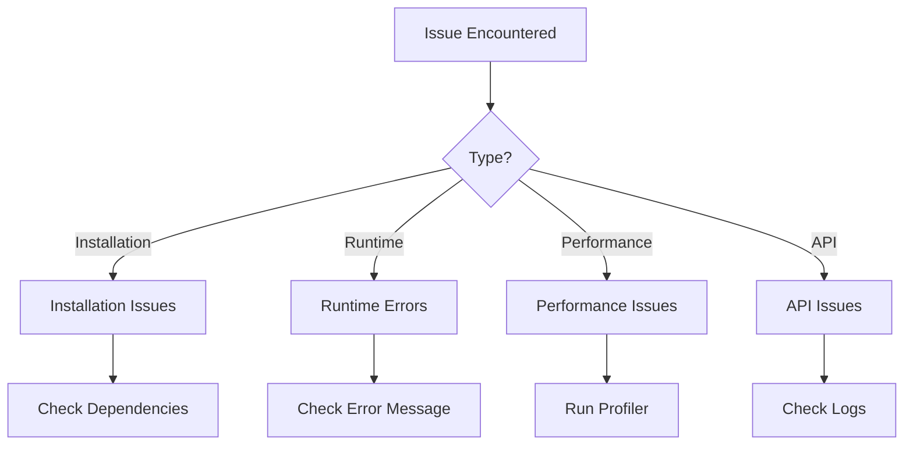

# UCID Troubleshooting Guide

## Document Information

| Field | Value |
|-------|-------|
| Document Title | UCID Troubleshooting and Debugging Guide |
| Version | 1.0.5 |
| Last Updated | 2026-01-16 |
| Maintainer | UCID Foundation Support Team |
| Contact | support@ucid.org |

---

## Table of Contents

1. [Overview](#overview)
2. [Installation Issues](#installation-issues)
3. [Runtime Errors](#runtime-errors)
4. [Parser Errors](#parser-errors)
5. [Validation Errors](#validation-errors)
6. [Context Errors](#context-errors)
7. [Performance Issues](#performance-issues)
8. [API Issues](#api-issues)
9. [Database Issues](#database-issues)
10. [Docker Issues](#docker-issues)
11. [Debug Mode](#debug-mode)
12. [Getting Help](#getting-help)

---

## Overview

### Library Statistics

| Metric | Value |
|--------|-------|
| Total Cities | 405 |
| Countries | 23 |
| CREATE Performance | 127,575 ops/sec |
| PARSE Performance | 61,443 ops/sec |

### Quick Diagnosis



### Environment Information

Before troubleshooting, gather this information:

```bash
# Python version
python --version

# UCID version
python -c "import ucid; print(ucid.__version__)"

# Operating system
python -c "import platform; print(platform.platform())"

# Installed packages
pip list | grep -E "ucid|h3|pydantic"
```

---

## Installation Issues

### Issue: pip install fails

**Symptoms:**
```
ERROR: Could not build wheels for h3
```

**Solutions:**

1. **Update pip and setuptools:**
```bash
pip install --upgrade pip setuptools wheel
pip install ucid
```

2. **Install build dependencies (Linux):**
```bash
sudo apt-get install build-essential python3-dev
pip install ucid
```

3. **Install build dependencies (macOS):**
```bash
xcode-select --install
pip install ucid
```

4. **Use pre-built wheels:**
```bash
pip install ucid --prefer-binary
```

---

### Issue: ModuleNotFoundError

**Symptoms:**
```python
ModuleNotFoundError: No module named 'ucid'
```

**Solutions:**

1. **Verify installation:**
```bash
pip show ucid
```

2. **Check Python path:**
```python
import sys
print(sys.path)
```

3. **Reinstall in correct environment:**
```bash
# Activate your virtual environment first
source venv/bin/activate  # Linux/macOS
venv\Scripts\activate     # Windows

pip install ucid
```

---

### Issue: Import h3 fails

**Symptoms:**
```python
ImportError: cannot import name 'h3' from 'h3'
```

**Solutions:**

1. **Install h3 explicitly:**
```bash
pip install h3>=4.0.0
```

2. **Check for version conflicts:**
```bash
pip list | grep h3
pip install h3==4.1.0
```

---

## Runtime Errors

### Issue: UCIDError base exception

**Symptoms:**
```python
ucid.core.errors.UCIDError: An error occurred
```

**Solutions:**

1. **Catch and handle specific exceptions:**
```python
from ucid.core.errors import UCIDError, UCIDParseError, UCIDValidationError

try:
    result = create_ucid(...)
except UCIDParseError as e:
    print(f"Parse error: {e}")
except UCIDValidationError as e:
    print(f"Validation error: {e}")
except UCIDError as e:
    print(f"General error: {e}")
```

2. **Enable debug logging:**
```python
import logging
logging.basicConfig(level=logging.DEBUG)
```

---

### Issue: TypeError in function call

**Symptoms:**
```python
TypeError: create_ucid() missing required argument: 'city'
```

**Solutions:**

1. **Check function signature:**
```python
from ucid import create_ucid
help(create_ucid)
```

2. **Provide required arguments:**
```python
from ucid import create_ucid

ucid = create_ucid(
    city="IST",       # Required
    lat=41.015,       # Required
    lon=28.979,       # Required
    # Optional parameters below
    timestamp=None,   # Auto-generated if None
    context="NONE",   # Default
)
```

---

## Parser Errors

### Issue: UCIDParseError - Invalid format

**Symptoms:**
```python
ucid.core.errors.UCIDParseError: Invalid UCID format
```

**Solutions:**

1. **Verify UCID format:**
```
UCID-V1:{CITY}:{LAT}:{LON}:{RES}:{H3}:{TIME}:{CTX}:{GRADE}:{CONF}
```

2. **Check for correct prefix:**
```python
ucid_str = "UCID-V1:IST:+41.015:+28.979:9:891f2ed6df7ffff:2026W03T14:15MIN:A:0.95"
```

3. **Parse with validation disabled:**
```python
from ucid import parse_ucid

# For debugging only
ucid = parse_ucid(ucid_str, validate=False)
```

---

### Issue: Invalid city code

**Symptoms:**
```python
UCIDParseError: Unknown city code: XXX
```

**Solutions:**

1. **List available cities:**
```python
from ucid import list_cities

for city in list_cities():
    print(f"{city.code}: {city.name}")
```

2. **Search for city:**
```python
from ucid import search_cities

results = search_cities("istanbul")
for city in results:
    print(city.code)  # IST
```

---

### Issue: Invalid coordinates

**Symptoms:**
```python
UCIDParseError: Latitude must be between -90 and 90
```

**Solutions:**

1. **Validate coordinates:**
```python
def validate_coords(lat, lon):
    if not -90 <= lat <= 90:
        raise ValueError(f"Invalid latitude: {lat}")
    if not -180 <= lon <= 180:
        raise ValueError(f"Invalid longitude: {lon}")
    return True
```

2. **Check coordinate order:**
```python
# Correct: latitude first, then longitude
create_ucid(city="IST", lat=41.015, lon=28.979)

# Wrong: longitude first
# create_ucid(city="IST", lat=28.979, lon=41.015)
```

---

## Validation Errors

### Issue: UCIDValidationError - H3 index mismatch

**Symptoms:**
```python
UCIDValidationError: H3 index does not match coordinates
```

**Solutions:**

1. **Regenerate UCID:**
```python
# Let UCID generate the H3 index
ucid = create_ucid(city="IST", lat=41.015, lon=28.979)
```

2. **Verify H3 index:**
```python
import h3

h3_index = h3.latlng_to_cell(41.015, 28.979, 9)
print(h3_index)
```

---

### Issue: City not found in registry

**Symptoms:**
```python
UCIDValidationError: City 'XYZ' not in registry
```

**Solutions:**

1. **Check city exists:**
```python
from ucid import get_city

city = get_city("IST")
if city:
    print(f"Found: {city.name}")
else:
    print("City not found")
```

2. **Use 405 supported cities:**
```python
from ucid import list_cities

cities = list_cities()
print(f"Supported cities: {len(cities)}")  # 405
```

---

## Context Errors

### Issue: Context computation timeout

**Symptoms:**
```python
TimeoutError: Context computation timed out
```

**Solutions:**

1. **Increase timeout:**
```python
from ucid.contexts import FifteenMinContext

context = FifteenMinContext(timeout=60)  # seconds
result = context.compute(lat=41.015, lon=28.979)
```

2. **Use cached results:**
```python
context = FifteenMinContext(cache_enabled=True)
```

3. **Use NONE context for fast results:**
```python
ucid = create_ucid(city="IST", lat=41.015, lon=28.979, context="NONE")
```

---

### Issue: OSM data fetch failed

**Symptoms:**
```python
OSMError: Failed to fetch data from Overpass API
```

**Solutions:**

1. **Check network connectivity:**
```bash
curl https://overpass-api.de/api/status
```

2. **Use alternative endpoint:**
```python
from ucid.data import OSMClient

client = OSMClient(
    endpoint="https://overpass.kumi.systems/api/interpreter"
)
```

3. **Use cached data:**
```python
from ucid.data import OSMClient

client = OSMClient(cache_enabled=True, cache_ttl=86400)
```

---

### Issue: GTFS feed not found

**Symptoms:**
```python
GTFSError: No GTFS feed available for city: XYZ
```

**Solutions:**

1. **Check available GTFS feeds:**
```python
from ucid.data import list_gtfs_feeds

feeds = list_gtfs_feeds()
for feed in feeds:
    print(f"{feed.city}: {feed.name}")
```

2. **Provide custom GTFS feed:**
```python
from ucid.data import GTFSClient

client = GTFSClient()
client.load_feed("path/to/feed.zip")
```

---

## Performance Issues

### Issue: Slow UCID creation

**Symptoms:**
- CREATE taking >1ms (should be ~8us)

**Solutions:**

1. **Profile the code:**
```python
import cProfile

cProfile.run('create_ucid(city="IST", lat=41.015, lon=28.979)')
```

2. **Use batch processing:**
```python
from ucid import create_ucid_batch

locations = [{"city": "IST", "lat": 41.0+i*0.01, "lon": 28.9} for i in range(1000)]
ucids = create_ucid_batch(locations)
```

3. **Disable validation for trusted input:**
```python
ucid = create_ucid(..., validate=False)
```

---

### Issue: High memory usage

**Symptoms:**
- Memory usage growing over time
- MemoryError exceptions

**Solutions:**

1. **Use generators:**
```python
def generate_ucids(locations):
    for loc in locations:
        yield create_ucid(**loc)

# Process one at a time
for ucid in generate_ucids(locations):
    process(ucid)
```

2. **Clear cache periodically:**
```python
from ucid.cache import clear_cache

clear_cache()
```

3. **Process in chunks:**
```python
from itertools import islice

def chunked(iterable, size):
    it = iter(iterable)
    while chunk := list(islice(it, size)):
        yield chunk

for chunk in chunked(locations, 1000):
    process_batch(chunk)
```

---

## API Issues

### Issue: 401 Unauthorized

**Symptoms:**
```
HTTP 401: Unauthorized
```

**Solutions:**

1. **Provide API key:**
```python
from ucid.api import UCIDClient

client = UCIDClient(api_key="your-api-key")
```

2. **Check API key validity:**
```python
response = client.get("/v1/auth/verify")
print(response.json())
```

---

### Issue: 429 Too Many Requests

**Symptoms:**
```
HTTP 429: Rate limit exceeded
```

**Solutions:**

1. **Check rate limits:**
```python
response = client.get("/v1/ucid/create")
print(response.headers.get("X-RateLimit-Remaining"))
```

2. **Implement backoff:**
```python
import time
from tenacity import retry, wait_exponential

@retry(wait=wait_exponential(multiplier=1, min=1, max=60))
def create_with_retry(client, **kwargs):
    return client.create(**kwargs)
```

---

### Issue: Connection refused

**Symptoms:**
```
ConnectionError: Connection refused
```

**Solutions:**

1. **Check service is running:**
```bash
curl http://localhost:8000/health
```

2. **Check port binding:**
```bash
netstat -tlnp | grep 8000
```

---

## Database Issues

### Issue: Connection pool exhausted

**Symptoms:**
```
sqlalchemy.exc.TimeoutError: QueuePool limit exceeded
```

**Solutions:**

1. **Increase pool size:**
```python
from sqlalchemy import create_engine

engine = create_engine(
    url,
    pool_size=20,
    max_overflow=30,
)
```

2. **Use connection recycling:**
```python
engine = create_engine(
    url,
    pool_recycle=3600,
    pool_pre_ping=True,
)
```

---

### Issue: PostGIS extension not found

**Symptoms:**
```
UndefinedFunction: function ST_Distance does not exist
```

**Solutions:**

1. **Install PostGIS:**
```sql
CREATE EXTENSION IF NOT EXISTS postgis;
```

2. **Verify installation:**
```sql
SELECT PostGIS_Version();
```

---

## Docker Issues

### Issue: Container won't start

**Symptoms:**
```
Container exited with code 1
```

**Solutions:**

1. **Check logs:**
```bash
docker logs ucid-api
```

2. **Check environment variables:**
```bash
docker inspect ucid-api | grep -A 20 "Env"
```

3. **Run interactively:**
```bash
docker run -it ucid/ucid-api:latest /bin/bash
```

---

### Issue: Image build fails

**Symptoms:**
```
ERROR: failed to build
```

**Solutions:**

1. **Clear Docker cache:**
```bash
docker builder prune
docker build --no-cache -t ucid/ucid-api .
```

2. **Check Dockerfile syntax:**
```bash
docker build -t ucid/ucid-api:latest . 2>&1 | head -50
```

---

## Debug Mode

### Enable Debug Logging

```python
import logging

logging.basicConfig(
    level=logging.DEBUG,
    format='%(asctime)s - %(name)s - %(levelname)s - %(message)s'
)

# Now run your code
from ucid import create_ucid
ucid = create_ucid(city="IST", lat=41.015, lon=28.979)
```

### UCID Debug Mode

```python
import os
os.environ['UCID_DEBUG'] = 'true'

from ucid import create_ucid
# Detailed logging enabled
```

---

## Getting Help

### Support Channels

| Channel | Purpose | Response |
|---------|---------|----------|
| GitHub Issues | Bug reports | 1-7 days |
| GitHub Discussions | Questions | 1-3 days |
| Email | Private inquiries | 3-5 days |

### Contact

| Purpose | Contact |
|---------|---------|
| General Support | support@ucid.org |
| Security Issues | security@ucid.org |
| Enterprise | enterprise@ucid.org |

---

## References

- [UCID Documentation](https://docs.ucid.org)
- [GitHub Repository](https://github.com/ucid-foundation/ucid)
- [SUPPORT.md](SUPPORT.md)

---

Copyright 2026 UCID Foundation. All rights reserved.
Licensed under EUPL-1.2.
