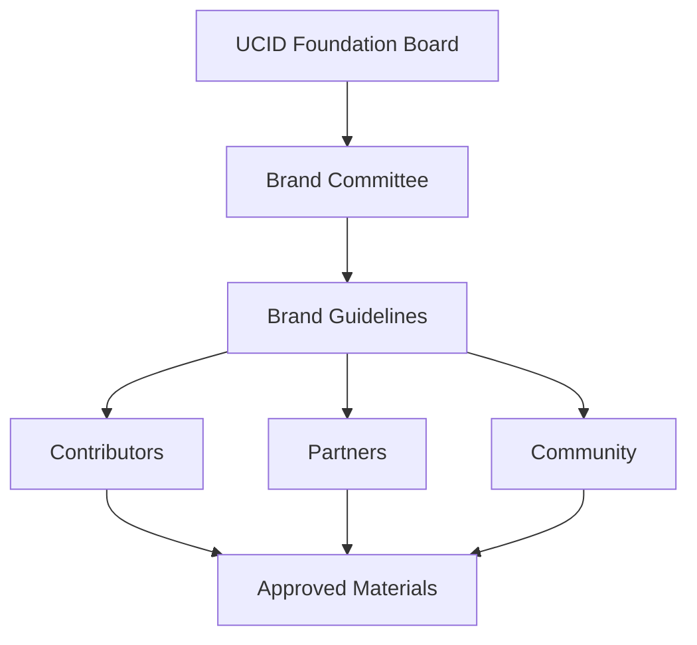
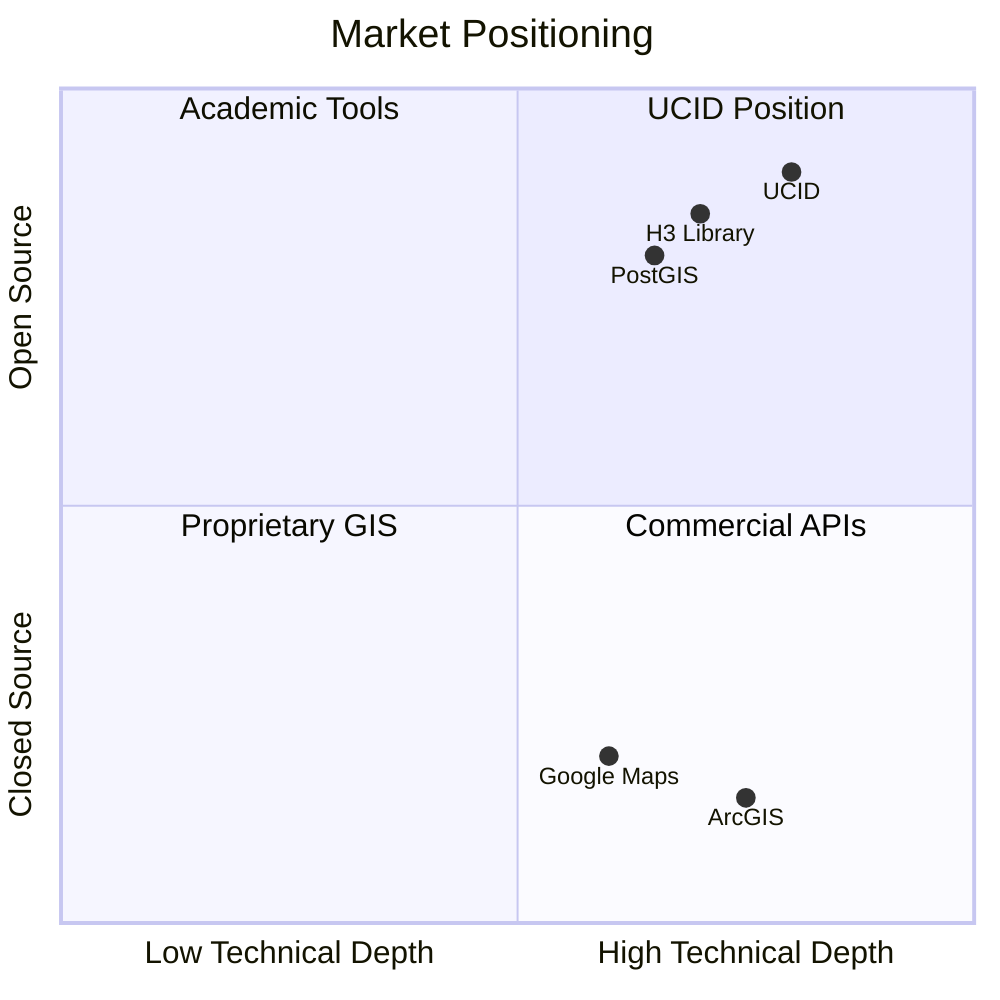
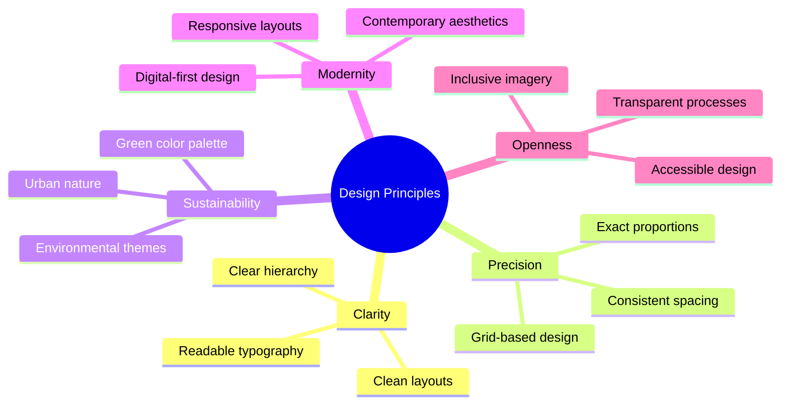
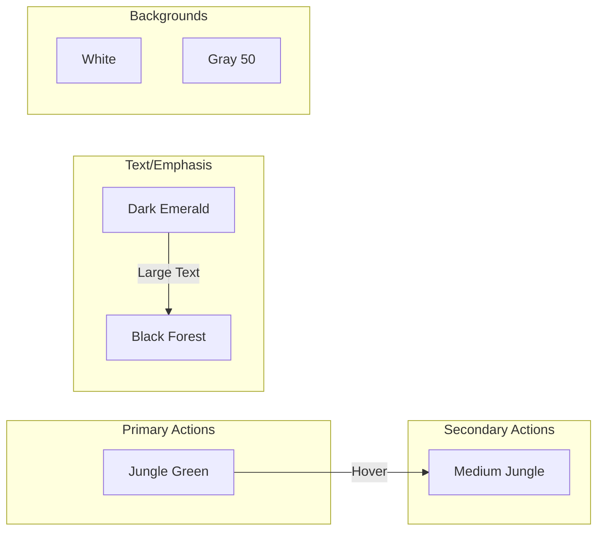
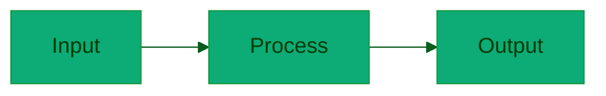

# UCID Brand Guidelines

## Document Information

| Field | Value |
|-------|-------|
| Document Title | UCID Comprehensive Brand Guidelines |
| Version | 1.0.5 |
| Last Updated | 2026-01-15 |
| Classification | Public |
| Maintainer | UCID Foundation Brand Team |
| Contact | brand@ucid.org |

---

## Table of Contents

1. [Introduction](#introduction)
2. [Brand Strategy](#brand-strategy)
3. [Visual Identity System](#visual-identity-system)
4. [Logo System](#logo-system)
5. [Color System](#color-system)
6. [Typography System](#typography-system)
7. [Iconography](#iconography)
8. [Photography and Imagery](#photography-and-imagery)
9. [Data Visualization](#data-visualization)
10. [Digital Applications](#digital-applications)
11. [Print Applications](#print-applications)
12. [Co-Branding Guidelines](#co-branding-guidelines)
13. [Brand Voice and Tone](#brand-voice-and-tone)
14. [Legal and Compliance](#legal-and-compliance)

---

## Introduction

### Purpose

This document provides comprehensive guidelines for the consistent application of the UCID (Urban Context Identifier) brand across all platforms and communications. These guidelines ensure brand integrity while enabling creative flexibility within defined parameters.

### Scope

These guidelines apply to:

- All UCID Foundation communications
- Open source project materials
- Partner and contributor materials
- Marketing and promotional content
- Digital and print applications
- Internal and external documentation

### Brand Governance



---

## Brand Strategy

### Brand Positioning

UCID occupies a unique position at the intersection of geospatial technology, urban analytics, and open source software.

#### Market Position Matrix



### Target Audiences

| Audience | Primary Needs | Communication Focus |
|----------|---------------|---------------------|
| Urban Planners | Spatial analysis, walkability metrics | Practical applications |
| Data Scientists | Performance, scalability | Technical accuracy |
| Developers | API simplicity, documentation | Implementation guides |
| Researchers | Reproducibility, citations | Academic credibility |
| Government | Standards compliance | Reliability, support |

### Brand Attributes

| Attribute | Expression |
|-----------|------------|
| **Technical Excellence** | Production-grade performance (127K ops/sec) |
| **Accessibility** | Open source, comprehensive documentation |
| **Innovation** | Novel context scoring algorithms |
| **Reliability** | 85%+ test coverage, OpenSSF 7.5+ score |
| **Community** | Active development, responsive support |

---

## Visual Identity System

### Design Principles

The UCID visual identity is built on five core principles:



### Grid System

All UCID layouts use an 8-point grid system:

| Grid Unit | Value | Usage |
|-----------|-------|-------|
| Base Unit | 8px | Fundamental spacing |
| Small | 16px (2 units) | Component padding |
| Medium | 24px (3 units) | Section spacing |
| Large | 32px (4 units) | Major sections |
| XLarge | 48px (6 units) | Page margins |

### Spacing Scale

```
0    8    16   24   32   40   48   56   64   72   80   88   96
├────┼────┼────┼────┼────┼────┼────┼────┼────┼────┼────┼────┤
│ xs │ sm │    │ md │    │    │ lg │    │    │    │    │ xl │
```

---

## Logo System

### Logo Architecture

The UCID logo consists of two primary elements:

1. **Icon Mark**: Stylized location pin with chat bubble
2. **Wordmark**: "UCID" in custom typography

### Logo Configurations

| Configuration | Usage | Minimum Width |
|---------------|-------|---------------|
| Full Logo (Horizontal) | Primary use | 120px |
| Full Logo (Stacked) | Narrow spaces | 80px |
| Icon Only | Favicons, small UI | 24px |
| Wordmark Only | When icon is nearby | 60px |

### Logo Construction

The logo is constructed on a precise grid:

```
┌───────────────────────────────────────┐
│  ╔═══╗                                │
│  ║ ▣ ║  ██  ██  ██ ██████            │
│  ╚═╦═╝  ██  ██  ██ ██   ██           │
│    ▼    ██  ██  ██ ██   ██           │
│         ██████  ██ ██████            │
│                                       │
└───────────────────────────────────────┘
  Icon    U    C    I    D
```

### Clear Space Requirements

Minimum clear space = height of the icon mark (1x)

```
       ←1x→
      ┌─────────────────────────┐ ↑
      │                         │ 1x
┌─────┼─────┐                   │ ↓
│     │     │    U C I D        │
│  ▣  │     │                   │
│     │     │                   │
└─────┼─────┘                   │
      │                         │ ↑
      └─────────────────────────┘ ↓
       ←1x→                       1x
```

### Logo Color Variations

| Variant | Background | Logo Color | File |
|---------|------------|------------|------|
| Primary | Light | Black Forest `#053b06` | logo.svg |
| Reversed | Dark | White `#ffffff` | logo-dark.svg |
| Monochrome Light | Light | Black `#000000` | logo-mono.svg |
| Monochrome Dark | Dark | White `#ffffff` | logo-mono-white.svg |

### Incorrect Logo Usage

**Do Not:**

- [ ] Rotate or tilt the logo
- [ ] Apply drop shadows or effects
- [ ] Change logo colors
- [ ] Stretch or compress
- [ ] Place on busy backgrounds
- [ ] Add outlines or borders
- [ ] Animate individual elements
- [ ] Recreate or modify

---

## Color System

### Primary Palette

The UCID primary palette draws inspiration from urban green spaces, representing sustainability, growth, and livable cities.

| Color Name | Hex | RGB | HSL |
|------------|-----|-----|-----|
| Jungle Green | `#0dab76` | `13, 171, 118` | `160°, 86%, 36%` |
| Medium Jungle | `#139a43` | `19, 154, 67` | `141°, 78%, 34%` |
| Dark Emerald | `#0b5d1e` | `11, 93, 30` | `134°, 79%, 20%` |
| Black Forest | `#053b06` | `5, 59, 6` | `121°, 84%, 13%` |
| Black | `#000000` | `0, 0, 0` | `0°, 0%, 0%` |

### Extended Palette

#### Neutral Colors

| Name | Hex | Usage |
|------|-----|-------|
| White | `#ffffff` | Backgrounds |
| Gray 50 | `#f9fafb` | Subtle backgrounds |
| Gray 100 | `#f3f4f6` | Borders |
| Gray 200 | `#e5e7eb` | Dividers |
| Gray 300 | `#d1d5db` | Disabled states |
| Gray 400 | `#9ca3af` | Placeholder text |
| Gray 500 | `#6b7280` | Secondary text |
| Gray 600 | `#4b5563` | Body text |
| Gray 700 | `#374151` | Headings |
| Gray 800 | `#1f2937` | Primary text |
| Gray 900 | `#111827` | High contrast |

#### Semantic Colors

| Purpose | Light Mode | Dark Mode |
|---------|------------|-----------|
| Success | `#0dab76` | `#10b981` |
| Warning | `#f59e0b` | `#fbbf24` |
| Error | `#dc2626` | `#ef4444` |
| Info | `#3b82f6` | `#60a5fa` |

### Color Accessibility

All primary color combinations meet WCAG 2.1 Level AA:

| Foreground | Background | Contrast | Level |
|------------|------------|----------|-------|
| Black Forest | White | 12.5:1 | AAA |
| Dark Emerald | White | 7.8:1 | AAA |
| Medium Jungle | White | 5.2:1 | AA |
| Jungle Green | White | 4.6:1 | AA |
| White | Black Forest | 12.5:1 | AAA |
| Jungle Green | Black Forest | 3.7:1 | AA (large text) |

### Color Application Rules



---

## Typography System

### Typeface Selection

| Usage | Primary | Fallback |
|-------|---------|----------|
| Headings | Inter | system-ui, sans-serif |
| Body | Inter | system-ui, sans-serif |
| Code | JetBrains Mono | ui-monospace, monospace |

### Type Scale

Based on a 1.25 ratio (Major Third):

| Level | Size | Line Height | Weight | Usage |
|-------|------|-------------|--------|-------|
| Display | 3.052rem | 1.1 | 800 | Hero sections |
| H1 | 2.441rem | 1.2 | 700 | Page titles |
| H2 | 1.953rem | 1.25 | 600 | Section headers |
| H3 | 1.563rem | 1.3 | 600 | Subsections |
| H4 | 1.25rem | 1.4 | 600 | Card titles |
| Body | 1rem | 1.6 | 400 | Paragraphs |
| Small | 0.8rem | 1.5 | 400 | Captions |
| Tiny | 0.64rem | 1.4 | 500 | Labels |

### Typography CSS

```css
/* UCID Typography System */
:root {
  /* Font Families */
  --font-sans: 'Inter', system-ui, -apple-system, BlinkMacSystemFont, 
               'Segoe UI', Roboto, 'Helvetica Neue', Arial, sans-serif;
  --font-mono: 'JetBrains Mono', ui-monospace, SFMono-Regular, 
               'SF Mono', Menlo, Consolas, monospace;
  
  /* Font Sizes */
  --text-xs: 0.64rem;
  --text-sm: 0.8rem;
  --text-base: 1rem;
  --text-lg: 1.25rem;
  --text-xl: 1.563rem;
  --text-2xl: 1.953rem;
  --text-3xl: 2.441rem;
  --text-4xl: 3.052rem;
  
  /* Font Weights */
  --font-normal: 400;
  --font-medium: 500;
  --font-semibold: 600;
  --font-bold: 700;
  --font-extrabold: 800;
  
  /* Line Heights */
  --leading-none: 1;
  --leading-tight: 1.25;
  --leading-snug: 1.375;
  --leading-normal: 1.5;
  --leading-relaxed: 1.625;
  --leading-loose: 2;
}
```

---

## Iconography

### Icon Style

UCID uses a consistent icon style:

| Property | Value |
|----------|-------|
| Style | Outlined |
| Stroke Width | 1.5px |
| Corner Radius | 2px |
| Optical Size | 24px base |

### Icon Set

Recommended icon libraries:

1. **Heroicons** (primary)
2. **Lucide** (alternative)
3. **Material Symbols** (alternative)

### Custom Icons

Custom UCID-specific icons:

| Icon | Usage | Description |
|------|-------|-------------|
| ucid-pin | Location markers | Stylized location with context |
| ucid-grid | H3 cells | Hexagonal grid reference |
| ucid-context | Context scoring | Ring with segments |
| ucid-city | City registry | Skyline silhouette |

---

## Photography and Imagery

### Photography Style

| Characteristic | Guideline |
|----------------|-----------|
| Subject | Urban environments, cityscapes |
| Mood | Optimistic, forward-looking |
| Color | Natural, green emphasis |
| Perspective | Human scale, street level |
| Quality | High resolution, professional |

### Image Treatment

| Treatment | Usage |
|-----------|-------|
| Full Color | Feature images |
| Duotone (Green) | Hero backgrounds |
| Grayscale | Secondary illustrations |
| Overlays | Text on images |

### Illustration Style

| Element | Guideline |
|---------|-----------|
| Style | Flat, geometric |
| Colors | Brand palette only |
| Complexity | Simple, clear shapes |
| Line Work | Clean, consistent stroke |

---

## Data Visualization

### Chart Colors

Primary series colors in order of use:

| Order | Color | Hex |
|-------|-------|-----|
| 1 | Jungle Green | `#0dab76` |
| 2 | Medium Jungle | `#139a43` |
| 3 | Dark Emerald | `#0b5d1e` |
| 4 | Black Forest | `#053b06` |
| 5 | Gray 500 | `#6b7280` |

### Chart Typography

| Element | Font Size | Weight | Color |
|---------|-----------|--------|-------|
| Title | 16px | 600 | Black Forest |
| Subtitle | 14px | 400 | Gray 600 |
| Axis Labels | 12px | 400 | Gray 500 |
| Legend | 12px | 400 | Gray 600 |
| Data Labels | 11px | 500 | White/Black |

### Example Mermaid Styling



---

## Digital Applications

### Website Guidelines

| Element | Specification |
|---------|---------------|
| Max Width | 1280px |
| Sidebar | 280px |
| Header | 64px height |
| Footer | 200px minimum |
| Content Padding | 24px mobile, 48px desktop |

### Button Styles

| Variant | Background | Text | Border |
|---------|------------|------|--------|
| Primary | Jungle Green | White | None |
| Secondary | White | Dark Emerald | Medium Jungle |
| Ghost | Transparent | Jungle Green | None |
| Danger | Error Red | White | None |

### Documentation Theme

For ReadTheDocs and similar platforms:

```css
/* Documentation Theme */
.wy-side-nav-search {
  background-color: #053b06;
}
.wy-menu-vertical a:hover {
  background-color: #0dab76;
}
code.literal {
  background-color: #f3f4f6;
  color: #0b5d1e;
}
```

---

## Print Applications

### Paper Sizes

| Region | Size | Dimensions |
|--------|------|------------|
| US | Letter | 8.5" × 11" |
| International | A4 | 210mm × 297mm |

### Print Colors

| Color Name | CMYK | Pantone |
|------------|------|---------|
| Jungle Green | C87 M0 Y69 K0 | 3395 C |
| Medium Jungle | C90 M0 Y85 K20 | 349 C |
| Dark Emerald | C95 M0 Y95 K55 | 3425 C |
| Black Forest | C95 M0 Y95 K75 | 350 C |

### Minimum Print Sizes

| Element | Minimum |
|---------|---------|
| Full Logo | 1 inch / 25mm |
| Icon Only | 0.25 inch / 6mm |
| Body Text | 9pt |
| Fine Print | 6pt |

---

## Co-Branding Guidelines

### Partner Logo Placement

When appearing with partner logos:

| Scenario | UCID Position | Size Ratio |
|----------|---------------|------------|
| Equal Partnership | Left or top | 1:1 |
| UCID Primary | Larger, left | 1.5:1 |
| UCID Secondary | Smaller, right | 1:1.5 |

### Minimum Separation

Maintain at least 2x clear space between UCID and partner logos.

### Prohibited Co-Branding

Do not co-brand with:

- Competitors
- Organizations with conflicting values
- Unlicensed uses

---

## Brand Voice and Tone

### Voice Characteristics

| Attribute | Description |
|-----------|-------------|
| Technical | Precise, accurate, detailed |
| Professional | Formal, credible, authoritative |
| Accessible | Clear, jargon-defined, inclusive |
| Helpful | Supportive, solution-oriented |

### Tone Variations

| Context | Tone |
|---------|------|
| Documentation | Neutral, instructive |
| Error Messages | Clear, helpful, non-blaming |
| Marketing | Confident, inspiring |
| Support | Empathetic, patient |

### Writing Guidelines

1. Use active voice
2. Lead with the main point
3. Define technical terms
4. Provide examples
5. Keep sentences under 25 words
6. Use numbered lists for sequences
7. Use bullet lists for features

---

## Legal and Compliance

### Trademark Usage

"UCID" and the UCID logo are trademarks of the UCID Foundation.

### License Information

| Asset | License |
|-------|---------|
| Brand Assets | CC BY 4.0 |
| Source Code | EUPL-1.2 |
| Documentation | CC BY 4.0 |

### Attribution Requirements

When using UCID brand assets:

```
UCID and the UCID logo are trademarks of the UCID Foundation.
Used under CC BY 4.0 license.
```

### Contact for Permissions

For usage beyond these guidelines:

- Email: brand@ucid.org
- Subject: "Brand Usage Request"

---

## Appendix: Design Tokens

### Complete Token Reference

```json
{
  "color": {
    "brand": {
      "jungle-green": "#0dab76",
      "medium-jungle": "#139a43",
      "dark-emerald": "#0b5d1e",
      "black-forest": "#053b06",
      "black": "#000000"
    }
  },
  "typography": {
    "fontFamily": {
      "sans": "Inter, system-ui, sans-serif",
      "mono": "JetBrains Mono, monospace"
    }
  },
  "spacing": {
    "unit": "8px",
    "scale": [0, 8, 16, 24, 32, 48, 64, 96]
  }
}
```

---

## Revision History

| Version | Date | Author | Changes |
|---------|------|--------|---------|
| 1.0.5 | 2026-01-15 | Brand Team | Initial comprehensive guidelines |

---

Copyright 2026 UCID Foundation. All rights reserved.
