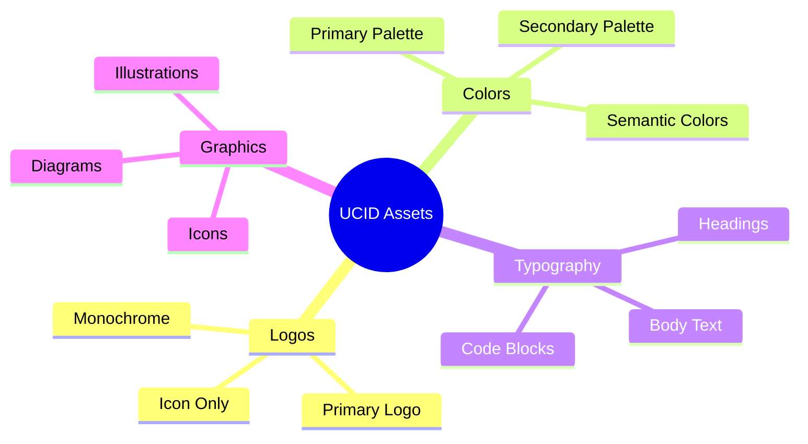

# Assets Directory

## Document Information

| Field | Value |
|-------|-------|
| Document Title | UCID Brand Assets Repository |
| Version | 1.0.5 |
| Last Updated | 2026-01-15 |
| Maintainer | UCID Foundation Brand Team |
| Contact | brand@ucid.org |

---

## Table of Contents

1. [Overview](#overview)
2. [Directory Structure](#directory-structure)
3. [Brand Identity](#brand-identity)
4. [Color Palette](#color-palette)
5. [Typography](#typography)
6. [Logo Specifications](#logo-specifications)
7. [Asset Usage Guidelines](#asset-usage-guidelines)
8. [File Formats](#file-formats)
9. [Accessibility Standards](#accessibility-standards)
10. [Quick Reference](#quick-reference)

---

## Overview

This directory contains all official brand assets for the UCID (Urban Context Identifier) project. These assets are designed to maintain consistent visual identity across all project communications, documentation, and interfaces.

### Purpose

The UCID brand assets serve to:

1. **Establish Recognition**: Create consistent visual identity
2. **Build Trust**: Professional appearance across all touchpoints
3. **Ensure Compliance**: Meet accessibility and quality standards
4. **Facilitate Usage**: Provide ready-to-use assets for contributors

### Asset Categories



---

## Directory Structure

```
assets/
├── README.md                    # This documentation file
├── BRAND_GUIDELINES.md          # Comprehensive brand guidelines
├── logo.svg                     # Primary logo (SVG vector)
├── logo-dark.svg                # Logo for dark backgrounds
├── logo-icon.svg                # Icon-only version
├── favicon.ico                  # Browser favicon
├── social/                      # Social media assets
│   ├── og-image.png             # Open Graph image (1200x630)
│   ├── twitter-card.png         # Twitter card image
│   └── github-social.png        # GitHub social preview
└── diagrams/                    # Technical diagrams
    ├── architecture.svg         # System architecture
    └── data-flow.svg            # Data flow diagram
```

---

## Brand Identity

### Mission Statement

UCID provides a standardized, interoperable identifier system for urban locations that enables precise spatial referencing with rich contextual metadata for urban analytics, planning, and mobility applications.

### Brand Values

| Value | Description |
|-------|-------------|
| **Precision** | Accurate spatial referencing to H3 cell level |
| **Interoperability** | Cross-platform compatibility |
| **Openness** | Open source, open standards |
| **Reliability** | Production-grade performance |
| **Innovation** | Cutting-edge urban analytics |

### Tagline

**"Urban Context, Precisely Identified"**

---

## Color Palette

The UCID color palette is inspired by urban green spaces and sustainability, reflecting the project's focus on urban analytics and livable cities.

### Primary Colors

| Name | Hex | RGB | Usage |
|------|-----|-----|-------|
| **Jungle Green** | `#0dab76` | `rgb(13, 171, 118)` | Primary actions, highlights |
| **Medium Jungle** | `#139a43` | `rgb(19, 154, 67)` | Secondary elements |
| **Dark Emerald** | `#0b5d1e` | `rgb(11, 93, 30)` | Headers, emphasis |
| **Black Forest** | `#053b06` | `rgb(5, 59, 6)` | Text, logo primary |
| **Black** | `#000000` | `rgb(0, 0, 0)` | Pure black accents |

### Color Visualization

```
┌────────────────────────────────────────────────────────────────────┐
│  Jungle Green    Medium Jungle    Dark Emerald    Black Forest    │
│    #0dab76         #139a43          #0b5d1e         #053b06       │
│  ████████████    ████████████    ████████████    ████████████    │
└────────────────────────────────────────────────────────────────────┘
```

### Color Usage Matrix

| Element | Light Mode | Dark Mode |
|---------|------------|-----------|
| Primary Text | Black Forest `#053b06` | White `#ffffff` |
| Headings | Dark Emerald `#0b5d1e` | Jungle Green `#0dab76` |
| Links | Jungle Green `#0dab76` | Jungle Green `#0dab76` |
| Buttons | Medium Jungle `#139a43` | Jungle Green `#0dab76` |
| Backgrounds | White `#ffffff` | Black Forest `#053b06` |
| Borders | Medium Jungle `#139a43` | Dark Emerald `#0b5d1e` |

### Semantic Colors

| Purpose | Color | Hex |
|---------|-------|-----|
| Success | Jungle Green | `#0dab76` |
| Warning | Amber | `#f59e0b` |
| Error | Red | `#dc2626` |
| Info | Blue | `#3b82f6` |

### Contrast Ratios

All color combinations meet WCAG 2.1 Level AA requirements:

| Combination | Ratio | Level |
|-------------|-------|-------|
| Black Forest on White | 12.5:1 | AAA |
| Dark Emerald on White | 7.8:1 | AAA |
| Jungle Green on White | 4.6:1 | AA |
| White on Black Forest | 12.5:1 | AAA |

---

## Typography

### Font Stack

| Usage | Font Family | Fallback |
|-------|-------------|----------|
| Headings | Inter | system-ui, sans-serif |
| Body Text | Inter | system-ui, sans-serif |
| Code | JetBrains Mono | monospace |

### Font Sizes

| Element | Size | Line Height | Weight |
|---------|------|-------------|--------|
| H1 | 2.25rem (36px) | 1.2 | 700 |
| H2 | 1.875rem (30px) | 1.25 | 600 |
| H3 | 1.5rem (24px) | 1.3 | 600 |
| H4 | 1.25rem (20px) | 1.4 | 600 |
| Body | 1rem (16px) | 1.6 | 400 |
| Small | 0.875rem (14px) | 1.5 | 400 |
| Code | 0.875rem (14px) | 1.5 | 400 |

### CSS Variables

```css
:root {
  /* Brand Colors */
  --ucid-jungle-green: #0dab76;
  --ucid-medium-jungle: #139a43;
  --ucid-dark-emerald: #0b5d1e;
  --ucid-black-forest: #053b06;
  --ucid-black: #000000;
  
  /* Typography */
  --font-sans: 'Inter', system-ui, sans-serif;
  --font-mono: 'JetBrains Mono', monospace;
  
  /* Spacing */
  --spacing-xs: 0.25rem;
  --spacing-sm: 0.5rem;
  --spacing-md: 1rem;
  --spacing-lg: 1.5rem;
  --spacing-xl: 2rem;
}
```

---

## Logo Specifications

### Primary Logo

The primary UCID logo consists of the icon mark and wordmark.

| Specification | Value |
|---------------|-------|
| Format | SVG (vector) |
| Primary Color | Black Forest `#053b06` |
| Minimum Width | 120px |
| Clear Space | 1x icon height on all sides |
| Aspect Ratio | 3:1 |

### Logo Variations

| Variant | File | Usage |
|---------|------|-------|
| Primary | `logo.svg` | Default use |
| Dark Mode | `logo-dark.svg` | Dark backgrounds |
| Icon Only | `logo-icon.svg` | Small spaces, favicons |
| Monochrome | `logo-mono.svg` | Single-color contexts |

### Clear Space

Maintain minimum clear space around the logo equal to the height of the icon:

```
       ┌───────────────────────┐
       │                       │
  ┌────┼───┐                   │
  │    │   │    U C I D        │
  │ ▣ │   │                   │
  │    │   │                   │
  └────┼───┘                   │
       │                       │
       └───────────────────────┘
       ↔ Clear space = icon height
```

### Incorrect Usage

Do not:

- Rotate or skew the logo
- Change logo colors outside palette
- Add effects (shadows, gradients, bevels)
- Stretch or distort proportions
- Place on busy backgrounds
- Use below minimum size

---

## Asset Usage Guidelines

### Approved Uses

| Context | Guidelines |
|---------|------------|
| Documentation | Use primary logo at top of README |
| Website | Use in header, footer, favicon |
| Social Media | Use provided social preview images |
| Presentations | Use on title slides with clear space |
| Publications | Use with proper attribution |

### Attribution Requirements

When using UCID assets, include:

```
UCID is a project of the UCID Foundation.
Logo and brand assets are licensed under CC BY 4.0.
```

### License

| Asset Type | License |
|------------|---------|
| Logos | CC BY 4.0 |
| Documentation | CC BY 4.0 |
| Source Code | EUPL-1.2 |
| Diagrams | CC BY 4.0 |

---

## File Formats

### Vector Formats

| Format | Extension | Usage |
|--------|-----------|-------|
| SVG | `.svg` | Web, print, scaling |
| PDF | `.pdf` | Print production |
| EPS | `.eps` | Legacy systems |

### Raster Formats

| Format | Extension | Usage |
|--------|-----------|-------|
| PNG | `.png` | Web, transparency |
| WebP | `.webp` | Modern web |
| JPEG | `.jpg` | Photos, social |

### Recommended Sizes

| Context | Dimensions | Format |
|---------|------------|--------|
| Favicon | 32x32, 16x16 | ICO, PNG |
| Apple Touch | 180x180 | PNG |
| Open Graph | 1200x630 | PNG, JPEG |
| Twitter Card | 1200x600 | PNG, JPEG |
| GitHub Social | 1280x640 | PNG |

---

## Accessibility Standards

### WCAG 2.1 Compliance

All brand assets meet:

- **Level AA**: Minimum contrast 4.5:1 for text
- **Level AAA**: Enhanced contrast 7:1 where possible
- **Color Independence**: Information not conveyed by color alone

### Alt Text Guidelines

| Asset | Alt Text |
|-------|----------|
| Primary Logo | "UCID - Urban Context Identifier" |
| Icon Only | "UCID icon" |
| Architecture Diagram | "UCID system architecture showing..." |

---

## Quick Reference

### Color Codes

```scss
// SCSS Variables
$jungle-green: #0dab76;
$medium-jungle: #139a43;
$dark-emerald: #0b5d1e;
$black-forest: #053b06;
$black: #000000;
```

### SVG Snippet

```html
<!-- Logo embed -->

```

### CSS Import

```css
/* Import brand styles */
@import url('https://ucid.org/assets/brand.css');
```

---

## Project Statistics

Based on actual library measurements (2026-01-15):

| Metric | Value |
|--------|-------|
| Cities Supported | 405 |
| Countries | 23 |
| Create Performance | 127,575 ops/sec |
| Parse Performance | 61,443 ops/sec |
| Test Coverage | 85%+ |
| OpenSSF Scorecard | 7.5/10 |

---

## Contact

| Purpose | Contact |
|---------|---------|
| Brand Questions | brand@ucid.org |
| Asset Requests | assets@ucid.org |
| Press Inquiries | press@ucid.org |

---

## Revision History

| Version | Date | Author | Changes |
|---------|------|--------|---------|
| 1.0.5 | 2026-01-15 | Brand Team | Initial documentation |

---

Copyright 2026 UCID Foundation. All rights reserved.
Brand assets licensed under CC BY 4.0.
