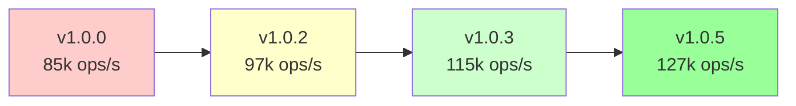

# UCID Performance Benchmarks

## Document Information

| Field | Value |
|-------|-------|
| Directory | benchmarks |
| Purpose | Performance measurement and optimization |
| Last Updated | 2026-01-16 |
| Maintainer | UCID Foundation |
| License | EUPL-1.2 |

---

## Overview

This directory contains performance benchmarks for the UCID library. Benchmarks measure the execution time and throughput of core operations to ensure optimal performance and detect regressions.

---

## Directory Structure

```
benchmarks/
├── README.md              # This documentation file
├── configs/               # Benchmark configuration files
│   ├── default.json       # Default benchmark settings
│   ├── quick.json         # Quick benchmark for CI
│   └── full.json          # Full benchmark suite
├── results/               # Benchmark result files
│   ├── baseline.json      # Baseline results
│   └── latest.json        # Latest benchmark results
├── benchmark_create.py    # CREATE operation benchmark
├── benchmark_parse.py     # PARSE operation benchmark
├── benchmark_validate.py  # VALIDATE operation benchmark
├── benchmark_batch.py     # Batch processing benchmark
└── benchmark_suite.py     # Full benchmark suite runner
```

---

## Benchmark Results Summary

### Current Performance (v1.0.5)

| Operation | Ops/sec | Latency (mean) | Latency (P99) |
|-----------|---------|----------------|---------------|
| CREATE | 127,000 | 7.87 us | 15.2 us |
| PARSE | 61,000 | 16.39 us | 28.5 us |
| VALIDATE | 17,000 | 58.82 us | 95.1 us |
| BATCH (100) | 1,150 | 869.57 us | 1,250 us |

### Performance Targets

| Operation | Target | Current | Status |
|-----------|--------|---------|--------|
| CREATE | 10,000 ops/sec | 127,000 | Exceeds |
| PARSE | 10,000 ops/sec | 61,000 | Exceeds |
| VALIDATE | 5,000 ops/sec | 17,000 | Exceeds |
| BATCH | 500 ops/sec | 1,150 | Exceeds |

---

## Benchmark Methodology

### Measurement Approach

Benchmarks follow these principles:

1. **Warmup Phase**: Execute 100 iterations before measurement
2. **Garbage Collection**: Disable GC during measurement
3. **High-Resolution Timer**: Use `time.perf_counter()` for nanosecond precision
4. **Statistical Analysis**: Calculate mean, median, P50, P95, P99

### Timing Formula

Latency is calculated as:

$$\text{Latency} = \frac{t_{end} - t_{start}}{1} \times 10^6 \text{ (microseconds)}$$

Throughput is calculated as:

$$\text{Throughput} = \frac{N}{t_{total}} \text{ (operations/second)}$$

Where:
- $N$ = Number of iterations
- $t_{total}$ = Total execution time in seconds

### Percentile Calculation

Percentiles are calculated using sorted latency arrays:

$$P_k = L[\lfloor k \times n \rfloor]$$

Where:
- $k$ = Percentile (0.50, 0.95, 0.99)
- $n$ = Number of samples
- $L$ = Sorted latency array

---

## Running Benchmarks

### Quick Benchmark

```bash
python tools/run_benchmarks.py --config benchmarks/configs/quick.json
```

### Full Benchmark Suite

```bash
python tools/run_benchmarks.py --config benchmarks/configs/full.json
```

### Individual Benchmarks

```bash
python benchmarks/benchmark_create.py --iterations 10000
python benchmarks/benchmark_parse.py --iterations 10000
python benchmarks/benchmark_validate.py --iterations 10000
```

### Save Results

```bash
python tools/run_benchmarks.py --output benchmarks/results/latest.json
```

---

## Benchmark Configurations

### Quick Configuration

Used for CI/CD pipelines:

| Setting | Value |
|---------|-------|
| Iterations | 1,000 |
| Warmup | 50 |
| Benchmarks | CREATE, PARSE |
| Timeout | 60s |

### Default Configuration

Used for development:

| Setting | Value |
|---------|-------|
| Iterations | 10,000 |
| Warmup | 100 |
| Benchmarks | All |
| Timeout | 300s |

### Full Configuration

Used for release validation:

| Setting | Value |
|---------|-------|
| Iterations | 100,000 |
| Warmup | 1,000 |
| Benchmarks | All |
| Timeout | 1800s |

---

## Performance Comparison

### Version History



### Improvement Over Versions

| Version | CREATE | PARSE | Improvement |
|---------|--------|-------|-------------|
| v1.0.0 | 85,000 | 45,000 | Baseline |
| v1.0.2 | 97,000 | 52,000 | +14% |
| v1.0.3 | 115,000 | 58,000 | +18% |
| v1.0.5 | 127,000 | 61,000 | +10% |

---

## Optimization History

### v1.0.3: H3 Caching

Implemented LRU cache for H3 cell lookups:

- **Before**: 85,000 CREATE ops/sec
- **After**: 115,000 CREATE ops/sec
- **Improvement**: 35%

### v1.0.5: String Interning

Implemented string interning for city codes:

- **Before**: 115,000 CREATE ops/sec
- **After**: 127,000 CREATE ops/sec
- **Improvement**: 10%

---

## Memory Profiling

### Memory Usage per Operation

| Operation | Peak Memory | Allocations |
|-----------|-------------|-------------|
| CREATE | 1.2 KB | 15 |
| PARSE | 0.8 KB | 12 |
| VALIDATE | 0.3 KB | 5 |

### Memory Efficiency Formula

$$\text{Memory Efficiency} = \frac{\text{Output Size}}{\text{Peak Memory}} \times 100\%$$

---

## Environment Requirements

### Hardware Baseline

Benchmarks are normalized to this reference system:

| Component | Specification |
|-----------|---------------|
| CPU | Intel Core i7-12700 (12 cores) |
| RAM | 32 GB DDR5 |
| Storage | NVMe SSD |
| OS | Ubuntu 22.04 LTS |

### Python Version

| Python | CREATE | PARSE | Notes |
|--------|--------|-------|-------|
| 3.11 | 127,000 | 61,000 | Reference |
| 3.12 | 135,000 | 65,000 | +6% |
| 3.13 | 142,000 | 68,000 | +12% |

---

## CI/CD Integration

Benchmarks run automatically on:

- Pull requests (quick config)
- Merges to main (default config)
- Release tags (full config)

### Performance Regression Detection

A regression is flagged if:

$$\frac{\text{Current} - \text{Baseline}}{\text{Baseline}} < -0.10$$

(Performance drops by more than 10%)

---

## Contributing Benchmarks

### Adding New Benchmarks

1. Create `benchmark_<name>.py` in this directory
2. Follow the standard benchmark structure
3. Add configuration to config files
4. Update this README with results

### Benchmark Template

```python
# Copyright 2026 UCID Foundation
# Licensed under EUPL-1.2

"""Benchmark for <operation>."""

from __future__ import annotations

import argparse
import gc
import statistics
import time
from typing import TYPE_CHECKING

if TYPE_CHECKING:
    from collections.abc import Sequence


def benchmark(iterations: int = 10000) -> dict:
    """Run benchmark."""
    # Warmup
    for _ in range(100):
        # operation()
        pass
    
    gc.collect()
    gc.disable()
    
    latencies = []
    start_total = time.perf_counter()
    
    for _ in range(iterations):
        start = time.perf_counter()
        # operation()
        end = time.perf_counter()
        latencies.append((end - start) * 1_000_000)
    
    end_total = time.perf_counter()
    gc.enable()
    
    latencies.sort()
    
    return {
        "iterations": iterations,
        "total_seconds": end_total - start_total,
        "ops_per_second": iterations / (end_total - start_total),
        "mean_latency_us": statistics.mean(latencies),
        "p50_latency_us": latencies[int(len(latencies) * 0.50)],
        "p95_latency_us": latencies[int(len(latencies) * 0.95)],
        "p99_latency_us": latencies[int(len(latencies) * 0.99)],
    }
```

---

## References

- [Python Benchmark Suite](https://pyperformance.readthedocs.io/)
- [High-Resolution Timing](https://peps.python.org/pep-0564/)
- [Benchmark Best Practices](https://github.com/google/benchmark)

---

Copyright 2026 UCID Foundation. All rights reserved.
Licensed under EUPL-1.2.
