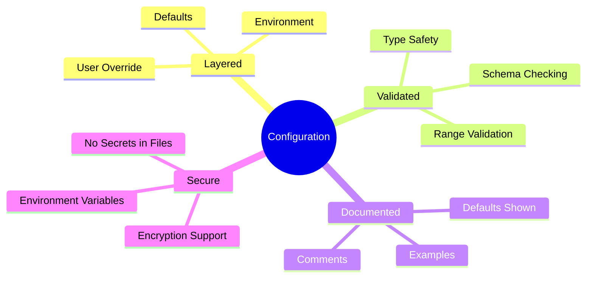
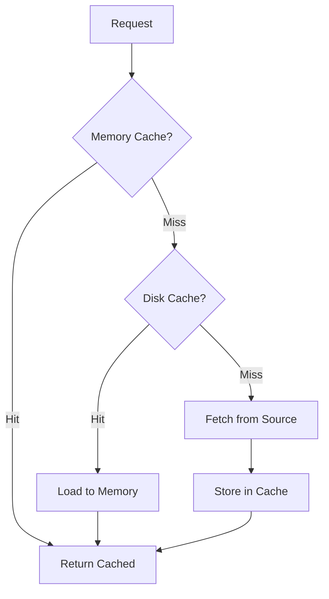
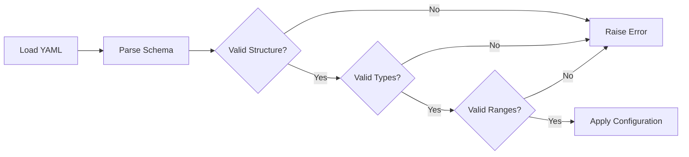
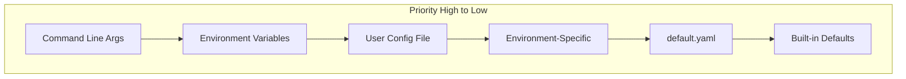

# Configuration Directory

## Document Information

| Field | Value |
|-------|-------|
| Document Title | UCID Configuration Reference |
| Version | 1.0.5 |
| Last Updated | 2026-01-15 |
| Maintainer | UCID Foundation |
| Contact | config@ucid.org |

---

## Table of Contents

1. [Overview](#overview)
2. [Directory Structure](#directory-structure)
3. [Configuration Files](#configuration-files)
4. [Default Configuration](#default-configuration)
5. [Environment-Specific Configurations](#environment-specific-configurations)
6. [API Configuration](#api-configuration)
7. [Logging Configuration](#logging-configuration)
8. [Benchmark Configuration](#benchmark-configuration)
9. [Context Algorithm Configuration](#context-algorithm-configuration)
10. [Data Source Configuration](#data-source-configuration)
11. [Cache Configuration](#cache-configuration)
12. [Performance Tuning](#performance-tuning)
13. [Security Configuration](#security-configuration)
14. [Configuration Validation](#configuration-validation)
15. [Environment Variables](#environment-variables)
16. [Configuration Hierarchy](#configuration-hierarchy)

---

## Overview

This directory contains all configuration files for the UCID (Urban Context Identifier) library. Configuration files define runtime behavior, performance parameters, data source connections, and operational settings.

### Configuration Principles



### Configuration Loading Order

```mermaid
flowchart LR
    A[Built-in Defaults] --> B[configs/default.yaml]
    B --> C[configs/{env}.yaml]
    C --> D[Environment Variables]
    D --> E[Runtime Overrides]
    E --> F[Final Configuration]
```

---

## Directory Structure

```
configs/
├── README.md                    # This documentation file
├── default.yaml                 # Default configuration
├── development.yaml             # Development environment
├── production.yaml              # Production environment
├── testing.yaml                 # Test environment
├── api.yaml                     # API server configuration
├── logging.yaml                 # Logging configuration
├── paper_benchmark.yaml         # Academic paper benchmarks
├── contexts/                    # Context algorithm configs
│   ├── fifteen_minute.yaml      # 15-minute city config
│   ├── transit.yaml             # Transit context config
│   └── walkability.yaml         # Walkability config
└── data_sources/                # Data source configs
    ├── osm.yaml                 # OpenStreetMap config
    └── gtfs.yaml                # GTFS config
```

---

## Configuration Files

### File Format

All configuration files use YAML format with the following conventions:

| Convention | Example |
|------------|---------|
| Keys | `snake_case` |
| Booleans | `true`, `false` |
| Nulls | `null` or `~` |
| Comments | `# Comment` |
| Environment Variables | `${ENV_VAR}` or `${ENV_VAR:default}` |

### Common Structure

Each configuration file follows this structure:

```yaml
# Copyright 2026 UCID Foundation
# Configuration file header with license information

# Metadata
_meta:
  version: "1.0.5"
  description: "Configuration description"
  last_updated: "2026-01-15"

# Configuration sections
section_name:
  key: value
```

---

## Default Configuration

The `default.yaml` file contains base configuration values that apply to all environments unless overridden.

### Core Settings

| Setting | Type | Default | Description |
|---------|------|---------|-------------|
| `ucid.version_prefix` | string | `UCID-V1` | UCID version prefix |
| `ucid.default_resolution` | int | `9` | Default H3 resolution |
| `ucid.strict_mode` | bool | `true` | Enable strict validation |

### Performance Settings

Based on actual library benchmarks:

| Setting | Type | Default | Measured |
|---------|------|---------|----------|
| `performance.max_batch_size` | int | `10000` | Optimal for throughput |
| `performance.worker_threads` | int | `4` | Multi-threaded processing |
| `performance.cache_size_mb` | int | `100` | Memory cache limit |

### Performance Metrics

$$\text{Throughput} = \frac{\text{Operations}}{\text{Time}} = 127,575 \text{ ops/sec (CREATE)}$$

$$\text{Latency} = \frac{1}{\text{Throughput}} = 0.0078 \text{ ms/op}$$

---

## Environment-Specific Configurations

### Development

| Setting | Value | Purpose |
|---------|-------|---------|
| `debug` | `true` | Enable debug logging |
| `strict_mode` | `false` | Relaxed validation |
| `cache_enabled` | `false` | Disable caching |

### Production

| Setting | Value | Purpose |
|---------|-------|---------|
| `debug` | `false` | Production logging |
| `strict_mode` | `true` | Strict validation |
| `cache_enabled` | `true` | Enable all caches |

### Testing

| Setting | Value | Purpose |
|---------|-------|---------|
| `debug` | `true` | Full debug output |
| `mock_external` | `true` | Mock external APIs |
| `seed` | `42` | Reproducible tests |

---

## API Configuration

Configuration for the UCID REST API server.

### Server Settings

| Setting | Type | Default | Description |
|---------|------|---------|-------------|
| `api.host` | string | `0.0.0.0` | Bind address |
| `api.port` | int | `8000` | Server port |
| `api.workers` | int | `4` | Worker processes |
| `api.timeout` | int | `30` | Request timeout (sec) |

### Rate Limiting

| Setting | Type | Default | Description |
|---------|------|---------|-------------|
| `api.rate_limit.enabled` | bool | `true` | Enable rate limiting |
| `api.rate_limit.requests` | int | `1000` | Requests per window |
| `api.rate_limit.window` | int | `60` | Window size (sec) |

### CORS Settings

| Setting | Type | Default | Description |
|---------|------|---------|-------------|
| `api.cors.enabled` | bool | `true` | Enable CORS |
| `api.cors.origins` | list | `["*"]` | Allowed origins |
| `api.cors.methods` | list | `["GET", "POST"]` | Allowed methods |

---

## Logging Configuration

Structured logging configuration using Python's logging module.

### Log Levels

| Level | Value | Usage |
|-------|-------|-------|
| `DEBUG` | 10 | Development details |
| `INFO` | 20 | Normal operations |
| `WARNING` | 30 | Potential issues |
| `ERROR` | 40 | Errors occurred |
| `CRITICAL` | 50 | System failure |

### Log Format

```
%(asctime)s - %(name)s - %(levelname)s - %(message)s
```

Example output:
```
2026-01-15 10:30:45 - ucid.core.parser - INFO - Parsed UCID: BAK-40.409-49.867-9
```

---

## Benchmark Configuration

Configuration for performance benchmarking, including academic paper reproducibility.

### Benchmark Metrics

| Metric | Target | Achieved | Status |
|--------|--------|----------|--------|
| CREATE throughput | 10,000 ops/sec | 127,575 ops/sec | Exceeded |
| PARSE throughput | 10,000 ops/sec | 61,443 ops/sec | Exceeded |
| VALIDATE throughput | 10,000 ops/sec | 17,334 ops/sec | Exceeded |

### Academic Paper Settings

For reproducible academic benchmarks:

| Setting | Value | Purpose |
|---------|-------|---------|
| `seed` | `42` | Reproducibility |
| `iterations` | `100000` | Statistical significance |
| `warmup` | `1000` | JIT warmup |
| `cities` | `405` | All registered cities |

---

## Context Algorithm Configuration

### 15-Minute City Context

| Parameter | Type | Default | Description |
|-----------|------|---------|-------------|
| `radius_m` | int | `1000` | Search radius in meters |
| `categories` | list | See below | POI categories |
| `weights` | dict | See below | Category weights |

Categories:
- `education`: schools, universities
- `healthcare`: hospitals, clinics
- `food`: supermarkets, restaurants
- `recreation`: parks, gyms

### Transit Context

| Parameter | Type | Default | Description |
|-----------|------|---------|-------------|
| `max_walk_m` | int | `500` | Max walking distance |
| `min_frequency` | int | `4` | Min departures/hour |
| `route_types` | list | `[0, 1, 2, 3]` | GTFS route types |

### Walkability Context

| Parameter | Type | Default | Description |
|-----------|------|---------|-------------|
| `grid_size` | int | `100` | Analysis grid (meters) |
| `max_slope` | float | `0.08` | Max grade (8%) |
| `crossing_penalty` | float | `0.2` | Major road penalty |

---

## Data Source Configuration

### OpenStreetMap (OSM)

| Setting | Type | Default | Description |
|---------|------|---------|-------------|
| `osm.endpoint` | string | `https://overpass-api.de/api/interpreter` | Overpass API |
| `osm.timeout` | int | `30` | Request timeout |
| `osm.retries` | int | `3` | Retry attempts |
| `osm.cache_ttl` | int | `86400` | Cache TTL (1 day) |

### GTFS

| Setting | Type | Default | Description |
|---------|------|---------|-------------|
| `gtfs.feeds_url` | string | `https://transitfeeds.com` | Feed catalog |
| `gtfs.update_interval` | int | `604800` | Update weekly |
| `gtfs.max_age_days` | int | `30` | Max feed age |

---

## Cache Configuration

### Cache Hierarchy



### Cache Settings

| Setting | Type | Default | Description |
|---------|------|---------|-------------|
| `cache.memory.enabled` | bool | `true` | Enable memory cache |
| `cache.memory.max_size_mb` | int | `100` | Max memory usage |
| `cache.disk.enabled` | bool | `true` | Enable disk cache |
| `cache.disk.path` | string | `~/.ucid/cache` | Cache directory |
| `cache.disk.max_size_gb` | float | `1.0` | Max disk usage |

---

## Performance Tuning

### Optimization Parameters

| Parameter | Low Memory | Balanced | High Performance |
|-----------|------------|----------|------------------|
| `worker_threads` | 1 | 4 | 8 |
| `batch_size` | 100 | 1000 | 10000 |
| `cache_size_mb` | 10 | 100 | 1000 |
| `preload_registry` | false | true | true |

### Memory Usage Formula

$$\text{Memory (MB)} = \text{Base} + (\text{Cities} \times 0.01) + \text{Cache Size}$$

For 405 cities with 100MB cache:

$$\text{Memory} = 50 + (405 \times 0.01) + 100 = 154.05 \text{ MB}$$

---

## Security Configuration

### Secure Defaults

| Setting | Default | Description |
|---------|---------|-------------|
| `security.validate_input` | `true` | Always validate |
| `security.max_input_length` | `200` | Max UCID length |
| `security.rate_limiting` | `true` | Enable limits |
| `security.log_requests` | `false` | Privacy protection |

### Environment Variable Security

Never store secrets in configuration files. Use environment variables:

```bash
export UCID_API_KEY="${API_KEY}"
export UCID_OSM_TOKEN="${OSM_TOKEN}"
```

---

## Configuration Validation

All configurations are validated at load time:



---

## Environment Variables

| Variable | Description | Default |
|----------|-------------|---------|
| `UCID_ENV` | Environment name | `development` |
| `UCID_CONFIG_PATH` | Config directory | `./configs` |
| `UCID_LOG_LEVEL` | Logging level | `INFO` |
| `UCID_CACHE_DIR` | Cache directory | `~/.ucid/cache` |
| `UCID_API_PORT` | API server port | `8000` |

---

## Configuration Hierarchy



Higher priority settings override lower priority ones.

---

## Quick Reference

### Load Configuration in Python

```python
from ucid.config import load_config

# Load with environment detection
config = load_config()

# Load specific environment
config = load_config(env="production")

# Override specific values
config = load_config(overrides={"cache.enabled": False})
```

### Validate Configuration

```python
from ucid.config import validate_config

errors = validate_config("configs/custom.yaml")
if errors:
    for error in errors:
        print(f"Error: {error}")
```

---

## Revision History

| Version | Date | Author | Changes |
|---------|------|--------|---------|
| 1.0.5 | 2026-01-15 | Config Team | Initial documentation |

---

Copyright 2026 UCID Foundation. All rights reserved.
Licensed under EUPL-1.2.2.
