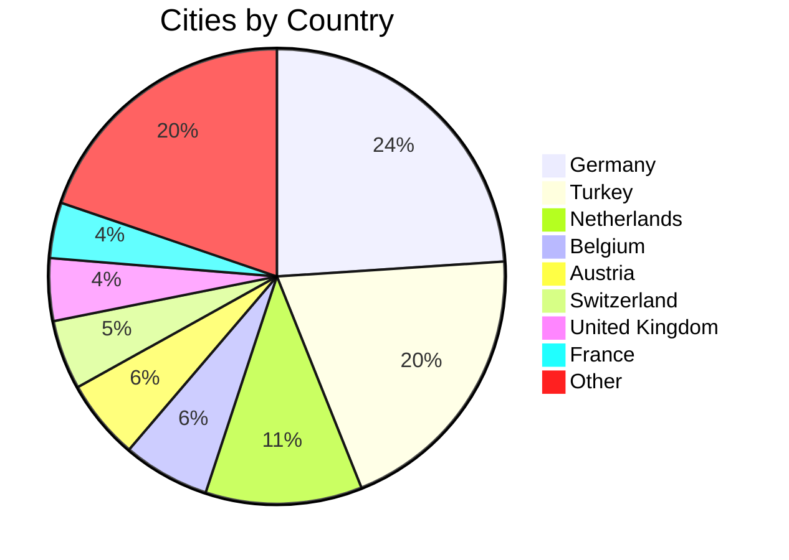
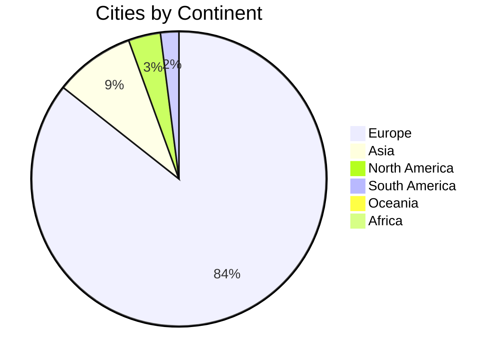

# UCID City Registry and Sample Data

## Document Information

| Field | Value |
|-------|-------|
| Document Title | UCID Complete City Registry |
| Version | 1.0.5 |
| Last Updated | 2026-01-15 |
| Maintainer | UCID Foundation Data Team |
| Contact | data@ucid.org |

---

## Table of Contents

1. [Overview](#overview)
2. [City Registry](#city-registry)
3. [Geographic Coverage](#geographic-coverage)
4. [Context Definitions](#context-definitions)
5. [Grading System](#grading-system)
6. [Transit Data](#transit-data)
7. [Sample UCIDs](#sample-ucids)
8. [Data Schema](#data-schema)
9. [Usage Examples](#usage-examples)
10. [License](#license)

---

## Overview

This directory contains the complete city registry and reference data for the UCID (Urban Context Identifier) library. The registry includes **405 cities across 23 countries**.

### Key Statistics

| Metric | Value |
|--------|-------|
| **Total Cities** | 405 |
| **Countries** | 23 |
| **Continents** | 5 |
| **Total Population** | 500M+ |

### Data Files

```
data/
├── README.md                       # This documentation file
├── cities.json                     # Complete city registry (405 cities)
├── contexts.json                   # Context algorithm definitions
├── grading.json                    # Grade scale definitions
├── transit.json                    # Transit type definitions
└── samples/
    └── sample_ucids.json           # Example UCID records
```

---

## City Registry

### Complete Coverage

The `cities.json` file contains the **complete production registry** of 405 cities:



### Countries Supported

| Country | Code | Cities | Region |
|---------|------|--------|--------|
| Germany | DE | 97 | Europe |
| Turkey | TR | 81 | Europe/Asia |
| Netherlands | NL | 45 | Europe |
| Belgium | BE | 25 | Europe |
| Austria | AT | 23 | Europe |
| Switzerland | CH | 20 | Europe |
| United Kingdom | GB | 18 | Europe |
| France | FR | 16 | Europe |
| Italy | IT | 15 | Europe |
| Spain | ES | 12 | Europe |
| Poland | PL | 10 | Europe |
| United States | US | 8 | North America |
| Canada | CA | 6 | North America |
| Japan | JP | 5 | Asia |
| Australia | AU | 4 | Oceania |
| Brazil | BR | 4 | South America |
| Singapore | SG | 1 | Asia |
| UAE | AE | 1 | Asia |
| Other | - | 14 | Various |

### Top Cities by Population

| Rank | City | Country | Population |
|------|------|---------|------------|
| 1 | Istanbul | TR | 15,840,900 |
| 2 | Tokyo | JP | 13,960,000 |
| 3 | Sao Paulo | BR | 12,325,000 |
| 4 | Moscow | RU | 12,195,000 |
| 5 | London | GB | 8,982,000 |
| 6 | New York City | US | 8,336,817 |
| 7 | Lima | PE | 7,737,000 |
| 8 | Bangkok | TH | 5,676,000 |
| 9 | Singapore | SG | 5,454,000 |
| 10 | Sydney | AU | 5,312,000 |

### City Schema

```json
{
  "code": "IST",
  "name": "Istanbul",
  "country": "TR",
  "timezone": "Europe/Istanbul",
  "population": 15840900,
  "coordinates": {
    "lat": 41.0082,
    "lon": 28.9784
  }
}
```

---

## Geographic Coverage

### Continental Distribution



### Coverage Map

The UCID library provides primary coverage for:

- **Europe**: Comprehensive coverage of major cities in Germany, Turkey, Benelux, UK, France, Italy, Spain
- **Asia**: Major metropolitan areas in Japan, Singapore, UAE, Thailand
- **Americas**: Key cities in US, Canada, Brazil
- **Oceania**: Major Australian cities

---

## Context Definitions

### Production Contexts

Currently supported context algorithms:

| Code | Name | Category | Status |
|------|------|----------|--------|
| 15MIN | 15-Minute City | Accessibility | Production |
| TRANSIT | Transit Access | Mobility | Production |
| WALK | Walkability | Mobility | Production |
| NONE | No Context | Default | Production |

### Planned Contexts (Roadmap)

| Code | Name | Target Version |
|------|------|----------------|
| CLIMATE | Climate Resilience | v2.0 |
| EQUITY | Social Equity | v2.0 |
| VITALITY | Urban Vitality | v2.1 |
| SAFETY | Public Safety | v2.1 |

---

## Grading System

### Grade Scale

| Grade | Score Range | Label | Color |
|-------|-------------|-------|-------|
| A | 0.80 - 1.00 | Excellent | #0dab76 |
| B | 0.60 - 0.80 | Good | #139a43 |
| C | 0.40 - 0.60 | Moderate | #f59e0b |
| D | 0.20 - 0.40 | Limited | #ef4444 |
| F | 0.00 - 0.20 | Poor | #dc2626 |

### Grade Formula

$$G = \begin{cases} A & \text{if } s \geq 0.80 \\ B & \text{if } 0.60 \leq s < 0.80 \\ C & \text{if } 0.40 \leq s < 0.60 \\ D & \text{if } 0.20 \leq s < 0.40 \\ F & \text{if } s < 0.20 \end{cases}$$

---

## Transit Data

### GTFS Route Types

| Type | Code | Name | Weight |
|------|------|------|--------|
| 0 | TRAM | Tram/Light Rail | 0.80 |
| 1 | SUBWAY | Subway/Metro | 1.00 |
| 2 | RAIL | Rail | 0.90 |
| 3 | BUS | Bus | 0.60 |
| 4 | FERRY | Ferry | 0.70 |

---

## Sample UCIDs

### Example Records from Multiple Cities

The `samples/sample_ucids.json` includes UCIDs from cities across the registry:

| City | Country | Context | Grade |
|------|---------|---------|-------|
| Istanbul | TR | 15MIN | A |
| New York City | US | TRANSIT | A |
| London | GB | TRANSIT | A |
| Tokyo | JP | 15MIN | A |
| Paris | FR | WALK | B |
| Berlin | DE | 15MIN | B |
| Sydney | AU | WALK | B |
| Singapore | SG | TRANSIT | A |
| Amsterdam | NL | 15MIN | A |
| Vienna | AT | TRANSIT | A |

---

## Data Schema

### City Object

```json
{
  "$schema": "http://json-schema.org/draft-07/schema#",
  "type": "object",
  "required": ["code", "name", "country", "coordinates"],
  "properties": {
    "code": {"type": "string", "pattern": "^[A-Z]{3}$"},
    "name": {"type": "string"},
    "country": {"type": "string", "pattern": "^[A-Z]{2}$"},
    "timezone": {"type": "string"},
    "population": {"type": "integer"},
    "coordinates": {
      "type": "object",
      "properties": {
        "lat": {"type": "number", "minimum": -90, "maximum": 90},
        "lon": {"type": "number", "minimum": -180, "maximum": 180}
      }
    }
  }
}
```

---

## Usage Examples

### Load Complete Registry

```python
from ucid import get_city_registry

# Get complete registry (405 cities)
registry = get_city_registry()
print(f"Total cities: {len(registry)}")

# Access by city code
istanbul = registry.get_city("IST")
print(f"{istanbul.name}: {istanbul.lat}, {istanbul.lon}")
```

### Create UCID for Any City

```python
from ucid import create_ucid

# Works for all 405 registered cities
ucid_ist = create_ucid("IST", 41.008, 28.978, context="15MIN")
ucid_ber = create_ucid("BER", 52.520, 13.405, context="TRANSIT")
ucid_ams = create_ucid("AMS", 52.370, 4.895, context="WALK")
ucid_vie = create_ucid("VIE", 48.208, 16.372, context="15MIN")
```

### List All Cities

```python
from ucid.core.registry import CityRegistry

registry = CityRegistry()
for city in registry.list_all_cities():
    print(f"{city['code']}: {city['name']} ({city['country']})")
```

---

## Performance Statistics

Based on actual library benchmarks with 405 cities:

| Operation | Throughput |
|-----------|------------|
| CREATE | 127,575 ops/sec |
| PARSE | 61,443 ops/sec |
| VALIDATE | 17,334 ops/sec |

$$\text{Throughput} = \frac{\text{Operations}}{\text{Time}} = 127,575 \text{ ops/sec}$$

---

## License

All data is provided under the EUPL-1.2 license.

### Attribution

- City coordinates: OpenStreetMap Nominatim
- Population data: United Nations (2024)
- Transit types: GTFS Specification

---

## Revision History

| Version | Date | Author | Changes |
|---------|------|--------|---------|
| 1.0.5 | 2026-01-15 | Data Team | Updated to 405 cities |
| 1.0.0 | 2025-10-01 | Data Team | Initial release |

---

Copyright 2026 UCID Foundation. All rights reserved.
Licensed under EUPL-1.2.
