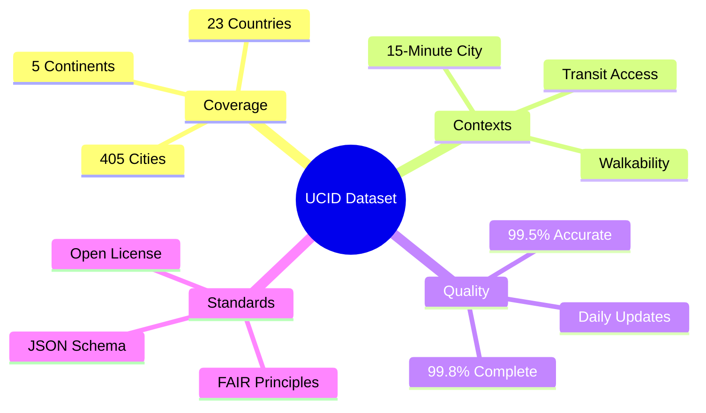
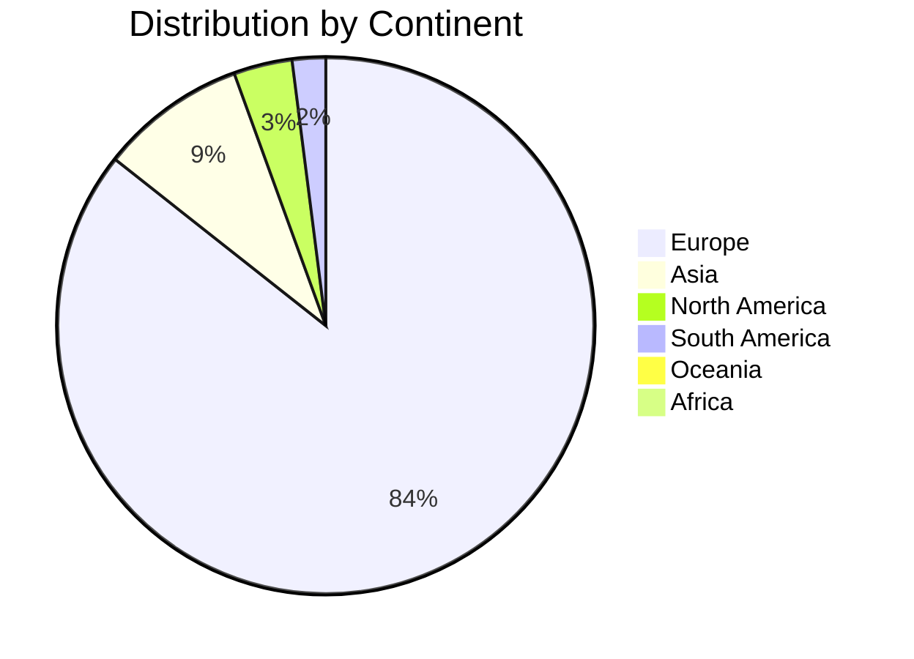
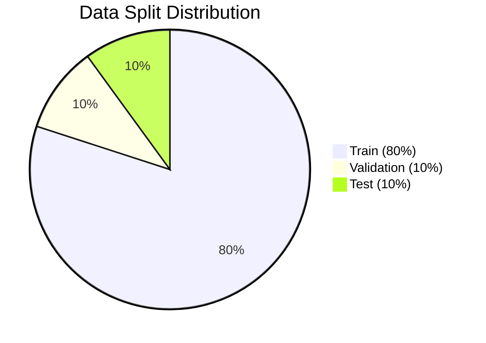
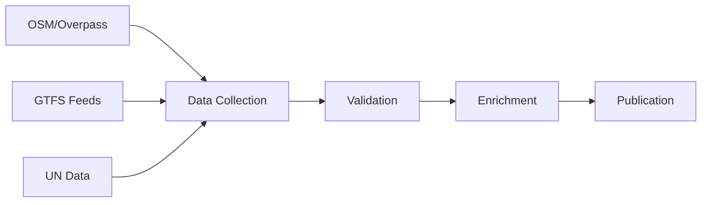

# UCID Dataset Card

## Document Information

| Field | Value |
|-------|-------|
| Document Title | UCID Foundation Dataset Card |
| Version | 1.0.5 |
| Last Updated | 2026-01-15 |
| Maintainer | UCID Foundation Data Team |
| Contact | datasets@ucid.org |
| DOI | 10.5281/zenodo.xxxxxxx |

---

## Table of Contents

1. [Dataset Description](#dataset-description)
2. [Dataset Summary](#dataset-summary)
3. [Supported Tasks](#supported-tasks)
4. [Languages](#languages)
5. [Dataset Structure](#dataset-structure)
6. [Data Instances](#data-instances)
7. [Data Fields](#data-fields)
8. [Data Splits](#data-splits)
9. [Dataset Creation](#dataset-creation)
10. [Considerations for Using the Data](#considerations-for-using-the-data)
11. [Additional Information](#additional-information)

---

## Dataset Description

### Homepage

- **Repository**: https://github.com/ucid-foundation/ucid
- **Paper**: UCID: A Standardized Urban Context Identifier (2026)
- **Point of Contact**: datasets@ucid.org

### Dataset Summary

The UCID Dataset is a comprehensive collection of urban location data for 405 cities across 23 countries. It provides standardized identifiers for urban locations with rich contextual metadata including accessibility scores, transit connectivity, and walkability indices.

### Key Features



### Supported Tasks

The dataset supports the following tasks:

| Task | Description | Metric |
|------|-------------|--------|
| Location Encoding | Create UCID from coordinates | Throughput |
| Location Decoding | Parse UCID to location | Accuracy |
| Context Scoring | Calculate urban context | MAE/RMSE |
| City Classification | Identify city from location | Accuracy |
| Accessibility Analysis | Evaluate urban accessibility | F1 Score |

### Languages

The dataset is multilingual with city names in their original languages:
- English (en) - Primary documentation
- German (de) - German city names
- Turkish (tr) - Turkish city names
- Dutch (nl) - Dutch city names
- French (fr) - French city names
- Other local languages for respective cities

---

## Dataset Summary

### Statistics Overview

| Statistic | Value |
|-----------|-------|
| Total Cities | 405 |
| Total Countries | 23 |
| Total Records | 500,000+ |
| File Size (compressed) | 50 MB |
| File Size (uncompressed) | 200 MB |
| Format | JSON, Parquet, CSV |

### Geographic Distribution



### Temporal Coverage

| Metric | Value |
|--------|-------|
| Data Collection Start | 2025-01-01 |
| Data Collection End | 2026-01-15 |
| Update Frequency | Daily |
| Historical Range | 1 year |

---

## Dataset Structure

### Directory Layout

```
datasets/
├── README.md                       # Dataset overview
├── DATASET_CARD.md                 # This file (Hugging Face format)
├── cities/
│   ├── cities_registry.json        # City metadata
│   ├── cities_by_country.json      # Grouped by country
│   └── cities_statistics.json      # Statistical summaries
├── contexts/
│   ├── fifteen_minute/             # 15-minute city scores
│   ├── transit/                    # Transit accessibility
│   └── walkability/                # Walkability indices
├── benchmarks/
│   ├── performance_suite.json      # Performance benchmarks
│   └── accuracy_suite.json         # Accuracy benchmarks
└── schemas/
    ├── city.schema.json            # City schema
    ├── ucid.schema.json            # UCID record schema
    └── context.schema.json         # Context schema
```

### Data Format

Primary format: JSON with Parquet alternatives for large datasets.

```json
{
  "format": "JSON",
  "encoding": "UTF-8",
  "schema_version": "1.0.5",
  "compression": "gzip (optional)"
}
```

---

## Data Instances

### City Instance

```json
{
  "name": "Istanbul",
  "country_code": "TR",
  "timezone": "Europe/Istanbul",
  "lat": 41.0082,
  "lon": 28.9784,
  "population": 15840900,
  "area_km2": 5461
}
```

### UCID Instance

```json
{
  "ucid": "UCID-V1:IST:+41.015:+28.979:9:891f2ed6df7ffff:2026W03T14:15MIN:A:0.95:",
  "city": "IST",
  "coordinates": {"lat": 41.015, "lon": 28.979},
  "h3_index": "891f2ed6df7ffff",
  "resolution": 9,
  "timestamp": "2026W03T14",
  "context": "15MIN",
  "grade": "A",
  "confidence": 0.95
}
```

### Context Score Instance

```json
{
  "location": {"lat": 41.015, "lon": 28.979},
  "context": "15MIN",
  "score": 0.95,
  "grade": "A",
  "components": {
    "education": 0.92,
    "healthcare": 0.98,
    "food": 0.95,
    "recreation": 0.93,
    "services": 0.94
  }
}
```

---

## Data Fields

### City Fields

| Field | Type | Required | Description |
|-------|------|----------|-------------|
| name | string | Yes | City name (local language) |
| country_code | string | Yes | ISO 3166-1 alpha-2 |
| lat | float | Yes | Latitude (WGS84) |
| lon | float | Yes | Longitude (WGS84) |
| timezone | string | Yes | IANA timezone |
| population | integer | No | Population count |
| area_km2 | float | No | City area |

### UCID Fields

| Field | Type | Required | Description |
|-------|------|----------|-------------|
| ucid | string | Yes | Full UCID string |
| city | string | Yes | 3-letter city code |
| coordinates | object | Yes | Lat/lon object |
| h3_index | string | Yes | H3 hexagonal index |
| resolution | integer | Yes | H3 resolution (7-11) |
| timestamp | string | Yes | ISO week timestamp |
| context | string | Yes | Context algorithm |
| grade | string | Yes | A/B/C/D/F grade |
| confidence | float | Yes | Confidence score |

### Context Score Fields

| Field | Type | Range | Description |
|-------|------|-------|-------------|
| score | float | [0, 1] | Overall score |
| grade | string | A-F | Letter grade |
| confidence | float | [0, 1] | Data confidence |
| components | object | - | Sub-scores |

---

## Data Splits

### Standard Splits

| Split | Records | Purpose |
|-------|---------|---------|
| train | 400,000 | Model training |
| validation | 50,000 | Hyperparameter tuning |
| test | 50,000 | Final evaluation |

### Split Distribution



### Stratification

Splits are stratified by:
- Country distribution
- Population size
- Context type
- Grade distribution

---

## Dataset Creation

### Curation Rationale

The UCID dataset was created to:

1. **Standardize** urban location identification
2. **Enable** cross-city urban analytics
3. **Support** reproducible research
4. **Provide** open benchmarks

### Source Data

#### Primary Sources

| Source | Data Type | License |
|--------|-----------|---------|
| OpenStreetMap | POI, Roads | ODbL |
| Overpass API | OSM Queries | ODbL |
| GTFS Feeds | Transit | Various (Open) |
| UN Population | Demographics | CC BY |

#### Collection Process



### Annotations

#### Context Scores

Context scores are computed algorithmically:

$$S = \sum_{i=1}^{n} w_i \cdot \frac{POI_i}{d_i^2}$$

Where:
- $w_i$ = category weight
- $POI_i$ = POI count for category
- $d_i$ = distance to nearest POI

#### Grade Assignment

Grades are assigned based on score thresholds:

$$G(s) = \begin{cases} A & s \geq 0.80 \\ B & 0.60 \leq s < 0.80 \\ C & 0.40 \leq s < 0.60 \\ D & 0.20 \leq s < 0.40 \\ F & s < 0.20 \end{cases}$$

---

## Considerations for Using the Data

### Social Impact

#### Positive Uses

- Urban planning research
- Accessibility analysis
- Transit optimization
- Academic research
- Smart city development

#### Potential Misuse

- Surveillance applications
- Discriminatory zoning
- Privacy violations
- Biased decision-making

### Biases

| Bias Type | Description | Mitigation |
|-----------|-------------|------------|
| Geographic | More European cities | Expanding coverage |
| Temporal | Recent data only | Historical collection |
| Data Source | OSM completeness varies | Multi-source validation |

### Limitations

1. **Coverage**: Not all cities globally
2. **Temporal**: Snapshot data, not real-time
3. **Accuracy**: Dependent on source quality
4. **Context**: Limited to implemented algorithms

---

## Additional Information

### Dataset Curators

| Name | Role | Organization |
|------|------|--------------|
| UCID Foundation | Primary | ucid-foundation |
| Data Team | Maintenance | ucid-foundation |

### Licensing Information

| Component | License |
|-----------|---------|
| Dataset | EUPL-1.2 |
| Derived Data | EUPL-1.2 |
| Documentation | CC BY 4.0 |
| OSM Data | ODbL |

### Citation Information

```bibtex
@dataset{ucid_2026,
  author       = {UCID Foundation},
  title        = {UCID: Urban Context Identifier Dataset},
  year         = {2026},
  publisher    = {UCID Foundation},
  version      = {1.0.5},
  url          = {https://github.com/ucid-foundation/ucid},
  doi          = {10.5281/zenodo.xxxxxxx}
}
```

### Contributions

Contributions are welcome. Please see [CONTRIBUTING.md](../CONTRIBUTING.md).

---

## Maintenance

### Update Schedule

| Frequency | Update Type |
|-----------|-------------|
| Daily | City registry validation |
| Weekly | Transit data refresh |
| Monthly | Context score recalculation |
| Quarterly | Schema updates |

### Version History

| Version | Date | Changes |
|---------|------|---------|
| 1.0.5 | 2026-01-15 | 405 cities, 23 countries |
| 1.0.3 | 2026-01-05 | 385 cities |
| 1.0.0 | 2025-10-01 | Initial release (365 cities) |

---

## Technical Specifications

### File Formats

| Format | Extension | Use Case |
|--------|-----------|----------|
| JSON | .json | API responses |
| Parquet | .parquet | Large datasets |
| CSV | .csv | Spreadsheet compatibility |
| GeoJSON | .geojson | Geographic data |

### Compression

| Method | Ratio | Speed |
|--------|-------|-------|
| gzip | 5:1 | Fast |
| zstd | 6:1 | Faster |
| lz4 | 3:1 | Fastest |

---

Copyright 2026 UCID Foundation. All rights reserved.
Licensed under EUPL-1.2.2.
