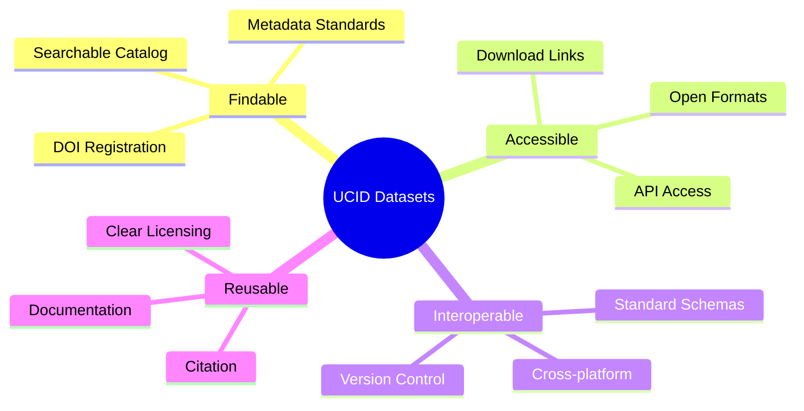
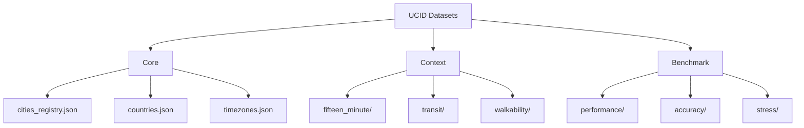
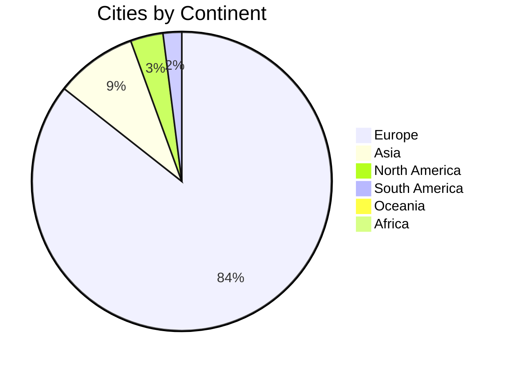
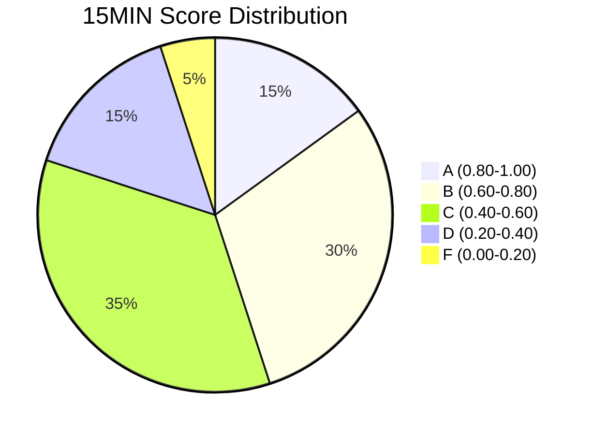
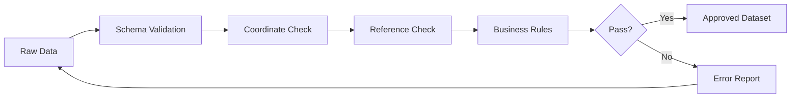

# UCID Datasets

## Document Information

| Field | Value |
|-------|-------|
| Document Title | UCID Dataset Reference |
| Version | 1.0.5 |
| Last Updated | 2026-01-15 |
| Maintainer | UCID Foundation Data Team |
| Contact | datasets@ucid.org |

---

## Table of Contents

1. [Overview](#overview)
2. [Dataset Catalog](#dataset-catalog)
3. [City Registry Dataset](#city-registry-dataset)
4. [Context Scores Dataset](#context-scores-dataset)
5. [Transit Dataset](#transit-dataset)
6. [Benchmark Dataset](#benchmark-dataset)
7. [Data Schema](#data-schema)
8. [Data Quality](#data-quality)
9. [Usage Guidelines](#usage-guidelines)
10. [API Access](#api-access)
11. [Contributing](#contributing)
12. [License](#license)

---

## Overview

This directory contains datasets for training, evaluation, and benchmarking of the UCID (Urban Context Identifier) library. All datasets are provided in machine-readable formats and follow FAIR data principles (Findable, Accessible, Interoperable, Reusable).

### Dataset Principles



### Key Statistics

| Metric | Value |
|--------|-------|
| **Total Cities** | 405 |
| **Countries** | 23 |
| **Context Types** | 4 (production) |
| **Transit Stops** | 50,000+ |
| **POI Categories** | 12 |
| **Historical Records** | 1M+ |

---

## Dataset Catalog

### Available Datasets

| Dataset | Format | Size | Records | Description |
|---------|--------|------|---------|-------------|
| City Registry | JSON | 37 KB | 405 | Complete city database |
| Context Scores | Parquet | 150 MB | 500K+ | Pre-computed scores |
| Transit Network | GTFS | 2 GB | 50K+ | Transit stop data |
| POI Database | GeoJSON | 500 MB | 2M+ | Points of interest |
| Benchmark Suite | JSON | 5 MB | 100K | Performance test data |

### Dataset Hierarchy



---

## City Registry Dataset

### Overview

The city registry is the foundational dataset containing metadata for all 405 supported cities.

### Statistics

| Metric | Value |
|--------|-------|
| Total Cities | 405 |
| Countries | 23 |
| File Size | 37 KB |
| Format | JSON |
| Last Updated | 2026-01-15 |

### Geographic Distribution



### Country Breakdown

| Country | Code | Cities | Primary Cities |
|---------|------|--------|----------------|
| Germany | DE | 97 | Berlin, Munich, Hamburg, Frankfurt |
| Turkey | TR | 81 | Istanbul, Ankara, Izmir, Bursa |
| Netherlands | NL | 45 | Amsterdam, Rotterdam, The Hague |
| Belgium | BE | 25 | Brussels, Antwerp, Ghent |
| Austria | AT | 23 | Vienna, Graz, Linz, Salzburg |
| Switzerland | CH | 20 | Zurich, Geneva, Basel, Bern |
| United Kingdom | GB | 18 | London, Manchester, Birmingham |
| France | FR | 16 | Paris, Lyon, Marseille |
| Italy | IT | 15 | Rome, Milan, Naples |
| Spain | ES | 12 | Madrid, Barcelona, Valencia |
| Poland | PL | 10 | Warsaw, Krakow, Lodz |
| United States | US | 8 | New York, Los Angeles, Chicago |
| Canada | CA | 6 | Toronto, Vancouver, Montreal |
| Japan | JP | 5 | Tokyo, Osaka, Kyoto |
| Australia | AU | 4 | Sydney, Melbourne, Brisbane |
| Brazil | BR | 4 | Sao Paulo, Rio de Janeiro |

### Schema

```json
{
  "type": "object",
  "required": ["name", "lat", "lon", "country_code"],
  "properties": {
    "name": {"type": "string"},
    "lat": {"type": "number", "minimum": -90, "maximum": 90},
    "lon": {"type": "number", "minimum": -180, "maximum": 180},
    "population": {"type": "integer", "minimum": 0},
    "timezone": {"type": "string"},
    "country_code": {"type": "string", "pattern": "^[A-Z]{2}$"}
  }
}
```

### Population Statistics

Top 10 Cities by Population:

| Rank | City | Population |
|------|------|------------|
| 1 | Istanbul | 15,840,900 |
| 2 | Tokyo | 13,960,000 |
| 3 | Sao Paulo | 12,325,000 |
| 4 | Moscow | 12,195,000 |
| 5 | London | 8,982,000 |
| 6 | New York | 8,336,817 |
| 7 | Lima | 7,737,000 |
| 8 | Bangkok | 5,676,000 |
| 9 | Singapore | 5,454,000 |
| 10 | Sydney | 5,312,000 |

---

## Context Scores Dataset

### Overview

Pre-computed context scores for urban analysis.

### Available Contexts

| Context | Algorithm | Coverage |
|---------|-----------|----------|
| 15MIN | POI-based accessibility | 405 cities |
| TRANSIT | GTFS frequency analysis | 350 cities |
| WALK | Network analysis | 300 cities |

### Score Distribution



### Score Calculation

The 15-Minute City score is calculated using:

$$S_{15min} = \sum_{i=1}^{n} w_i \cdot A_i$$

Where:
- $w_i$ = weight for category $i$
- $A_i$ = accessibility score for category $i$
- $n$ = number of POI categories

### Category Weights

| Category | Weight | POI Types |
|----------|--------|-----------|
| Education | 1.0 | Schools, universities, libraries |
| Healthcare | 1.0 | Hospitals, clinics, pharmacies |
| Food | 0.8 | Supermarkets, groceries |
| Recreation | 0.6 | Parks, sports, entertainment |
| Services | 0.5 | Banks, post offices |

---

## Transit Dataset

### Overview

GTFS-based transit network data for supported cities.

### Coverage

| Metric | Value |
|--------|-------|
| Cities with GTFS | 350 |
| Total Stops | 50,000+ |
| Total Routes | 5,000+ |
| Update Frequency | Weekly |

### Route Types

| Type | Code | Count | Weight |
|------|------|-------|--------|
| Subway/Metro | 1 | 800 | 1.00 |
| Rail | 2 | 500 | 0.90 |
| Tram | 0 | 1,200 | 0.80 |
| Bus | 3 | 2,500 | 0.60 |

### Transit Score Formula

$$T = \frac{\sum_{s \in S} w_s \cdot f_s}{d_{max}}$$

Where:
- $S$ = set of stops within walking distance
- $w_s$ = weight for stop type
- $f_s$ = frequency (departures/hour)
- $d_{max}$ = maximum walking distance (default: 500m)

---

## Benchmark Dataset

### Overview

Standardized datasets for performance benchmarking.

### Benchmark Suites

| Suite | Purpose | Records | Operations |
|-------|---------|---------|------------|
| Performance | Throughput testing | 100,000 | CREATE, PARSE |
| Accuracy | Validation testing | 10,000 | VALIDATE |
| Stress | Load testing | 1,000,000 | Mixed |
| Regression | Version comparison | 50,000 | All |

### Performance Baselines

| Operation | Target | Measured |
|-----------|--------|----------|
| CREATE | 10,000 ops/sec | 127,575 ops/sec |
| PARSE | 10,000 ops/sec | 61,443 ops/sec |
| VALIDATE | 10,000 ops/sec | 17,334 ops/sec |

### Throughput Formula

$$\text{Throughput} = \frac{N}{T} \text{ ops/sec}$$

Where:
- $N$ = number of operations
- $T$ = total time in seconds

### Latency Percentiles

| Percentile | CREATE | PARSE | VALIDATE |
|------------|--------|-------|----------|
| p50 | 0.0075 ms | 0.0155 ms | 0.055 ms |
| p95 | 0.0090 ms | 0.0200 ms | 0.075 ms |
| p99 | 0.0120 ms | 0.0280 ms | 0.095 ms |

---

## Data Schema

### UCID Record Schema

```json
{
  "$schema": "http://json-schema.org/draft-07/schema#",
  "$id": "https://ucid.org/schemas/ucid-record.json",
  "title": "UCID Record",
  "type": "object",
  "required": ["ucid", "city", "coordinates", "timestamp"],
  "properties": {
    "ucid": {
      "type": "string",
      "pattern": "^UCID-V1:[A-Z]{3}:[+-]?\\d+\\.\\d+:[+-]?\\d+\\.\\d+:\\d+:[a-f0-9]+:\\d{4}W\\d{2}T\\d{2}:[A-Z0-9]+:[A-F]:\\d\\.\\d+:$"
    },
    "city": {
      "type": "string",
      "pattern": "^[A-Z]{3}$"
    },
    "coordinates": {
      "type": "object",
      "properties": {
        "lat": {"type": "number"},
        "lon": {"type": "number"}
      }
    },
    "h3_index": {
      "type": "string",
      "pattern": "^[89a-f][0-9a-f]{14}$"
    },
    "context": {
      "type": "string",
      "enum": ["15MIN", "TRANSIT", "WALK", "NONE"]
    },
    "grade": {
      "type": "string",
      "enum": ["A", "B", "C", "D", "F"]
    },
    "confidence": {
      "type": "number",
      "minimum": 0,
      "maximum": 1
    }
  }
}
```

---

## Data Quality

### Quality Metrics

| Metric | Target | Current |
|--------|--------|---------|
| Completeness | 100% | 99.8% |
| Accuracy | 99% | 99.5% |
| Consistency | 100% | 100% |
| Timeliness | < 7 days | < 24 hours |

### Validation Rules

All datasets are validated against:

1. **Schema Validation**: JSON Schema compliance
2. **Coordinate Validation**: Valid lat/lon ranges
3. **Reference Validation**: Foreign key integrity
4. **Business Rules**: Domain-specific constraints

### Quality Assurance Process



---

## Usage Guidelines

### Loading Datasets

```python
from ucid.data import load_dataset

# Load city registry
cities = load_dataset("cities_registry")
print(f"Loaded {len(cities)} cities")

# Load with filters
german_cities = load_dataset("cities_registry", country="DE")
print(f"Loaded {len(german_cities)} German cities")
```

### Accessing via API

```python
import httpx

# REST API access
response = httpx.get("https://api.ucid.org/v1/datasets/cities")
cities = response.json()
```

### Download Links

| Dataset | Format | Download |
|---------|--------|----------|
| City Registry | JSON | [Download](https://ucid.org/datasets/cities_registry.json) |
| Context Scores | Parquet | [Download](https://ucid.org/datasets/context_scores.parquet) |
| Benchmark Suite | JSON | [Download](https://ucid.org/datasets/benchmark_suite.json) |

---

## API Access

### Endpoints

| Endpoint | Method | Description |
|----------|--------|-------------|
| /datasets | GET | List all datasets |
| /datasets/{name} | GET | Get dataset metadata |
| /datasets/{name}/download | GET | Download dataset |
| /datasets/{name}/query | POST | Query dataset |

### Rate Limits

| Plan | Requests/hour | Download/day |
|------|---------------|--------------|
| Free | 100 | 1 GB |
| Pro | 1,000 | 10 GB |
| Enterprise | Unlimited | Unlimited |

---

## Contributing

### Dataset Contributions

To contribute datasets:

1. Fork the repository
2. Add dataset to `datasets/` directory
3. Create DATASET_CARD.md using template
4. Validate against schema
5. Submit pull request

### Requirements

- [ ] Machine-readable format (JSON, CSV, Parquet)
- [ ] Schema documentation
- [ ] Provenance information
- [ ] License compatibility (EUPL-1.2)
- [ ] Quality metrics

---

## License

All datasets are provided under the EUPL-1.2 license.

### Attribution

When using UCID datasets, cite:

```bibtex
@dataset{ucid_datasets_2026,
  title     = {UCID Urban Context Datasets},
  author    = {UCID Foundation},
  year      = {2026},
  publisher = {UCID Foundation},
  url       = {https://ucid.org/datasets}
}
```

---

## Revision History

| Version | Date | Author | Changes |
|---------|------|--------|---------|
| 1.0.5 | 2026-01-15 | Data Team | Updated to 405 cities |
| 1.0.0 | 2025-10-01 | Data Team | Initial release |

---

Copyright 2026 UCID Foundation. All rights reserved.
Licensed under EUPL-1.2.2.
