# UCID Project Overview

This document provides a comprehensive technical overview of the UCID (Urban Context Identifier) project, including its architecture, design philosophy, data model, and integration patterns.

---

## Table of Contents

1. [Introduction](#introduction)
2. [Problem Statement](#problem-statement)
3. [Solution Architecture](#solution-architecture)
4. [Core Concepts](#core-concepts)
5. [Data Model](#data-model)
6. [System Components](#system-components)
7. [Integration Patterns](#integration-patterns)
8. [Performance Characteristics](#performance-characteristics)
9. [Security Model](#security-model)
10. [Deployment Options](#deployment-options)
11. [Roadmap](#roadmap)
12. [References](#references)

---

## Introduction

The Urban Context Identifier (UCID) is a standardized identification system for encoding spatial, temporal, and contextual information about urban locations. UCID addresses the fundamental challenge of urban data fragmentation by providing a universal key that enables consistent joining and analysis of heterogeneous urban datasets.

### Project Goals

| Goal | Description |
|------|-------------|
| **Standardization** | Provide a universal identifier format for urban locations |
| **Interoperability** | Enable seamless data exchange between urban data systems |
| **Reproducibility** | Ensure deterministic results for scientific applications |
| **Scalability** | Support city-wide and global-scale analysis |
| **Accessibility** | Make advanced urban analysis accessible to non-specialists |

### Target Audiences

UCID is designed for multiple user communities:

1. **Urban Researchers**: Academic researchers studying urban phenomena
2. **Urban Planners**: Professionals designing cities and infrastructure
3. **Data Scientists**: Analysts working with large-scale urban datasets
4. **Software Developers**: Engineers building urban data applications
5. **Policy Makers**: Officials using data to inform urban policy

---

## Problem Statement

Urban data analysis faces several fundamental challenges that UCID addresses:

### Data Fragmentation

Urban data exists in numerous isolated systems, each with different identifiers:

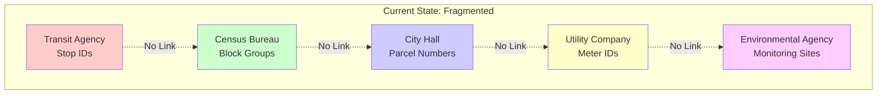

### The Universal Key Solution

UCID provides a universal spatial-temporal key:

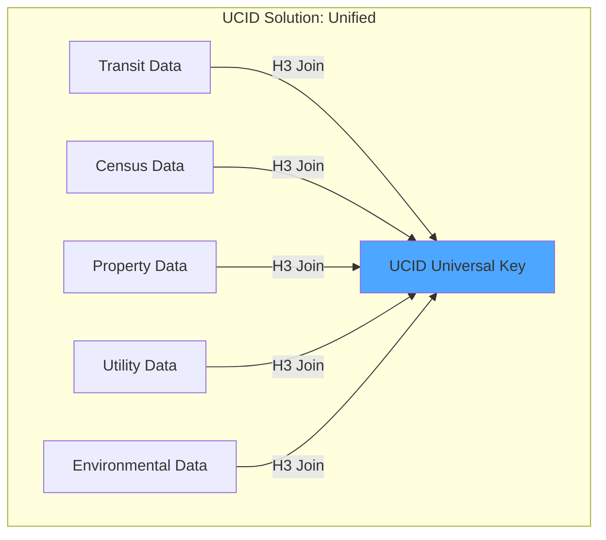

### Key Challenges Addressed

| Challenge | Traditional Approach | UCID Solution |
|-----------|---------------------|---------------|
| **Spatial Alignment** | Manual geocoding and matching | H3 hexagonal indexing |
| **Temporal Alignment** | Various date formats | ISO week standardization |
| **Context Integration** | Separate analysis pipelines | Unified context scoring |
| **Reproducibility** | Ad-hoc methodologies | Deterministic algorithms |
| **Scale** | Desktop processing limits | Distributed computing support |

---

## Solution Architecture

UCID implements a layered architecture that separates concerns and enables extensibility:

### High-Level Architecture

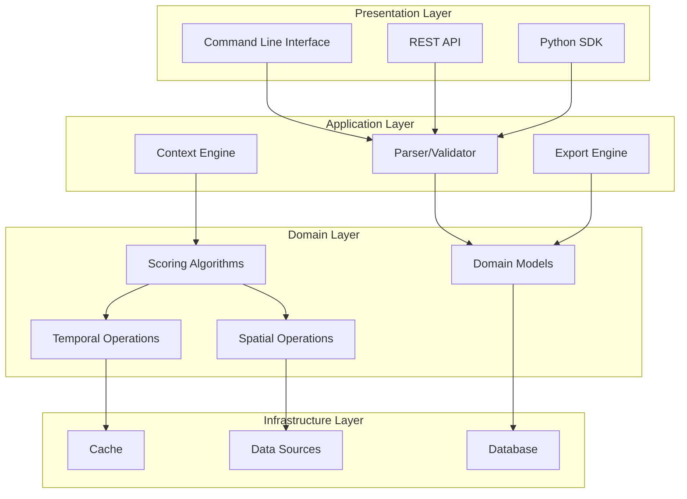

### Component Interactions

The following sequence diagram illustrates a typical UCID creation workflow:

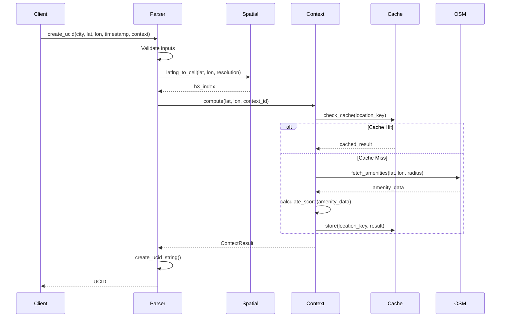

---

## Core Concepts

### UCID Format Specification

A UCID string is a colon-separated sequence of 11 fields:

```
UCID-V1:CITY:LAT:LON:H3R:H3:TIME:CTX:GRD:CONF:FLAGS
```

The mathematical representation of a UCID can be expressed as:

$$UCID = (V, C, \lambda, \phi, r, h, t, x, g, c, F)$$

Where:
- $V$ is the version identifier
- $C$ is the city code from UN/LOCODE
- $(\lambda, \phi)$ are latitude and longitude coordinates
- $r$ is the H3 resolution level
- $h$ is the H3 cell index
- $t$ is the temporal key
- $x$ is the context identifier
- $g$ is the quality grade
- $c$ is the confidence score
- $F$ is the set of optional flags

### Field Specifications

| Field | Symbol | Type | Range | Example |
|-------|--------|------|-------|---------|
| Version | $V$ | String | `UCID-V1` | `UCID-V1` |
| City | $C$ | String | 3 uppercase letters | `IST` |
| Latitude | $\lambda$ | Float | $[-90, 90]$ | `+41.015` |
| Longitude | $\phi$ | Float | $[-180, 180]$ | `+28.979` |
| H3 Resolution | $r$ | Integer | $[0, 15]$ | `9` |
| H3 Index | $h$ | Hexadecimal | 15 characters | `891f2ed6df7ffff` |
| Timestamp | $t$ | String | `YYYYWwwThh` | `2026W01T12` |
| Context | $x$ | String | Alphanumeric | `15MIN` |
| Grade | $g$ | String | `A+,A,B,C,D,F` | `A` |
| Confidence | $c$ | Float | $[0, 1]$ | `0.92` |
| Flags | $F$ | String | Semicolon-separated | `VERIFIED;OFFICIAL` |

### Determinism Guarantee

UCID guarantees deterministic output through the following invariant:

$$\forall (C, \lambda, \phi, t, x, g, c, F): \text{create\_ucid}(C, \lambda, \phi, t, x, g, c, F) = \text{constant}$$

This property ensures reproducibility across systems and time.

---

## Data Model

### Entity Relationship Diagram

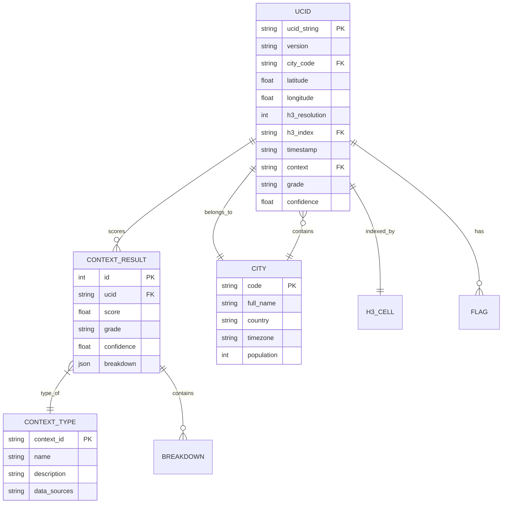

### Class Hierarchy

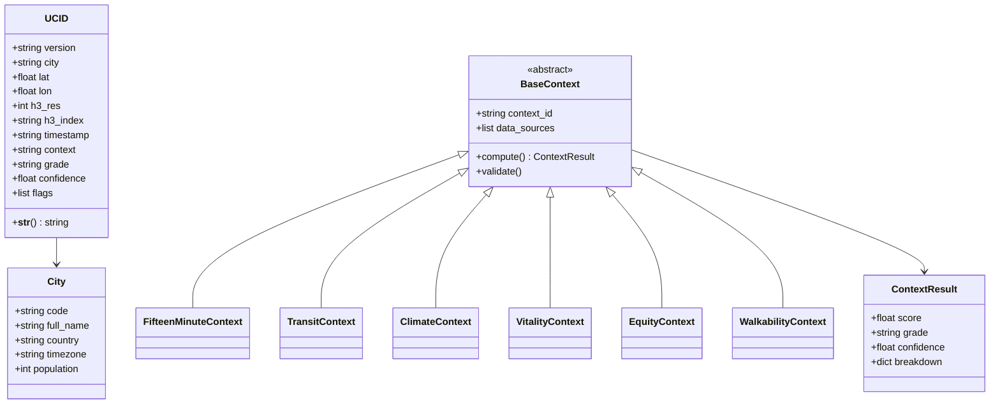

---

## System Components

### Module Architecture

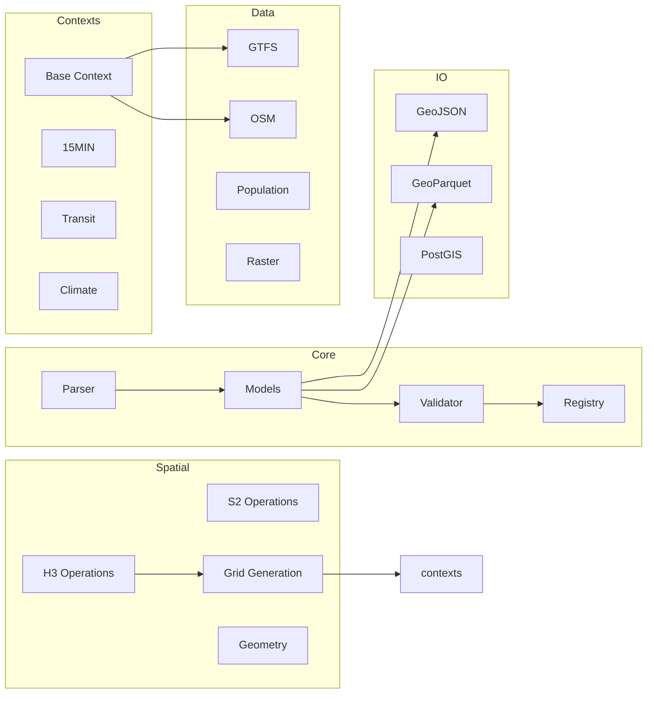

### Component Descriptions

| Component | Purpose | Key Classes |
|-----------|---------|-------------|
| **Core** | UCID parsing, creation, validation | `parse_ucid`, `create_ucid`, `UCID` |
| **Spatial** | Spatial indexing and operations | `latlng_to_cell`, `generate_grid_h3` |
| **Temporal** | Time series analysis | `analyze_trend`, `detect_anomalies` |
| **Contexts** | Scoring algorithms | `FifteenMinuteContext`, `TransitContext` |
| **Data** | External data integration | `OSMFetcher`, `GTFSManager` |
| **IO** | Import/export operations | `export_geoparquet`, `export_geojson` |
| **API** | REST API server | `app`, `routes` |
| **ML** | Machine learning | `UCIDPredictor` |

---

## Integration Patterns

### Data Pipeline Integration

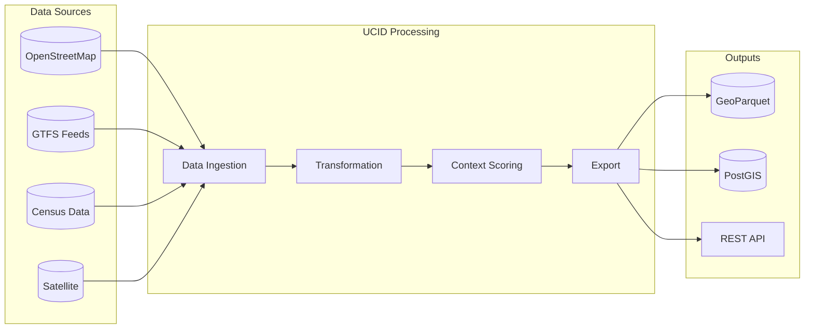

### API Integration

External systems can integrate with UCID through:

1. **Python SDK**: Direct library integration
2. **REST API**: HTTP-based integration
3. **CLI**: Command-line scripting
4. **Database**: Direct PostGIS queries

---

## Performance Characteristics

### Computational Complexity

| Operation | Time Complexity | Space Complexity |
|-----------|-----------------|------------------|
| UCID Creation | $O(1)$ | $O(1)$ |
| UCID Parsing | $O(n)$ where $n$ = string length | $O(1)$ |
| Grid Generation | $O(k)$ where $k$ = cell count | $O(k)$ |
| Context Scoring | $O(m)$ where $m$ = amenity count | $O(m)$ |

### Benchmark Results

| Operation | Throughput | Latency (p50) | Latency (p99) |
|-----------|------------|---------------|---------------|
| `create_ucid` | 500,000/s | 2 $\mu$s | 10 $\mu$s |
| `parse_ucid` | 800,000/s | 1.2 $\mu$s | 8 $\mu$s |
| `compute` (cached) | 50,000/s | 20 $\mu$s | 100 $\mu$s |
| `compute` (uncached) | 1,000/s | 800 ms | 2,000 ms |

### Scaling Characteristics

The system exhibits the following scaling behavior:

$$T_{total} = T_{fixed} + n \cdot T_{per\_item}$$

Where:
- $T_{fixed}$ is the fixed initialization overhead
- $n$ is the number of items processed
- $T_{per\_item}$ is the per-item processing time

---

## Security Model

### Threat Model

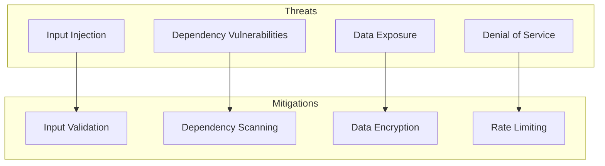

### Security Controls

| Control | Implementation | Status |
|---------|----------------|--------|
| Input Validation | Pydantic models, regex patterns | Active |
| Dependency Scanning | Dependabot, pip-audit | Automated |
| Static Analysis | Bandit, CodeQL | CI/CD integrated |
| SBOM Generation | CycloneDX | Automated |
| Signed Releases | GPG signatures | Active |

---

## Deployment Options

### Deployment Architectures

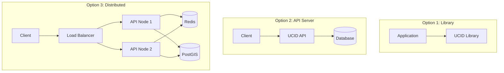

---

## Roadmap

### Version Timeline

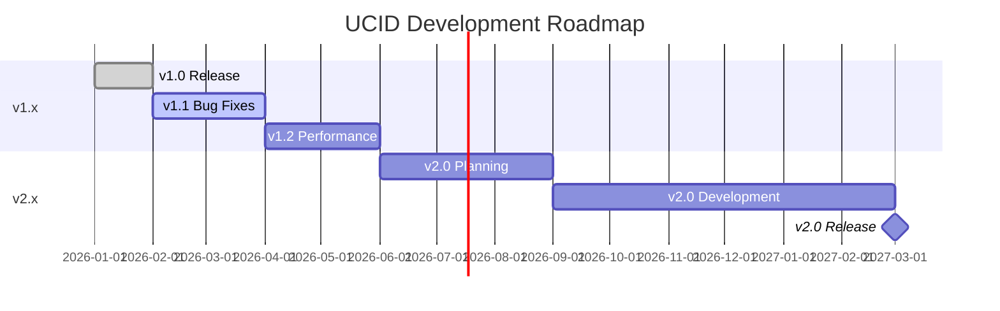

---

## References

1. Moreno, C. et al. (2021). "The 15-minute city: A sustainable urban planning concept."
2. Brodsky, I. (2018). "H3: Uber's Hexagonal Hierarchical Spatial Index."
3. ISO 8601:2019. "Date and time format."
4. UN/LOCODE. "United Nations Code for Trade and Transport Locations."
5. OGC. "GeoParquet Specification."

---

Copyright 2026 UCID Foundation. All rights reserved.
