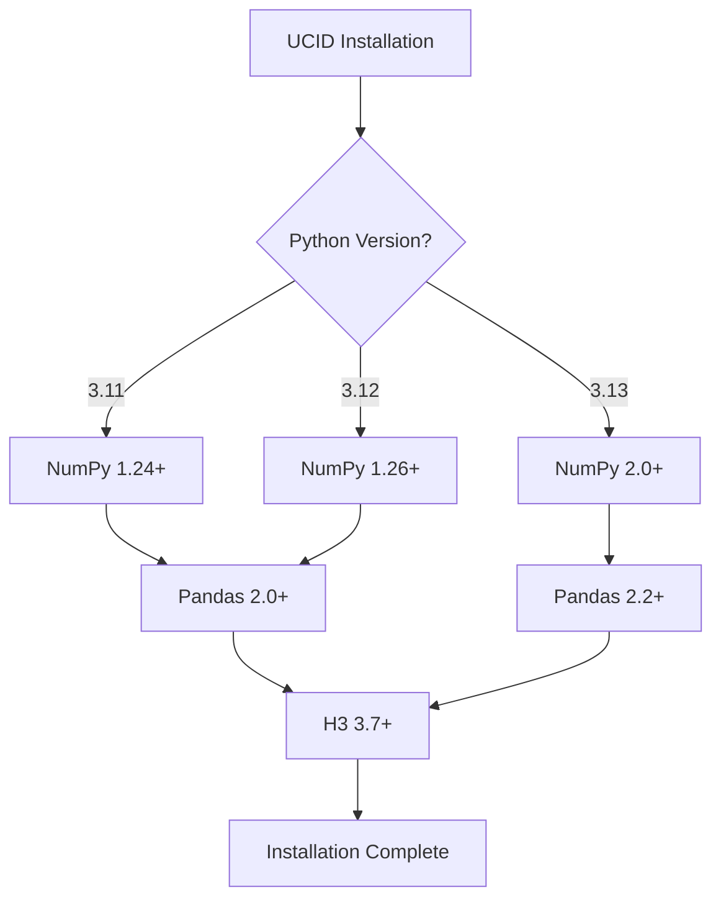

# UCID Installation Guide

This document provides comprehensive installation instructions for the UCID (Urban Context Identifier) library across all supported platforms and environments. The guide covers standard installation, optional dependencies, troubleshooting, and environment-specific configurations.

---

## Table of Contents

1. [System Requirements](#system-requirements)
2. [Installation Methods](#installation-methods)
3. [Dependency Groups](#dependency-groups)
4. [Platform-Specific Instructions](#platform-specific-instructions)
5. [Container Deployment](#container-deployment)
6. [Development Installation](#development-installation)
7. [Virtual Environments](#virtual-environments)
8. [Verification](#verification)
9. [Configuration](#configuration)
10. [Troubleshooting](#troubleshooting)
11. [Upgrading](#upgrading)
12. [Uninstallation](#uninstallation)

---

## System Requirements

### Minimum Requirements

| Component | Requirement |
|-----------|-------------|
| **Python** | 3.11, 3.12, or 3.13 |
| **Operating System** | Linux, macOS 12+, Windows 10+ |
| **Memory** | 4 GB RAM |
| **Disk Space** | 500 MB (base) |
| **Network** | Required for data fetching |

### Recommended Requirements

| Component | Recommendation |
|-----------|----------------|
| **Python** | 3.12 (latest stable) |
| **Operating System** | Ubuntu 22.04 LTS or macOS 14 |
| **Memory** | 8 GB RAM |
| **Disk Space** | 2 GB (with contexts and cache) |
| **Processor** | Multi-core (for parallel processing) |

### Python Version Compatibility

The following table shows Python version support:

| Python Version | Support Status | Notes |
|----------------|----------------|-------|
| 3.10 and below | Not Supported | Use older UCID versions |
| 3.11 | Fully Supported | Minimum version |
| 3.12 | Fully Supported | Recommended |
| 3.13 | Fully Supported | Latest |
| 3.14 | Experimental | Pre-release testing |

### Dependency Resolution

UCID's dependency resolution follows this priority:



---

## Installation Methods

### Method 1: PyPI Installation (Recommended)

The simplest installation method uses pip to install from the Python Package Index:

```bash
pip install UCID
```

This installs UCID with its core dependencies:

| Package | Purpose | Version |
|---------|---------|---------|
| `numpy` | Numerical operations | >=1.24.0, <2.0.0 |
| `pandas` | Data manipulation | >=2.0.0, <3.0.0 |
| `geopandas` | Geospatial data handling | >=0.14.0, <1.0.0 |
| `shapely` | Geometric operations | >=2.0.0, <3.0.0 |
| `pyproj` | Coordinate transformations | >=3.5.0, <4.0.0 |
| `h3` | Hexagonal indexing | >=3.7.0, <4.0.0 |
| `pydantic` | Data validation | >=2.5.0, <3.0.0 |
| `python-dateutil` | Date parsing | >=2.8.0, <3.0.0 |
| `click` | CLI framework | >=8.0.0, <9.0.0 |
| `httpx` | HTTP client | >=0.25.0, <1.0.0 |

### Method 2: Installation with Optional Dependencies

For extended functionality, install with optional dependency groups:

```bash
# All optional dependencies
pip install "UCID[all]"

# Specific dependency groups
pip install "UCID[contexts]"   # Context scoring
pip install "UCID[ml]"         # Machine learning
pip install "UCID[viz]"        # Visualization
pip install "UCID[api]"        # REST API server
pip install "UCID[db]"         # Database integration
pip install "UCID[dask]"       # Distributed computing
pip install "UCID[ray]"        # Ray backend

# Multiple groups
pip install "UCID[contexts,viz,ml]"
```

### Method 3: Installation from Source

For development or access to unreleased features:

```bash
# Clone the repository
git clone https://github.com/ucid-foundation/ucid.git
cd ucid

# Install in development mode
pip install -e ".[dev]"
```

### Method 4: Installation from Git

Install directly from the Git repository:

```bash
# Latest main branch
pip install git+https://github.com/ucid-foundation/ucid.git

# Specific tag or branch
pip install git+https://github.com/ucid-foundation/ucid.git@v1.0.0
pip install git+https://github.com/ucid-foundation/ucid.git@feature-branch
```

### Method 5: Conda Installation

UCID is available through conda-forge:

```bash
conda install -c conda-forge ucid
```

---

## Dependency Groups

### Core Dependencies

The core installation includes essential packages for UCID functionality:

```mermaid
graph LR
    subgraph "Core Dependencies"
        numpy[NumPy]
        pandas[Pandas]
        geopandas[GeoPandas]
        shapely[Shapely]
        pyproj[PyProj]
        h3[H3]
        pydantic[Pydantic]
        dateutil[python-dateutil]
        click[Click]
        httpx[HTTPX]
    end
    
    UCID --> numpy
    UCID --> pandas
    UCID --> geopandas
    UCID --> shapely
    UCID --> pyproj
    UCID --> h3
    UCID --> pydantic
    UCID --> dateutil
    UCID --> click
    UCID --> httpx
```

### Optional Dependency Groups

| Group | Description | Key Packages | Size |
|-------|-------------|--------------|------|
| `contexts` | Context scoring algorithms | OSMnx, NetworkX | ~200 MB |
| `ml` | Machine learning models | scikit-learn, XGBoost | ~150 MB |
| `temporal` | Time series analysis | statsmodels | ~100 MB |
| `viz` | Visualization | matplotlib, plotly, folium | ~100 MB |
| `api` | REST API server | FastAPI, Uvicorn | ~50 MB |
| `db` | Database integration | SQLAlchemy, psycopg2, GeoAlchemy2 | ~50 MB |
| `dask` | Distributed computing | Dask | ~200 MB |
| `ray` | Ray backend | Ray | ~300 MB |
| `raster` | Raster data handling | Rasterio | ~50 MB |
| `dev` | Development tools | pytest, mypy, ruff | ~100 MB |
| `docs` | Documentation building | Sphinx, themes | ~50 MB |
| `security` | Security auditing | pip-audit, bandit | ~20 MB |
| `all` | All optional dependencies | All above | ~1-2 GB |

### Dependency Details by Group

#### Contexts Group

```bash
pip install "UCID[contexts]"
```

| Package | Version | Purpose |
|---------|---------|---------|
| `osmnx` | >=1.8.0 | OpenStreetMap network analysis |
| `networkx` | >=3.1.0 | Graph analysis |

#### Machine Learning Group

```bash
pip install "UCID[ml]"
```

| Package | Version | Purpose |
|---------|---------|---------|
| `scikit-learn` | >=1.3.0 | ML algorithms |
| `xgboost` | >=2.0.0 | Gradient boosting |

#### Visualization Group

```bash
pip install "UCID[viz]"
```

| Package | Version | Purpose |
|---------|---------|---------|
| `matplotlib` | >=3.7.0 | Static plots |
| `plotly` | >=5.17.0 | Interactive plots |
| `folium` | >=0.15.0 | Interactive maps |

---

## Platform-Specific Instructions

### Linux (Ubuntu/Debian)

```bash
# Update system packages
sudo apt-get update
sudo apt-get upgrade

# Install Python
sudo apt-get install python3.12 python3.12-venv python3.12-dev

# Install system dependencies for geospatial packages
sudo apt-get install libgdal-dev libgeos-dev libproj-dev

# Create virtual environment
python3.12 -m venv .venv
source .venv/bin/activate

# Install UCID
pip install "UCID[all]"
```

### Linux (RHEL/CentOS/Fedora)

```bash
# Install Python
sudo dnf install python3.12 python3.12-devel

# Install system dependencies
sudo dnf install gdal-devel geos-devel proj-devel

# Create virtual environment
python3.12 -m venv .venv
source .venv/bin/activate

# Install UCID
pip install "UCID[all]"
```

### macOS

```bash
# Install Homebrew (if not installed)
/bin/bash -c "$(curl -fsSL https://raw.githubusercontent.com/Homebrew/install/HEAD/install.sh)"

# Install Python
brew install python@3.12

# Install system dependencies
brew install gdal geos proj

# Create virtual environment
python3.12 -m venv .venv
source .venv/bin/activate

# Install UCID
pip install "UCID[all]"
```

### Windows

```powershell
# Install Python from python.org or Microsoft Store
# Ensure "Add Python to PATH" is selected during installation

# Create virtual environment
python -m venv .venv
.venv\Scripts\Activate

# Install UCID
pip install "UCID[all]"
```

#### Windows System Dependencies

For the `[contexts]` group on Windows, you may need to install OSMnx separately:

```powershell
# Install OSMnx using conda (recommended for Windows)
conda install -c conda-forge osmnx

# Then install UCID
pip install UCID
```

---

## Container Deployment

### Docker Installation

UCID provides official Docker images:

```bash
# Pull the latest image
docker pull ghcr.io/ucid-foundation/ucid:latest

# Run the API server
docker run -p 8000:8000 ghcr.io/ucid-foundation/ucid:latest

# Run with environment variables
docker run -p 8000:8000 \
    -e UCID_LOG_LEVEL=DEBUG \
    ghcr.io/ucid-foundation/ucid:latest
```

### Docker Compose

For local development with databases:

```yaml
# docker-compose.yml
version: "3.9"

services:
  ucid:
    image: ghcr.io/ucid-foundation/ucid:latest
    ports:
      - "8000:8000"
    environment:
      - UCID_LOG_LEVEL=INFO
    depends_on:
      - db
      
  db:
    image: postgis/postgis:16-3.4
    environment:
      POSTGRES_DB: ucid
      POSTGRES_USER: ucid
      POSTGRES_PASSWORD: secret
    volumes:
      - ucid_data:/var/lib/postgresql/data

volumes:
  ucid_data:
```

```bash
docker-compose up -d
```

### Kubernetes Deployment

```yaml
apiVersion: apps/v1
kind: Deployment
metadata:
  name: ucid-api
spec:
  replicas: 3
  selector:
    matchLabels:
      app: ucid-api
  template:
    metadata:
      labels:
        app: ucid-api
    spec:
      containers:
      - name: ucid
        image: ghcr.io/ucid-foundation/ucid:latest
        ports:
        - containerPort: 8000
        resources:
          requests:
            memory: "512Mi"
            cpu: "250m"
          limits:
            memory: "1Gi"
            cpu: "500m"
```

---

## Development Installation

### Setting Up for Development

```bash
# Clone the repository
git clone https://github.com/ucid-foundation/ucid.git
cd ucid

# Create virtual environment
python -m venv .venv
source .venv/bin/activate  # Linux/macOS
# .venv\Scripts\Activate     # Windows

# Install in development mode with all dependencies
pip install -e ".[dev,contexts,viz,ml]"

# Install pre-commit hooks
pre-commit install

# Verify installation
pytest tests/unit/ -v
```

### IDE Configuration

#### Visual Studio Code

Create `.vscode/settings.json`:

```json
{
    "python.defaultInterpreterPath": "${workspaceFolder}/.venv/bin/python",
    "python.analysis.typeCheckingMode": "strict",
    "editor.formatOnSave": true,
    "[python]": {
        "editor.codeActionsOnSave": {
            "source.fixAll.ruff": true,
            "source.organizeImports.ruff": true
        }
    }
}
```

#### PyCharm

1. Open the project folder
2. Configure interpreter: File > Settings > Project > Python Interpreter
3. Add virtual environment: ${workspaceFolder}/.venv
4. Enable mypy: File > Settings > Python Integrated Tools > Mypy

---

## Virtual Environments

### Using venv

```bash
# Create environment
python -m venv .venv

# Activate
source .venv/bin/activate  # Linux/macOS
.venv\Scripts\Activate      # Windows

# Deactivate
deactivate
```

### Using conda

```bash
# Create environment
conda create -n ucid python=3.12

# Activate
conda activate ucid

# Install
pip install UCID

# Deactivate
conda deactivate
```

### Using poetry

```bash
# Initialize
poetry init

# Add dependency
poetry add UCID

# Install
poetry install

# Activate shell
poetry shell
```

---

## Verification

### Basic Verification

```bash
# Check version
python -c "import ucid; print(ucid.__version__)"

# CLI verification
ucid --version
ucid --help
```

### Feature Verification

```python
# Verify core functionality
from ucid import create_ucid, parse_ucid

# Create a UCID
ucid = create_ucid(
    city="IST",
    lat=41.015,
    lon=28.979,
    timestamp="2026W01T12",
    context="15MIN",
)
print(f"Created: {ucid}")

# Parse the UCID
parsed = parse_ucid(str(ucid))
print(f"Parsed city: {parsed.city}")
print(f"Parsed coordinates: ({parsed.lat}, {parsed.lon})")
```

### Dependency Verification

```python
# Check installed dependencies
import sys
import pkg_resources

required = ['numpy', 'pandas', 'geopandas', 'h3', 'pydantic']
for pkg in required:
    try:
        version = pkg_resources.get_distribution(pkg).version
        print(f"{pkg}: {version}")
    except pkg_resources.DistributionNotFound:
        print(f"{pkg}: NOT FOUND")
```

---

## Configuration

### Environment Variables

| Variable | Description | Default |
|----------|-------------|---------|
| `UCID_LOG_LEVEL` | Logging verbosity | `INFO` |
| `UCID_CACHE_DIR` | Cache directory | `.ucid_cache` |
| `UCID_API_KEY` | API authentication key | None |
| `UCID_DEBUG` | Enable debug mode | `false` |
| `UCID_TIMEOUT` | Request timeout (seconds) | `30` |

### Configuration File

UCID can be configured via `~/.ucid/config.toml`:

```toml
[general]
log_level = "INFO"
cache_dir = "~/.ucid/cache"

[api]
timeout = 30
retries = 3

[contexts]
default_resolution = 9
```

---

## Troubleshooting

### Common Issues

#### Issue: H3 Installation Fails

**Symptom**: Error during `pip install h3`

**Solution**:

```bash
# Linux
sudo apt-get install cmake

# macOS
brew install cmake

# Windows: Install Visual Studio Build Tools
```

#### Issue: GeoPandas Import Error

**Symptom**: `ImportError: libgdal.so.XX: cannot open shared object file`

**Solution**:

```bash
# Linux
sudo apt-get install libgdal-dev

# macOS
brew install gdal
```

#### Issue: OSMnx Installation Fails

**Symptom**: Network analysis features unavailable

**Solution**:

```bash
# Use conda instead of pip
conda install -c conda-forge osmnx
```

### Diagnostic Commands

```bash
# Check Python version
python --version

# Check pip version
pip --version

# List installed packages
pip list | grep -E "ucid|numpy|pandas|geopandas|h3"

# Check package location
python -c "import ucid; print(ucid.__file__)"
```

---

## Upgrading

### Standard Upgrade

```bash
pip install --upgrade UCID
```

### Upgrade with Dependencies

```bash
pip install --upgrade "UCID[all]"
```

### Upgrade to Pre-release

```bash
pip install --upgrade --pre UCID
```

---

## Uninstallation

### Remove UCID

```bash
pip uninstall UCID
```

### Complete Cleanup

```bash
# Remove package
pip uninstall UCID

# Remove cache
rm -rf ~/.ucid

# Remove virtual environment
rm -rf .venv
```

---

Copyright 2026 UCID Foundation. All rights reserved.
