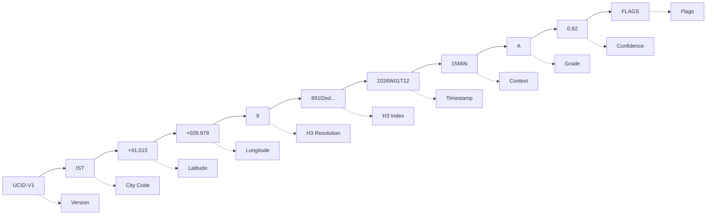
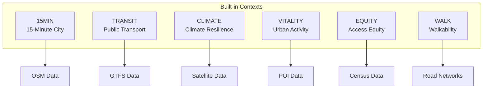

# UCID Quick Start Guide

This document provides a rapid introduction to the UCID (Urban Context Identifier) library, enabling developers and researchers to begin working with standardized urban identifiers within minutes.

---

## Table of Contents

1. [Prerequisites](#prerequisites)
2. [Installation](#installation)
3. [Basic Usage](#basic-usage)
4. [Creating UCIDs](#creating-ucids)
5. [Parsing UCIDs](#parsing-ucids)
6. [Context Scoring](#context-scoring)
7. [Grid Operations](#grid-operations)
8. [Data Export](#data-export)
9. [CLI Usage](#cli-usage)
10. [Common Patterns](#common-patterns)
11. [Next Steps](#next-steps)

---

## Prerequisites

Before starting, ensure your environment meets the following requirements:

| Requirement | Minimum | Recommended |
|-------------|---------|-------------|
| Python | 3.11 | 3.12 |
| pip | 23.0 | Latest |
| Memory | 4 GB | 8 GB |

Verify your Python installation:

```bash
python --version
# Expected: Python 3.11.x or higher
```

---

## Installation

### Standard Installation

Install UCID from PyPI:

```bash
pip install UCID
```

### Installation with Context Scoring

For full context scoring capabilities:

```bash
pip install "UCID[contexts]"
```

### Verification

Verify the installation:

```bash
python -c "import ucid; print(f'UCID version: {ucid.__version__}')"
```

---

## Basic Usage

### Importing the Library

```python
# Import core functions
from ucid import create_ucid, parse_ucid, canonicalize

# Import models
from ucid.core.models import UCID, City

# Import spatial operations
from ucid.spatial import latlng_to_cell, generate_grid_h3

# Import context scoring
from ucid.contexts import FifteenMinuteContext, TransitContext
```

### Understanding the UCID Format

A UCID string follows this structure:

```
UCID-V1:CITY:LAT:LON:H3R:H3:TIME:CTX:GRD:CONF:FLAGS
```

Example:
```
UCID-V1:IST:+41.015:+028.979:9:891f2ed6df7ffff:2026W01T12:15MIN:A:0.92:
```

The components are:



---

## Creating UCIDs

### Basic UCID Creation

Create a UCID with minimal parameters:

```python
from ucid import create_ucid

# Create a UCID for Istanbul
ucid = create_ucid(
    city="IST",
    lat=41.0082,
    lon=28.9784,
    timestamp="2026W01T12",
    context="15MIN",
)

print(ucid)
# Output: UCID-V1:IST:+41.008:+028.978:9:891f2ed6df7ffff:2026W01T12:15MIN:F:0.00:
```

### UCID Creation with Scoring

Create a UCID with quality grades:

```python
from ucid import create_ucid

ucid = create_ucid(
    city="IST",
    lat=41.0082,
    lon=28.9784,
    timestamp="2026W01T12",
    context="15MIN",
    grade="A",
    confidence=0.92,
)

print(f"Grade: {ucid.grade}")
print(f"Confidence: {ucid.confidence}")
```

### UCID Creation with Flags

Add optional flags to the UCID:

```python
from ucid import create_ucid

ucid = create_ucid(
    city="IST",
    lat=41.0082,
    lon=28.9784,
    timestamp="2026W01T12",
    context="15MIN",
    grade="A",
    confidence=0.92,
    flags=["VERIFIED", "OFFICIAL"],
)

print(f"Flags: {ucid.flags}")
```

### Batch UCID Creation

Create multiple UCIDs efficiently:

```python
from ucid import create_ucid

locations = [
    {"lat": 41.0082, "lon": 28.9784, "name": "Istanbul Center"},
    {"lat": 41.0136, "lon": 29.0095, "name": "Kadikoy"},
    {"lat": 41.0422, "lon": 29.0083, "name": "Uskudar"},
]

ucids = []
for loc in locations:
    ucid = create_ucid(
        city="IST",
        lat=loc["lat"],
        lon=loc["lon"],
        timestamp="2026W01T12",
        context="15MIN",
    )
    ucids.append(ucid)
    print(f"{loc['name']}: {ucid}")
```

---

## Parsing UCIDs

### Basic Parsing

Parse a UCID string to extract its components:

```python
from ucid import parse_ucid

ucid_string = "UCID-V1:IST:+41.008:+028.978:9:891f2ed6df7ffff:2026W01T12:15MIN:A:0.92:"

parsed = parse_ucid(ucid_string)

print(f"Version: {parsed.version}")
print(f"City: {parsed.city}")
print(f"Latitude: {parsed.lat}")
print(f"Longitude: {parsed.lon}")
print(f"H3 Resolution: {parsed.h3_res}")
print(f"H3 Index: {parsed.h3_index}")
print(f"Timestamp: {parsed.timestamp}")
print(f"Context: {parsed.context}")
print(f"Grade: {parsed.grade}")
print(f"Confidence: {parsed.confidence}")
```

### Strict vs Permissive Parsing

```python
from ucid import parse_ucid
from ucid.core.errors import UCIDParseError

# Strict parsing (default) - raises error on invalid input
try:
    parsed = parse_ucid("INVALID:STRING", strict=True)
except UCIDParseError as e:
    print(f"Parse error: {e}")

# Permissive parsing - attempts to parse despite errors
parsed = parse_ucid("UCID-V1:IST:+41.0:+28.9:9:...", strict=False)
```

### Accessing UCID Properties

The parsed UCID object provides convenient properties:

```python
from ucid import parse_ucid

ucid_string = "UCID-V1:IST:+41.008:+028.978:9:891f2ed6df7ffff:2026W01T12:15MIN:A:0.92:"
parsed = parse_ucid(ucid_string)

# Geographic coordinates as tuple
coords = (parsed.lat, parsed.lon)
print(f"Coordinates: {coords}")

# Check grade quality
if parsed.grade in ("A+", "A"):
    print("High quality location")

# Parse timestamp components
year = parsed.timestamp[:4]
week = parsed.timestamp[5:7]
hour = parsed.timestamp[8:10]
print(f"Year: {year}, Week: {week}, Hour: {hour}")
```

---

## Context Scoring

### Computing 15-Minute City Score

```python
from ucid.contexts import FifteenMinuteContext

# Initialize the context
context = FifteenMinuteContext()

# Compute score for a location
result = context.compute(
    lat=41.0082,
    lon=28.9784,
    timestamp="2026W01T12",
)

print(f"Score: {result.score:.2f}")
print(f"Grade: {result.grade}")
print(f"Confidence: {result.confidence:.2f}")
print(f"Breakdown: {result.breakdown}")
```

### Computing Transit Score

```python
from ucid.contexts import TransitContext

context = TransitContext()

result = context.compute(
    lat=41.0082,
    lon=28.9784,
    timestamp="2026W01T12",
)

print(f"Transit Score: {result.score:.2f}")
print(f"Transit Grade: {result.grade}")
```

### Available Contexts



| Context | ID | Description | Data Sources |
|---------|------|-------------|--------------|
| 15-Minute City | `15MIN` | Accessibility to amenities | OSM, OSMnx |
| Transit | `TRANSIT` | Public transport quality | GTFS |
| Climate | `CLIMATE` | Green space and heat resilience | Sentinel-2, OSM |
| Vitality | `VITALITY` | Urban activity levels | Mobile data, POIs |
| Equity | `EQUITY` | Equitable access | Census, WorldPop |
| Walkability | `WALK` | Pedestrian infrastructure | OSM roads |

### Creating UCIDs with Context Scoring

```python
from ucid import create_ucid
from ucid.contexts import FifteenMinuteContext

# Compute context score
context = FifteenMinuteContext()
result = context.compute(lat=41.0082, lon=28.9784, timestamp="2026W01T12")

# Create UCID with computed score
ucid = create_ucid(
    city="IST",
    lat=41.0082,
    lon=28.9784,
    timestamp="2026W01T12",
    context="15MIN",
    grade=result.grade,
    confidence=result.confidence,
)

print(ucid)
```

---

## Grid Operations

### Generating H3 Grid

Generate a grid of H3 cells over a bounding box:

```python
from ucid.spatial import generate_grid_h3

# Define bounding box (min_lat, min_lon, max_lat, max_lon)
bbox = (40.9, 28.8, 41.1, 29.1)

# Generate grid at resolution 9
cells = list(generate_grid_h3(
    min_lat=bbox[0],
    min_lon=bbox[1],
    max_lat=bbox[2],
    max_lon=bbox[3],
    resolution=9,
))

print(f"Generated {len(cells)} cells")
for cell in cells[:5]:
    print(f"  {cell}")
```

### Scanning a City

Generate UCIDs for an entire city grid:

```python
from ucid.spatial import scan_city_grid

# Define Istanbul bounding box
ist_bbox = (40.8, 28.5, 41.3, 29.5)

# Scan the grid
ucids = []
for ucid in scan_city_grid(
    city_code="IST",
    bbox=ist_bbox,
    resolution=9,
    timestamp="2026W01T12",
    context="15MIN",
):
    ucids.append(ucid)
    if len(ucids) >= 100:  # Limit for demo
        break

print(f"Generated {len(ucids)} UCIDs")
```

### Working with H3 Cells

```python
from ucid.spatial import latlng_to_cell, cell_to_latlng

# Convert coordinates to H3 cell
h3_index = latlng_to_cell(41.0082, 28.9784, resolution=9)
print(f"H3 Index: {h3_index}")

# Convert H3 cell back to coordinates
lat, lon = cell_to_latlng(h3_index)
print(f"Center: ({lat:.4f}, {lon:.4f})")
```

---

## Data Export

### Export to GeoParquet

GeoParquet is the recommended format for large datasets:

```python
from ucid import create_ucid
from ucid.io import export_geoparquet

# Create sample UCIDs
ucids = []
for i in range(10):
    ucid = create_ucid(
        city="IST",
        lat=41.0 + i * 0.01,
        lon=28.9 + i * 0.01,
        timestamp="2026W01T12",
        context="15MIN",
    )
    ucids.append(ucid)

# Export to GeoParquet
export_geoparquet(ucids, "istanbul_sample.parquet")
print("Exported to istanbul_sample.parquet")
```

### Export to GeoJSON

For web visualization or small datasets:

```python
from ucid import create_ucid
from ucid.io import export_geojson

ucids = [...]  # Your UCID list

export_geojson(ucids, "istanbul_sample.geojson")
print("Exported to istanbul_sample.geojson")
```

### Reading GeoParquet

```python
from ucid.io import read_geoparquet

# Read the exported data
gdf = read_geoparquet("istanbul_sample.parquet")
print(gdf.head())
```

---

## CLI Usage

### Parse Command

```bash
ucid parse "UCID-V1:IST:+41.008:+028.978:9:891f2ed6df7ffff:2026W01T12:15MIN:A:0.92:"
```

Output:
```
Version:    UCID-V1
City:       IST
Latitude:   41.008
Longitude:  28.978
H3 Res:     9
H3 Index:   891f2ed6df7ffff
Timestamp:  2026W01T12
Context:    15MIN
Grade:      A
Confidence: 0.92
Flags:      
```

### Create Command

```bash
ucid create --city IST --lat 41.008 --lon 28.978 --timestamp 2026W01T12 --context 15MIN
```

### Canonicalize Command

```bash
ucid canonicalize "ucid-v1:ist:+41:+28:9:..."
```

---

## Common Patterns

### Pattern 1: Batch Processing

```python
from ucid import create_ucid
from ucid.contexts import FifteenMinuteContext

def process_locations(locations, city_code, timestamp):
    """Process multiple locations with context scoring."""
    context = FifteenMinuteContext()
    results = []
    
    for loc in locations:
        # Compute score
        score_result = context.compute(
            lat=loc["lat"],
            lon=loc["lon"],
            timestamp=timestamp,
        )
        
        # Create UCID
        ucid = create_ucid(
            city=city_code,
            lat=loc["lat"],
            lon=loc["lon"],
            timestamp=timestamp,
            context="15MIN",
            grade=score_result.grade,
            confidence=score_result.confidence,
        )
        
        results.append({
            "name": loc.get("name", ""),
            "ucid": str(ucid),
            "score": score_result.score,
            "grade": score_result.grade,
        })
    
    return results
```

### Pattern 2: Time Series Analysis

```python
from ucid import create_ucid

def create_temporal_series(lat, lon, city, context, weeks):
    """Create UCIDs for multiple time periods."""
    ucids = []
    
    for week in range(1, weeks + 1):
        timestamp = f"2026W{week:02d}T12"
        ucid = create_ucid(
            city=city,
            lat=lat,
            lon=lon,
            timestamp=timestamp,
            context=context,
        )
        ucids.append(ucid)
    
    return ucids

# Generate 12 weeks of data
series = create_temporal_series(41.008, 28.978, "IST", "15MIN", 12)
```

### Pattern 3: Spatial Comparison

```python
from ucid import create_ucid, parse_ucid

def compare_locations(ucid1_str, ucid2_str):
    """Compare two locations by their UCIDs."""
    u1 = parse_ucid(ucid1_str)
    u2 = parse_ucid(ucid2_str)
    
    comparison = {
        "same_city": u1.city == u2.city,
        "same_context": u1.context == u2.context,
        "grade_diff": ord(u2.grade[0]) - ord(u1.grade[0]),
        "confidence_diff": u2.confidence - u1.confidence,
    }
    
    return comparison
```

---

## Next Steps

After completing this quick start guide, explore these topics:

| Topic | Document | Description |
|-------|----------|-------------|
| UCID Standard | [03_ucid_standard.md](03_ucid_standard.md) | Complete format specification |
| H3 Indexing | [05_h3_geohash_s2_interop.md](05_h3_geohash_s2_interop.md) | Spatial indexing details |
| Temporal Model | [06_temporal_model.md](06_temporal_model.md) | Time handling |
| Context Plugins | [08_context_plugin_architecture.md](08_context_plugin_architecture.md) | Custom contexts |
| Data Integration | [15_data_integration_osm.md](15_data_integration_osm.md) | OpenStreetMap |
| API Server | [21_api_service_fastapi.md](21_api_service_fastapi.md) | REST API |

---

## Reference Card

### Quick Reference

| Operation | Code |
|-----------|------|
| Create UCID | `create_ucid(city, lat, lon, timestamp, context)` |
| Parse UCID | `parse_ucid(ucid_string)` |
| H3 Index | `latlng_to_cell(lat, lon, resolution)` |
| Grid Generate | `generate_grid_h3(min_lat, min_lon, max_lat, max_lon, res)` |
| Export Parquet | `export_geoparquet(ucids, path)` |
| Export GeoJSON | `export_geojson(ucids, path)` |

### Grade Scale

| Grade | Score Range | Quality |
|-------|-------------|---------|
| A+ | 95-100 | Exceptional |
| A | 85-94 | Excellent |
| B | 70-84 | Good |
| C | 55-69 | Moderate |
| D | 40-54 | Below Average |
| F | 0-39 | Poor |

---

Copyright 2026 UCID Foundation. All rights reserved.
