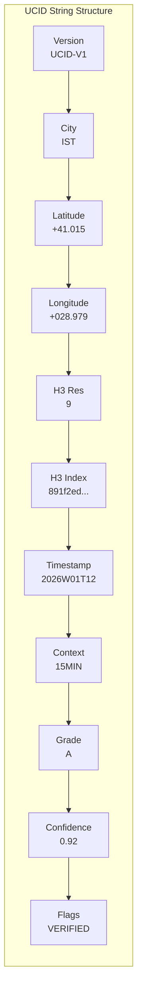
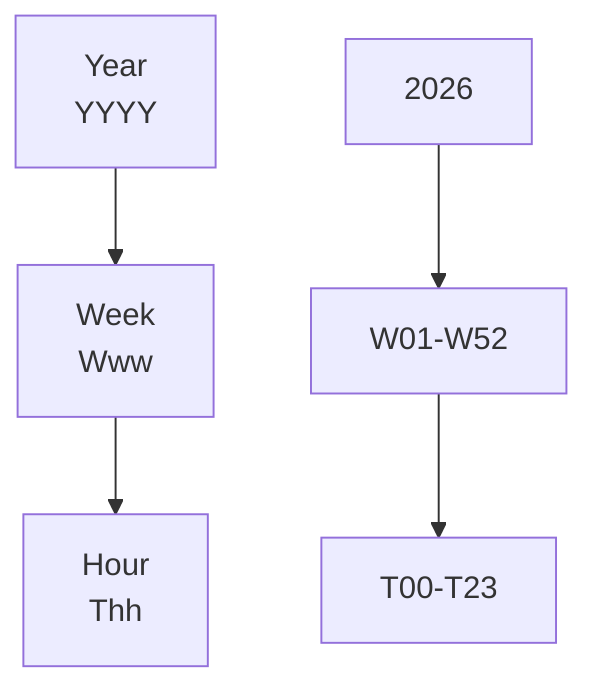
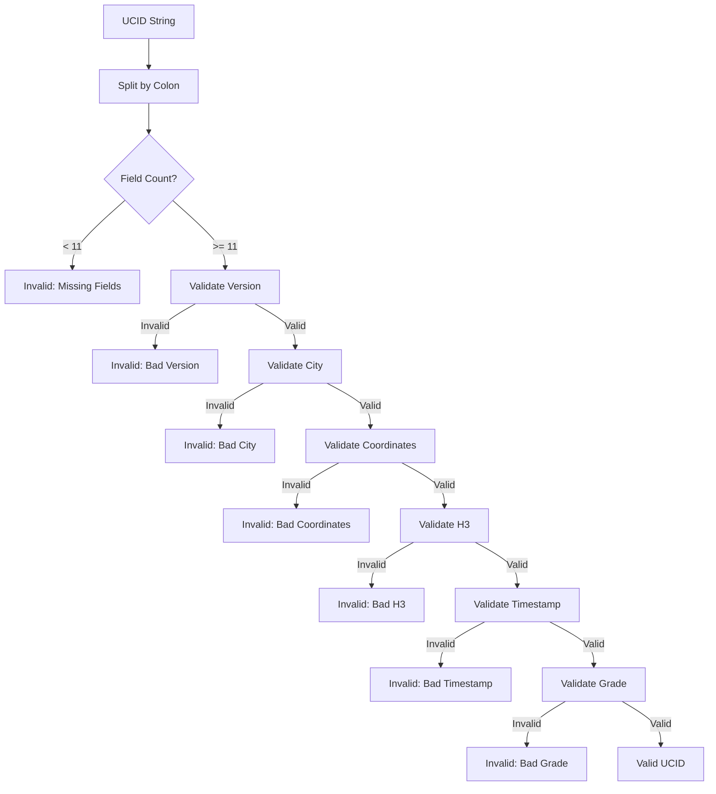

# UCID Standard Specification

This document provides the complete technical specification for the UCID (Urban Context Identifier) format, including syntax, semantics, validation rules, and canonical representations.

---

## Table of Contents

1. [Overview](#overview)
2. [Format Specification](#format-specification)
3. [Field Definitions](#field-definitions)
4. [Validation Rules](#validation-rules)
5. [Canonical Form](#canonical-form)
6. [Encoding and Serialization](#encoding-and-serialization)
7. [Comparison and Ordering](#comparison-and-ordering)
8. [Version History](#version-history)
9. [Conformance](#conformance)
10. [Examples](#examples)

---

## Overview

### Purpose

The Urban Context Identifier (UCID) is a standardized string format for uniquely identifying locations within urban environments across space, time, and analytical context. UCID serves as a universal join key for heterogeneous urban datasets.

### Design Goals

| Goal | Rationale |
|------|-----------|
| **Uniqueness** | Each valid spatial-temporal-contextual tuple maps to exactly one UCID |
| **Readability** | Human-readable format facilitates debugging and communication |
| **Parsability** | Machine-parseable format enables programmatic processing |
| **Sortability** | Lexicographic ordering provides meaningful spatial proximity |
| **Extensibility** | Version field and flags enable future enhancements |

### Mathematical Foundation

A UCID can be formally defined as a tuple:

$$UCID = (V, C, \lambda, \phi, r, h, t, x, g, c, F)$$

Where the domain constraints are:

$$V \in \{UCID\text{-}V1\}$$
$$C \in \Sigma^3, \Sigma = \{A, B, ..., Z\}$$
$$\lambda \in [-90.0, 90.0]$$
$$\phi \in [-180.0, 180.0]$$
$$r \in \{0, 1, 2, ..., 15\}$$
$$h \in \mathbb{H}_{r}$$ (H3 index space at resolution $r$)
$$t \in \mathcal{T}$$ (ISO week timestamp space)
$$x \in \Sigma^+$$ (context identifier alphabet)
$$g \in \{A+, A, B, C, D, F\}$$
$$c \in [0.0, 1.0]$$
$$F \subseteq \Sigma^*$$ (optional flag set)

---

## Format Specification

### Syntax

The UCID string format follows this ABNF grammar:

```abnf
ucid           = version ":" city ":" latitude ":" longitude ":" 
                 h3-resolution ":" h3-index ":" timestamp ":" 
                 context ":" grade ":" confidence ":" flags

version        = "UCID-V" 1*DIGIT
city           = 3ALPHA
latitude       = sign decimal-degrees
longitude      = sign decimal-degrees
sign           = "+" / "-"
decimal-degrees = 1*2DIGIT "." 1*3DIGIT
h3-resolution  = 1*2DIGIT
h3-index       = 15HEXDIG
timestamp      = year "W" week "T" hour
year           = 4DIGIT
week           = 2DIGIT
hour           = 2DIGIT
context        = 1*ALPHANUM
grade          = ("A+" / "A" / "B" / "C" / "D" / "F")
confidence     = "0" "." 1*2DIGIT / "1" "." "00"
flags          = *( flag-value ";" )
flag-value     = 1*ALPHA

ALPHA          = %x41-5A / %x61-7A
DIGIT          = %x30-39
HEXDIG         = DIGIT / %x41-46 / %x61-66
ALPHANUM       = ALPHA / DIGIT
```

### String Structure



### Field Indices

| Index | Field | Size | Required |
|-------|-------|------|----------|
| 0 | Version | 7 chars | Yes |
| 1 | City | 3 chars | Yes |
| 2 | Latitude | 5-8 chars | Yes |
| 3 | Longitude | 6-9 chars | Yes |
| 4 | H3 Resolution | 1-2 chars | Yes |
| 5 | H3 Index | 15 chars | Yes |
| 6 | Timestamp | 10 chars | Yes |
| 7 | Context | 1-16 chars | Yes |
| 8 | Grade | 1-2 chars | Yes |
| 9 | Confidence | 4 chars | Yes |
| 10 | Flags | 0+ chars | No |

---

## Field Definitions

### Field 0: Version

The version identifier specifies the UCID protocol version.

| Property | Value |
|----------|-------|
| Format | `UCID-V` followed by version number |
| Current Version | `UCID-V1` |
| Case | Uppercase required |

Version history:

| Version | Date | Changes |
|---------|------|---------|
| V1 | 2026-01-01 | Initial release |

### Field 1: City Code

The city code identifies the metropolitan area using UN/LOCODE format.

| Property | Specification |
|----------|---------------|
| Format | 3 uppercase ASCII letters |
| Standard | UN/LOCODE (subset) |
| Validation | Must exist in city registry |

Common city codes:

| Code | City | Country |
|------|------|---------|
| IST | Istanbul | Turkey |
| NYC | New York | United States |
| LON | London | United Kingdom |
| HEL | Helsinki | Finland |
| SYD | Sydney | Australia |

### Field 2: Latitude

Geographic latitude in signed decimal degrees.

| Property | Specification |
|----------|---------------|
| Range | $[-90.000, +90.000]$ |
| Precision | 3 decimal places |
| Sign | Explicit `+` or `-` required |
| Format | `[+-]DD.DDD` |

The latitude precision corresponds to approximately:

$$\Delta d \approx 111.32 \text{ m} \times 10^{-3} = 111 \text{ m}$$

### Field 3: Longitude

Geographic longitude in signed decimal degrees.

| Property | Specification |
|----------|---------------|
| Range | $[-180.000, +180.000]$ |
| Precision | 3 decimal places |
| Sign | Explicit `+` or `-` required |
| Format | `[+-]DDD.DDD` |

### Field 4: H3 Resolution

The H3 hexagonal grid resolution level.

| Property | Specification |
|----------|---------------|
| Range | $[0, 15]$ |
| Default | 9 |
| Type | Integer |

Resolution characteristics:

| Resolution | Average Area | Edge Length |
|------------|--------------|-------------|
| 0 | 4,357,449 km^2 | 1,108 km |
| 4 | 1,770 km^2 | 22.6 km |
| 8 | 0.737 km^2 | 461 m |
| 9 | 0.105 km^2 | 174 m |
| 10 | 0.015 km^2 | 65 m |
| 15 | 0.0009 m^2 | 0.5 m |

The relationship between resolution and cell count is:

$$N_{cells}(r) = 122 \times 7^r - 2$$

### Field 5: H3 Index

The H3 hexagonal cell identifier.

| Property | Specification |
|----------|---------------|
| Format | 15 lowercase hexadecimal characters |
| Encoding | H3 v3/v4 compatible |
| Derivation | Computed from lat/lon at specified resolution |

### Field 6: Timestamp

Temporal identifier in ISO week format with hourly precision.

| Property | Specification |
|----------|---------------|
| Format | `YYYYWwwThh` |
| Year | 4-digit year |
| Week | 2-digit ISO week (01-53) |
| Hour | 2-digit hour (00-23) |

The temporal granularity hierarchy:



ISO week calculation:

The ISO week number $W$ for a given date can be calculated using:

$$W = \lfloor \frac{DOY - DW + 10}{7} \rfloor$$

Where:
- $DOY$ = Day of Year
- $DW$ = Day of Week (Monday = 1)

### Field 7: Context

The analytical context identifier.

| Property | Specification |
|----------|---------------|
| Format | 1-16 uppercase alphanumeric characters |
| Validation | Must be registered context |

Built-in contexts:

| Context ID | Full Name | Category |
|------------|-----------|----------|
| 15MIN | 15-Minute City | Accessibility |
| TRANSIT | Public Transit | Transportation |
| CLIMATE | Climate Resilience | Environment |
| VITALITY | Urban Vitality | Activity |
| EQUITY | Access Equity | Social |
| WALK | Walkability | Mobility |

### Field 8: Grade

Quality grade on the standard grading scale.

| Property | Specification |
|----------|---------------|
| Values | A+, A, B, C, D, F |
| Ordering | A+ > A > B > C > D > F |

Grade calculation from score:

$$g(s) = \begin{cases}
A+ & \text{if } s \geq 95 \\
A & \text{if } 85 \leq s < 95 \\
B & \text{if } 70 \leq s < 85 \\
C & \text{if } 55 \leq s < 70 \\
D & \text{if } 40 \leq s < 55 \\
F & \text{if } s < 40
\end{cases}$$

### Field 9: Confidence

Confidence score for the grade assignment.

| Property | Specification |
|----------|---------------|
| Range | $[0.00, 1.00]$ |
| Precision | 2 decimal places |
| Interpretation | Probability of grade accuracy |

### Field 10: Flags

Optional semicolon-separated flags.

| Property | Specification |
|----------|---------------|
| Format | Uppercase letters, semicolon-separated |
| Cardinality | 0 or more |

Reserved flags:

| Flag | Meaning |
|------|---------|
| VERIFIED | Manually verified |
| OFFICIAL | Official data source |
| ESTIMATED | Score is estimated |
| OUTDATED | Data may be stale |

---

## Validation Rules

### Structural Validation



### Validation Functions

| Field | Validation Rule |
|-------|-----------------|
| Version | Exact match: `UCID-V1` |
| City | 3 uppercase letters AND in registry |
| Latitude | Float AND $\lvert\lambda\rvert \leq 90$ |
| Longitude | Float AND $\lvert\phi\rvert \leq 180$ |
| H3 Resolution | Integer AND $0 \leq r \leq 15$ |
| H3 Index | 15 hex chars AND valid H3 cell |
| Timestamp | Matches `\d{4}W[0-5]\d T[0-2]\d$` |
| Context | Non-empty alphanumeric |
| Grade | One of: A+, A, B, C, D, F |
| Confidence | Float AND $0 \leq c \leq 1$ |

### Consistency Validation

Beyond structural validation, UCIDs must satisfy consistency constraints:

1. **H3 Consistency**: The H3 index must correspond to the stated coordinates at the stated resolution
2. **Timestamp Validity**: Week numbers must be valid for the specified year
3. **City-Coordinate Consistency**: Coordinates should fall within the city's metropolitan area

---

## Canonical Form

### Canonicalization Rules

UCIDs are canonicalized according to these rules:

| Field | Canonical Form |
|-------|----------------|
| Version | Uppercase: `UCID-V1` |
| City | Uppercase: `IST` |
| Latitude | Sign + 2 digits + `.` + 3 digits: `+41.015` |
| Longitude | Sign + 3 digits + `.` + 3 digits: `+028.979` |
| H3 Resolution | No leading zeros: `9` |
| H3 Index | Lowercase: `891f2ed6df7ffff` |
| Timestamp | Standard format: `2026W01T12` |
| Context | Uppercase: `15MIN` |
| Grade | Standard: `A` or `A+` |
| Confidence | 2 decimal places: `0.92` |
| Flags | Uppercase, sorted, semicolon-terminated |

### Canonicalization Example

Input:
```
ucid-v1:ist:+41.0150:+28.979:09:891F2ED6DF7FFFF:2026W1T12:15min:a:0.9200:verified;official
```

Canonical output:
```
UCID-V1:IST:+41.015:+028.979:9:891f2ed6df7ffff:2026W01T12:15MIN:A:0.92:OFFICIAL;VERIFIED;
```

---

## Encoding and Serialization

### String Encoding

UCIDs are encoded as UTF-8 strings. All characters are within the ASCII subset.

### JSON Representation

```json
{
  "ucid": "UCID-V1:IST:+41.015:+028.979:9:891f2ed6df7ffff:2026W01T12:15MIN:A:0.92:",
  "version": "V1",
  "city": "IST",
  "lat": 41.015,
  "lon": 28.979,
  "h3_resolution": 9,
  "h3_index": "891f2ed6df7ffff",
  "timestamp": "2026W01T12",
  "context": "15MIN",
  "grade": "A",
  "confidence": 0.92,
  "flags": []
}
```

### Binary Encoding

For compact storage, UCIDs can be encoded in binary format:

| Field | Bytes | Encoding |
|-------|-------|----------|
| Version | 1 | Uint8 (1 = V1) |
| City | 3 | ASCII |
| Latitude | 4 | Float32 |
| Longitude | 4 | Float32 |
| H3 Index | 8 | Uint64 |
| Timestamp | 4 | Uint32 (Unix week + hour) |
| Context | 2 | Uint16 (context ID) |
| Grade | 1 | Uint8 (0 = F, 5 = A+) |
| Confidence | 2 | Uint16 (0-10000) |
| Flags | 2 | Bitfield |

Total: 31 bytes (vs ~80 bytes for string)

---

## Comparison and Ordering

### Equality

Two UCIDs are equal if all fields match after canonicalization:

$$UCID_1 = UCID_2 \iff \text{canonical}(UCID_1) = \text{canonical}(UCID_2)$$

### Ordering

UCIDs are ordered lexicographically by their canonical string representation:

$$UCID_1 < UCID_2 \iff \text{canonical}(UCID_1) <_{lex} \text{canonical}(UCID_2)$$

This ordering groups UCIDs by:
1. City (primary)
2. Location (secondary, via coordinates)
3. Time (tertiary)
4. Context (quaternary)

---

## Version History

### Version 1 (Current)

Released: 2026-01-01

Features:
- 11-field colon-separated format
- H3 spatial indexing
- ISO week temporal keys
- Pluggable context system
- Letter grades with confidence scores

### Future Versions

Reserved version numbers:
- V2: Extended precision coordinates
- V3: Alternative spatial indices (S2 native)
- V4: Nested hierarchy support

---

## Conformance

### Conformance Levels

| Level | Requirements |
|-------|--------------|
| **Minimal** | Parse and serialize valid UCIDs |
| **Standard** | Minimal + validation + canonicalization |
| **Extended** | Standard + context scoring + H3 operations |
| **Full** | Extended + all optional features |

### Test Vectors

Valid UCIDs:

```
UCID-V1:IST:+41.015:+028.979:9:891f2ed6df7ffff:2026W01T12:15MIN:A:0.92:
UCID-V1:NYC:+40.712:−074.006:9:892a1072d63ffff:2026W01T12:TRANSIT:B:0.85:
UCID-V1:LON:+51.507:−000.127:9:8d1fb46f93bffff:2026W52T23:CLIMATE:A+:0.98:VERIFIED;
```

Invalid UCIDs:

```
UCID-V2:IST:...                    # Invalid version
UCID-V1:istanbul:...               # Invalid city format
UCID-V1:IST:41.015:28.979:...      # Missing coordinate signs
UCID-V1:IST:+41.015:+28.979:16:... # Invalid resolution
```

---

## Examples

### Complete Example

```
UCID-V1:IST:+41.015:+028.979:9:891f2ed6df7ffff:2026W01T12:15MIN:A:0.92:VERIFIED;OFFICIAL;
```

| Field | Value | Interpretation |
|-------|-------|----------------|
| Version | UCID-V1 | Protocol version 1 |
| City | IST | Istanbul, Turkey |
| Latitude | +41.015 | 41.015 degrees North |
| Longitude | +028.979 | 28.979 degrees East |
| H3 Resolution | 9 | ~174m hexagon edge |
| H3 Index | 891f2ed6df7ffff | Unique cell ID |
| Timestamp | 2026W01T12 | Week 1 of 2026, noon |
| Context | 15MIN | 15-Minute City score |
| Grade | A | Excellent (85-94) |
| Confidence | 0.92 | 92% confidence |
| Flags | VERIFIED;OFFICIAL | Verified official data |

---

Copyright 2026 UCID Foundation. All rights reserved.
