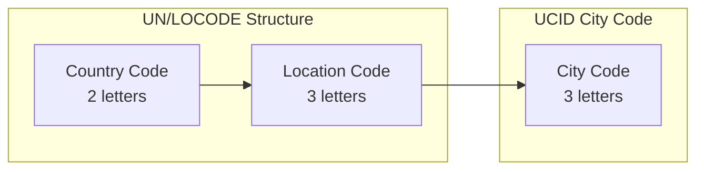
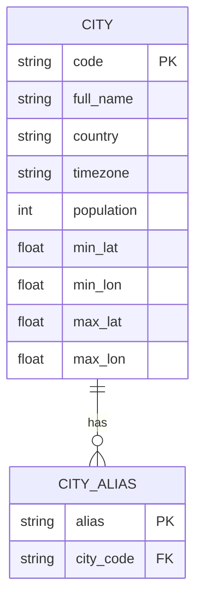
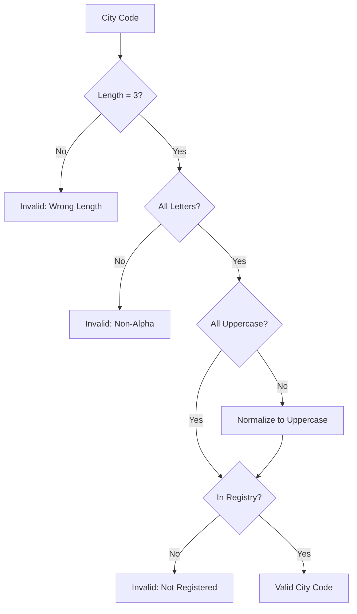
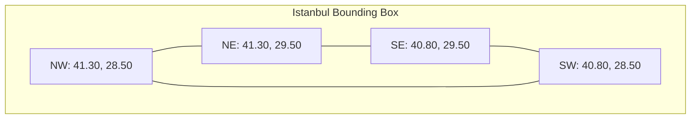

# City Codes and UN/LOCODE Integration

This document describes the city code system used in UCID, its relationship to the UN/LOCODE standard, and the city registry management procedures.

---

## Table of Contents

1. [Overview](#overview)
2. [UN/LOCODE Standard](#unlocode-standard)
3. [UCID City Registry](#ucid-city-registry)
4. [City Code Validation](#city-code-validation)
5. [Metropolitan Area Boundaries](#metropolitan-area-boundaries)
6. [Adding New Cities](#adding-new-cities)
7. [City Code Conflicts](#city-code-conflicts)
8. [Timezone Handling](#timezone-handling)
9. [Population Data](#population-data)
10. [API Reference](#api-reference)

---

## Overview

UCID uses a three-letter city code system derived from the United Nations Code for Trade and Transport Locations (UN/LOCODE). This standardized approach ensures global consistency and interoperability with existing transportation and logistics systems.

### Design Rationale

| Criterion | Requirement | Solution |
|-----------|-------------|----------|
| **Uniqueness** | No two cities share a code | UN/LOCODE assignment |
| **Brevity** | Compact representation | 3-character limit |
| **Readability** | Human-memorable codes | Mnemonic derivation |
| **Stability** | Codes do not change | Registry governance |
| **Extensibility** | Support for new cities | Registration process |

### Code Structure



The UCID city code corresponds to the location portion of the UN/LOCODE, omitting the country prefix for brevity while maintaining uniqueness through registry management.

---

## UN/LOCODE Standard

### Background

The United Nations Code for Trade and Transport Locations (UN/LOCODE) is a geographic coding scheme developed and maintained by the United Nations Economic Commission for Europe (UNECE). It provides codes for over 100,000 locations worldwide.

### Format

A complete UN/LOCODE consists of:

$$LOCODE = CC + LLL$$

Where:
- $CC$ = ISO 3166-1 alpha-2 country code
- $LLL$ = 3-character location identifier

Examples:

| UN/LOCODE | City | Country |
|-----------|------|---------|
| TR IST | Istanbul | Turkey |
| US NYC | New York | United States |
| GB LON | London | United Kingdom |
| FI HEL | Helsinki | Finland |
| AU SYD | Sydney | Australia |
| JP TYO | Tokyo | Japan |
| FR PAR | Paris | France |
| DE BER | Berlin | Germany |

### Function Codes

UN/LOCODE includes function codes indicating location capabilities:

| Code | Function |
|------|----------|
| 1 | Port |
| 2 | Rail terminal |
| 3 | Road terminal |
| 4 | Airport |
| 5 | Postal exchange |
| 6 | Multimodal |
| B | Fixed transport |
| 0 | Function not known |

### UCID Adaptation

UCID uses only the location component (LLL) as the city code, with the following adaptations:

1. **Major cities only**: UCID focuses on metropolitan areas, not all UN/LOCODE locations
2. **Unique codes**: Where location codes could conflict, UCID maintains a curated registry
3. **Timezone enrichment**: UCID adds timezone information to each city

---

## UCID City Registry

### Registry Structure

The UCID city registry is a curated database of metropolitan areas:



### Default Cities

UCID ships with a pre-configured set of major world cities:

| Code | City | Country | Timezone | Population |
|------|------|---------|----------|------------|
| IST | Istanbul | TR | Europe/Istanbul | 15,462,452 |
| NYC | New York City | US | America/New_York | 8,804,190 |
| LON | London | GB | Europe/London | 8,982,000 |
| HEL | Helsinki | FI | Europe/Helsinki | 631,695 |
| PDX | Portland | US | America/Los_Angeles | 652,503 |
| BOS | Boston | US | America/New_York | 675,647 |
| SYD | Sydney | AU | Australia/Sydney | 5,312,163 |
| TYO | Tokyo | JP | Asia/Tokyo | 13,960,000 |
| PAR | Paris | FR | Europe/Paris | 2,161,000 |
| BER | Berlin | DE | Europe/Berlin | 3,645,000 |
| SIN | Singapore | SG | Asia/Singapore | 5,454,000 |
| DXB | Dubai | AE | Asia/Dubai | 3,331,000 |
| TST | Test City | XX | UTC | 0 |
| DEV | Development | XX | UTC | 0 |

### Registry API

```python
from ucid.core.registry import CityRegistry

# Get singleton instance
registry = CityRegistry()

# Get city by code
city = registry.get("IST")
print(f"City: {city.full_name}, TZ: {city.timezone}")

# Check if city exists
if registry.exists("NYC"):
    print("NYC is registered")

# List all cities
for city in registry.list_all():
    print(f"{city.code}: {city.full_name}")

# Register custom city
from ucid.core.models import City

custom_city = City(
    code="XYZ",
    full_name="Custom City",
    country="XX",
    timezone="UTC",
    population=100000,
)
registry.register(custom_city)
```

---

## City Code Validation

### Validation Rules

City codes must satisfy the following constraints:

1. **Length**: Exactly 3 characters
2. **Characters**: Uppercase ASCII letters only (A-Z)
3. **Registry**: Must exist in the city registry
4. **Reserved**: Certain codes are reserved for testing

Validation function:

$$\text{valid}(C) = \begin{cases}
\text{true} & \text{if } |C| = 3 \land C \in [A-Z]^3 \land C \in \mathcal{R} \\
\text{false} & \text{otherwise}
\end{cases}$$

Where $\mathcal{R}$ is the set of registered city codes.

### Validation Process



### Implementation

```python
from ucid.utils.validation import validate_city_code

# Validate city code
is_valid, error_msg = validate_city_code("IST")
if is_valid:
    print("Valid city code")
else:
    print(f"Invalid: {error_msg}")

# Examples
validate_city_code("IST")    # (True, "")
validate_city_code("ist")    # (False, "City code must be 3 uppercase letters")
validate_city_code("ISTANBUL")  # (False, "City code must be 3 characters, got 8")
validate_city_code("123")    # (False, "City code must be 3 uppercase letters")
```

---

## Metropolitan Area Boundaries

### Bounding Box Definition

Each registered city includes a bounding box defining its metropolitan area:

$$\text{BBox} = (\lambda_{min}, \phi_{min}, \lambda_{max}, \phi_{max})$$

Where:
- $\lambda_{min}, \lambda_{max}$ = Latitude bounds
- $\phi_{min}, \phi_{max}$ = Longitude bounds

### Example Bounding Boxes

| City | Min Lat | Min Lon | Max Lat | Max Lon |
|------|---------|---------|---------|---------|
| IST | 40.80 | 28.50 | 41.30 | 29.50 |
| NYC | 40.49 | -74.26 | 40.92 | -73.70 |
| LON | 51.28 | -0.51 | 51.69 | 0.33 |
| HEL | 60.10 | 24.75 | 60.35 | 25.25 |

### Boundary Validation

Coordinates can be validated against city boundaries:

```python
def is_within_city(lat: float, lon: float, city_code: str) -> bool:
    """Check if coordinates fall within city boundaries."""
    city = registry.get(city_code)
    return (
        city.min_lat <= lat <= city.max_lat and
        city.min_lon <= lon <= city.max_lon
    )
```

### Boundary Visualization



---

## Adding New Cities

### Registration Process


### Requirements for New Cities

| Requirement | Description |
|-------------|-------------|
| **Population** | Minimum 100,000 inhabitants |
| **UN/LOCODE** | Must have assigned UN/LOCODE |
| **Unique Code** | Code must not conflict with existing |
| **Data Availability** | OSM and transit data available |
| **Timezone** | Valid IANA timezone identifier |

### Registration Request Format

```yaml
# City Registration Request
city:
  code: "XYZ"
  full_name: "Example City"
  country: "XX"
  timezone: "Europe/Example"
  population: 500000
  
boundaries:
  min_lat: 40.0
  min_lon: 20.0
  max_lat: 41.0
  max_lon: 21.0
  
data_sources:
  osm: true
  gtfs: "https://example.com/gtfs.zip"
  
justification: |
  Example City is a major metropolitan area with
  significant urban planning research interest.
```

### Programmatic Registration

```python
from ucid.core.registry import CityRegistry
from ucid.core.models import City

registry = CityRegistry()

new_city = City(
    code="XYZ",
    full_name="Example City",
    country="XX",
    timezone="Europe/Example",
    population=500000,
)

registry.register(new_city)
```

---

## City Code Conflicts

### Conflict Resolution

When multiple cities could share the same code, UCID applies these resolution rules:

1. **Priority to larger city**: Higher population takes precedence
2. **Historical usage**: Established codes are preserved
3. **Alternative derivation**: Alternative mnemonic assigned

### Known Conflicts

| Code | Conflict | Resolution |
|------|----------|------------|
| SAN | San Antonio, Santiago, San Diego | SAN = San Diego, SAT = San Antonio, SCL = Santiago |
| VIE | Vienna, Vientiane | VIE = Vienna, VTE = Vientiane |

### Alias Support

Cities may have multiple recognized codes (aliases):

```python
# Both codes refer to the same city
registry.get("NYC")  # New York City
registry.get("JFK")  # Alias for NYC (airport code)
```

---

## Timezone Handling

### IANA Timezone Database

UCID uses IANA timezone identifiers (tzdata):

| City | Timezone | UTC Offset (Winter) | UTC Offset (Summer) |
|------|----------|---------------------|---------------------|
| IST | Europe/Istanbul | +03:00 | +03:00 |
| NYC | America/New_York | -05:00 | -04:00 |
| LON | Europe/London | +00:00 | +01:00 |
| TYO | Asia/Tokyo | +09:00 | +09:00 |

### Timezone Operations

```python
from datetime import datetime
from zoneinfo import ZoneInfo

city = registry.get("IST")
tz = ZoneInfo(city.timezone)

# Current time in city
local_time = datetime.now(tz)
print(f"Time in {city.full_name}: {local_time}")

# Convert UTC to local
utc_time = datetime.utcnow()
local_time = utc_time.replace(tzinfo=ZoneInfo("UTC")).astimezone(tz)
```

---

## Population Data

### Data Sources

City population data is sourced from:

1. **WorldPop**: Gridded population estimates
2. **GHS-POP**: Global Human Settlement Population
3. **National Census**: Official census data

### Population Density Calculation

Population density within a city:

$$\rho = \frac{P}{A}$$

Where:
- $\rho$ = Population density (people/km^2)
- $P$ = Total population
- $A$ = Metropolitan area (km^2)

Example densities:

| City | Population | Area (km^2) | Density |
|------|------------|-------------|---------|
| IST | 15,462,452 | 5,343 | 2,893 |
| NYC | 8,804,190 | 783 | 11,244 |
| LON | 8,982,000 | 1,572 | 5,714 |

---

## API Reference

### CityRegistry Class

```python
class CityRegistry:
    """Thread-safe singleton registry for city definitions."""
    
    def get(self, code: str) -> City:
        """Get city by code. Raises UCIDRegistryError if not found."""
        
    def exists(self, code: str) -> bool:
        """Check if city code exists."""
        
    def register(self, city: City) -> None:
        """Register a new city."""
        
    def list_all(self) -> list[City]:
        """List all registered cities."""
        
    def count(self) -> int:
        """Return number of registered cities."""
```

### City Model

```python
@dataclass
class City:
    """City definition model."""
    
    code: str           # 3-letter city code
    full_name: str      # Full city name
    country: str        # ISO 3166-1 alpha-2 country code
    timezone: str       # IANA timezone identifier
    population: int     # Metropolitan population (optional)
```

---

Copyright 2026 UCID Foundation. All rights reserved.
