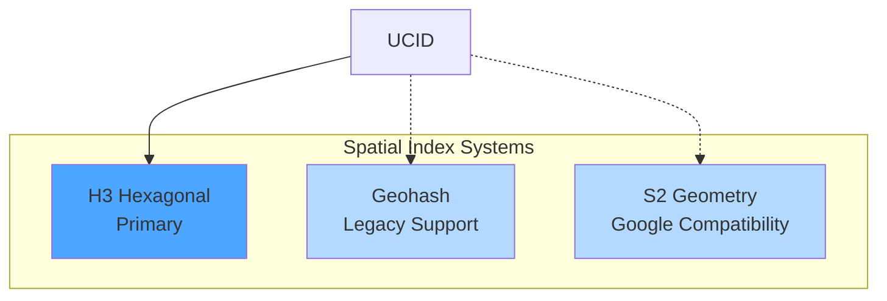
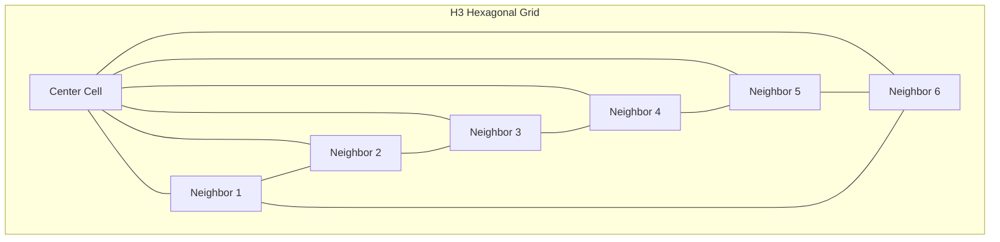
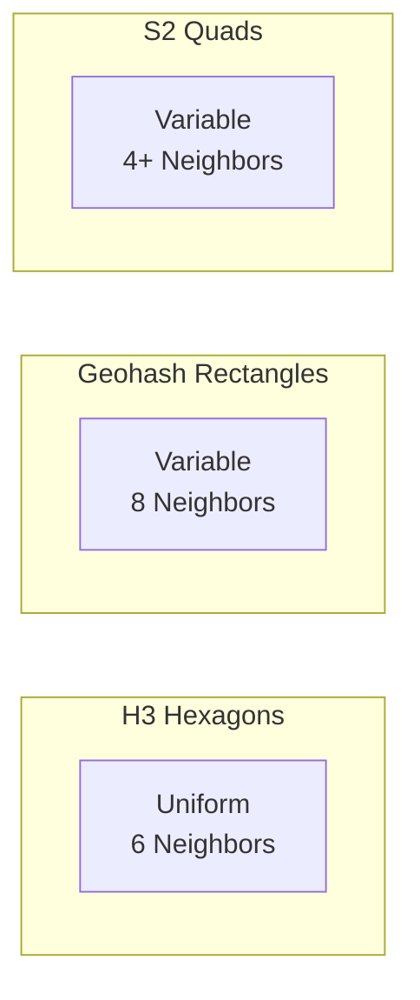
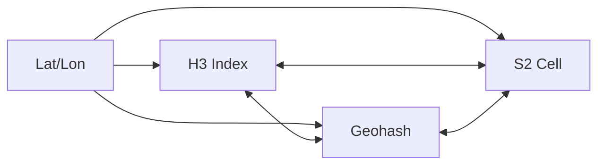
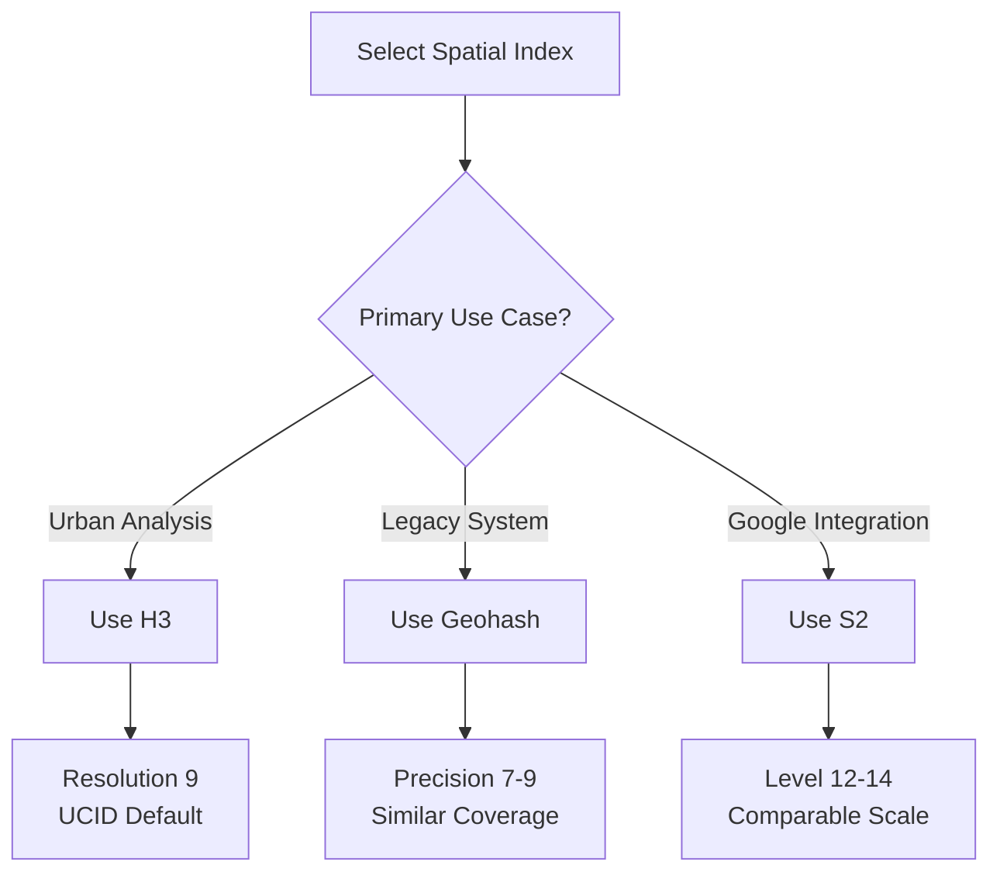

# H3, Geohash, and S2 Spatial Index Interoperability

This document describes the spatial indexing systems supported by UCID, their characteristics, interoperability patterns, and selection guidelines for different use cases.

---

## Table of Contents

1. [Overview](#overview)
2. [H3 Hexagonal Index](#h3-hexagonal-index)
3. [Geohash](#geohash)
4. [S2 Geometry](#s2-geometry)
5. [Comparison](#comparison)
6. [Interoperability](#interoperability)
7. [Selection Guidelines](#selection-guidelines)
8. [Implementation](#implementation)
9. [Performance](#performance)
10. [Best Practices](#best-practices)

---

## Overview

Spatial indexing systems provide hierarchical decomposition of Earth's surface into discrete cells. UCID primarily uses H3 but supports interoperability with Geohash and S2 for compatibility with external systems.

### Supported Systems



### Design Considerations

| Criterion | H3 | Geohash | S2 |
|-----------|-----|---------|-----|
| Cell Shape | Hexagon | Rectangle | Quadrilateral |
| Hierarchy | Regular | Regular | Irregular |
| Neighbors | 6 (uniform) | 8 (variable) | Variable |
| Distortion | Minimal | Moderate at poles | Minimal |
| Resolution Levels | 16 (0-15) | Unlimited | 31 (0-30) |

---

## H3 Hexagonal Index

### Overview

H3 is a hierarchical hexagonal geospatial indexing system developed by Uber. It partitions Earth's surface into hexagonal cells at multiple resolutions.

### Mathematical Foundation

H3 uses an icosahedron projection with Class II aperture-7 hierarchy:

$$N_{cells}(r) = 2 + 120 \times 7^r$$

Where $r$ is the resolution level (0-15).

The relationship between resolutions:

$$\frac{A_{r}}{A_{r+1}} \approx 7$$

### Resolution Characteristics

| Resolution | Avg Area | Edge Length | Use Case |
|------------|----------|-------------|----------|
| 0 | 4,357,449 km^2 | 1,108 km | Continental |
| 4 | 1,770 km^2 | 22.6 km | Regional |
| 7 | 5.16 km^2 | 1.22 km | District |
| 8 | 0.737 km^2 | 461 m | Neighborhood |
| 9 | 0.105 km^2 | 174 m | Block (UCID default) |
| 10 | 0.015 km^2 | 65 m | Building |
| 12 | 307 m^2 | 9.4 m | Parcel |
| 15 | 0.9 m^2 | 0.5 m | Point |

### H3 Index Format

H3 indices are 64-bit integers, typically represented as 15-character hexadecimal strings:

```
891f2ed6df7ffff
│││││││└────────── Cell identifier
│││└───────────── Base cell
│└─────────────── Resolution (9)
└───────────────── Mode (hexagon)
```

### H3 Operations in UCID

```python
from ucid.spatial import (
    latlng_to_cell,
    cell_to_latlng,
    cell_to_boundary,
    get_resolution,
    cell_area,
    k_ring,
)

# Convert coordinates to H3 cell
h3_index = latlng_to_cell(41.015, 28.979, resolution=9)
print(f"H3 Index: {h3_index}")
# Output: 891f2ed6df7ffff

# Get cell center
lat, lon = cell_to_latlng(h3_index)
print(f"Center: ({lat:.4f}, {lon:.4f})")

# Get cell boundary (for visualization)
boundary = cell_to_boundary(h3_index)
print(f"Vertices: {len(boundary)}")

# Get cell area in km^2
area = cell_area(h3_index)
print(f"Area: {area:.4f} km^2")

# Get neighboring cells (k-ring)
neighbors = k_ring(h3_index, k=1)
print(f"Neighbors: {len(neighbors)}")
```

### Hexagonal Grid Visualization



---

## Geohash

### Overview

Geohash is a public domain geocoding system that encodes geographic coordinates into a short string of letters and digits.

### Encoding Algorithm

Geohash uses interleaved binary encoding of latitude and longitude:

1. Divide latitude range [-90, 90] and longitude range [-180, 180]
2. For each bit, determine if coordinate is in upper or lower half
3. Interleave longitude and latitude bits
4. Encode resulting binary as Base32

### Mathematical Representation

For precision $p$ characters:

$$\text{lat\_bits} = \lfloor 5p / 2 \rfloor$$
$$\text{lon\_bits} = \lceil 5p / 2 \rceil$$

Precision:

$$\Delta\lambda \approx \frac{180}{2^{\text{lat\_bits}}}$$
$$\Delta\phi \approx \frac{360}{2^{\text{lon\_bits}}}$$

### Precision Levels

| Length | Lat Error | Lon Error | Cell Size |
|--------|-----------|-----------|-----------|
| 1 | 23 km | 23 km | 5,000 km |
| 2 | 2.8 km | 5.6 km | 625 km |
| 3 | 700 m | 700 m | 156 km |
| 4 | 87 m | 175 m | 40 km |
| 5 | 22 m | 22 m | 5 km |
| 6 | 2.7 m | 5.5 m | 1.2 km |
| 7 | 700 mm | 700 mm | 150 m |
| 8 | 87 mm | 175 mm | 40 m |

### Geohash Operations

```python
from ucid.spatial.geohash_ops import (
    encode_geohash,
    decode_geohash,
    geohash_to_h3,
    h3_to_geohash,
)

# Encode coordinates to geohash
gh = encode_geohash(41.015, 28.979, precision=9)
print(f"Geohash: {gh}")
# Output: sxk9g7tqm

# Decode geohash to coordinates
lat, lon = decode_geohash(gh)
print(f"Decoded: ({lat:.4f}, {lon:.4f})")

# Convert geohash to H3
h3_index = geohash_to_h3(gh, resolution=9)

# Convert H3 to geohash
gh_back = h3_to_geohash(h3_index, precision=9)
```

---

## S2 Geometry

### Overview

S2 is a spherical geometry library developed by Google. It projects Earth onto a cube and uses Hilbert curves for cell ordering.

### Cell Hierarchy

S2 uses a quadtree hierarchy on each of the six cube faces:

$$N_{cells}(l) = 6 \times 4^l$$

Where $l$ is the level (0-30).

### Level Characteristics

| Level | Avg Area | Edge Length | Cells |
|-------|----------|-------------|-------|
| 0 | 85,011,012 km^2 | 7,842 km | 6 |
| 4 | 324,268 km^2 | 481 km | 1,536 |
| 8 | 1,260 km^2 | 30 km | 393,216 |
| 12 | 4.9 km^2 | 1.9 km | 100,663,296 |
| 16 | 19,000 m^2 | 117 m | 2.6e10 |
| 20 | 74 m^2 | 7.3 m | 6.6e12 |
| 24 | 0.29 m^2 | 0.46 m | 1.7e15 |
| 30 | 0.48 cm^2 | 0.74 cm | 6.9e18 |

### S2 Operations

```python
from ucid.spatial.s2_ops import (
    latlon_to_cell_id,
    cell_id_to_latlon,
)

# Convert coordinates to S2 cell
s2_cell = latlon_to_cell_id(41.015, 28.979, level=12)
print(f"S2 Cell ID: {s2_cell}")

# Convert back to coordinates
lat, lon = cell_id_to_latlon(s2_cell)
print(f"Center: ({lat:.4f}, {lon:.4f})")
```

---

## Comparison

### Cell Shape Comparison



### Feature Comparison

| Feature | H3 | Geohash | S2 |
|---------|-----|---------|-----|
| Cell Shape | Hexagon | Rectangle | Quad |
| Area Uniformity | Excellent | Poor at poles | Good |
| Neighbor Count | Always 6 | 4-8 | Variable |
| Hierarchy Ratio | 7:1 | 32:1 | 4:1 |
| Edge Sharing | Full | Partial | Full |
| Compact Regions | Excellent | Good | Excellent |
| Parent-Child | Clean | Clean | Clean |

### Area Distortion

Area distortion across latitudes:

| Latitude | H3 Distortion | Geohash Distortion | S2 Distortion |
|----------|---------------|-------------------|---------------|
| 0 (Equator) | 1.00 | 1.00 | 1.00 |
| 30 | 1.02 | 0.87 | 1.01 |
| 60 | 1.08 | 0.50 | 1.03 |
| 80 | 1.15 | 0.17 | 1.06 |

### Neighbor Distance

The distance function for H3 is uniform:

$$d(c_1, c_2) = \sum_{i=1}^{n} w_i \cdot \mathbb{1}[c_1^i \neq c_2^i]$$

For geohash, neighbor distance varies with direction:

$$d_{NS} \neq d_{EW}$$

---

## Interoperability

### Conversion Functions



### H3 to Geohash

```python
def h3_to_geohash(h3_index: str, precision: int = 9) -> str:
    """Convert H3 index to approximate geohash."""
    lat, lon = cell_to_latlng(h3_index)
    return encode_geohash(lat, lon, precision)
```

### H3 to S2

```python
def h3_to_s2(h3_index: str, level: int = 12) -> int:
    """Convert H3 index to approximate S2 cell."""
    lat, lon = cell_to_latlng(h3_index)
    return latlon_to_cell_id(lat, lon, level)
```

### Resolution Mapping

Approximate resolution equivalences:

| H3 Res | Geohash Len | S2 Level | Approx Size |
|--------|-------------|----------|-------------|
| 4 | 3 | 6 | 20-30 km |
| 7 | 5 | 10 | 1-2 km |
| 9 | 6-7 | 14 | 100-200 m |
| 11 | 8 | 18 | 20-30 m |
| 13 | 9-10 | 22 | 2-5 m |

---

## Selection Guidelines

### Decision Matrix



### Use Case Recommendations

| Use Case | Recommended | Rationale |
|----------|-------------|-----------|
| UCID identifiers | H3 | Native format |
| Transit analysis | H3 | Uniform distance |
| Global coverage | S2 | Google Maps integration |
| Address geocoding | Geohash | Simple prefix matching |
| Visualization | H3 | Aesthetic hexagons |
| Spatial joins | Any | Convert as needed |

### Performance Considerations

| Operation | H3 | Geohash | S2 |
|-----------|-----|---------|-----|
| Encoding | Fast | Very Fast | Fast |
| Decoding | Fast | Very Fast | Fast |
| Neighbors | Fast | Fast | Moderate |
| Contains | Fast | Simple | Fast |
| Distance | Moderate | Simple | Moderate |

---

## Implementation

### Core Interface

```python
from abc import ABC, abstractmethod

class SpatialIndex(ABC):
    """Abstract base class for spatial indices."""
    
    @abstractmethod
    def encode(self, lat: float, lon: float) -> str:
        """Encode coordinates to cell identifier."""
        pass
    
    @abstractmethod
    def decode(self, cell_id: str) -> tuple[float, float]:
        """Decode cell identifier to coordinates."""
        pass
    
    @abstractmethod
    def neighbors(self, cell_id: str) -> list[str]:
        """Get neighboring cells."""
        pass
```

### H3 Adapter

```python
class H3Index(SpatialIndex):
    """H3 spatial index adapter."""
    
    def __init__(self, resolution: int = 9):
        self.resolution = resolution
    
    def encode(self, lat: float, lon: float) -> str:
        return latlng_to_cell(lat, lon, self.resolution)
    
    def decode(self, cell_id: str) -> tuple[float, float]:
        return cell_to_latlng(cell_id)
    
    def neighbors(self, cell_id: str) -> list[str]:
        return k_ring(cell_id, k=1)
```

---

## Performance

### Benchmark Results

Encoding performance (operations per second):

| Index | Single Encode | Batch Encode (1M) |
|-------|---------------|-------------------|
| H3 | 1,500,000 | 800,000 |
| Geohash | 3,000,000 | 2,000,000 |
| S2 | 1,200,000 | 700,000 |

Memory usage:

| Index | Cell ID Size | Memory per 1M cells |
|-------|--------------|---------------------|
| H3 | 8 bytes (int64) | 8 MB |
| Geohash | 9-12 bytes (string) | 12 MB |
| S2 | 8 bytes (int64) | 8 MB |

---

## Best Practices

### Recommendations

1. **Use H3 for UCID**: Native format with best urban analysis properties
2. **Convert at boundaries**: Only convert when interfacing with external systems
3. **Cache conversions**: Store converted indices to avoid recomputation
4. **Match resolutions**: Use equivalent resolutions when converting
5. **Handle precision loss**: Accept some precision loss in conversions

### Anti-Patterns

| Anti-Pattern | Problem | Solution |
|--------------|---------|----------|
| Mixing indices | Incompatible joins | Standardize on H3 |
| Wrong resolution | Area mismatch | Use resolution mapping |
| String comparisons | Performance | Use native integers |
| Ignoring poles | Distortion errors | Use S2 for polar regions |

---

Copyright 2026 UCID Foundation. All rights reserved.
