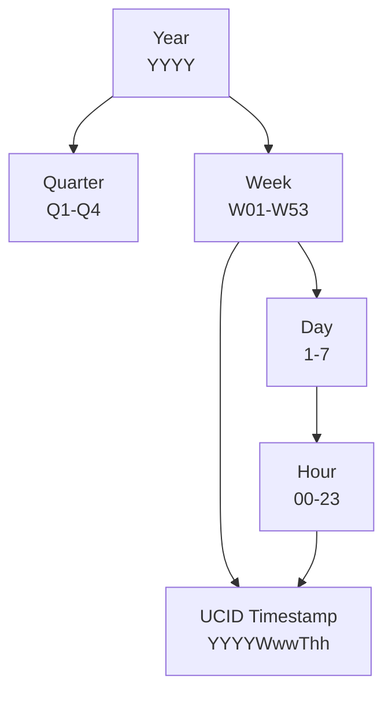
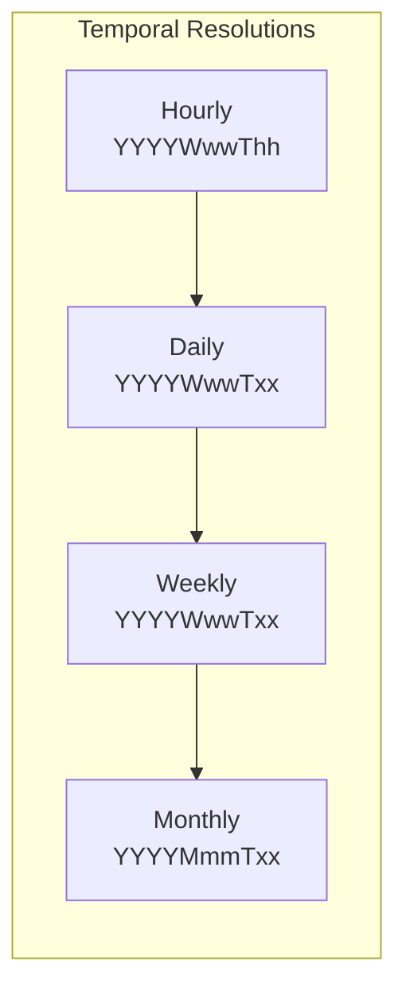
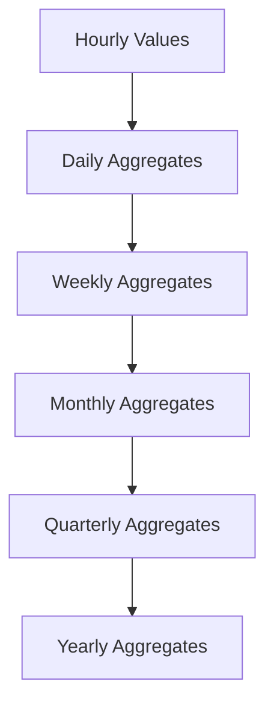

# UCID Temporal Model

This document describes the temporal model used in UCID, including timestamp formats, temporal keys, time series operations, and temporal analysis capabilities.

---

## Table of Contents

1. [Overview](#overview)
2. [ISO Week Calendar](#iso-week-calendar)
3. [Temporal Key Format](#temporal-key-format)
4. [Time Resolution](#time-resolution)
5. [Temporal Operations](#temporal-operations)
6. [Time Series Analysis](#time-series-analysis)
7. [Temporal Aggregation](#temporal-aggregation)
8. [Timezone Handling](#timezone-handling)
9. [Temporal Validity](#temporal-validity)
10. [Implementation](#implementation)

---

## Overview

UCID's temporal model is designed to support reproducible, temporally-aware urban analysis. The model uses ISO week-based timestamps with hourly precision, enabling consistent temporal comparisons across different calendar systems and locales.

### Design Goals

| Goal | Implementation |
|------|----------------|
| **Reproducibility** | Deterministic week numbering |
| **Comparability** | Uniform temporal granularity |
| **Efficiency** | Compact timestamp representation |
| **Flexibility** | Support for multiple time zones |
| **Aggregation** | Natural hierarchy for rollups |

### Temporal Hierarchy



---

## ISO Week Calendar

### Definition

UCID uses the ISO 8601 week date system, which defines:

- Weeks start on Monday
- Week 01 is the week containing the first Thursday of the year
- Years have 52 or 53 weeks

### Mathematical Formulation

The ISO week number $W$ for a given ordinal day $d$ in year $y$ is:

$$W = \left\lfloor \frac{d - DW + 10}{7} \right\rfloor$$

Where $DW$ is the ISO day of week (Monday = 1, Sunday = 7).

The week-based year may differ from the calendar year near January 1 and December 31.

### Week 53 Years

Some years have 53 weeks. A year has 53 weeks if:

$$\text{Year has 53 weeks} \iff (p(y) = 4) \lor (p(y-1) = 3)$$

Where $p(y) = (y + \lfloor y/4 \rfloor - \lfloor y/100 \rfloor + \lfloor y/400 \rfloor) \mod 7$

Years with 53 weeks (2020-2030):

| Year | Weeks | Last Day of W53 |
|------|-------|-----------------|
| 2020 | 53 | 2021-01-03 |
| 2026 | 53 | 2027-01-03 |

### Week Calculation Examples

| Date | ISO Week | UCID Timestamp (noon) |
|------|----------|----------------------|
| 2026-01-01 | 2026-W01 | 2026W01T12 |
| 2026-01-05 | 2026-W02 | 2026W02T12 |
| 2026-06-15 | 2026-W25 | 2026W25T12 |
| 2026-12-28 | 2026-W53 | 2026W53T12 |
| 2026-12-31 | 2026-W53 | 2026W53T12 |
| 2027-01-01 | 2026-W53 | 2026W53T12 |
| 2027-01-04 | 2027-W01 | 2027W01T12 |

---

## Temporal Key Format

### Syntax

The UCID temporal key follows this format:

```
YYYYWwwThh
```

| Component | Description | Range |
|-----------|-------------|-------|
| YYYY | ISO week year | 4 digits |
| W | Week prefix | Literal 'W' |
| ww | Week number | 01-53 |
| T | Time separator | Literal 'T' |
| hh | Hour (24-hour) | 00-23 |

### Validation Pattern

Regular expression for temporal key validation:

```regex
^(\d{4})W(0[1-9]|[1-4]\d|5[0-3])T([01]\d|2[0-3])$
```

### Examples

| Temporal Key | Interpretation |
|--------------|----------------|
| 2026W01T00 | First hour of week 1, 2026 |
| 2026W01T12 | Noon on week 1, 2026 |
| 2026W26T18 | 6 PM on week 26, 2026 |
| 2026W53T23 | Last hour of 2026 |

---

## Time Resolution

### Resolution Levels

UCID supports multiple temporal resolutions:



### Resolution Characteristics

| Resolution | Key Format | Granularity | Use Case |
|------------|------------|-------------|----------|
| Hourly | 2026W01T12 | 1 hour | Real-time analysis |
| Daily | 2026W01D3 | 1 day | Daily patterns |
| Weekly | 2026W01 | 7 days | Trend analysis |
| Monthly | 2026M01 | ~30 days | Long-term trends |

### Aggregation Formulas

For hourly to daily aggregation:

$$v_{daily} = f(\{v_h : h \in [0, 23]\})$$

Where $f$ is typically mean, max, or sum depending on the metric.

For daily to weekly:

$$v_{weekly} = f(\{v_d : d \in [1, 7]\})$$

---

## Temporal Operations

### Time Arithmetic

```python
from ucid.temporal import (
    parse_temporal_key,
    add_hours,
    add_weeks,
    diff_hours,
)

# Parse temporal key
t = parse_temporal_key("2026W01T12")

# Add hours
t_next = add_hours(t, 6)
print(t_next)  # 2026W01T18

# Add weeks
t_next_week = add_weeks(t, 1)
print(t_next_week)  # 2026W02T12

# Calculate difference
delta = diff_hours("2026W02T12", "2026W01T12")
print(delta)  # 168 hours
```

### Time Ranges

```python
from ucid.temporal import generate_time_range

# Generate hourly range
for ts in generate_time_range(
    start="2026W01T00",
    end="2026W01T23",
    step_hours=1,
):
    print(ts)

# Generate daily range (noon each day)
for ts in generate_time_range(
    start="2026W01T12",
    end="2026W04T12",
    step_hours=24,
):
    print(ts)
```

### Temporal Comparisons

```python
from ucid.temporal import compare_temporal

# Compare temporal keys
result = compare_temporal("2026W01T12", "2026W02T12")
print(result)  # -1 (first is earlier)

# Check if within range
is_within = is_in_range(
    "2026W02T12",
    start="2026W01T00",
    end="2026W04T23",
)
print(is_within)  # True
```

---

## Time Series Analysis

### Trend Analysis

UCID supports temporal trend analysis using the temporal module:

```python
from ucid.temporal import analyze_trend

# Sample time series data
data = [
    ("2026W01T12", 75.0),
    ("2026W02T12", 78.0),
    ("2026W03T12", 76.0),
    ("2026W04T12", 82.0),
]

result = analyze_trend(data)
print(f"Trend: {result.direction}")
print(f"Slope: {result.slope:.2f}")
print(f"R-squared: {result.r_squared:.2f}")
```

### Trend Formula

Linear trend is computed using least squares regression:

$$\hat{y} = \beta_0 + \beta_1 t$$

Where:

$$\beta_1 = \frac{\sum_{i=1}^{n}(t_i - \bar{t})(y_i - \bar{y})}{\sum_{i=1}^{n}(t_i - \bar{t})^2}$$

$$\beta_0 = \bar{y} - \beta_1 \bar{t}$$

### Anomaly Detection

```python
from ucid.temporal import detect_anomalies

data = [...]  # Time series data

anomalies = detect_anomalies(
    data,
    method="zscore",
    threshold=2.5,
)

for anomaly in anomalies:
    print(f"Anomaly at {anomaly.timestamp}: {anomaly.value}")
```

### Anomaly Detection Methods

| Method | Formula | Use Case |
|--------|---------|----------|
| Z-Score | $z = \frac{x - \mu}{\sigma}$ | Normal distribution |
| IQR | $x < Q_1 - 1.5 \cdot IQR$ | Robust to outliers |
| MAD | $\frac{x - \text{median}}{MAD}$ | Very robust |

### Seasonal Decomposition

```python
from ucid.temporal import decompose_seasonal

result = decompose_seasonal(
    data,
    period=24,  # Daily seasonality (24 hours)
)

print(f"Trend component: {result.trend}")
print(f"Seasonal component: {result.seasonal}")
print(f"Residual: {result.residual}")
```

---

## Temporal Aggregation

### Aggregation Hierarchy



### Aggregation Functions

| Function | Formula | Use Case |
|----------|---------|----------|
| Mean | $\bar{x} = \frac{1}{n}\sum_{i=1}^{n} x_i$ | Average scores |
| Max | $\max(x_1, ..., x_n)$ | Peak values |
| Min | $\min(x_1, ..., x_n)$ | Minimum conditions |
| Sum | $\sum_{i=1}^{n} x_i$ | Cumulative counts |
| Median | $\text{median}(x_1, ..., x_n)$ | Robust central tendency |
| Std | $\sqrt{\frac{1}{n}\sum_{i=1}^{n}(x_i - \bar{x})^2}$ | Variability |

### Implementation

```python
from ucid.temporal import aggregate_temporal

# Aggregate hourly to daily
daily_data = aggregate_temporal(
    hourly_data,
    source_resolution="hourly",
    target_resolution="daily",
    aggregation="mean",
)

# Aggregate with multiple functions
multi_agg = aggregate_temporal(
    data,
    source_resolution="hourly",
    target_resolution="weekly",
    aggregation=["mean", "max", "min", "std"],
)
```

---

## Timezone Handling

### UTC Normalization

All UCID timestamps are interpreted in the context of the city's timezone but can be normalized to UTC for comparison:

```python
from ucid.temporal import to_utc, from_utc

# Convert city local time to UTC
utc_ts = to_utc("2026W01T12", city="IST")
print(utc_ts)  # 2026W01T09 (Istanbul is UTC+3)

# Convert UTC to city local time
local_ts = from_utc("2026W01T09", city="IST")
print(local_ts)  # 2026W01T12
```

### Timezone-Aware Operations

When comparing UCIDs from different cities:

$$t_{UTC} = t_{local} - \text{offset}(city, t)$$

The offset may vary due to daylight saving time:

| City | Winter Offset | Summer Offset |
|------|---------------|---------------|
| IST | +03:00 | +03:00 |
| NYC | -05:00 | -04:00 |
| LON | +00:00 | +01:00 |
| TYO | +09:00 | +09:00 |

---

## Temporal Validity

### Validity Windows

Each context score has a temporal validity window:

$$\text{valid}(score, t) = |t - t_{score}| \leq \Delta t_{max}$$

Where $\Delta t_{max}$ depends on the context:

| Context | Validity Window | Rationale |
|---------|-----------------|-----------|
| 15MIN | 4 weeks | POI data updates |
| TRANSIT | 1 week | Schedule changes |
| CLIMATE | 12 weeks | Seasonal variation |
| VITALITY | 2 weeks | Activity patterns |

### Freshness Calculation

```python
from ucid.temporal import calculate_freshness

freshness = calculate_freshness(
    score_timestamp="2026W01T12",
    current_timestamp="2026W03T12",
    context="15MIN",
)

print(f"Freshness: {freshness:.2f}")  # 0.5 (half of validity window)
```

---

## Implementation

### Temporal Key Parser

```python
from dataclasses import dataclass

@dataclass
class TemporalKey:
    """Parsed temporal key."""
    year: int
    week: int
    hour: int
    
    def __str__(self) -> str:
        return f"{self.year}W{self.week:02d}T{self.hour:02d}"


def parse_temporal_key(key: str) -> TemporalKey:
    """Parse a UCID temporal key string."""
    import re
    
    pattern = r"^(\d{4})W(\d{2})T(\d{2})$"
    match = re.match(pattern, key)
    
    if not match:
        raise ValueError(f"Invalid temporal key: {key}")
    
    return TemporalKey(
        year=int(match.group(1)),
        week=int(match.group(2)),
        hour=int(match.group(3)),
    )
```

### Time Series Container

```python
from typing import TypeVar, Generic
from collections.abc import Iterator

T = TypeVar("T")

class TimeSeries(Generic[T]):
    """Container for temporal data."""
    
    def __init__(self):
        self._data: dict[str, T] = {}
    
    def add(self, timestamp: str, value: T) -> None:
        """Add a value at a timestamp."""
        self._data[timestamp] = value
    
    def get(self, timestamp: str) -> T | None:
        """Get value at timestamp."""
        return self._data.get(timestamp)
    
    def range(self, start: str, end: str) -> Iterator[tuple[str, T]]:
        """Iterate over range of timestamps."""
        for ts, value in sorted(self._data.items()):
            if start <= ts <= end:
                yield ts, value
```

---

Copyright 2026 UCID Foundation. All rights reserved.
