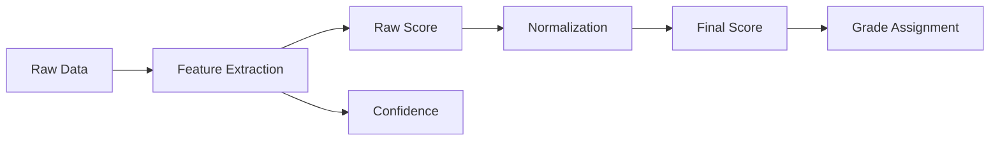
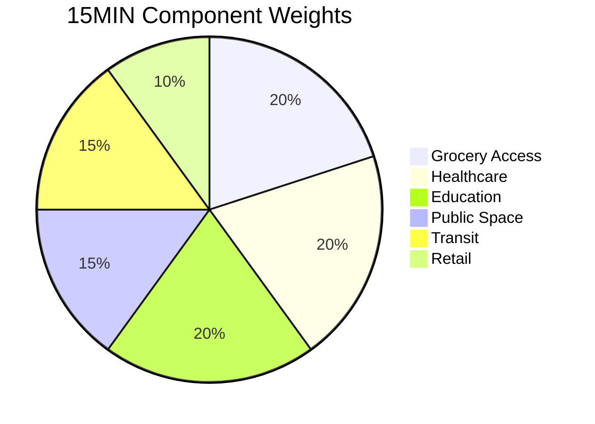
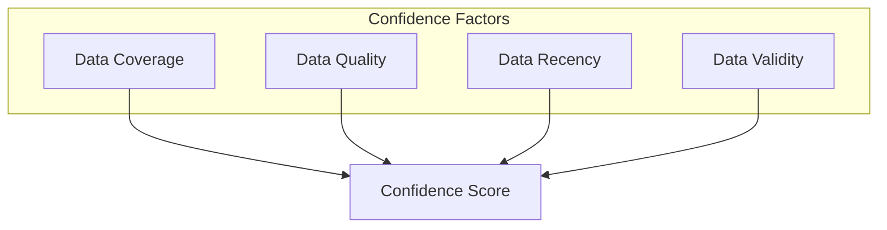
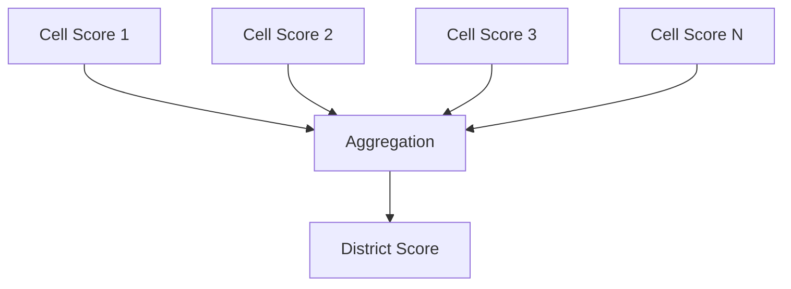
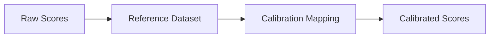
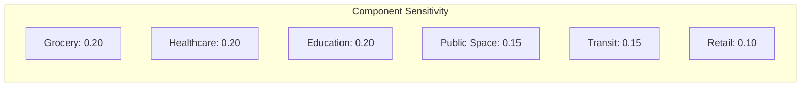

# UCID Scoring System

This document describes the scoring system used in UCID for assessing urban quality across multiple dimensions, including score calculation, grade assignment, confidence estimation, and calibration procedures.

---

## Table of Contents

1. [Overview](#overview)
2. [Score Components](#score-components)
3. [Grade Assignment](#grade-assignment)
4. [Confidence Estimation](#confidence-estimation)
5. [Score Normalization](#score-normalization)
6. [Score Aggregation](#score-aggregation)
7. [Calibration](#calibration)
8. [Uncertainty Quantification](#uncertainty-quantification)
9. [Sensitivity Analysis](#sensitivity-analysis)
10. [Quality Assurance](#quality-assurance)

---

## Overview

The UCID scoring system provides a standardized framework for quantifying urban quality across multiple dimensions. Each context produces a numerical score that is converted to a letter grade with an associated confidence value.

### Scoring Pipeline



### Score Characteristics

| Property | Specification |
|----------|---------------|
| Range | [0, 100] |
| Precision | 2 decimal places |
| Type | Continuous numeric |
| Interpretation | Higher is better |

---

## Score Components

### Component Structure

Each context score is composed of multiple weighted components:

$$S = \sum_{i=1}^{n} w_i \cdot c_i$$

Subject to:

$$\sum_{i=1}^{n} w_i = 1, \quad w_i \geq 0, \quad c_i \in [0, 100]$$

### Component Weights

Example for 15-Minute City context:



| Component | Weight | Description |
|-----------|--------|-------------|
| Grocery Access | 0.20 | Supermarkets, grocery stores |
| Healthcare | 0.20 | Hospitals, clinics, pharmacies |
| Education | 0.20 | Schools, universities |
| Public Space | 0.15 | Parks, plazas, green spaces |
| Transit | 0.15 | Bus stops, metro stations |
| Retail | 0.10 | Shops, markets |

### Component Calculation

Each component score is calculated based on accessibility metrics:

$$c_i = 100 \times \min\left(1, \frac{A_i}{A_{threshold}}\right)$$

Where:
- $A_i$ = Number of accessible amenities within walking distance
- $A_{threshold}$ = Minimum amenities for full score

### Walking Distance Model

Accessibility is measured using network-based walking distance:

$$d_{walk} = \frac{d_{network}}{v_{walk}}$$

Where:
- $d_{network}$ = Shortest path distance on road network
- $v_{walk}$ = Average walking speed (80 m/min)

For 15-minute accessibility:

$$\text{accessible} \iff d_{walk} \leq 15 \text{ minutes} = 1200 \text{ m}$$

---

## Grade Assignment

### Grade Scale

Scores are converted to letter grades using the following thresholds:

| Grade | Score Range | Interpretation |
|-------|-------------|----------------|
| A+ | 95 - 100 | Exceptional |
| A | 85 - 94 | Excellent |
| B | 70 - 84 | Good |
| C | 55 - 69 | Moderate |
| D | 40 - 54 | Below Average |
| F | 0 - 39 | Poor |

### Grade Function

$$g(s) = \begin{cases}
\text{A+} & \text{if } s \geq 95 \\
\text{A} & \text{if } 85 \leq s < 95 \\
\text{B} & \text{if } 70 \leq s < 85 \\
\text{C} & \text{if } 55 \leq s < 70 \\
\text{D} & \text{if } 40 \leq s < 55 \\
\text{F} & \text{if } s < 40
\end{cases}$$

### Grade Ordering

Grades have a natural ordering for comparison:

$$\text{A+} > \text{A} > \text{B} > \text{C} > \text{D} > \text{F}$$

Numeric equivalents for sorting:

| Grade | Numeric Value |
|-------|---------------|
| A+ | 5 |
| A | 4 |
| B | 3 |
| C | 2 |
| D | 1 |
| F | 0 |

---

## Confidence Estimation

### Confidence Definition

Confidence represents the reliability of the score based on data quality and coverage:

$$\text{confidence} \in [0.00, 1.00]$$

### Confidence Components



### Confidence Calculation

$$\text{confidence} = w_{cov} \cdot C + w_{qual} \cdot Q + w_{rec} \cdot R + w_{val} \cdot V$$

Where:
- $C$ = Data coverage factor (0-1)
- $Q$ = Data quality factor (0-1)
- $R$ = Data recency factor (0-1)
- $V$ = Validation factor (0-1)

### Coverage Factor

$$C = \frac{\text{data points available}}{\text{data points expected}}$$

### Recency Factor

$$R = \max\left(0, 1 - \frac{t_{now} - t_{data}}{t_{validity}}\right)$$

Where $t_{validity}$ is the context-specific validity window.

### Confidence Thresholds

| Confidence | Interpretation | Action |
|------------|----------------|--------|
| 0.90 - 1.00 | Very High | Use directly |
| 0.70 - 0.89 | High | Use with minor caveats |
| 0.50 - 0.69 | Moderate | Use with caution |
| 0.30 - 0.49 | Low | Investigate data quality |
| 0.00 - 0.29 | Very Low | Do not rely on score |

---

## Score Normalization

### Min-Max Normalization

Raw scores are normalized to the [0, 100] range:

$$s_{norm} = 100 \times \frac{s - s_{min}}{s_{max} - s_{min}}$$

### Z-Score Normalization

For population-relative scoring:

$$z = \frac{s - \mu}{\sigma}$$

Then converted to percentile:

$$p = \Phi(z) \times 100$$

Where $\Phi$ is the standard normal CDF.

### Benchmark Normalization

Scores can be normalized against benchmark values:

$$s_{bench} = 100 \times \frac{s}{s_{benchmark}}$$

### Normalization Parameters

| Context | Min | Max | Benchmark |
|---------|-----|-----|-----------|
| 15MIN | 0 | 50 amenities | 25 amenities |
| TRANSIT | 0 | 100 stops/km^2 | 50 stops/km^2 |
| CLIMATE | 0 | 100% coverage | 30% coverage |
| WALK | 0 | 100 intersections | 50 intersections |

---

## Score Aggregation

### Spatial Aggregation

Aggregate scores across spatial units:



### Aggregation Methods

| Method | Formula | Use Case |
|--------|---------|----------|
| Mean | $\bar{s} = \frac{1}{n}\sum_i s_i$ | Uniform importance |
| Weighted Mean | $\frac{\sum_i w_i s_i}{\sum_i w_i}$ | Population weighted |
| Median | $\text{median}(s_1, ..., s_n)$ | Robust to outliers |
| Area-Weighted | $\frac{\sum_i A_i s_i}{\sum_i A_i}$ | Size-adjusted |

### Temporal Aggregation

For time series of scores:

$$S_{period} = f(\{s_t : t \in \text{period}\})$$

Where $f$ is typically mean for trend analysis.

---

## Calibration

### Calibration Purpose

Calibration ensures scores are comparable across:
- Different cities
- Different time periods
- Different data sources

### Calibration Process



### Linear Calibration

$$s_{calibrated} = \alpha \cdot s_{raw} + \beta$$

Parameters estimated using reference cities.

### Quantile Calibration

Map scores to reference quantiles:

$$s_{calibrated} = F^{-1}_{ref}(F_{raw}(s))$$

Where $F$ is the cumulative distribution function.

### Calibration Metrics

| Metric | Formula | Target |
|--------|---------|--------|
| MAE | $\frac{1}{n}\sum_i |s_i - r_i|$ | < 5 |
| RMSE | $\sqrt{\frac{1}{n}\sum_i (s_i - r_i)^2}$ | < 7 |
| Correlation | $\rho(s, r)$ | > 0.9 |

---

## Uncertainty Quantification

### Sources of Uncertainty

1. **Data uncertainty**: Incomplete or inaccurate input data
2. **Model uncertainty**: Simplifications in scoring algorithms
3. **Parameter uncertainty**: Uncertainty in weight values

### Uncertainty Propagation

For weighted sum:

$$\sigma_S^2 = \sum_{i=1}^{n} w_i^2 \cdot \sigma_{c_i}^2$$

### Confidence Intervals

The confidence interval for a score:

$$CI_{95} = [S - 1.96 \cdot \sigma_S, S + 1.96 \cdot \sigma_S]$$

### Monte Carlo Simulation

```python
import numpy as np

def estimate_uncertainty(score, components, n_simulations=1000):
    """Estimate score uncertainty via Monte Carlo."""
    samples = []
    
    for _ in range(n_simulations):
        # Add noise to each component
        noisy_components = [
            c + np.random.normal(0, c * 0.1)
            for c in components
        ]
        # Recalculate score
        sample_score = calculate_score(noisy_components)
        samples.append(sample_score)
    
    return np.std(samples)
```

---

## Sensitivity Analysis

### Purpose

Sensitivity analysis identifies which components have the greatest impact on the final score.

### Local Sensitivity

$$\frac{\partial S}{\partial c_i} = w_i$$

For weighted sum, sensitivity equals the weight.

### Global Sensitivity

Sobol indices for global sensitivity:

$$S_i = \frac{V_i}{V(Y)}$$

Where $V_i$ is the variance contribution of component $i$.

### Sensitivity Visualization



### Sensitivity Analysis Implementation

```python
from ucid.scoring.sensitivity import analyze_sensitivity

result = analyze_sensitivity(
    context="15MIN",
    location=(41.015, 28.979),
    method="sobol",
    n_samples=1024,
)

for component, sensitivity in result.items():
    print(f"{component}: {sensitivity:.3f}")
```

---

## Quality Assurance

### Score Validation

| Check | Criterion | Action |
|-------|-----------|--------|
| Range | $0 \leq s \leq 100$ | Clamp to valid range |
| Consistency | Grade matches score | Recalculate grade |
| Confidence | Valid confidence | Flag low confidence |
| Temporal | Within validity | Mark as stale |

### Anomaly Detection

Detect anomalous scores:

1. **Statistical outliers**: Z-score > 3
2. **Spatial outliers**: Different from neighbors
3. **Temporal outliers**: Sudden changes

### Quality Flags

| Flag | Meaning | Impact |
|------|---------|--------|
| VERIFIED | Manually verified | High confidence |
| ESTIMATED | Limited data | Lower confidence |
| OUTDATED | Beyond validity | Mark for update |
| ANOMALY | Statistical outlier | Requires review |

---

Copyright 2026 UCID Foundation. All rights reserved.
