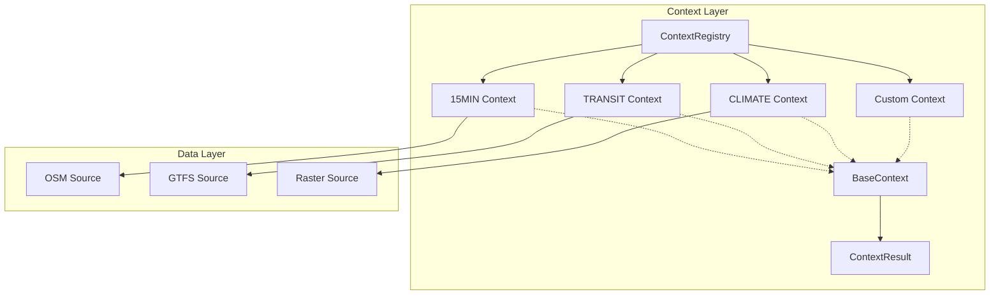
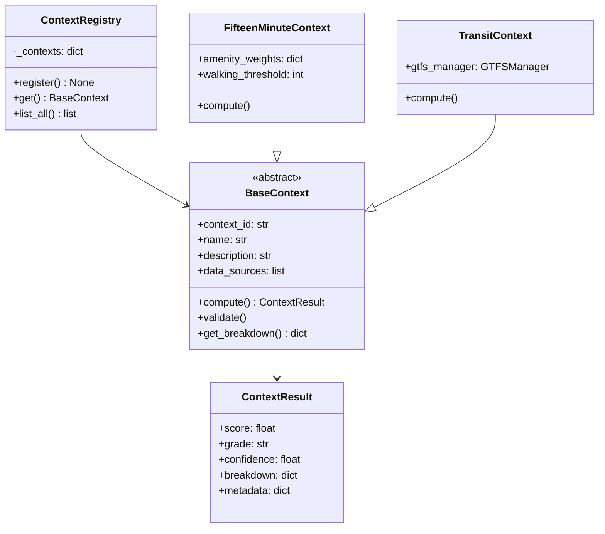
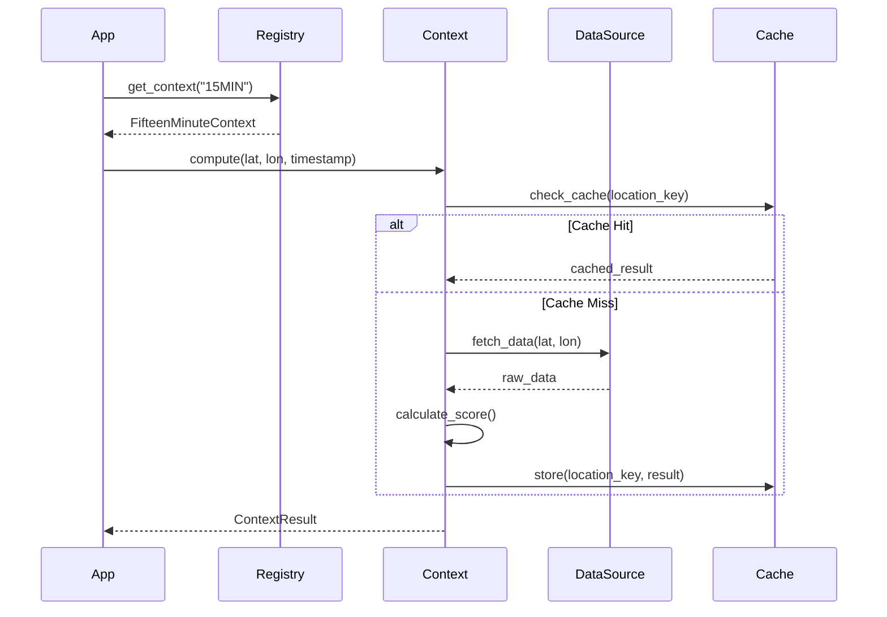
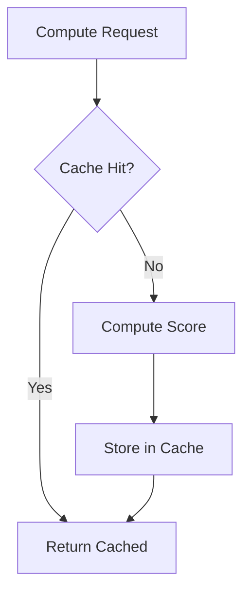

# Context Plugin Architecture

This document describes the plugin architecture for UCID contexts, enabling extensible and customizable urban quality assessment through modular scoring algorithms.

---

## Table of Contents

1. [Overview](#overview)
2. [Architecture Design](#architecture-design)
3. [Base Context Class](#base-context-class)
4. [Context Registry](#context-registry)
5. [Creating Custom Contexts](#creating-custom-contexts)
6. [Data Source Integration](#data-source-integration)
7. [Caching and Performance](#caching-and-performance)
8. [Testing Contexts](#testing-contexts)
9. [Deployment](#deployment)
10. [Best Practices](#best-practices)

---

## Overview

UCID's context system is built on a plugin architecture that allows for modular, extensible scoring algorithms. Each context represents a specific dimension of urban quality assessment.

### Design Principles

| Principle | Implementation |
|-----------|----------------|
| **Modularity** | Each context is a self-contained module |
| **Extensibility** | New contexts can be added without modifying core |
| **Consistency** | All contexts follow the same interface |
| **Testability** | Contexts are independently testable |
| **Performance** | Built-in caching and optimization |

### Architecture Overview



---

## Architecture Design

### Component Hierarchy



### Plugin Lifecycle



---

## Base Context Class

### Abstract Base Class

```python
from abc import ABC, abstractmethod
from dataclasses import dataclass

@dataclass
class ContextResult:
    """Result of a context computation."""
    score: float
    grade: str
    confidence: float
    breakdown: dict[str, float]
    metadata: dict[str, Any] | None = None


class BaseContext(ABC):
    """Abstract base class for all UCID contexts."""
    
    context_id: str = ""
    name: str = ""
    description: str = ""
    data_sources: list[str] = []
    
    @abstractmethod
    def compute(
        self,
        lat: float,
        lon: float,
        timestamp: str,
        **kwargs: Any,
    ) -> ContextResult:
        """Compute context score for a location.
        
        Args:
            lat: Latitude in decimal degrees.
            lon: Longitude in decimal degrees.
            timestamp: UCID temporal key.
            **kwargs: Additional context-specific parameters.
            
        Returns:
            ContextResult with score, grade, and breakdown.
        """
        pass
    
    def validate(self, lat: float, lon: float) -> None:
        """Validate input coordinates."""
        if not -90 <= lat <= 90:
            raise ValueError(f"Invalid latitude: {lat}")
        if not -180 <= lon <= 180:
            raise ValueError(f"Invalid longitude: {lon}")
    
    def score_to_grade(self, score: float) -> str:
        """Convert numeric score to letter grade."""
        if score >= 95:
            return "A+"
        elif score >= 85:
            return "A"
        elif score >= 70:
            return "B"
        elif score >= 55:
            return "C"
        elif score >= 40:
            return "D"
        else:
            return "F"
```

### Required Methods

| Method | Purpose | Return Type |
|--------|---------|-------------|
| `compute()` | Calculate context score | `ContextResult` |
| `validate()` | Validate inputs | `None` or raise |
| `score_to_grade()` | Convert score to grade | `str` |

### Optional Methods

| Method | Purpose | Default |
|--------|---------|---------|
| `get_data_sources()` | List required data | `[]` |
| `estimate_confidence()` | Calculate confidence | `1.0` |
| `get_breakdown()` | Detailed score components | `{}` |

---

## Context Registry

### Registry Pattern

The context registry manages all available contexts:

```python
class ContextRegistry:
    """Thread-safe singleton registry for context implementations."""
    
    _instance: ContextRegistry | None = None
    _lock: threading.Lock = threading.Lock()
    _contexts: dict[str, BaseContext] = {}
    
    def __new__(cls) -> ContextRegistry:
        if cls._instance is None:
            with cls._lock:
                if cls._instance is None:
                    cls._instance = super().__new__(cls)
        return cls._instance
    
    def register(self, context: BaseContext) -> None:
        """Register a context implementation."""
        self._contexts[context.context_id] = context
    
    def get(self, context_id: str) -> BaseContext:
        """Get a context by ID."""
        if context_id not in self._contexts:
            raise UCIDRegistryError(f"Unknown context: {context_id}")
        return self._contexts[context_id]
    
    def list_all(self) -> list[BaseContext]:
        """List all registered contexts."""
        return list(self._contexts.values())
```

### Default Contexts

| Context ID | Class | Module |
|------------|-------|--------|
| 15MIN | FifteenMinuteContext | ucid.contexts.fifteen_minute |
| TRANSIT | TransitContext | ucid.contexts.transit |
| CLIMATE | ClimateContext | ucid.contexts.climate |
| VITALITY | VitalityContext | ucid.contexts.vitality |
| EQUITY | EquityContext | ucid.contexts.equity |
| WALK | WalkabilityContext | ucid.contexts.walkability |

### Auto-Discovery

Contexts are automatically discovered and registered on import:

```python
# ucid/contexts/__init__.py
from ucid.contexts.registry import ContextRegistry
from ucid.contexts.fifteen_minute import FifteenMinuteContext
from ucid.contexts.transit import TransitContext
# ... other imports

# Auto-register built-in contexts
registry = ContextRegistry()
registry.register(FifteenMinuteContext())
registry.register(TransitContext())
# ... other registrations
```

---

## Creating Custom Contexts

### Step-by-Step Guide


### Example: Custom Safety Context

```python
from ucid.contexts.base import BaseContext, ContextResult

class SafetyContext(BaseContext):
    """Urban safety and security scoring context."""
    
    context_id = "SAFETY"
    name = "Urban Safety"
    description = "Measures urban safety based on lighting, visibility, and surveillance"
    data_sources = ["osm-lighting", "osm-cctv", "crime-data"]
    
    def __init__(self):
        self.lighting_weight = 0.35
        self.visibility_weight = 0.35
        self.surveillance_weight = 0.30
    
    def compute(
        self,
        lat: float,
        lon: float,
        timestamp: str,
        **kwargs,
    ) -> ContextResult:
        """Compute safety score for a location."""
        self.validate(lat, lon)
        
        # Fetch data
        lighting_score = self._calculate_lighting(lat, lon)
        visibility_score = self._calculate_visibility(lat, lon)
        surveillance_score = self._calculate_surveillance(lat, lon)
        
        # Calculate weighted score
        score = (
            self.lighting_weight * lighting_score +
            self.visibility_weight * visibility_score +
            self.surveillance_weight * surveillance_score
        )
        
        # Build result
        return ContextResult(
            score=score,
            grade=self.score_to_grade(score),
            confidence=self._estimate_confidence(lat, lon),
            breakdown={
                "lighting": lighting_score,
                "visibility": visibility_score,
                "surveillance": surveillance_score,
            },
        )
    
    def _calculate_lighting(self, lat: float, lon: float) -> float:
        """Calculate street lighting coverage score."""
        # Implementation details...
        return 75.0
    
    def _calculate_visibility(self, lat: float, lon: float) -> float:
        """Calculate sight-line visibility score."""
        # Implementation details...
        return 80.0
    
    def _calculate_surveillance(self, lat: float, lon: float) -> float:
        """Calculate natural surveillance score."""
        # Implementation details...
        return 70.0
    
    def _estimate_confidence(self, lat: float, lon: float) -> float:
        """Estimate result confidence based on data availability."""
        # Implementation details...
        return 0.85
```

### Registration

```python
from ucid.contexts import ContextRegistry
from my_contexts.safety import SafetyContext

registry = ContextRegistry()
registry.register(SafetyContext())

# Now usable in UCID creation
from ucid import create_ucid

ucid = create_ucid(
    city="IST",
    lat=41.015,
    lon=28.979,
    timestamp="2026W01T12",
    context="SAFETY",
)
```

---

## Data Source Integration

### Data Source Interface

```python
from abc import ABC, abstractmethod

class DataSource(ABC):
    """Abstract interface for data sources."""
    
    @abstractmethod
    def fetch(
        self,
        lat: float,
        lon: float,
        radius: float,
    ) -> dict[str, Any]:
        """Fetch data for a location."""
        pass
    
    @abstractmethod
    def is_available(self, lat: float, lon: float) -> bool:
        """Check if data is available for location."""
        pass
```

### Built-in Data Sources

| Source | Class | Data Type |
|--------|-------|-----------|
| OSM | OSMFetcher | POIs, roads |
| GTFS | GTFSManager | Transit schedules |
| WorldPop | PopulationEstimator | Demographics |
| Sentinel | RasterSource | Satellite imagery |

### Data Source Configuration

```python
class MyContext(BaseContext):
    def __init__(self):
        self.osm = OSMFetcher()
        self.gtfs = GTFSManager()
    
    def compute(self, lat, lon, timestamp, **kwargs):
        # Fetch from multiple sources
        pois = self.osm.fetch_amenities(lat, lon, radius=1000)
        stops = self.gtfs.fetch_stops(lat, lon, radius=500)
        
        # Combine data...
```

---

## Caching and Performance

### Cache Strategy



### Cache Implementation

```python
from functools import lru_cache
from ucid.data.cache import FileCache

class CachedContext(BaseContext):
    def __init__(self):
        self.cache = FileCache(
            cache_dir=".ucid_cache/contexts",
            ttl_hours=168,  # 1 week
        )
    
    def compute(self, lat, lon, timestamp, **kwargs):
        cache_key = f"{self.context_id}:{lat:.3f}:{lon:.3f}:{timestamp}"
        
        cached = self.cache.get(cache_key)
        if cached:
            return cached
        
        result = self._compute_impl(lat, lon, timestamp, **kwargs)
        self.cache.set(cache_key, result)
        return result
```

### Performance Optimization

| Technique | Benefit | Implementation |
|-----------|---------|----------------|
| Result caching | Avoid recomputation | FileCache, LRU |
| Data caching | Reduce API calls | OSM cache |
| Lazy loading | Faster startup | Import on demand |
| Batch processing | Amortize overhead | Process in chunks |

---

## Testing Contexts

### Unit Testing

```python
import pytest
from my_contexts.safety import SafetyContext

class TestSafetyContext:
    """Unit tests for SafetyContext."""
    
    def setup_method(self):
        self.context = SafetyContext()
    
    def test_compute_returns_result(self):
        """Test that compute returns a ContextResult."""
        result = self.context.compute(
            lat=41.015,
            lon=28.979,
            timestamp="2026W01T12",
        )
        
        assert isinstance(result, ContextResult)
        assert 0 <= result.score <= 100
        assert result.grade in ("A+", "A", "B", "C", "D", "F")
        assert 0 <= result.confidence <= 1
    
    def test_invalid_coordinates_raises(self):
        """Test that invalid coordinates raise ValueError."""
        with pytest.raises(ValueError):
            self.context.compute(
                lat=91.0,  # Invalid
                lon=28.979,
                timestamp="2026W01T12",
            )
    
    def test_breakdown_contains_components(self):
        """Test that breakdown includes all components."""
        result = self.context.compute(
            lat=41.015,
            lon=28.979,
            timestamp="2026W01T12",
        )
        
        assert "lighting" in result.breakdown
        assert "visibility" in result.breakdown
        assert "surveillance" in result.breakdown
```

### Integration Testing

```python
@pytest.mark.integration
class TestSafetyContextIntegration:
    """Integration tests with real data sources."""
    
    def test_real_data_computation(self):
        """Test computation with real OSM data."""
        context = SafetyContext()
        
        # Use known location with OSM data
        result = context.compute(
            lat=41.0082,
            lon=28.9784,
            timestamp="2026W01T12",
        )
        
        assert result.score > 0
        assert result.confidence > 0
```

---

## Deployment

### Package Structure

```
my_contexts/
├── __init__.py
├── safety.py
├── noise.py
├── data_sources/
│   ├── __init__.py
│   └── crime_data.py
└── tests/
    ├── __init__.py
    ├── test_safety.py
    └── test_noise.py
```

### Registration Hook

```python
# my_contexts/__init__.py
def register_contexts():
    """Register all custom contexts."""
    from ucid.contexts import ContextRegistry
    from my_contexts.safety import SafetyContext
    from my_contexts.noise import NoiseContext
    
    registry = ContextRegistry()
    registry.register(SafetyContext())
    registry.register(NoiseContext())
```

---

## Best Practices

### Design Guidelines

| Guideline | Rationale |
|-----------|-----------|
| Single responsibility | Each context measures one dimension |
| Deterministic output | Same inputs produce same outputs |
| Graceful degradation | Handle missing data gracefully |
| Explicit confidence | Always report data confidence |
| Comprehensive breakdown | Provide component-level scores |

### Common Pitfalls

| Pitfall | Solution |
|---------|----------|
| Missing validation | Always validate inputs |
| Unbounded scores | Clamp scores to [0, 100] |
| Silent failures | Log and report data issues |
| Missing tests | Aim for 80%+ coverage |
| Hardcoded parameters | Use configuration |

---

Copyright 2026 UCID Foundation. All rights reserved.
