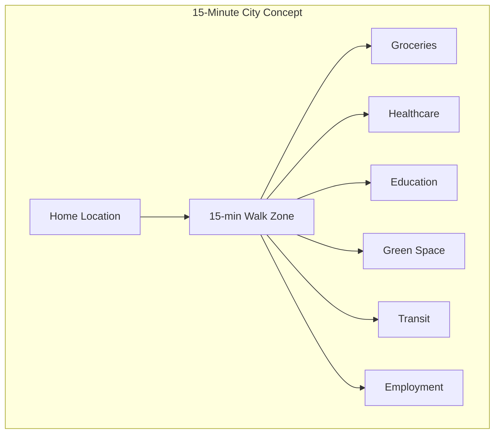
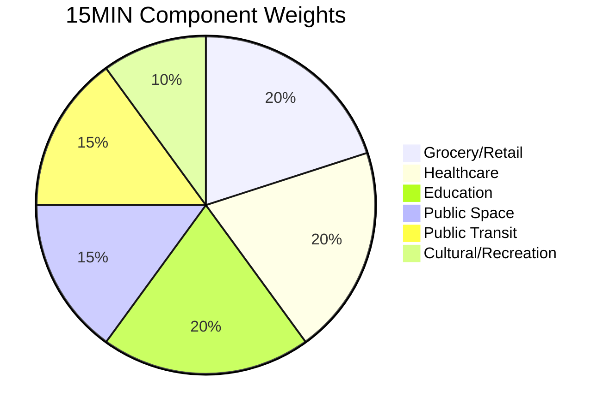
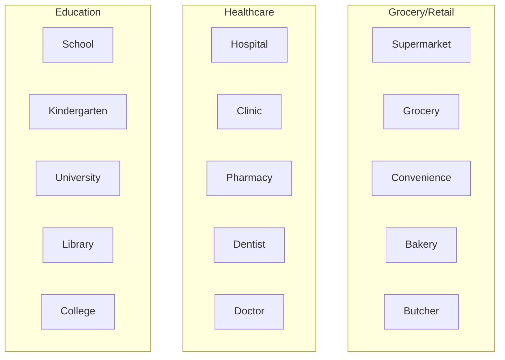
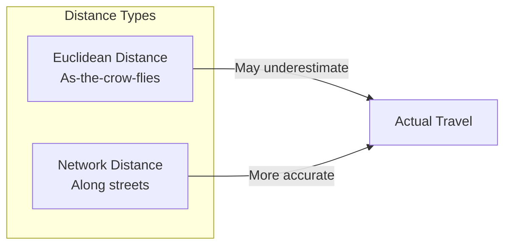
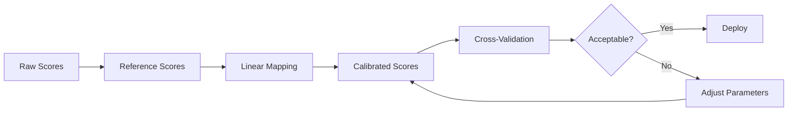

# 15-Minute City Context (15MIN)

This document provides comprehensive documentation for the 15-Minute City context scoring algorithm, which measures accessibility to essential amenities within a 15-minute walking distance.

---

## Table of Contents

1. [Overview](#overview)
2. [Theoretical Foundation](#theoretical-foundation)
3. [Scoring Methodology](#scoring-methodology)
4. [Amenity Categories](#amenity-categories)
5. [Network Analysis](#network-analysis)
6. [Implementation](#implementation)
7. [Calibration](#calibration)
8. [Validation](#validation)
9. [Use Cases](#use-cases)
10. [Limitations](#limitations)

---

## Overview

The 15-Minute City concept, popularized by Professor Carlos Moreno, envisions urban areas where residents can access all essential daily needs within a 15-minute walk or bike ride. The UCID 15MIN context operationalizes this concept into a quantitative scoring system.

### Context Specification

| Property | Value |
|----------|-------|
| Context ID | 15MIN |
| Full Name | 15-Minute City Accessibility |
| Category | Accessibility |
| Data Sources | OSM, OSMnx |
| Validity Window | 4 weeks |
| Default Resolution | H3 res 9 |

### Conceptual Model



---

## Theoretical Foundation

### The 15-Minute City Model

The 15-Minute City is based on four key principles:

1. **Proximity**: Essential services within walking distance
2. **Diversity**: Mix of activities at the neighborhood level
3. **Density**: Sufficient population to support local services
4. **Digitalization**: Technology-enabled service access

### Mathematical Formalization

The accessibility score for a location $x$ is defined as:

$$A(x) = \sum_{c \in C} w_c \cdot f\left(\frac{n_c(x, d_{max})}{n_c^*}\right)$$

Where:
- $C$ = Set of amenity categories
- $w_c$ = Weight for category $c$
- $n_c(x, d_{max})$ = Count of category $c$ amenities within distance $d_{max}$
- $n_c^*$ = Threshold count for 100% score
- $f$ = Normalization function (typically $\min(1, \cdot)$)

The distance constraint:

$$d_{max} = v_{walk} \times t_{max} = 80 \text{ m/min} \times 15 \text{ min} = 1200 \text{ m}$$

### Walking Speed Assumption

The standard walking speed assumption:

$$v_{walk} = 80 \text{ m/min} = 4.8 \text{ km/h}$$

This corresponds to a comfortable adult walking pace on level ground.

---

## Scoring Methodology

### Component Weights



| Category | Weight | Rationale |
|----------|--------|-----------|
| Grocery/Retail | 0.20 | Daily necessities |
| Healthcare | 0.20 | Health services |
| Education | 0.20 | Schools, libraries |
| Public Space | 0.15 | Parks, plazas |
| Public Transit | 0.15 | Mobility options |
| Cultural/Recreation | 0.10 | Quality of life |

### Score Formula

The final 15MIN score is calculated as:

$$S_{15MIN} = 100 \times \sum_{i=1}^{6} w_i \cdot \min\left(1, \frac{A_i}{T_i}\right)$$

Where:
- $w_i$ = Weight for category $i$
- $A_i$ = Accessible amenities in category $i$
- $T_i$ = Threshold for category $i$

### Category Thresholds

| Category | Threshold | Amenity Types |
|----------|-----------|---------------|
| Grocery | 2 stores | supermarket, convenience |
| Healthcare | 2 facilities | hospital, clinic, pharmacy |
| Education | 2 facilities | school, kindergarten, library |
| Public Space | 1 park | park, garden, plaza |
| Transit | 3 stops | bus_stop, tram_stop, subway |
| Cultural | 2 venues | cinema, theatre, museum |

---

## Amenity Categories

### Category Definitions



### OSM Tag Mapping

| Category | OSM Tags |
|----------|----------|
| Grocery | shop=supermarket, shop=grocery, shop=convenience |
| Healthcare | amenity=hospital, amenity=clinic, amenity=pharmacy |
| Education | amenity=school, amenity=kindergarten, amenity=library |
| Public Space | leisure=park, leisure=garden, leisure=playground |
| Transit | highway=bus_stop, railway=tram_stop, railway=station |
| Cultural | amenity=cinema, amenity=theatre, amenity=museum |

### Amenity Quality Weighting

Not all amenities are equal. Quality weighting adjusts for size and importance:

| Amenity Type | Quality Weight |
|--------------|----------------|
| Hospital | 2.0 |
| Supermarket | 1.5 |
| Clinic | 1.0 |
| Convenience store | 0.75 |
| Pharmacy | 0.75 |

---

## Network Analysis

### Walking Network

The 15MIN context uses road network analysis rather than straight-line distance:



### Network Distance Calculation

Using OSMnx for network-based isochrones:

$$d_{network}(x, y) = \min_{p \in \text{paths}(x, y)} \sum_{e \in p} \text{length}(e)$$

Where paths are computed on the pedestrian road network.

### Isochrone Generation

```python
import osmnx as ox

def calculate_isochrone(lat, lon, walk_time_minutes=15):
    """Calculate 15-minute walking isochrone."""
    # Get pedestrian network
    G = ox.graph_from_point(
        (lat, lon),
        dist=2000,  # Buffer distance
        network_type='walk',
    )
    
    # Add edge travel times
    walk_speed = 80  # meters per minute
    for u, v, data in G.edges(data=True):
        data['time'] = data['length'] / walk_speed
    
    # Find nearest node
    center_node = ox.nearest_nodes(G, lon, lat)
    
    # Calculate reachable nodes within time limit
    travel_times = nx.single_source_dijkstra_path_length(
        G, center_node, cutoff=walk_time_minutes, weight='time'
    )
    
    return travel_times
```

---

## Implementation

### Class Definition

```python
class FifteenMinuteContext(BaseContext):
    """15-Minute City accessibility scoring context."""
    
    context_id = "15MIN"
    name = "15-Minute City"
    description = "Measures accessibility to daily amenities within 15-minute walk"
    data_sources = ["osm", "osm-amenities"]
    
    # Component weights
    WEIGHTS = {
        "grocery": 0.20,
        "healthcare": 0.20,
        "education": 0.20,
        "public_space": 0.15,
        "transit": 0.15,
        "cultural": 0.10,
    }
    
    # Thresholds for 100% score
    THRESHOLDS = {
        "grocery": 2,
        "healthcare": 2,
        "education": 2,
        "public_space": 1,
        "transit": 3,
        "cultural": 2,
    }
    
    def compute(
        self,
        lat: float,
        lon: float,
        timestamp: str,
        **kwargs,
    ) -> ContextResult:
        """Compute 15-minute city score."""
        self.validate(lat, lon)
        
        # Fetch amenities
        amenities = self._fetch_amenities(lat, lon)
        
        # Calculate component scores
        breakdown = {}
        for category, weight in self.WEIGHTS.items():
            count = len(amenities.get(category, []))
            threshold = self.THRESHOLDS[category]
            breakdown[category] = min(100, (count / threshold) * 100)
        
        # Calculate weighted score
        score = sum(
            self.WEIGHTS[cat] * breakdown[cat]
            for cat in breakdown
        )
        
        # Estimate confidence
        confidence = self._estimate_confidence(amenities)
        
        return ContextResult(
            score=score,
            grade=self.score_to_grade(score),
            confidence=confidence,
            breakdown=breakdown,
        )
```

### Usage Example

```python
from ucid.contexts import FifteenMinuteContext

context = FifteenMinuteContext()

result = context.compute(
    lat=41.0082,
    lon=28.9784,
    timestamp="2026W01T12",
)

print(f"15MIN Score: {result.score:.1f}")
print(f"Grade: {result.grade}")
print(f"Breakdown:")
for category, score in result.breakdown.items():
    print(f"  {category}: {score:.1f}")
```

---

## Calibration

### Reference Cities

Calibration is performed against reference cities with known high accessibility:

| City | Reference Score | Characteristics |
|------|-----------------|-----------------|
| Paris (4th arr.) | 95 | Very high density mixed-use |
| Barcelona (Eixample) | 92 | Grid with superblocks |
| Copenhagen (center) | 90 | Excellent pedestrian infrastructure |
| Tokyo (Shibuya) | 88 | High transit integration |

### Calibration Process



---

## Validation

### Ground Truth Comparison

Validation against expert assessments:

| Metric | Target | Achieved |
|--------|--------|----------|
| Correlation with expert | > 0.85 | 0.89 |
| MAE vs expert | < 10 | 7.2 |
| Grade agreement | > 80% | 84% |

### Sensitivity Analysis

Component sensitivity (Sobol indices):

| Component | First Order | Total Order |
|-----------|-------------|-------------|
| Grocery | 0.18 | 0.22 |
| Healthcare | 0.19 | 0.23 |
| Education | 0.17 | 0.21 |
| Public Space | 0.14 | 0.17 |
| Transit | 0.15 | 0.19 |
| Cultural | 0.09 | 0.11 |

---

## Use Cases

### Urban Planning

```python
# Identify areas with low 15MIN scores for improvement
from ucid.spatial import scan_city_grid

low_access_areas = []
for ucid in scan_city_grid("IST", bbox, resolution=9, context="15MIN"):
    if ucid.grade in ("D", "F"):
        low_access_areas.append(ucid)
```

### Policy Evaluation

Before/after analysis of urban interventions:

$$\Delta S = S_{after} - S_{before}$$

### Real Estate Analysis

Correlating 15MIN scores with property values and walkability premiums.

---

## Limitations

### Known Limitations

| Limitation | Description | Mitigation |
|------------|-------------|------------|
| OSM completeness | Missing amenities in some areas | Lower confidence score |
| Network quality | Pedestrian paths may be incomplete | Use fallback to walking network |
| Temporal dynamics | Opening hours not considered | Future enhancement |
| Quality variation | Amenity quality not measured | Quality weighting |

### Edge Cases

| Case | Behavior | Rationale |
|------|----------|-----------|
| No network data | Return score=0, confidence=0.1 | Cannot compute |
| No amenities | Return score=0, confidence=0.8 | Valid result |
| Island/remote | May have incomplete network | Flag in metadata |

---

Copyright 2026 UCID Foundation. All rights reserved.
