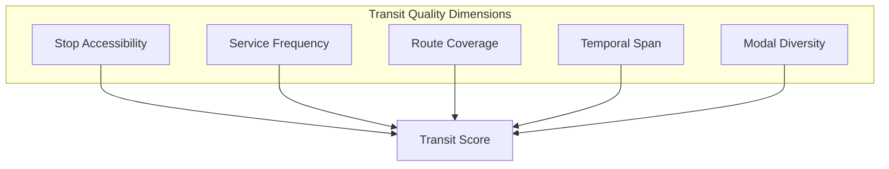
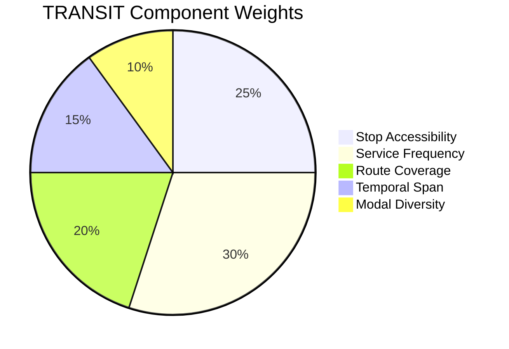
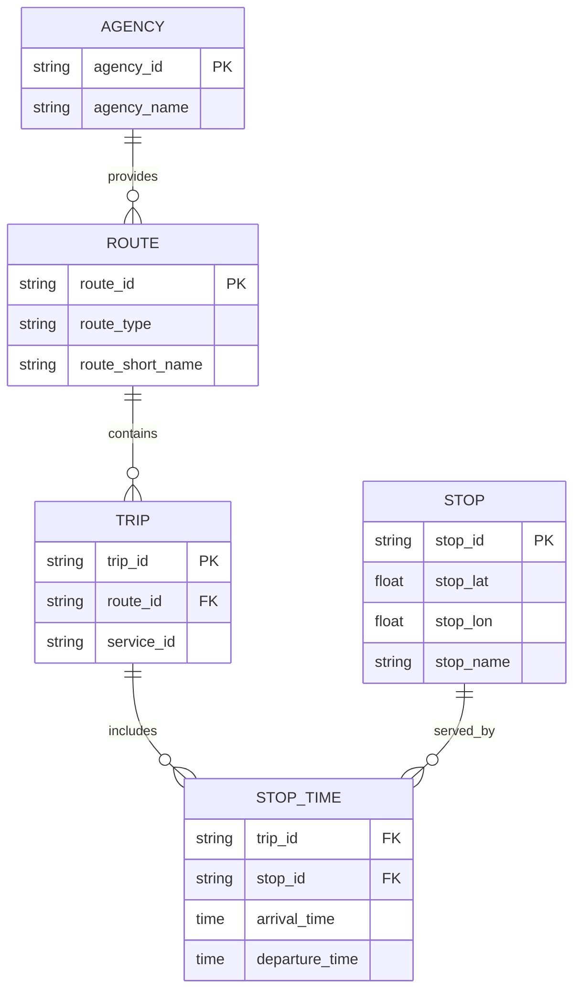
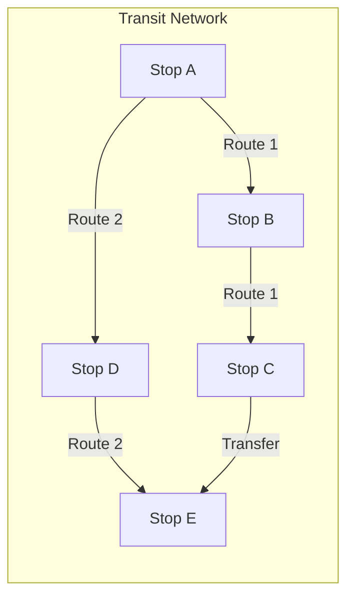
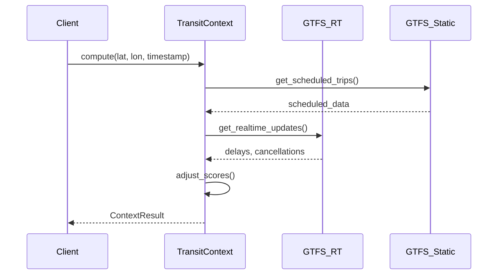

# Transit Context (TRANSIT)

This document provides comprehensive documentation for the Transit context scoring algorithm, which measures public transportation quality and accessibility.

---

## Table of Contents

1. [Overview](#overview)
2. [Theoretical Foundation](#theoretical-foundation)
3. [Scoring Methodology](#scoring-methodology)
4. [GTFS Integration](#gtfs-integration)
5. [Service Quality Metrics](#service-quality-metrics)
6. [Network Analysis](#network-analysis)
7. [Implementation](#implementation)
8. [Real-Time Integration](#real-time-integration)
9. [Validation](#validation)
10. [Limitations](#limitations)

---

## Overview

The TRANSIT context measures public transportation quality based on stop accessibility, service frequency, route coverage, and temporal availability. It integrates with GTFS data to provide comprehensive transit scoring.

### Context Specification

| Property | Value |
|----------|-------|
| Context ID | TRANSIT |
| Full Name | Public Transit Quality |
| Category | Transportation |
| Data Sources | GTFS, GTFS-RT, OSM |
| Validity Window | 1 week |
| Default Resolution | H3 res 9 |

### Conceptual Model



---

## Theoretical Foundation

### Transit Accessibility Model

Transit quality is multi-dimensional, encompassing:

$$Q_{transit} = f(A, F, C, T, M)$$

Where:
- $A$ = Accessibility (proximity to stops)
- $F$ = Frequency (service intervals)
- $C$ = Coverage (destinations reachable)
- $T$ = Temporal span (hours of operation)
- $M$ = Modal diversity (bus, rail, etc.)

### Generalized Transit Cost

The generalized cost of transit travel:

$$C_{total} = t_{access} + t_{wait} + t_{in-vehicle} + t_{transfer} + \epsilon$$

Where each component contributes to perceived transit quality.

### Wait Time Model

Expected wait time under random passenger arrivals:

$$E[W] = \frac{h}{2} + \frac{\sigma_h^2}{2h}$$

Where:
- $h$ = Mean headway (time between vehicles)
- $\sigma_h^2$ = Variance of headway

For perfectly regular service: $E[W] = h/2$

---

## Scoring Methodology

### Component Weights



| Component | Weight | Description |
|-----------|--------|-------------|
| Stop Accessibility | 0.25 | Distance to nearest stops |
| Service Frequency | 0.30 | Trips per hour |
| Route Coverage | 0.20 | Destinations reachable |
| Temporal Span | 0.15 | Hours of operation |
| Modal Diversity | 0.10 | Number of transit modes |

### Score Formula

$$S_{TRANSIT} = 100 \times \sum_{i=1}^{5} w_i \cdot s_i$$

Where each component score $s_i \in [0, 1]$.

### Component Calculations

**Stop Accessibility Score:**

$$s_{access} = \begin{cases}
1.0 & \text{if } d_{stop} \leq 300\text{m} \\
\frac{500 - d_{stop}}{200} & \text{if } 300 < d_{stop} \leq 500 \\
0 & \text{if } d_{stop} > 500\text{m}
\end{cases}$$

**Frequency Score:**

$$s_{freq} = \min\left(1, \frac{f}{f_{max}}\right)$$

Where $f$ = trips per hour, $f_{max}$ = 12 trips/hour threshold.

**Modal Diversity Score:**

$$s_{modal} = \frac{\text{unique modes}}{\text{max modes}} = \frac{m}{5}$$

Where modes include: bus, tram, metro, rail, ferry.

---

## GTFS Integration

### GTFS Data Model



### GTFS Manager

```python
from ucid.data.gtfs import GTFSManager

gtfs = GTFSManager()

# Load GTFS feed
gtfs.load_feed("istanbul_gtfs.zip")

# Query stops near location
stops = gtfs.get_stops_near(
    lat=41.0082,
    lon=28.9784,
    radius_m=500,
)

# Get departure frequency
freq = gtfs.get_frequency(
    stop_id="IST001",
    time_range=("07:00", "09:00"),
)
```

### Route Type Mapping

| GTFS Type | Mode | Weight |
|-----------|------|--------|
| 0 | Tram/Light Rail | 1.2 |
| 1 | Metro/Subway | 1.5 |
| 2 | Rail | 1.3 |
| 3 | Bus | 1.0 |
| 4 | Ferry | 1.1 |
| 5 | Cable Car | 0.8 |
| 6 | Gondola | 0.7 |
| 7 | Funicular | 0.7 |

---

## Service Quality Metrics

### Frequency Metrics

| Metric | Formula | Description |
|--------|---------|-------------|
| Headway | $h = 60/f$ | Minutes between vehicles |
| Peak Frequency | $f_{peak}$ | AM/PM rush hour frequency |
| Off-Peak Frequency | $f_{off}$ | Midday frequency |
| Frequency Ratio | $f_{peak}/f_{off}$ | Service consistency |

### Coverage Metrics

**Stop Density:**

$$\rho_{stops} = \frac{N_{stops}}{A_{km^2}}$$

**Route Kilometers:**

$$L_{route} = \sum_{r} \text{length}(r)$$

### Temporal Metrics

**Service Span:**

$$T_{span} = t_{last} - t_{first}$$

**Night Service Score:**

$$s_{night} = \begin{cases}
1.0 & \text{if service until 24:00+} \\
0.5 & \text{if service until 23:00} \\
0 & \text{if service ends before 22:00}
\end{cases}$$

---

## Network Analysis

### Transit Network Graph



### Reachability Analysis

Destinations reachable within time budget:

$$R(x, t_{max}) = \{y : T(x, y) \leq t_{max}\}$$

Where $T(x, y)$ is the transit travel time from $x$ to $y$.

### Transfer Penalty

Total journey time with transfers:

$$T_{journey} = t_{access} + t_{wait} + t_{ride} + \sum_{k=1}^{n} p_{transfer}$$

Where $p_{transfer}$ = 5-10 minutes per transfer.

---

## Implementation

### Class Definition

```python
class TransitContext(BaseContext):
    """Public transit quality scoring context."""
    
    context_id = "TRANSIT"
    name = "Public Transit Quality"
    description = "Measures public transportation accessibility and quality"
    data_sources = ["gtfs", "gtfs-rt", "osm-transit"]
    
    WEIGHTS = {
        "accessibility": 0.25,
        "frequency": 0.30,
        "coverage": 0.20,
        "temporal": 0.15,
        "modal": 0.10,
    }
    
    def __init__(self):
        self.gtfs_manager = GTFSManager()
    
    def compute(
        self,
        lat: float,
        lon: float,
        timestamp: str,
        **kwargs,
    ) -> ContextResult:
        """Compute transit quality score."""
        self.validate(lat, lon)
        
        # Fetch stops and routes
        stops = self.gtfs_manager.get_stops_near(lat, lon, radius_m=500)
        
        # Calculate components
        breakdown = {
            "accessibility": self._score_accessibility(stops, lat, lon),
            "frequency": self._score_frequency(stops, timestamp),
            "coverage": self._score_coverage(stops),
            "temporal": self._score_temporal(stops),
            "modal": self._score_modal_diversity(stops),
        }
        
        # Weighted sum
        score = sum(
            self.WEIGHTS[k] * v
            for k, v in breakdown.items()
        )
        
        return ContextResult(
            score=score,
            grade=self.score_to_grade(score),
            confidence=self._estimate_confidence(stops),
            breakdown=breakdown,
        )
```

### Usage Example

```python
from ucid.contexts import TransitContext

context = TransitContext()
context.gtfs_manager.load_feed("city_gtfs.zip")

result = context.compute(
    lat=41.0082,
    lon=28.9784,
    timestamp="2026W01T08",  # Morning rush hour
)

print(f"Transit Score: {result.score:.1f}")
print(f"Grade: {result.grade}")
```

---

## Real-Time Integration

### GTFS-RT Support



### Real-Time Adjustments

| Condition | Score Adjustment |
|-----------|------------------|
| On-time performance > 90% | +5% |
| On-time performance < 70% | -10% |
| Service cancellations | -15% |
| Crowding alerts | -5% |

---

## Validation

### Validation Metrics

| Metric | Target | Achieved |
|--------|--------|----------|
| Correlation with ridership | > 0.75 | 0.82 |
| Expert agreement | > 80% | 85% |
| Cross-city consistency | < 10% variance | 8.5% |

### Reference Benchmarks

| City | Reference Score | Transit Type |
|------|-----------------|--------------|
| Tokyo | 95 | Comprehensive rail |
| Singapore | 92 | Integrated network |
| London | 88 | Historic underground |
| Istanbul | 75 | Bus + Metro + Ferry |

---

## Limitations

### Known Limitations

| Limitation | Description | Mitigation |
|------------|-------------|------------|
| GTFS availability | Not all cities have GTFS | OSM fallback |
| Real-time data | GTFS-RT not universal | Use scheduled data |
| Informal transit | Minibuses, dolmus | Manual addition |
| Fare integration | Not considered | Future enhancement |

---

Copyright 2026 UCID Foundation. All rights reserved.
