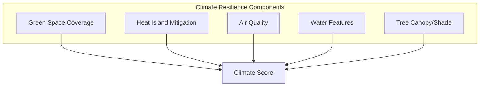
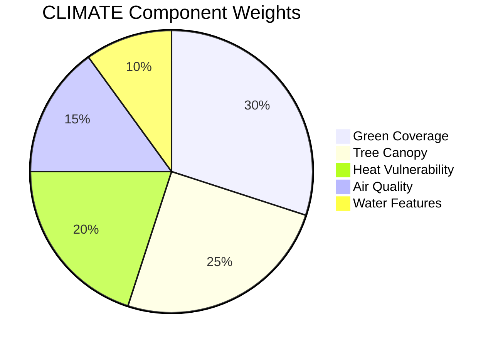
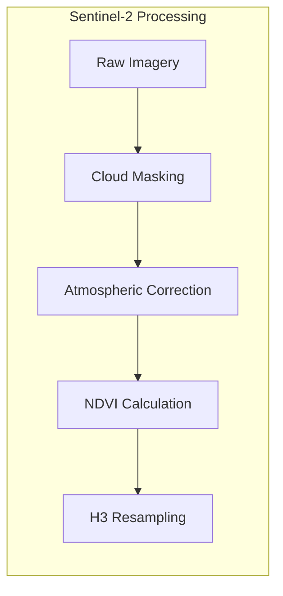
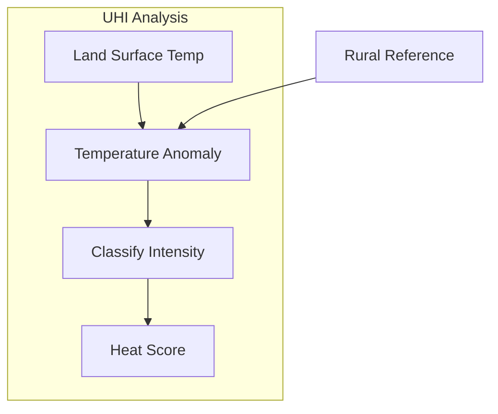

# Climate Context (CLIMATE)

This document provides comprehensive documentation for the Climate context scoring algorithm, which measures urban climate resilience including green space coverage, heat island mitigation, and environmental quality.

---

## Table of Contents

1. [Overview](#overview)
2. [Theoretical Foundation](#theoretical-foundation)
3. [Scoring Methodology](#scoring-methodology)
4. [Remote Sensing Integration](#remote-sensing-integration)
5. [Urban Heat Island Analysis](#urban-heat-island-analysis)
6. [Green Infrastructure Metrics](#green-infrastructure-metrics)
7. [Implementation](#implementation)
8. [Data Sources](#data-sources)
9. [Validation](#validation)
10. [Climate Projections](#climate-projections)

---

## Overview

The CLIMATE context assesses urban environmental quality and climate resilience. It integrates satellite imagery, OpenStreetMap data, and environmental datasets to score locations based on green coverage, heat vulnerability, and air quality indicators.

### Context Specification

| Property | Value |
|----------|-------|
| Context ID | CLIMATE |
| Full Name | Climate Resilience |
| Category | Environment |
| Data Sources | Sentinel-2, OSM, Air Quality APIs |
| Validity Window | 12 weeks |
| Default Resolution | H3 res 9 |

### Conceptual Model



---

## Theoretical Foundation

### Urban Climate Framework

Urban climate is influenced by:

$$T_{urban} = T_{rural} + \Delta T_{UHI}$$

Where $\Delta T_{UHI}$ is the Urban Heat Island effect, typically 2-8 degrees C.

### Heat Island Intensity

The heat island intensity is related to urban form:

$$\Delta T_{UHI} = \alpha \cdot \text{SVF} + \beta \cdot \text{GCR} + \gamma \cdot \text{ALB} + \epsilon$$

Where:
- SVF = Sky View Factor
- GCR = Green Coverage Ratio
- ALB = Average Surface Albedo

### Vegetation Indices

Normalized Difference Vegetation Index:

$$NDVI = \frac{NIR - Red}{NIR + Red}$$

Where NIR and Red are spectral reflectance values.

NDVI interpretation:

| NDVI Range | Interpretation |
|------------|----------------|
| < 0 | Water, clouds, snow |
| 0 - 0.2 | Bare soil, rock, built-up |
| 0.2 - 0.4 | Sparse vegetation |
| 0.4 - 0.6 | Moderate vegetation |
| 0.6 - 0.8 | Dense vegetation |
| > 0.8 | Very dense vegetation |

---

## Scoring Methodology

### Component Weights



| Component | Weight | Description |
|-----------|--------|-------------|
| Green Coverage | 0.30 | Parks, gardens, green areas |
| Tree Canopy | 0.25 | Street trees, urban forest |
| Heat Vulnerability | 0.20 | Inverse of heat island intensity |
| Air Quality | 0.15 | PM2.5, NO2, O3 levels |
| Water Features | 0.10 | Rivers, lakes, fountains |

### Score Formula

$$S_{CLIMATE} = 100 \times \sum_{i=1}^{5} w_i \cdot s_i$$

### Component Calculations

**Green Coverage Score:**

$$s_{green} = \min\left(1, \frac{A_{green}}{A_{total} \times 0.3}\right)$$

Where 30% green coverage = full score.

**Tree Canopy Score:**

$$s_{canopy} = \min\left(1, \frac{NDVI_{avg} - 0.2}{0.4}\right)$$

Normalized from NDVI 0.2 (bare) to 0.6 (dense trees).

**Heat Vulnerability Score:**

$$s_{heat} = 1 - \frac{T_{surface} - T_{min}}{T_{max} - T_{min}}$$

Inverted so cooler areas score higher.

---

## Remote Sensing Integration

### Sentinel-2 Data



### Spectral Bands

| Band | Wavelength (nm) | Resolution | Use |
|------|-----------------|------------|-----|
| B2 | 490 (Blue) | 10m | RGB composite |
| B3 | 560 (Green) | 10m | Vegetation |
| B4 | 665 (Red) | 10m | NDVI denominator |
| B8 | 842 (NIR) | 10m | NDVI numerator |
| B11 | 1610 (SWIR) | 20m | Built-up index |

### Processing Pipeline

```python
from ucid.data.raster import SatelliteProcessor

processor = SatelliteProcessor()

# Load Sentinel-2 scene
scene = processor.load_sentinel2(
    bbox=(28.8, 40.9, 29.2, 41.1),
    date_range=("2026-06-01", "2026-08-31"),
    cloud_cover_max=20,
)

# Calculate NDVI
ndvi = processor.calculate_ndvi(scene)

# Aggregate to H3 cells
h3_ndvi = processor.aggregate_to_h3(ndvi, resolution=9)
```

---

## Urban Heat Island Analysis

### Land Surface Temperature

Land Surface Temperature from thermal bands:

$$LST = \frac{T_B}{1 + (\lambda \cdot T_B / \rho) \cdot \ln(\epsilon)}$$

Where:
- $T_B$ = Brightness temperature
- $\lambda$ = Wavelength of emitted radiance
- $\rho$ = h * c / k = 1.438 * 10^-2 m K
- $\epsilon$ = Land surface emissivity

### Heat Island Mapping



### UHI Intensity Classes

| Class | Intensity | Delta T | Score Impact |
|-------|-----------|---------|--------------|
| Cool Island | -2 to 0 C | 0 | +20% |
| Normal | 0 to 2 C | +0-2 | 0% |
| Moderate UHI | 2 to 4 C | +2-4 | -10% |
| Strong UHI | 4 to 6 C | +4-6 | -25% |
| Extreme UHI | > 6 C | +6+ | -40% |

---

## Green Infrastructure Metrics

### Green Space Typology

| Type | OSM Tags | Score Weight |
|------|----------|--------------|
| Park | leisure=park | 1.0 |
| Forest | landuse=forest | 1.2 |
| Garden | leisure=garden | 0.8 |
| Grass | landuse=grass | 0.6 |
| Cemetery | landuse=cemetery | 0.5 |
| Playground | leisure=playground | 0.4 |

### Accessibility Calculation

Green space accessibility within walking distance:

$$A_{green} = \sum_{g \in G} w_g \cdot \mathbb{1}[d(x, g) \leq d_{max}]$$

Where $d_{max}$ = 400m (5-minute walk).

### Connectivity Analysis

Green network connectivity using graph metrics:

$$C = \frac{2E}{N(N-1)}$$

Where:
- $E$ = Number of green corridors
- $N$ = Number of green patches

---

## Implementation

### Class Definition

```python
class ClimateContext(BaseContext):
    """Urban climate resilience scoring context."""
    
    context_id = "CLIMATE"
    name = "Climate Resilience"
    description = "Measures green space, heat vulnerability, and air quality"
    data_sources = ["sentinel-2", "osm-greenspace"]
    
    WEIGHTS = {
        "green_coverage": 0.30,
        "tree_canopy": 0.25,
        "heat_vulnerability": 0.20,
        "air_quality": 0.15,
        "water_features": 0.10,
    }
    
    def compute(
        self,
        lat: float,
        lon: float,
        timestamp: str,
        **kwargs,
    ) -> ContextResult:
        """Compute climate resilience score."""
        self.validate(lat, lon)
        
        # Fetch data
        green_areas = self._fetch_green_spaces(lat, lon)
        ndvi = self._get_ndvi(lat, lon, timestamp)
        lst = self._get_surface_temp(lat, lon, timestamp)
        aqi = self._get_air_quality(lat, lon)
        
        # Calculate components
        breakdown = {
            "green_coverage": self._score_green_coverage(green_areas),
            "tree_canopy": self._score_tree_canopy(ndvi),
            "heat_vulnerability": self._score_heat(lst),
            "air_quality": self._score_air_quality(aqi),
            "water_features": self._score_water(lat, lon),
        }
        
        # Weighted sum
        score = sum(self.WEIGHTS[k] * v for k, v in breakdown.items())
        
        return ContextResult(
            score=score,
            grade=self.score_to_grade(score),
            confidence=self._estimate_confidence(),
            breakdown=breakdown,
        )
```

---

## Data Sources

### Primary Data Sources

| Source | Data Type | Resolution | Update Frequency |
|--------|-----------|------------|------------------|
| Sentinel-2 | Multispectral imagery | 10m | 5 days |
| Landsat | Thermal imagery | 30m | 16 days |
| OSM | Green space polygons | N/A | Continuous |
| OpenAQ | Air quality | Point | Hourly |

### Data Quality Considerations

| Factor | Impact | Mitigation |
|--------|--------|------------|
| Cloud cover | Missing data | Temporal compositing |
| Seasonality | NDVI variation | Season-specific thresholds |
| Urban shadows | LST artifacts | Shadow masking |
| OSM completeness | Missing features | Satellite backup |

---

## Validation

### Validation Metrics

| Metric | Target | Achieved |
|--------|--------|----------|
| NDVI correlation with field | > 0.85 | 0.89 |
| UHI vs. weather stations | < 2 C MAE | 1.6 C |
| Expert agreement | > 80% | 83% |

### Reference Benchmarks

| City | Reference Score | Climate Type |
|------|-----------------|--------------|
| Singapore | 92 | Tropical, high green ratio |
| Vienna | 88 | Continental, strong planning |
| Curitiba | 85 | Pioneering green city |
| Istanbul | 62 | Mixed, variable green coverage |

---

## Climate Projections

### Future Scenarios

Impact of climate change on scores:

| Scenario | Temperature Change | Score Impact |
|----------|-------------------|--------------|
| RCP 2.6 | +1.5 C | -5% |
| RCP 4.5 | +2.5 C | -12% |
| RCP 8.5 | +4.0 C | -25% |

### Adaptation Metrics

Measuring climate adaptation potential:

$$A_{adapt} = f(\text{tree planting capacity}, \text{cool roof potential}, \text{water availability})$$

---

## API Examples

### Basic Usage

```python
from ucid.contexts import ClimateContext

context = ClimateContext()

# Score a single location
result = context.compute(
    lat=41.015,
    lon=28.979,
    timestamp="2026W01T12",
)

print(f"Climate Score: {result.score:.1f}")
print(f"Grade: {result.grade}")
print(f"NDVI: {result.breakdown['tree_canopy']:.2f}")
```

### Batch Processing

```python
from ucid.contexts import ClimateContext
import pandas as pd

context = ClimateContext()
locations = pd.read_csv("city_locations.csv")

# Process multiple locations
results = []
for _, row in locations.iterrows():
    result = context.compute(row.lat, row.lon, "2026W01T12")
    results.append({
        'lat': row.lat,
        'lon': row.lon,
        'climate_score': result.score,
        'ndvi': result.breakdown['tree_canopy'],
    })

df_results = pd.DataFrame(results)
```

---

## Use Cases

### Urban Heat Mapping

Identify heat vulnerability zones:

| Zone | Score Range | Priority | Intervention |
|------|-------------|----------|--------------|
| Critical | 0-40 | Immediate | Emergency cooling centers |
| High Risk | 40-60 | Short-term | Tree planting, cool roofs |
| Moderate | 60-80 | Medium-term | Green corridors |
| Low Risk | 80-100 | Maintenance | Preserve green space |

### Green Infrastructure Planning

Use climate scores to prioritize green infrastructure investments.

### Climate Equity Analysis

Cross-reference with demographic data to identify environmental justice issues.

---

## Limitations

### Known Limitations

| Limitation | Impact | Mitigation |
|------------|--------|------------|
| Cloud cover | Data gaps | Temporal compositing |
| Seasonal variation | Score fluctuation | Season-adjusted thresholds |
| Sensor resolution | Urban detail | Multi-resolution fusion |
| Data latency | Stale analysis | Regular updates |

---

Copyright 2026 UCID Foundation. All rights reserved.
