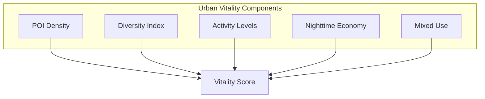
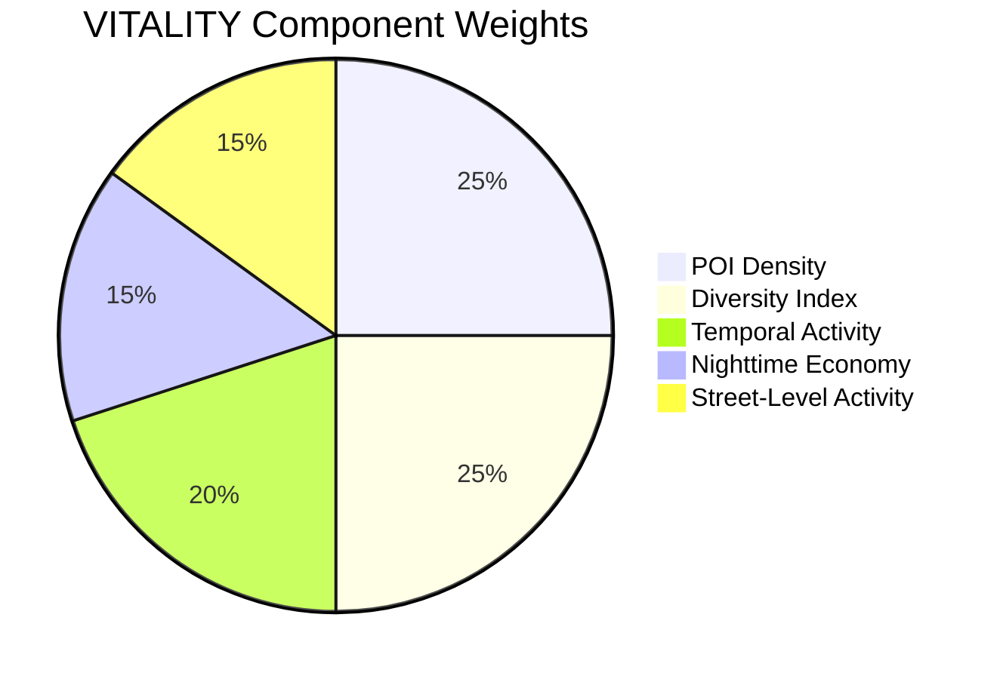
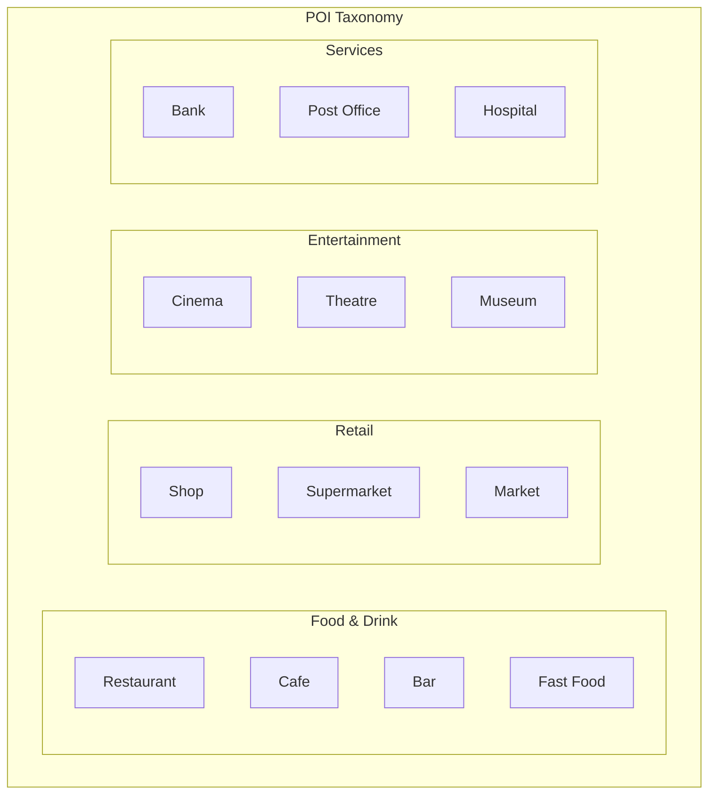
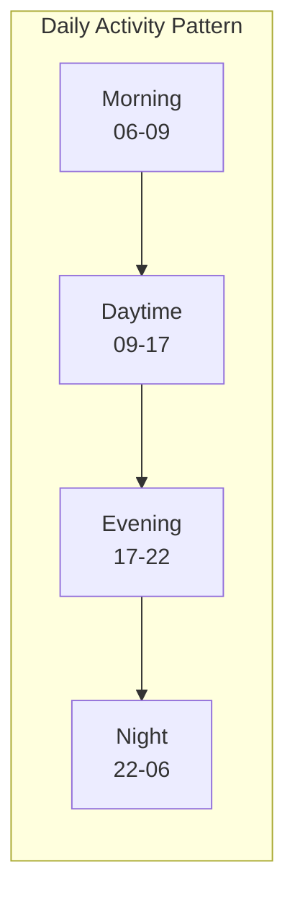

# Vitality Context (VITALITY)

This document provides comprehensive documentation for the Vitality context scoring algorithm, which measures urban vibrancy, activity levels, and mixed-use intensity.

---

## Table of Contents

1. [Overview](#overview)
2. [Theoretical Foundation](#theoretical-foundation)
3. [Scoring Methodology](#scoring-methodology)
4. [POI Analysis](#poi-analysis)
5. [Activity Patterns](#activity-patterns)
6. [Mixed-Use Metrics](#mixed-use-metrics)
7. [Implementation](#implementation)
8. [Temporal Dynamics](#temporal-dynamics)
9. [Validation](#validation)
10. [Applications](#applications)

---

## Overview

The VITALITY context measures urban vibrancy and activity levels based on POI diversity, temporal activity patterns, and land-use mix. It captures the "life" of urban areas.

### Context Specification

| Property | Value |
|----------|-------|
| Context ID | VITALITY |
| Full Name | Urban Vitality |
| Category | Activity |
| Data Sources | OSM POI, Mobile Data |
| Validity Window | 2 weeks |
| Default Resolution | H3 res 9 |

### Conceptual Model



---

## Theoretical Foundation

### Jane Jacobs' Urban Vitality

Urban vitality, as conceptualized by Jane Jacobs, requires:

1. **Mixed uses**: Multiple functions attracting people at different times
2. **Short blocks**: Frequent corners and turning opportunities
3. **Building age mix**: Variety of old and new buildings
4. **Concentration**: Sufficient density of people

### Entropy-Based Diversity

Land use diversity measured using Shannon entropy:

$$H = -\sum_{i=1}^{n} p_i \ln(p_i)$$

Where $p_i$ is the proportion of land use category $i$.

Normalized entropy:

$$H_{norm} = \frac{H}{\ln(n)}$$

Ranges from 0 (monoculture) to 1 (perfect mix).

### Activity Intensity Model

Activity intensity over time:

$$A(t) = \sum_{p \in POIs} w_p \cdot f_p(t)$$

Where:
- $w_p$ = Weight of POI type
- $f_p(t)$ = Activity function for POI at time $t$

---

## Scoring Methodology

### Component Weights



| Component | Weight | Description |
|-----------|--------|-------------|
| POI Density | 0.25 | Points of interest per area |
| Diversity Index | 0.25 | Category mix entropy |
| Temporal Activity | 0.20 | Activity across day |
| Nighttime Economy | 0.15 | Evening/night activity |
| Street-Level Activity | 0.15 | Retail frontage, cafes |

### Score Formula

$$S_{VITALITY} = 100 \times \sum_{i=1}^{5} w_i \cdot s_i$$

### Component Calculations

**POI Density Score:**

$$s_{density} = \min\left(1, \frac{\rho_{POI}}{\rho_{threshold}}\right)$$

Where $\rho_{threshold}$ = 50 POIs per H3 cell (res 9).

**Diversity Score:**

$$s_{diversity} = H_{norm}$$

Using Shannon entropy of POI categories.

**Nighttime Score:**

$$s_{night} = \frac{N_{evening}}{N_{total}}$$

Where evening = restaurants, bars, entertainment after 18:00.

---

## POI Analysis

### POI Categories



### Category Weights

| Category | Weight | Vitality Contribution |
|----------|--------|----------------------|
| Restaurant | 1.5 | High social activity |
| Cafe | 1.3 | Street life, lingering |
| Bar | 1.2 | Nighttime activity |
| Retail | 1.0 | Foot traffic |
| Services | 0.8 | Necessary but less vibrant |
| Office | 0.5 | Limited street interaction |

### POI Quality Indicators

| Indicator | Measurement | Impact |
|-----------|-------------|--------|
| Opening hours | Extended hours | +20% |
| Outdoor seating | Terrace presence | +15% |
| Historic venue | Listed status | +10% |
| Chain vs. local | Independent business | +10% |

---

## Activity Patterns

### Temporal Activity Profile



### Activity Functions

| POI Type | Peak Hours | Activity Pattern |
|----------|------------|------------------|
| Cafe | 08:00-11:00 | Morning spike |
| Office | 09:00-17:00 | Workday plateau |
| Restaurant | 12:00-14:00, 19:00-22:00 | Lunch, dinner peaks |
| Bar | 20:00-02:00 | Evening rise |
| Club | 23:00-04:00 | Late night peak |

### Hourly Activity Index

$$A_h = \sum_{c \in C} n_c \cdot f_c(h) \cdot w_c$$

Where:
- $n_c$ = Count of POIs in category $c$
- $f_c(h)$ = Expected activity at hour $h$
- $w_c$ = Category weight

---

## Mixed-Use Metrics

### Land Use Categories

| Category | Code | Examples |
|----------|------|----------|
| Residential | R | Apartments, houses |
| Commercial | C | Retail, offices |
| Industrial | I | Factories, warehouses |
| Institutional | N | Schools, hospitals |
| Recreational | P | Parks, sports |
| Transportation | T | Stations, parking |

### Mix Index Calculation

Using the Herfindahl-Hirschman Index (inverted):

$$MIX = 1 - \sum_{i=1}^{n} p_i^2$$

Where $p_i$ is the proportion of land use $i$.

Higher values indicate better mix.

### Vertical Mixed-Use

Measuring active ground floors:

$$V_{mix} = \frac{L_{active}}{L_{total}}$$

Where $L_{active}$ = length of active frontage (retail, restaurants).

---

## Implementation

### Class Definition

```python
class VitalityContext(BaseContext):
    """Urban vitality and activity scoring context."""
    
    context_id = "VITALITY"
    name = "Urban Vitality"
    description = "Measures urban vibrancy and activity levels"
    data_sources = ["mobile-network-data", "osm-poi"]
    
    WEIGHTS = {
        "poi_density": 0.25,
        "diversity": 0.25,
        "temporal_activity": 0.20,
        "nighttime": 0.15,
        "street_activity": 0.15,
    }
    
    def compute(
        self,
        lat: float,
        lon: float,
        timestamp: str,
        **kwargs,
    ) -> ContextResult:
        """Compute vitality score."""
        self.validate(lat, lon)
        
        # Fetch POIs
        pois = self._fetch_pois(lat, lon, radius=500)
        
        # Calculate components
        breakdown = {
            "poi_density": self._score_density(pois),
            "diversity": self._score_diversity(pois),
            "temporal_activity": self._score_temporal(pois, timestamp),
            "nighttime": self._score_nighttime(pois),
            "street_activity": self._score_street(pois),
        }
        
        score = sum(self.WEIGHTS[k] * v for k, v in breakdown.items())
        
        return ContextResult(
            score=score,
            grade=self.score_to_grade(score),
            confidence=self._estimate_confidence(pois),
            breakdown=breakdown,
        )
    
    def _score_diversity(self, pois: list) -> float:
        """Calculate Shannon entropy of POI categories."""
        from collections import Counter
        import math
        
        if not pois:
            return 0.0
        
        categories = [p.category for p in pois]
        counts = Counter(categories)
        total = sum(counts.values())
        
        entropy = -sum(
            (c/total) * math.log(c/total)
            for c in counts.values()
            if c > 0
        )
        
        # Normalize by max entropy
        max_entropy = math.log(len(counts))
        return (entropy / max_entropy * 100) if max_entropy > 0 else 0
```

---

## Temporal Dynamics

### Day-of-Week Variations

| Day | Activity Modifier |
|-----|-------------------|
| Monday | 0.90 |
| Tuesday-Thursday | 1.00 |
| Friday | 1.10 |
| Saturday | 1.15 |
| Sunday | 0.85 |

### Seasonal Adjustments

| Season | Outdoor Activity | Score Impact |
|--------|------------------|--------------|
| Summer | High | +10% |
| Spring/Fall | Moderate | 0% |
| Winter | Low | -10% |

---

## Validation

### Validation Metrics

| Metric | Target | Achieved |
|--------|--------|----------|
| Mobile data correlation | > 0.75 | 0.81 |
| Expert agreement | > 80% | 86% |
| Pedestrian count correlation | > 0.70 | 0.74 |

### Reference Benchmarks

| Location | Score | Characteristics |
|----------|-------|-----------------|
| Times Square, NYC | 98 | Maximum activity |
| Shibuya, Tokyo | 95 | Dense mixed-use |
| Beyoglu, Istanbul | 85 | Historic nightlife |
| Suburban mall | 45 | Single-use, car-dependent |

---

## Applications

### Urban Planning

Identifying areas for revitalization:

```python
# Find low-vitality areas with potential
low_vitality = [
    ucid for ucid in city_grid
    if ucid.context == "VITALITY" and ucid.grade in ("D", "F")
]
```

### Economic Development

Correlating vitality with property values and business success.

### Public Safety

High vitality areas often correlate with "eyes on the street" safety.

---

Copyright 2026 UCID Foundation. All rights reserved.
