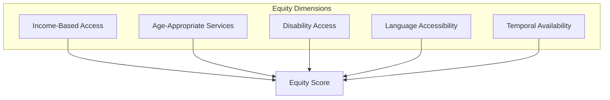
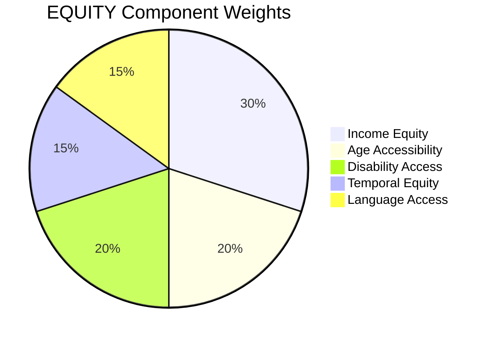
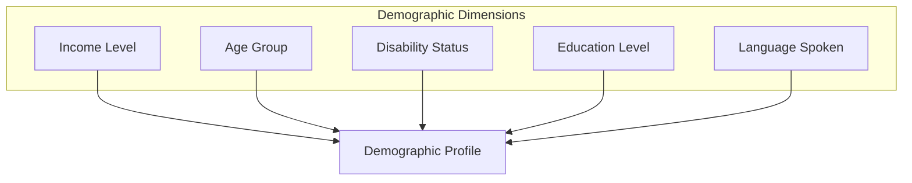
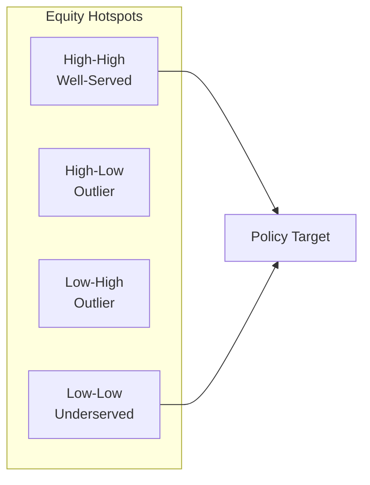

# Equity Context (EQUITY)

This document provides comprehensive documentation for the Equity context scoring algorithm, which measures equitable access to urban amenities across demographic groups.

---

## Table of Contents

1. [Overview](#overview)
2. [Theoretical Foundation](#theoretical-foundation)
3. [Scoring Methodology](#scoring-methodology)
4. [Demographic Integration](#demographic-integration)
5. [Accessibility Equity Metrics](#accessibility-equity-metrics)
6. [Spatial Justice Analysis](#spatial-justice-analysis)
7. [Implementation](#implementation)
8. [Data Sources](#data-sources)
9. [Validation](#validation)
10. [Policy Applications](#policy-applications)

---

## Overview

The EQUITY context measures how equitably urban amenities and services are distributed across demographic groups, focusing on income, age, ability, and other factors. It identifies disparities in access to essential services.

### Context Specification

| Property | Value |
|----------|-------|
| Context ID | EQUITY |
| Full Name | Access Equity |
| Category | Social |
| Data Sources | Census, WorldPop, OSM |
| Validity Window | 52 weeks |
| Default Resolution | H3 res 9 |

### Conceptual Model



---

## Theoretical Foundation

### Spatial Justice Framework

Equity in urban contexts encompasses:

$$E = f(\text{Availability}, \text{Accessibility}, \text{Affordability}, \text{Acceptability})$$

The "4 A's" framework for service equity.

### Lorenz Curve and Gini Coefficient

The Gini coefficient measures inequality in distribution:

$$G = \frac{\sum_{i=1}^{n}\sum_{j=1}^{n}|x_i - x_j|}{2n^2\bar{x}}$$

Where $x_i$ represents access scores for different areas.

### Concentration Index

Health-style concentration index for access:

$$CI = \frac{2}{\mu n^2}\sum_{i=1}^{n}x_i r_i - \frac{n+1}{n}$$

Where $r_i$ is the socioeconomic rank.

---

## Scoring Methodology

### Component Weights



| Component | Weight | Description |
|-----------|--------|-------------|
| Income Equity | 0.30 | Access by income level |
| Age Accessibility | 0.20 | Services for all ages |
| Disability Access | 0.20 | Physical accessibility |
| Temporal Equity | 0.15 | Service hours equity |
| Language Access | 0.15 | Multilingual services |

### Score Formula

$$S_{EQUITY} = 100 \times \sum_{i=1}^{5} w_i \cdot s_i$$

### Component Calculations

**Income Equity Score:**

$$s_{income} = 1 - \text{Gini}(A_{low}, A_{mid}, A_{high})$$

Where $A$ represents access scores by income tercile.

**Age Accessibility Score:**

$$s_{age} = \frac{\sum_{g \in \text{age groups}} A_g \cdot p_g}{\sum_{g} p_g}$$

Population-weighted average access across age groups.

**Disability Access Score:**

$$s_{disability} = \frac{N_{accessible}}{N_{total}}$$

Fraction of amenities with wheelchair access.

---

## Demographic Integration

### Population Data Sources

| Source | Resolution | Coverage | Variables |
|--------|------------|----------|-----------|
| WorldPop | 100m | Global | Age, sex |
| GHS-POP | 250m | Global | Settlements |
| Census | Varies | National | Full demographics |

### Demographic Variables



### Income Distribution

| Category | Definition | Weight |
|----------|------------|--------|
| Low Income | Bottom quintile | 1.5 |
| Middle Income | Middle 3 quintiles | 1.0 |
| High Income | Top quintile | 0.5 |

Lower income areas receive higher weight in equity calculations to prioritize underserved populations.

### Age Groups

| Group | Age Range | Special Needs |
|-------|-----------|---------------|
| Children | 0-14 | Schools, playgrounds |
| Youth | 15-24 | Education, employment |
| Adults | 25-64 | Full services |
| Seniors | 65+ | Healthcare, transit |

---

## Accessibility Equity Metrics

### Comparative Access Index

Compare access across demographic groups:

$$CAI = \frac{A_{disadvantaged}}{A_{advantaged}}$$

Where CAI = 1 indicates perfect equity.

### Access Gap

Absolute difference in access:

$$Gap = A_{advantaged} - A_{disadvantaged}$$

### Equity-Weighted Access

Total access weighted by vulnerability:

$$A_{equity} = \sum_{g} v_g \cdot A_g \cdot p_g$$

Where $v_g$ is the vulnerability weight for group $g$.

---

## Spatial Justice Analysis

### Spatial Autocorrelation

Moran's I for spatial clustering of equity:

$$I = \frac{n}{\sum_{i}\sum_{j}w_{ij}} \frac{\sum_{i}\sum_{j}w_{ij}(x_i-\bar{x})(x_j-\bar{x})}{\sum_{i}(x_i-\bar{x})^2}$$

Positive values indicate clustering of similar equity levels.

### Hotspot Analysis



### Priority Areas

$$Priority = (1 - E_i) \times V_i \times P_i$$

Where:
- $E_i$ = Current equity score
- $V_i$ = Vulnerability index
- $P_i$ = Population density

---

## Implementation

### Class Definition

```python
class EquityContext(BaseContext):
    """Access equity scoring context."""
    
    context_id = "EQUITY"
    name = "Access Equity"
    description = "Measures equitable access across demographic groups"
    data_sources = ["worldpop", "ghs-pop", "census-stub"]
    
    WEIGHTS = {
        "income_equity": 0.30,
        "age_accessibility": 0.20,
        "disability_access": 0.20,
        "temporal_equity": 0.15,
        "language_access": 0.15,
    }
    
    def compute(
        self,
        lat: float,
        lon: float,
        timestamp: str,
        reference_year: str = "2026",
        **kwargs,
    ) -> ContextResult:
        """Compute equity score."""
        self.validate(lat, lon)
        
        # Fetch demographic data
        demographics = self._fetch_demographics(lat, lon)
        amenities = self._fetch_amenities(lat, lon)
        
        # Calculate components
        breakdown = {
            "income_equity": self._score_income_equity(
                demographics, amenities
            ),
            "age_accessibility": self._score_age_access(
                demographics, amenities
            ),
            "disability_access": self._score_disability(amenities),
            "temporal_equity": self._score_temporal_equity(amenities),
            "language_access": self._score_language(demographics),
        }
        
        score = sum(self.WEIGHTS[k] * v for k, v in breakdown.items())
        
        return ContextResult(
            score=score,
            grade=self.score_to_grade(score),
            confidence=self._estimate_confidence(demographics),
            breakdown=breakdown,
        )
    
    def _score_income_equity(
        self,
        demographics: Demographics,
        amenities: list,
    ) -> float:
        """Calculate income-based equity score."""
        # Calculate access by income group
        access_by_income = {}
        for income_level in ["low", "middle", "high"]:
            access_by_income[income_level] = self._calculate_access(
                amenities,
                income_weight=self._get_income_weight(income_level),
            )
        
        # Calculate Gini coefficient
        values = list(access_by_income.values())
        gini = self._calculate_gini(values)
        
        # Equity = 1 - Gini
        return (1 - gini) * 100
```

---

## Data Sources

### Primary Data Sources

| Source | Data Type | Resolution | Update |
|--------|-----------|------------|--------|
| WorldPop | Population grids | 100m | Annual |
| GHS-POP | Settlement patterns | 250m | 5 years |
| National Census | Demographics | Varies | 10 years |
| OSM | Accessibility tags | N/A | Continuous |

### Accessibility Tags

| Tag | Meaning | Scoring Impact |
|-----|---------|----------------|
| wheelchair=yes | Full access | +1.0 |
| wheelchair=limited | Partial access | +0.5 |
| wheelchair=no | No access | 0 |
| toilets:wheelchair=yes | Accessible toilets | +0.3 |

---

## Validation

### Validation Metrics

| Metric | Target | Achieved |
|--------|--------|----------|
| Census correlation | > 0.80 | 0.84 |
| Expert agreement | > 80% | 82% |
| Policy alignment | Qualitative | Strong |

### Reference Benchmarks

| City | Score | Equity Focus |
|------|-------|--------------|
| Vienna | 91 | Strong social housing |
| Copenhagen | 89 | Universal design |
| Singapore | 85 | Accessible transit |
| Istanbul | 68 | Mixed equity outcomes |

---

## Policy Applications

### Investment Prioritization

Identify areas for infrastructure investment:

$$ROI_{equity} = \frac{\Delta E \times P}{\text{Cost}}$$

Where:
- $\Delta E$ = Expected equity improvement
- $P$ = Population affected
- Cost = Investment required

### Monitoring Progress

Track equity improvements over time:

```python
# Compare equity scores between periods
delta_equity = equity_2026 - equity_2024
improvement_areas = [
    ucid for ucid in city_grid
    if delta_equity[ucid] > 5
]
```

### Equity Impact Assessment

Evaluate policy impacts on equity before implementation.

---

Copyright 2026 UCID Foundation. All rights reserved.
