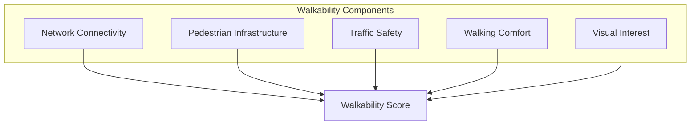
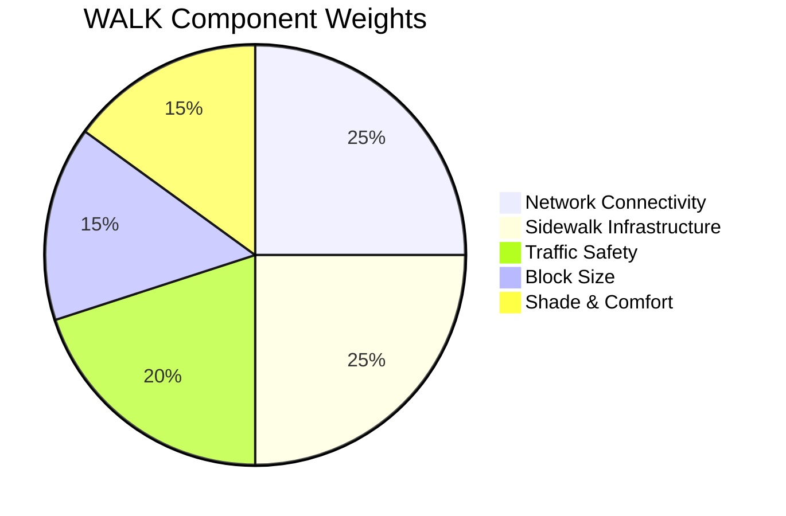
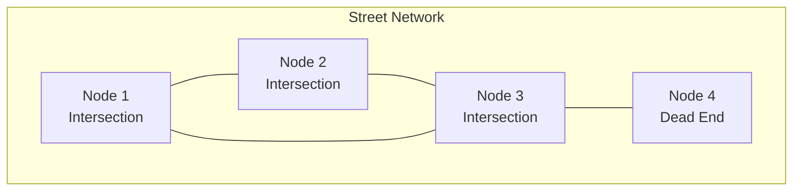
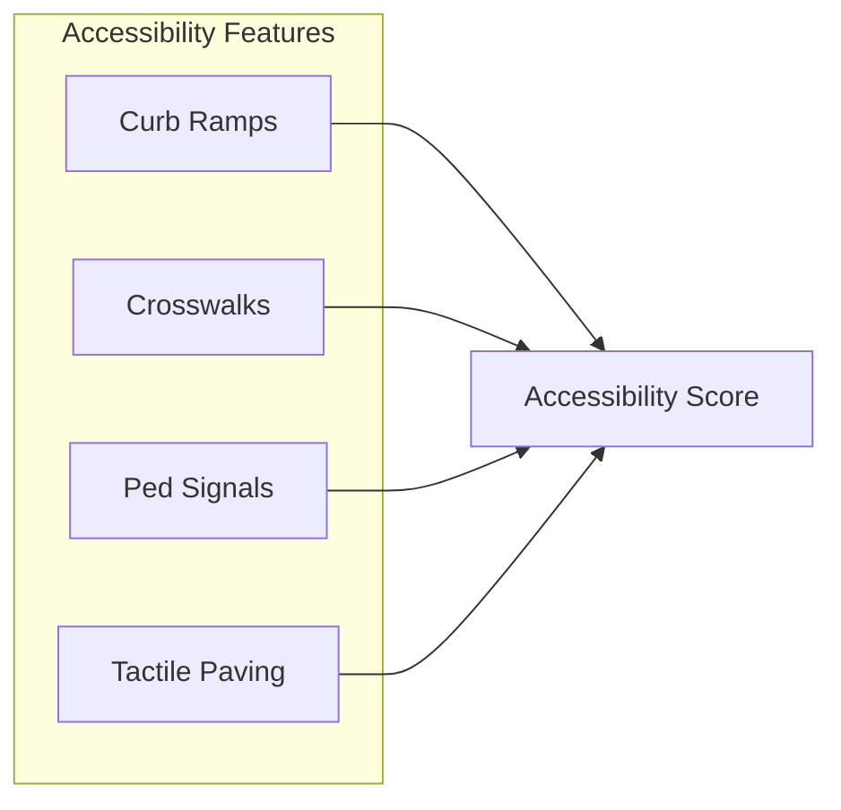

# Walkability Context (WALK)

This document provides comprehensive documentation for the Walkability context scoring algorithm, which measures pedestrian infrastructure quality and walking conditions.

---

## Table of Contents

1. [Overview](#overview)
2. [Theoretical Foundation](#theoretical-foundation)
3. [Scoring Methodology](#scoring-methodology)
4. [Network Analysis](#network-analysis)
5. [Pedestrian Infrastructure](#pedestrian-infrastructure)
6. [Safety Metrics](#safety-metrics)
7. [Implementation](#implementation)
8. [Micro-Scale Features](#micro-scale-features)
9. [Validation](#validation)
10. [Applications](#applications)

---

## Overview

The WALK context measures the quality of pedestrian infrastructure, street network connectivity, and walking conditions. It captures both the physical infrastructure and the experience of walking.

### Context Specification

| Property | Value |
|----------|-------|
| Context ID | WALK |
| Full Name | Walkability |
| Category | Mobility |
| Data Sources | OSM Roads, OSM POI |
| Validity Window | 8 weeks |
| Default Resolution | H3 res 9 |

### Conceptual Model



---

## Theoretical Foundation

### Walk Score Methodology

Walkability is a function of:

$$W = f(\text{Connectivity}, \text{Density}, \text{Diversity}, \text{Design})$$

The "4 D's" of walkability (Cervero and Kockelman).

### Pedestrian Level of Service

Based on Highway Capacity Manual methodology:

$$LOS = f(\text{sidewalk width}, \text{volume}, \text{speed})$$

| LOS | Description | Score |
|-----|-------------|-------|
| A | Free flow | 100 |
| B | Reasonably free | 85 |
| C | Stable flow | 70 |
| D | Approaching unstable | 55 |
| E | Unstable | 40 |
| F | Forced flow | 0 |

### Space Syntax Metrics

Integration (how accessible a street is):

$$I_i = \frac{n-1}{\sum_{j=1}^{n}d_{ij}}$$

Where $d_{ij}$ is the topological depth (steps) from space $i$ to space $j$.

---

## Scoring Methodology

### Component Weights



| Component | Weight | Description |
|-----------|--------|-------------|
| Network Connectivity | 0.25 | Intersection density, connectivity |
| Sidewalk Infrastructure | 0.25 | Presence and quality of sidewalks |
| Traffic Safety | 0.20 | Traffic volume, crossings |
| Block Size | 0.15 | Block perimeter, directness |
| Shade & Comfort | 0.15 | Trees, benches, protection |

### Score Formula

$$S_{WALK} = 100 \times \sum_{i=1}^{5} w_i \cdot s_i$$

### Component Calculations

**Connectivity Score:**

$$s_{connect} = \min\left(1, \frac{I_{actual}}{I_{target}}\right)$$

Where $I_{target}$ = 70 intersections per km^2.

**Sidewalk Score:**

$$s_{sidewalk} = \frac{L_{sidewalk}}{L_{road}}$$

Ratio of sidewalk length to road length.

**Block Size Score:**

$$s_{block} = \begin{cases}
1.0 & \text{if } P_{avg} \leq 400\text{m} \\
\frac{800 - P_{avg}}{400} & \text{if } 400 < P_{avg} \leq 800 \\
0 & \text{if } P_{avg} > 800\text{m}
\end{cases}$$

Where $P_{avg}$ is average block perimeter.

---

## Network Analysis

### Street Network Graph



### Network Metrics

| Metric | Formula | Interpretation |
|--------|---------|----------------|
| Node Density | $\rho_n = N/A$ | Intersections per area |
| Link Density | $\rho_l = L/A$ | Road length per area |
| Connectivity | $C = L/(N-1)$ | Links per node |
| Circuity | $\bar{c} = d_{net}/d_{eucl}$ | Route directness |

### Pedestrian Network Types

| Type | OSM Tags | Weight |
|------|----------|--------|
| Footway | highway=footway | 1.5 |
| Path | highway=path | 1.2 |
| Pedestrian | highway=pedestrian | 1.5 |
| Steps | highway=steps | 0.5 |
| Living Street | highway=living_street | 1.3 |
| Residential | highway=residential | 0.8 |

### Network Connectivity Formula

$$\text{Connectivity} = \frac{2E}{N(N-1)}$$

Where:
- $E$ = Number of street segments
- $N$ = Number of intersections

---

## Pedestrian Infrastructure

### Sidewalk Attributes

| Attribute | Tag | Scoring |
|-----------|-----|---------|
| Presence | sidewalk=* | Required |
| Width | width=* | >=2m = full score |
| Surface | surface=* | paved > unpaved |
| Smoothness | smoothness=* | good > bad |
| Lit | lit=yes | +10% |

### Accessibility Features



### Infrastructure Quality Index

$$IQI = \sum_{f} w_f \cdot p_f$$

Where:
- $w_f$ = Feature weight
- $p_f$ = Proportion of network with feature

| Feature | Weight |
|---------|--------|
| Sidewalk present | 0.30 |
| Width >= 2m | 0.20 |
| Good surface | 0.15 |
| Street lighting | 0.15 |
| Curb cuts | 0.10 |
| Pedestrian signals | 0.10 |

---

## Safety Metrics

### Traffic Safety Indicators

| Indicator | Measurement | Threshold |
|-----------|-------------|-----------|
| Speed limit | km/h | <30 km/h = safe |
| Traffic volume | AADT | <5000 = safe |
| Crossing frequency | per km | >3 = good |
| Signal timing | seconds | <60 = good |

### Pedestrian Exposure

$$E = \sum_{s \in \text{segments}} V_s \times L_s \times (1 - S_s)$$

Where:
- $V_s$ = Traffic volume on segment
- $L_s$ = Segment length
- $S_s$ = Separation score (sidewalk/buffer)

### Safe Route Score

$$S_{safe} = 1 - \frac{E}{E_{max}}$$

Lower exposure = higher safety score.

---

## Implementation

### Class Definition

```python
class WalkabilityContext(BaseContext):
    """Walkability scoring context."""
    
    context_id = "WALK"
    name = "Walkability"
    description = "Measures pedestrian infrastructure and walking conditions"
    data_sources = ["osm-roads", "osm-poi"]
    
    WEIGHTS = {
        "connectivity": 0.25,
        "infrastructure": 0.25,
        "safety": 0.20,
        "block_size": 0.15,
        "comfort": 0.15,
    }
    
    def compute(
        self,
        lat: float,
        lon: float,
        timestamp: str,
        **kwargs,
    ) -> ContextResult:
        """Compute walkability score."""
        self.validate(lat, lon)
        
        # Fetch network data
        network = self._fetch_network(lat, lon, radius=500)
        
        # Calculate components
        breakdown = {
            "connectivity": self._score_connectivity(network),
            "infrastructure": self._score_infrastructure(network),
            "safety": self._score_safety(network),
            "block_size": self._score_blocks(network),
            "comfort": self._score_comfort(lat, lon),
        }
        
        score = sum(self.WEIGHTS[k] * v for k, v in breakdown.items())
        
        return ContextResult(
            score=score,
            grade=self.score_to_grade(score),
            confidence=self._estimate_confidence(network),
            breakdown=breakdown,
        )
    
    def _score_connectivity(self, network: nx.Graph) -> float:
        """Calculate network connectivity score."""
        if len(network.nodes) < 2:
            return 0.0
        
        # Calculate intersection density
        area_km2 = self._calculate_area(network)
        n_intersections = sum(
            1 for n, d in network.degree() if d >= 3
        )
        
        density = n_intersections / area_km2 if area_km2 > 0 else 0
        target_density = 70  # intersections per km^2
        
        return min(100, (density / target_density) * 100)
```

---

## Micro-Scale Features

### Street-Level Audit Items

| Feature | Scoring Impact | Measurement |
|---------|----------------|-------------|
| Street trees | +10% | Per 50m |
| Benches | +5% | Per block |
| Shade structures | +5% | Percentage |
| Active frontage | +10% | Retail proportion |
| Blank walls | -10% | Proportion |

### Pedestrian Experience Index

$$PEI = \sum_{i} w_i \cdot f_i + \sum_{j} p_j \cdot n_j$$

Where:
- $f_i$ = Positive features (trees, benches)
- $n_j$ = Negative features (blank walls, parking)

---

## Validation

### Validation Metrics

| Metric | Target | Achieved |
|--------|--------|----------|
| Pedestrian count correlation | > 0.70 | 0.76 |
| Walk Score correlation | > 0.85 | 0.88 |
| Expert audit agreement | > 80% | 84% |

### Reference Benchmarks

| City/Area | Score | Characteristics |
|-----------|-------|-----------------|
| Barcelona Eixample | 95 | Superblocks, wide sidewalks |
| Copenhagen Center | 92 | Car-free streets |
| Melbourne CBD | 88 | Lane network |
| Istanbul Kadikoy | 72 | Mixed infrastructure |
| Suburban sprawl | 25 | Car-oriented |

---

## Applications

### Route Planning

Find most walkable route:

```python
def find_walkable_route(origin, destination, network):
    """Find route maximizing walkability."""
    return nx.shortest_path(
        network,
        origin,
        destination,
        weight='walkability_cost',
    )
```

### Infrastructure Investment

Prioritize sidewalk improvements:

$$Priority = (1 - W_i) \times P_i \times T_i$$

Where:
- $W_i$ = Current walkability
- $P_i$ = Pedestrian potential
- $T_i$ = Transit connectivity

### Health Impact Assessment

Correlating walkability with physical activity and health outcomes.

---

Copyright 2026 UCID Foundation. All rights reserved.
