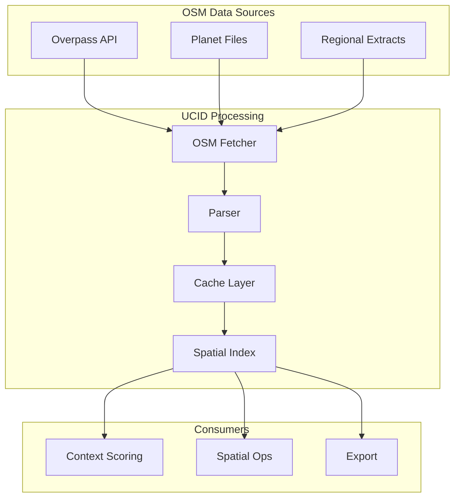
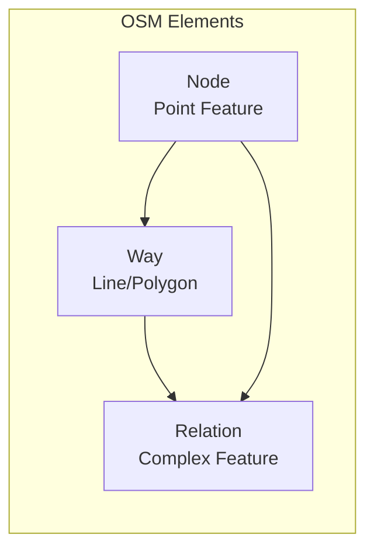
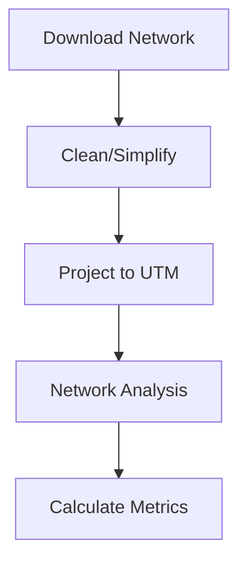
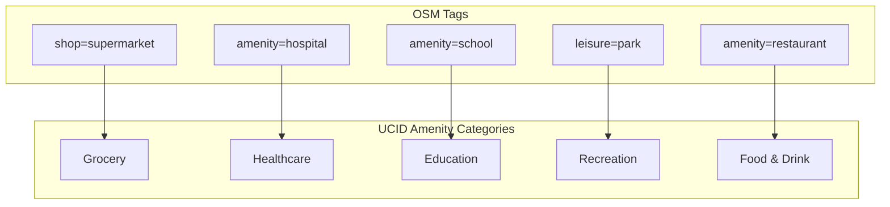
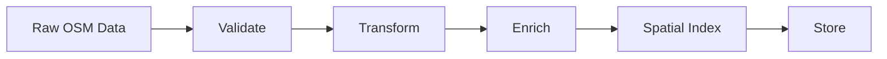
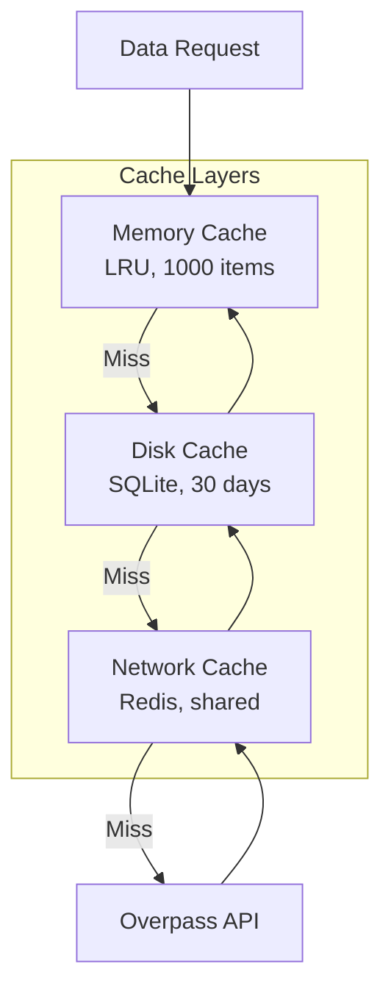

# OpenStreetMap Data Integration

This document provides comprehensive documentation for integrating OpenStreetMap (OSM) data into UCID, including data fetching, processing, caching, and quality assurance procedures.

---

## Table of Contents

1. [Overview](#overview)
2. [OSM Data Model](#osm-data-model)
3. [Data Fetching](#data-fetching)
4. [OSMnx Integration](#osmnx-integration)
5. [Tag Mapping](#tag-mapping)
6. [Data Processing](#data-processing)
7. [Caching Strategy](#caching-strategy)
8. [Quality Assurance](#quality-assurance)
9. [Implementation](#implementation)
10. [Best Practices](#best-practices)

---

## Overview

OpenStreetMap is the primary data source for UCID's spatial analysis, providing road networks, points of interest, land use, and building footprints. UCID integrates OSM data through multiple APIs and processing pipelines.

### Data Categories

| Category | OSM Elements | UCID Usage |
|----------|--------------|------------|
| Road Network | way[highway=*] | Walkability, routing |
| Amenities | node[amenity=*] | 15MIN, Vitality |
| Land Use | area[landuse=*] | Climate, Equity |
| Buildings | way[building=*] | Density analysis |
| Transit | node[public_transport=*] | Transit scoring |

### Integration Architecture



---

## OSM Data Model

### Element Types



### Node Structure

| Field | Type | Description |
|-------|------|-------------|
| id | int64 | Unique identifier |
| lat | float | Latitude |
| lon | float | Longitude |
| tags | dict | Key-value attributes |
| version | int | Edit version |
| timestamp | datetime | Last edit time |

### Way Structure

| Field | Type | Description |
|-------|------|-------------|
| id | int64 | Unique identifier |
| nodes | list[int64] | Ordered node references |
| tags | dict | Key-value attributes |
| closed | bool | Is polygon (first=last node) |

### Tag System

OSM uses a flexible key=value tagging system:

$$\text{Feature} = \{(k_1, v_1), (k_2, v_2), ..., (k_n, v_n)\}$$

Common conventions:
- Primary tag: `amenity=restaurant`
- Secondary tags: `cuisine=turkish`, `name=Kebap House`
- Metadata tags: `source=survey`, `operator=Company`

---

## Data Fetching

### Overpass API

The Overpass API provides flexible querying of OSM data:

```python
from ucid.data.osm import OSMFetcher

fetcher = OSMFetcher()

# Fetch amenities in bounding box
amenities = fetcher.fetch_amenities(
    bbox=(28.8, 40.9, 29.2, 41.1),
    amenity_types=["restaurant", "cafe", "hospital"],
)

# Fetch with custom Overpass query
query = """
[out:json][timeout:60];
(
  node["amenity"="school"]({{bbox}});
  way["amenity"="school"]({{bbox}});
);
out body geom;
"""
schools = fetcher.fetch_custom(query, bbox=(28.8, 40.9, 29.2, 41.1))
```

### Overpass Query Language

Basic query structure:

```overpass
[out:json][timeout:60];
(
  // Nodes with highway tag
  node["highway"]({{bbox}});
  // Ways with highway tag
  way["highway"]({{bbox}});
);
out body geom;
```

### Query Optimization

| Technique | Description | Impact |
|-----------|-------------|--------|
| Bbox reduction | Smaller area queries | -70% response time |
| Tag filtering | Request only needed tags | -50% data size |
| Output format | Use `out:json` | Faster parsing |
| Timeout increase | Prevent failures | Better reliability |

### Rate Limiting

Overpass API rate limits:

| Limit | Value | Mitigation |
|-------|-------|------------|
| Requests/min | 10 | Request queuing |
| Data/request | 1 GB | Chunked queries |
| Concurrent | 2 | Connection pooling |

---

## OSMnx Integration

### Network Analysis

OSMnx provides high-level network analysis:

```python
import osmnx as ox

# Download walk network
G = ox.graph_from_point(
    (41.015, 28.979),
    dist=1000,
    network_type='walk',
)

# Basic stats
stats = ox.basic_stats(G)
print(f"Nodes: {stats['n']}")
print(f"Edges: {stats['m']}")
print(f"Avg degree: {stats['k_avg']:.2f}")
```

### Network Types

| Type | Description | Use Case |
|------|-------------|----------|
| walk | Pedestrian network | Walkability |
| drive | Driving network | Car accessibility |
| bike | Cycling network | Bike infrastructure |
| all | All networks | Complete analysis |

### Graph Operations



### Key Metrics from OSMnx

| Metric | Formula | Interpretation |
|--------|---------|----------------|
| Node Density | $n/A$ | Connectivity |
| Edge Density | $m/A$ | Coverage |
| Circuity | $\bar{c}$ | Route efficiency |
| Avg Degree | $2m/n$ | Intersection type |

---

## Tag Mapping

### Amenity Categories



### Complete Tag Mapping

| UCID Category | OSM Tags | Priority |
|---------------|----------|----------|
| grocery | shop=supermarket, shop=grocery, shop=convenience | High |
| healthcare | amenity=hospital, amenity=clinic, amenity=pharmacy | High |
| education | amenity=school, amenity=kindergarten, amenity=university | High |
| public_space | leisure=park, leisure=garden, landuse=village_green | Medium |
| transit | highway=bus_stop, railway=station, railway=tram_stop | High |
| food_drink | amenity=restaurant, amenity=cafe, amenity=bar | Medium |
| cultural | amenity=theatre, amenity=cinema, amenity=museum | Medium |
| retail | shop=*, building=retail | Low |

### Tag Weights

Quality weighting based on OSM tags:

```python
TAG_WEIGHTS = {
    "amenity": {
        "hospital": 2.0,
        "clinic": 1.0,
        "pharmacy": 0.8,
        "restaurant": 1.0,
        "fast_food": 0.6,
    },
    "shop": {
        "supermarket": 1.5,
        "grocery": 1.0,
        "convenience": 0.7,
    },
}
```

---

## Data Processing

### Processing Pipeline



### Geometry Processing

```python
from shapely.geometry import Point, Polygon
from shapely.ops import transform
import pyproj

def process_osm_element(element: dict) -> dict:
    """Process OSM element to UCID format."""
    if element["type"] == "node":
        geom = Point(element["lon"], element["lat"])
    elif element["type"] == "way" and element.get("geometry"):
        coords = [(n["lon"], n["lat"]) for n in element["geometry"]]
        if coords[0] == coords[-1]:
            geom = Polygon(coords)
        else:
            geom = LineString(coords)
    
    # Project to local UTM
    utm_crs = get_utm_crs(geom.centroid.y, geom.centroid.x)
    project = pyproj.Transformer.from_crs("EPSG:4326", utm_crs).transform
    geom_utm = transform(project, geom)
    
    return {
        "osm_id": element["id"],
        "type": element["type"],
        "geometry": geom,
        "geometry_utm": geom_utm,
        "tags": element.get("tags", {}),
        "category": classify_element(element),
    }
```

### Category Classification

```python
def classify_element(element: dict) -> str:
    """Classify OSM element into UCID category."""
    tags = element.get("tags", {})
    
    # Priority order classification
    if tags.get("amenity") in HEALTHCARE_TAGS:
        return "healthcare"
    if tags.get("shop") in GROCERY_TAGS:
        return "grocery"
    if tags.get("amenity") in EDUCATION_TAGS:
        return "education"
    if tags.get("leisure") in RECREATION_TAGS:
        return "public_space"
    
    return "other"
```

---

## Caching Strategy

### Cache Architecture



### Cache Implementation

```python
from ucid.data.cache import FileCache

class OSMFetcher:
    def __init__(self, cache_dir: str = ".ucid_cache/osm"):
        self.cache = FileCache(
            cache_dir=cache_dir,
            ttl_hours=720,  # 30 days
        )
    
    def fetch_amenities(self, bbox: tuple, **kwargs) -> list:
        cache_key = f"amenities:{bbox}:{hash(frozenset(kwargs.items()))}"
        
        cached = self.cache.get(cache_key)
        if cached:
            return cached
        
        result = self._fetch_from_api(bbox, **kwargs)
        self.cache.set(cache_key, result)
        return result
```

### Cache Invalidation

| Trigger | Action | Scope |
|---------|--------|-------|
| TTL expiry | Auto-delete | Per-entry |
| OSM update | Manual refresh | Per-region |
| Version change | Full clear | Global |
| Storage limit | LRU eviction | Oldest entries |

---

## Quality Assurance

### Data Quality Metrics

| Metric | Formula | Target |
|--------|---------|--------|
| Completeness | $\frac{\text{features with name}}{\text{total features}}$ | > 0.80 |
| Positional accuracy | Mean displacement | < 10m |
| Currency | Age of last edit | < 1 year |
| Consistency | Tag format compliance | > 0.95 |

### Validation Checks

```python
def validate_osm_data(features: list) -> ValidationResult:
    """Validate OSM data quality."""
    issues = []
    
    for feature in features:
        # Check required tags
        if not feature.tags.get("name"):
            issues.append(QualityIssue(
                feature.id,
                "MISSING_NAME",
                "Feature lacks name tag",
            ))
        
        # Check geometry validity
        if not feature.geometry.is_valid:
            issues.append(QualityIssue(
                feature.id,
                "INVALID_GEOMETRY",
                feature.geometry.explain_validity(),
            ))
        
        # Check tag consistency
        if feature.tags.get("amenity") and feature.tags.get("shop"):
            issues.append(QualityIssue(
                feature.id,
                "TAG_CONFLICT",
                "Both amenity and shop tags present",
            ))
    
    return ValidationResult(
        total=len(features),
        valid=len(features) - len(issues),
        issues=issues,
    )
```

### Completeness by Region

| Region | OSM Completeness | Notes |
|--------|------------------|-------|
| Western Europe | 95%+ | Excellent |
| North America | 90%+ | Very good |
| East Asia | 80%+ | Good |
| Middle East | 70%+ | Moderate |
| Africa | 50-80% | Variable |

---

## Implementation

### OSMFetcher Class

```python
class OSMFetcher:
    """Fetches and processes OSM data for UCID."""
    
    OVERPASS_URL = "https://overpass-api.de/api/interpreter"
    
    def __init__(
        self,
        cache_dir: str = ".ucid_cache/osm",
        timeout: int = 60,
    ):
        self.cache = FileCache(cache_dir, ttl_hours=720)
        self.timeout = timeout
        self.session = httpx.Client(timeout=timeout)
    
    def fetch_amenities(
        self,
        lat: float,
        lon: float,
        radius: int = 1000,
        categories: list[str] | None = None,
    ) -> list[OSMFeature]:
        """Fetch amenities near a point."""
        bbox = self._point_to_bbox(lat, lon, radius)
        
        # Build query
        tags = self._categories_to_tags(categories)
        query = self._build_query(tags, bbox)
        
        # Execute with caching
        cache_key = f"amenities:{lat:.3f}:{lon:.3f}:{radius}"
        return self._fetch_cached(cache_key, query)
    
    def fetch_network(
        self,
        lat: float,
        lon: float,
        radius: int = 1000,
        network_type: str = "walk",
    ) -> nx.MultiDiGraph:
        """Fetch road network as graph."""
        import osmnx as ox
        
        return ox.graph_from_point(
            (lat, lon),
            dist=radius,
            network_type=network_type,
        )
```

---

## Best Practices

### Recommendations

| Practice | Rationale |
|----------|-----------|
| Use caching | Reduce API load, improve speed |
| Chunk large areas | Avoid timeouts |
| Validate data | Handle OSM inconsistencies |
| Update periodically | Keep data current |
| Log data quality | Track completeness issues |

### Common Pitfalls

| Issue | Solution |
|-------|----------|
| Rate limiting | Implement backoff |
| Incomplete data | Use multiple sources |
| Tag inconsistency | Normalize mappings |
| Geometry errors | Validate and fix |

---

Copyright 2026 UCID Foundation. All rights reserved.
