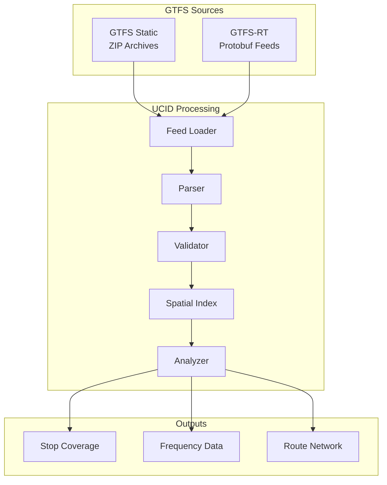
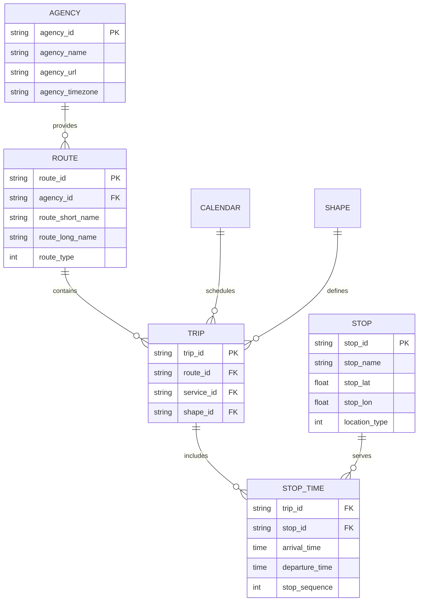
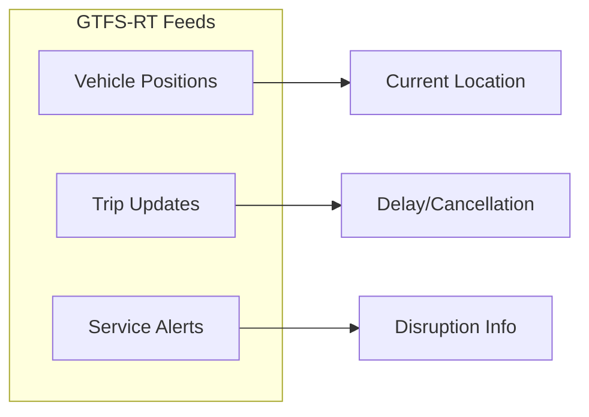
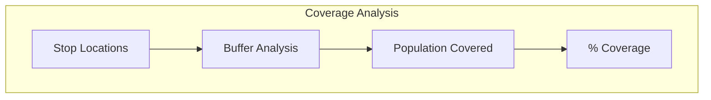
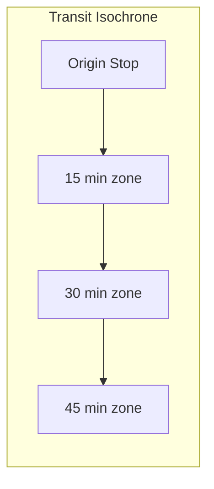
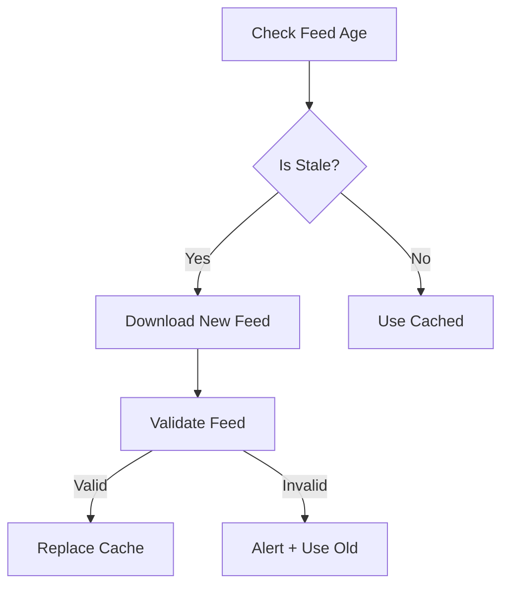

# GTFS Data Integration

This document provides comprehensive documentation for integrating General Transit Feed Specification (GTFS) data into UCID for public transportation analysis.

---

## Table of Contents

1. [Overview](#overview)
2. [GTFS Static Format](#gtfs-static-format)
3. [GTFS Realtime](#gtfs-realtime)
4. [Data Loading](#data-loading)
5. [Transit Metrics](#transit-metrics)
6. [Spatial Operations](#spatial-operations)
7. [Temporal Analysis](#temporal-analysis)
8. [Implementation](#implementation)
9. [Feed Management](#feed-management)
10. [Quality Assurance](#quality-assurance)

---

## Overview

GTFS (General Transit Feed Specification) is the standard format for public transportation schedules and associated geographic information. UCID integrates GTFS data for transit quality scoring.

### GTFS Components

| Component | Files | Purpose |
|-----------|-------|---------|
| Schedule | trips.txt, stop_times.txt | Service timing |
| Geography | stops.txt, shapes.txt | Locations, routes |
| Service | calendar.txt, calendar_dates.txt | Operating days |
| Fares | fare_attributes.txt | Pricing |
| Realtime | Vehicle positions, alerts | Live updates |

### Integration Architecture



---

## GTFS Static Format

### Required Files

| File | Contents | UCID Usage |
|------|----------|------------|
| agency.txt | Transit agencies | Metadata |
| stops.txt | Stop locations | Spatial scoring |
| routes.txt | Route definitions | Coverage |
| trips.txt | Scheduled trips | Frequency |
| stop_times.txt | Arrival/departure | Schedule |
| calendar.txt | Service days | Temporal |

### Entity Relationships



### Route Types

| Type Code | Mode | Icon |
|-----------|------|------|
| 0 | Tram, Light Rail | Tram |
| 1 | Subway, Metro | Metro |
| 2 | Rail | Train |
| 3 | Bus | Bus |
| 4 | Ferry | Ferry |
| 5 | Cable Tram | Cable |
| 6 | Aerial Lift | Gondola |
| 7 | Funicular | Funicular |
| 11 | Trolleybus | Trolley |
| 12 | Monorail | Mono |

---

## GTFS Realtime

### Realtime Entities



### Protobuf Message Structure

```protobuf
message FeedMessage {
  required FeedHeader header = 1;
  repeated FeedEntity entity = 2;
}

message TripUpdate {
  required TripDescriptor trip = 1;
  repeated StopTimeUpdate stop_time_update = 2;
  optional int64 timestamp = 4;
  optional int32 delay = 5;
}

message VehiclePosition {
  optional TripDescriptor trip = 1;
  optional VehicleDescriptor vehicle = 8;
  optional Position position = 2;
  optional uint32 current_stop_sequence = 3;
  optional string stop_id = 7;
}
```

### Realtime Integration

```python
from google.transit import gtfs_realtime_pb2
import httpx

def fetch_vehicle_positions(feed_url: str) -> list:
    """Fetch current vehicle positions from GTFS-RT feed."""
    response = httpx.get(feed_url)
    
    feed = gtfs_realtime_pb2.FeedMessage()
    feed.ParseFromString(response.content)
    
    positions = []
    for entity in feed.entity:
        if entity.HasField('vehicle'):
            vp = entity.vehicle
            positions.append({
                'trip_id': vp.trip.trip_id,
                'lat': vp.position.latitude,
                'lon': vp.position.longitude,
                'timestamp': vp.timestamp,
            })
    
    return positions
```

---

## Data Loading

### Feed Loading

```python
from ucid.data.gtfs import GTFSManager

gtfs = GTFSManager()

# Load from ZIP file
gtfs.load_feed("istanbul_gtfs.zip")

# Load from URL
gtfs.load_feed_from_url("https://data.city.gov/gtfs.zip")

# Load multiple feeds
gtfs.load_feeds([
    "bus_gtfs.zip",
    "metro_gtfs.zip",
    "ferry_gtfs.zip",
])
```

### Parsing Implementation

```python
import pandas as pd
from zipfile import ZipFile

class GTFSParser:
    """Parse GTFS static feeds."""
    
    REQUIRED_FILES = [
        'agency.txt', 'stops.txt', 'routes.txt',
        'trips.txt', 'stop_times.txt', 'calendar.txt'
    ]
    
    def parse(self, gtfs_path: str) -> GTFSFeed:
        """Parse GTFS ZIP file."""
        with ZipFile(gtfs_path) as zf:
            # Validate required files
            file_list = zf.namelist()
            for required in self.REQUIRED_FILES:
                if required not in file_list:
                    raise GTFSValidationError(f"Missing {required}")
            
            # Parse each file
            stops = pd.read_csv(zf.open('stops.txt'))
            routes = pd.read_csv(zf.open('routes.txt'))
            trips = pd.read_csv(zf.open('trips.txt'))
            stop_times = pd.read_csv(zf.open('stop_times.txt'))
            
            return GTFSFeed(
                stops=stops,
                routes=routes,
                trips=trips,
                stop_times=stop_times,
            )
```

---

## Transit Metrics

### Frequency Calculation

Frequency (trips per hour) at a stop:

$$f = \frac{N_{trips}}{T_{hours}}$$

Average headway:

$$h = \frac{60}{f} \text{ minutes}$$

### Frequency by Time Period

| Period | Hours | Typical Frequency |
|--------|-------|-------------------|
| AM Peak | 07:00-09:00 | High (5-10 min) |
| Midday | 09:00-16:00 | Medium (10-15 min) |
| PM Peak | 16:00-19:00 | High (5-10 min) |
| Evening | 19:00-23:00 | Low (15-30 min) |
| Night | 23:00-07:00 | Very low (30+ min) |

### Stop Accessibility

Stop density within walking distance:

$$\rho_{stops} = \frac{N_{stops}}{A_{km^2}}$$

Service level:

$$SL = \sum_{s \in stops} w_s \cdot f_s$$

Where $w_s$ is mode weight and $f_s$ is frequency.

### Coverage Metrics



### Implementation

```python
def calculate_frequency(
    stop_id: str,
    start_time: str,
    end_time: str,
    date: str,
) -> float:
    """Calculate trips per hour for a stop."""
    # Get stop times for the date
    trips = get_trips_at_stop(stop_id, date)
    
    # Filter by time range
    trips_in_range = [
        t for t in trips
        if start_time <= t.arrival_time <= end_time
    ]
    
    # Calculate frequency
    hours = time_diff_hours(start_time, end_time)
    return len(trips_in_range) / hours if hours > 0 else 0
```

---

## Spatial Operations

### Stop Buffering

Create service areas around stops:

```python
from shapely.geometry import Point
from shapely.ops import unary_union

def create_service_area(stops: list, buffer_m: float = 400) -> Polygon:
    """Create combined service area from stops."""
    buffers = []
    for stop in stops:
        point = Point(stop.lon, stop.lat)
        # Convert to UTM, buffer, convert back
        point_utm = to_utm(point)
        buffer_utm = point_utm.buffer(buffer_m)
        buffers.append(from_utm(buffer_utm))
    
    return unary_union(buffers)
```

### Isochrone Generation

Transit travel time isochrones:



### Network Graph

Build transit network graph:

```python
import networkx as nx

def build_transit_graph(feed: GTFSFeed) -> nx.DiGraph:
    """Build directed graph of transit connections."""
    G = nx.DiGraph()
    
    # Add nodes (stops)
    for _, stop in feed.stops.iterrows():
        G.add_node(
            stop.stop_id,
            lat=stop.stop_lat,
            lon=stop.stop_lon,
            name=stop.stop_name,
        )
    
    # Add edges (connections)
    for trip_id, group in feed.stop_times.groupby('trip_id'):
        stops = group.sort_values('stop_sequence')
        for i in range(len(stops) - 1):
            from_stop = stops.iloc[i].stop_id
            to_stop = stops.iloc[i + 1].stop_id
            travel_time = parse_time_diff(
                stops.iloc[i].departure_time,
                stops.iloc[i + 1].arrival_time,
            )
            G.add_edge(from_stop, to_stop, time=travel_time)
    
    return G
```

---

## Temporal Analysis

### Service Calendar

```python
def get_active_service_ids(date: str, calendar: pd.DataFrame) -> list:
    """Get service IDs active on a date."""
    dow = date_to_weekday(date)  # 'monday', 'tuesday', etc.
    
    active = calendar[
        (calendar[dow] == 1) &
        (calendar.start_date <= date) &
        (calendar.end_date >= date)
    ]
    
    return active.service_id.tolist()
```

### Peak Hour Detection

Identify peak service hours:

```python
def detect_peak_hours(stop_id: str, date: str) -> dict:
    """Detect AM and PM peak hours."""
    hourly_freq = {}
    for hour in range(24):
        freq = calculate_frequency(
            stop_id,
            f"{hour:02d}:00",
            f"{hour+1:02d}:00",
            date,
        )
        hourly_freq[hour] = freq
    
    # Find peaks
    am_peak = max(range(6, 10), key=lambda h: hourly_freq[h])
    pm_peak = max(range(16, 20), key=lambda h: hourly_freq[h])
    
    return {
        'am_peak': am_peak,
        'am_peak_freq': hourly_freq[am_peak],
        'pm_peak': pm_peak,
        'pm_peak_freq': hourly_freq[pm_peak],
    }
```

---

## Implementation

### GTFSManager Class

```python
class GTFSManager:
    """Manage GTFS feeds for transit analysis."""
    
    def __init__(self, cache_dir: str = ".ucid_cache/gtfs"):
        self.feeds: dict[str, GTFSFeed] = {}
        self.cache_dir = cache_dir
    
    def load_feed(self, path: str, feed_id: str = "default") -> None:
        """Load a GTFS feed."""
        parser = GTFSParser()
        feed = parser.parse(path)
        self.feeds[feed_id] = feed
    
    def get_stops_near(
        self,
        lat: float,
        lon: float,
        radius_m: float = 500,
        feed_id: str = "default",
    ) -> list[GTFSStop]:
        """Get stops within radius of a point."""
        feed = self.feeds[feed_id]
        nearby = []
        
        for _, stop in feed.stops.iterrows():
            dist = haversine(lat, lon, stop.stop_lat, stop.stop_lon)
            if dist <= radius_m:
                nearby.append(GTFSStop(
                    stop_id=stop.stop_id,
                    name=stop.stop_name,
                    lat=stop.stop_lat,
                    lon=stop.stop_lon,
                    distance=dist,
                ))
        
        return sorted(nearby, key=lambda s: s.distance)
    
    def get_frequency(
        self,
        stop_id: str,
        time_range: tuple[str, str],
        date: str | None = None,
    ) -> float:
        """Get frequency (trips/hour) at a stop."""
        date = date or today()
        return calculate_frequency(
            stop_id,
            time_range[0],
            time_range[1],
            date,
        )
```

---

## Feed Management

### Feed Sources

| City | Feed URL | Update Frequency |
|------|----------|------------------|
| Istanbul | iett.istanbul/gtfs | Daily |
| Helsinki | hsl.fi/gtfs | Real-time |
| NYC | mta.info/gtfs | Real-time |

### Update Strategy



---

## Quality Assurance

### Validation Checks

| Check | Severity | Description |
|-------|----------|-------------|
| Required files | Error | Must have all required files |
| Stop coordinates | Error | Valid lat/lon range |
| Time format | Warning | HH:MM:SS format |
| Route references | Error | Foreign keys valid |
| Calendar dates | Warning | Future service defined |

### Feed Scoring

$$Q_{feed} = \sum_{i} w_i \cdot c_i$$

Where:
- $w_i$ = Check weight
- $c_i$ = Check pass/fail (1/0)

---

Copyright 2026 UCID Foundation. All rights reserved.
