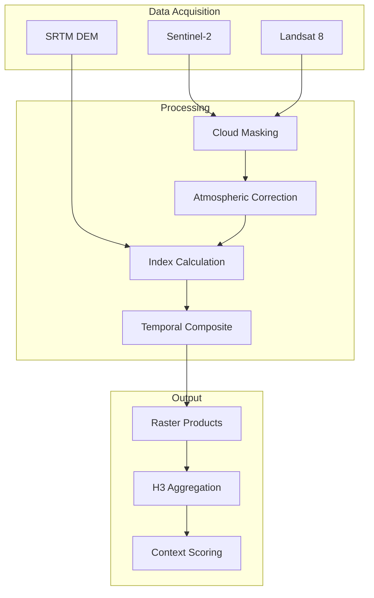
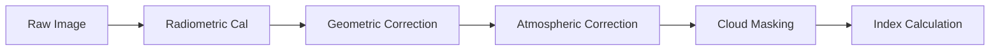
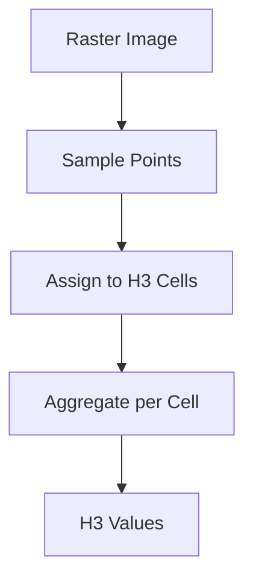

# Remote Sensing Data Integration

This document provides documentation for integrating satellite imagery and remote sensing data into UCID for climate and land cover analysis.

---

## Table of Contents

1. [Overview](#overview)
2. [Satellite Data Sources](#satellite-data-sources)
3. [Spectral Indices](#spectral-indices)
4. [Image Processing](#image-processing)
5. [Cloud Masking](#cloud-masking)
6. [Temporal Compositing](#temporal-compositing)
7. [H3 Aggregation](#h3-aggregation)
8. [Implementation](#implementation)
9. [Quality Assurance](#quality-assurance)
10. [Best Practices](#best-practices)

---

## Overview

Remote sensing data provides crucial inputs for UCID's climate and environmental analysis, including vegetation indices, land surface temperature, and urban morphology metrics.

### Data Types

| Data Type | Source | Resolution | Use Case |
|-----------|--------|------------|----------|
| Multispectral | Sentinel-2 | 10-60m | NDVI, Land cover |
| Thermal | Landsat 8/9 | 100m | Surface temperature |
| SAR | Sentinel-1 | 10m | Flood mapping |
| Elevation | SRTM, ALOS | 30m | Terrain analysis |

### Processing Pipeline



---

## Satellite Data Sources

### Sentinel-2 MSI

| Band | Wavelength (nm) | Resolution | Application |
|------|-----------------|------------|-------------|
| B2 | 490 (Blue) | 10m | RGB, water |
| B3 | 560 (Green) | 10m | RGB, vegetation |
| B4 | 665 (Red) | 10m | NDVI, chlorophyll |
| B5 | 705 (Red Edge 1) | 20m | Vegetation stress |
| B6 | 740 (Red Edge 2) | 20m | LAI |
| B7 | 783 (Red Edge 3) | 20m | LAI |
| B8 | 842 (NIR) | 10m | NDVI, biomass |
| B8A | 865 (NIR narrow) | 20m | Water vapor |
| B11 | 1610 (SWIR 1) | 20m | Built-up, moisture |
| B12 | 2190 (SWIR 2) | 20m | Geology, moisture |

### Landsat 8/9 OLI/TIRS

| Band | Wavelength | Resolution | Application |
|------|------------|------------|-------------|
| B2-4 | Visible | 30m | RGB composite |
| B5 | NIR | 30m | Vegetation |
| B6-7 | SWIR | 30m | Built-up |
| B10 | TIR 1 | 100m | Surface temp |
| B11 | TIR 2 | 100m | Surface temp |

---

## Spectral Indices

### Vegetation Indices

**NDVI (Normalized Difference Vegetation Index):**

$$NDVI = \frac{NIR - Red}{NIR + Red}$$

**EVI (Enhanced Vegetation Index):**

$$EVI = 2.5 \times \frac{NIR - Red}{NIR + 6 \times Red - 7.5 \times Blue + 1}$$

**SAVI (Soil Adjusted Vegetation Index):**

$$SAVI = \frac{(NIR - Red) \times (1 + L)}{NIR + Red + L}$$

Where $L = 0.5$ for moderate vegetation.

### Built-Up Indices

**NDBI (Normalized Difference Built-up Index):**

$$NDBI = \frac{SWIR - NIR}{SWIR + NIR}$$

**UI (Urban Index):**

$$UI = \frac{SWIR2 - NIR}{SWIR2 + NIR}$$

### Water Indices

**NDWI (Normalized Difference Water Index):**

$$NDWI = \frac{Green - NIR}{Green + NIR}$$

**MNDWI (Modified NDWI):**

$$MNDWI = \frac{Green - SWIR}{Green + SWIR}$$

### Land Surface Temperature

From thermal bands:

$$LST = \frac{T_B}{1 + (\lambda \cdot T_B / \rho) \cdot \ln(\epsilon)}$$

Where:
- $T_B$ = Brightness temperature
- $\lambda$ = Wavelength (11.5 $\mu$m)
- $\rho = 1.438 \times 10^{-2}$ m K
- $\epsilon$ = Land surface emissivity

---

## Image Processing

### Processing Workflow



### Atmospheric Correction

Convert DN to surface reflectance:

$$\rho_s = \frac{\pi \cdot (L_\lambda - L_p)}{T_v \cdot (E_s \cdot \cos\theta_s \cdot T_z + E_d)}$$

Where:
- $L_\lambda$ = At-sensor radiance
- $L_p$ = Path radiance
- $T_v, T_z$ = Atmospheric transmittance
- $E_s$ = Solar irradiance
- $E_d$ = Diffuse irradiance

### Implementation

```python
import rasterio
import numpy as np

def calculate_ndvi(red_band: np.ndarray, nir_band: np.ndarray) -> np.ndarray:
    """Calculate NDVI from red and NIR bands."""
    # Avoid division by zero
    denominator = nir_band.astype(float) + red_band.astype(float)
    denominator[denominator == 0] = np.nan
    
    ndvi = (nir_band.astype(float) - red_band.astype(float)) / denominator
    
    # Clip to valid range
    ndvi = np.clip(ndvi, -1, 1)
    
    return ndvi
```

---

## Cloud Masking

### Sentinel-2 SCL Classification

| Value | Class | Action |
|-------|-------|--------|
| 0 | No data | Mask |
| 1 | Saturated/defective | Mask |
| 2 | Dark area | Keep |
| 3 | Cloud shadow | Mask |
| 4 | Vegetation | Keep |
| 5 | Not vegetated | Keep |
| 6 | Water | Keep |
| 7 | Unclassified | Keep |
| 8 | Cloud medium probability | Mask |
| 9 | Cloud high probability | Mask |
| 10 | Thin cirrus | Mask |
| 11 | Snow/ice | Keep/Context |

### Cloud Mask Implementation

```python
def create_cloud_mask(scl: np.ndarray) -> np.ndarray:
    """Create binary cloud mask from SCL band."""
    # Classes to mask
    cloud_classes = [0, 1, 3, 8, 9, 10]
    
    mask = np.isin(scl, cloud_classes)
    
    return mask  # True = cloudy/invalid
```

---

## Temporal Compositing

### Median Composite

Reduce cloud impact using temporal median:

$$p_{composite}(x, y) = \text{median}(\{p_t(x, y) : t \in T, \neg cloud_t(x, y)\})$$

### Maximum NDVI Composite

For vegetation monitoring:

$$NDVI_{max}(x, y) = \max(\{NDVI_t(x, y) : t \in T\})$$

### Implementation

```python
def create_temporal_composite(
    images: list[np.ndarray],
    masks: list[np.ndarray],
    method: str = "median",
) -> np.ndarray:
    """Create temporal composite from image stack."""
    # Stack images
    stack = np.stack(images, axis=0)
    mask_stack = np.stack(masks, axis=0)
    
    # Apply masks
    masked = np.ma.array(stack, mask=mask_stack)
    
    if method == "median":
        return np.ma.median(masked, axis=0).data
    elif method == "max":
        return np.ma.max(masked, axis=0).data
    elif method == "mean":
        return np.ma.mean(masked, axis=0).data
```

---

## H3 Aggregation

### Raster to H3



### Aggregation Methods

| Method | Formula | Use Case |
|--------|---------|----------|
| Mean | $\bar{x} = \frac{1}{n}\sum x_i$ | Average NDVI |
| Median | $\text{median}(x)$ | Robust average |
| Max | $\max(x)$ | Peak temperature |
| Percentage | $\frac{n_{class}}{n_{total}}$ | Green coverage |

### Implementation

```python
import h3

def aggregate_raster_to_h3(
    raster: np.ndarray,
    transform: rasterio.Affine,
    resolution: int = 9,
    method: str = "mean",
) -> dict[str, float]:
    """Aggregate raster values to H3 cells."""
    h3_values = {}
    
    # Sample raster at regular points
    rows, cols = raster.shape
    for row in range(0, rows, 10):
        for col in range(0, cols, 10):
            # Get coordinates
            x, y = transform * (col, row)
            lat, lon = y, x  # Assuming EPSG:4326
            
            # Get H3 cell
            h3_index = h3.latlng_to_cell(lat, lon, resolution)
            
            # Accumulate values
            value = raster[row, col]
            if not np.isnan(value):
                if h3_index not in h3_values:
                    h3_values[h3_index] = []
                h3_values[h3_index].append(value)
    
    # Aggregate
    result = {}
    for h3_index, values in h3_values.items():
        if method == "mean":
            result[h3_index] = np.mean(values)
        elif method == "max":
            result[h3_index] = np.max(values)
    
    return result
```

---

## Implementation

### SatelliteProcessor Class

```python
class SatelliteProcessor:
    """Process satellite imagery for UCID."""
    
    def __init__(self, cache_dir: str = ".ucid_cache/raster"):
        self.cache_dir = cache_dir
    
    def load_sentinel2(
        self,
        bbox: tuple,
        date_range: tuple[str, str],
        cloud_cover_max: int = 20,
    ) -> Sentinel2Scene:
        """Load Sentinel-2 scene for area and date range."""
        pass
    
    def calculate_ndvi(self, scene: Sentinel2Scene) -> np.ndarray:
        """Calculate NDVI from scene."""
        red = scene.get_band("B4")
        nir = scene.get_band("B8")
        return calculate_ndvi(red, nir)
    
    def calculate_lst(self, scene: LandsatScene) -> np.ndarray:
        """Calculate Land Surface Temperature."""
        thermal = scene.get_band("B10")
        return calculate_lst(thermal)
    
    def aggregate_to_h3(
        self,
        raster: np.ndarray,
        transform: rasterio.Affine,
        resolution: int = 9,
    ) -> dict[str, float]:
        """Aggregate raster to H3 cells."""
        return aggregate_raster_to_h3(raster, transform, resolution)
```

---

## Quality Assurance

### Quality Metrics

| Metric | Target | Description |
|--------|--------|-------------|
| Cloud cover | < 20% | Scene usability |
| Geometric accuracy | < 1 pixel | Position accuracy |
| Radiometric quality | No artifacts | Data quality |
| Temporal coverage | > 80% | Valid observations |

### Validation

Compare satellite-derived metrics with ground truth:

| Index | Ground Truth | R² | RMSE |
|-------|--------------|-----|------|
| NDVI | Field LAI | 0.85 | 0.12 |
| LST | Weather stations | 0.92 | 1.5 K |
| NDBI | Land cover maps | 0.88 | 0.08 |

---

## Best Practices

### Recommendations

| Practice | Rationale |
|----------|-----------|
| Use composites | Reduce cloud impact |
| Match seasons | Compare like with like |
| Validate locally | Account for regional variation |
| Cache processed | Avoid reprocessing |
| Document metadata | Ensure reproducibility |

---

Copyright 2026 UCID Foundation. All rights reserved.
