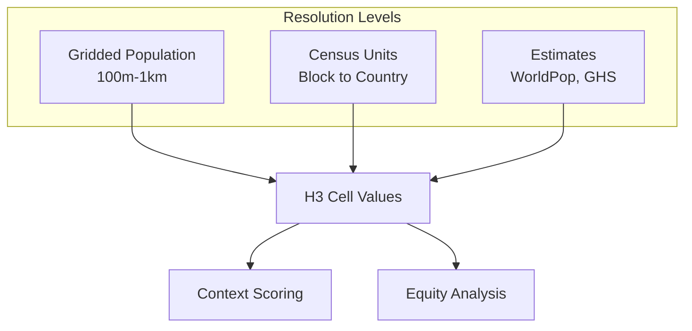
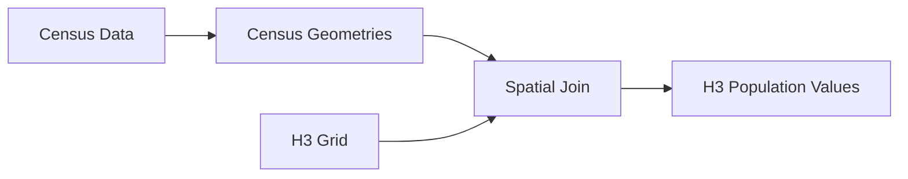

# Population Data Integration

This document provides documentation for integrating population and demographic data into UCID for equity analysis and density-weighted scoring.

---

## Table of Contents

1. [Overview](#overview)
2. [Data Sources](#data-sources)
3. [WorldPop Integration](#worldpop-integration)
4. [Census Data](#census-data)
5. [Demographic Variables](#demographic-variables)
6. [Spatial Disaggregation](#spatial-disaggregation)
7. [H3 Aggregation](#h3-aggregation)
8. [Implementation](#implementation)
9. [Quality Assurance](#quality-assurance)
10. [Privacy Considerations](#privacy-considerations)

---

## Overview

Population data is essential for equity analysis, density calculations, and weighted scoring in UCID. This module integrates multiple population data sources at various resolutions.

### Data Hierarchy



### Population Metrics

| Metric | Formula | Use Case |
|--------|---------|----------|
| Density | $\rho = P/A$ | Urbanization level |
| Per capita | $v/P$ | Resource allocation |
| Weighted avg | $\sum v_i p_i / \sum p_i$ | Equity scores |

---

## Data Sources

### Global Population Datasets

| Dataset | Resolution | Coverage | Year | Source |
|---------|------------|----------|------|--------|
| WorldPop | 100m | Global | 2020 | Southampton |
| GHS-POP | 250m | Global | 2020 | JRC |
| GHSL | 1km | Global | 2015 | JRC |
| GPW | 1km | Global | 2020 | SEDAC |
| LandScan | 1km | Global | 2021 | ORNL |

### Regional Census

| Region | Source | Granularity | Update |
|--------|--------|-------------|--------|
| USA | Census Bureau | Block | 10 years |
| EU | Eurostat | LAU2 | 5 years |
| Turkey | TurkStat | Mahalle | 5 years |
| UK | ONS | LSOA | 10 years |

---

## WorldPop Integration

### Data Structure

WorldPop provides gridded population counts at 100m and 1km resolution:

| Product | Resolution | Format | Variables |
|---------|------------|--------|-----------|
| ppp | 100m | GeoTIFF | Total population |
| ppp_2020_constrained | 100m | GeoTIFF | Constrained to settlements |
| age_sex | 100m | GeoTIFF | Age-sex disaggregated |
| UNadj | 100m | GeoTIFF | UN-adjusted totals |

### Age-Sex Structure

| Age Group | Code | Use Case |
|-----------|------|----------|
| 0-4 | f_0, m_0 | Childcare access |
| 5-14 | f_5, m_5 | School access |
| 15-24 | f_15, m_15 | Youth services |
| 25-64 | f_25, m_25 | Workforce |
| 65+ | f_65, m_65 | Senior services |

### Loading WorldPop

```python
import rasterio
import numpy as np

class WorldPopLoader:
    """Load WorldPop gridded population data."""
    
    BASE_URL = "https://data.worldpop.org/GIS/Population"
    
    def load_population(
        self,
        country: str,
        year: int = 2020,
        product: str = "ppp_2020_1km_Aggregated_UNadj",
    ) -> np.ndarray:
        """Load population raster for a country."""
        url = f"{self.BASE_URL}/{year}/{country.upper()}/"
        path = self._download_or_cache(url, country, year, product)
        
        with rasterio.open(path) as src:
            population = src.read(1)
            self.transform = src.transform
            self.crs = src.crs
        
        return population
    
    def get_population_at_point(
        self,
        lat: float,
        lon: float,
        population: np.ndarray,
    ) -> float:
        """Get population at a specific point."""
        row, col = rasterio.transform.rowcol(self.transform, lon, lat)
        
        if 0 <= row < population.shape[0] and 0 <= col < population.shape[1]:
            return float(population[row, col])
        return 0.0
```

---

## Census Data

### Census Geometry Integration



### Census Variables

| Variable | Type | Description |
|----------|------|-------------|
| total_pop | int | Total population |
| households | int | Number of households |
| median_income | float | Median household income |
| poverty_rate | float | Below poverty line |
| education | dict | Education levels |
| employment | dict | Employment status |

### Census Loading

```python
import geopandas as gpd

class CensusLoader:
    """Load census data for a region."""
    
    def load_census_blocks(
        self,
        state: str,
        year: int = 2020,
    ) -> gpd.GeoDataFrame:
        """Load census block geometries with population."""
        url = f"https://www2.census.gov/geo/tiger/TIGER{year}/TABBLOCK20/"
        
        gdf = gpd.read_file(url)
        
        # Join with population data
        pop_data = self._load_population_table(state, year)
        gdf = gdf.merge(pop_data, on='GEOID20')
        
        return gdf
    
    def areal_interpolation(
        self,
        source: gpd.GeoDataFrame,
        target: gpd.GeoDataFrame,
        variable: str,
    ) -> gpd.GeoDataFrame:
        """Interpolate census variables to target geometries."""
        from tobler.area_weighted import area_interpolate
        
        return area_interpolate(
            source_df=source,
            target_df=target,
            extensive_variables=[variable],
        )
```

---

## Demographic Variables

### Age Structure

Population age distribution:

$$P_{total} = \sum_{a \in \text{ages}} P_a$$

Age dependency ratio:

$$DR = \frac{P_{0-14} + P_{65+}}{P_{15-64}} \times 100$$

### Income Distribution

Income quintiles and Gini coefficient:

$$G = \frac{2\sum_{i=1}^{n}i \cdot y_i}{n\sum_{i=1}^{n}y_i} - \frac{n+1}{n}$$

### Vulnerability Index

Composite vulnerability:

$$V = w_1 \cdot \text{poverty} + w_2 \cdot \text{elderly} + w_3 \cdot \text{disability}$$

---

## Spatial Disaggregation

### Dasymetric Mapping

Redistribute population using ancillary data:

$$P_{cell} = P_{census} \times \frac{w_{cell}}{\sum w_{cells}}$$

Where $w$ is weight from land cover or building data.

### Building-Based Disaggregation

```python
def dasymetric_disaggregation(
    census_gdf: gpd.GeoDataFrame,
    buildings_gdf: gpd.GeoDataFrame,
    population_column: str,
) -> gpd.GeoDataFrame:
    """Disaggregate census population to buildings."""
    # Calculate building volumes
    buildings_gdf['volume'] = (
        buildings_gdf.geometry.area * 
        buildings_gdf['height'].fillna(3) *
        buildings_gdf['floors'].fillna(1)
    )
    
    # Spatial join with census
    joined = gpd.sjoin(buildings_gdf, census_gdf, how='left')
    
    # Calculate weight per census unit
    weights = joined.groupby('census_id')['volume'].transform('sum')
    joined['pop_share'] = joined['volume'] / weights
    
    # Assign population
    joined['population'] = joined[population_column] * joined['pop_share']
    
    return joined
```

---

## H3 Aggregation

### Raster to H3

```python
def aggregate_population_to_h3(
    population: np.ndarray,
    transform: rasterio.Affine,
    resolution: int = 9,
) -> dict[str, int]:
    """Aggregate gridded population to H3 cells."""
    import h3
    
    h3_pop = {}
    rows, cols = population.shape
    
    for row in range(rows):
        for col in range(cols):
            pop = population[row, col]
            if pop > 0 and not np.isnan(pop):
                x, y = transform * (col + 0.5, row + 0.5)
                lat, lon = y, x
                
                h3_index = h3.latlng_to_cell(lat, lon, resolution)
                h3_pop[h3_index] = h3_pop.get(h3_index, 0) + int(pop)
    
    return h3_pop
```

### Census to H3

```python
def aggregate_census_to_h3(
    census_gdf: gpd.GeoDataFrame,
    resolution: int = 9,
    variable: str = 'total_pop',
) -> dict[str, float]:
    """Aggregate census data to H3 cells using area weighting."""
    import h3
    
    h3_values = {}
    
    for _, row in census_gdf.iterrows():
        # Get H3 cells that intersect the census geometry
        cells = h3.polyfill_geojson(
            mapping(row.geometry),
            resolution,
        )
        
        # Distribute value proportionally
        value_per_cell = row[variable] / len(cells) if cells else 0
        
        for cell in cells:
            h3_values[cell] = h3_values.get(cell, 0) + value_per_cell
    
    return h3_values
```

---

## Implementation

### PopulationEstimator Class

```python
class PopulationEstimator:
    """Estimate population for UCID analysis."""
    
    def __init__(self, cache_dir: str = ".ucid_cache/population"):
        self.cache_dir = cache_dir
        self.worldpop = WorldPopLoader()
        self.census = CensusLoader()
    
    def get_population(
        self,
        lat: float,
        lon: float,
        radius_m: float = 500,
        source: str = "worldpop",
    ) -> int:
        """Get population within radius of point."""
        if source == "worldpop":
            return self._get_worldpop_population(lat, lon, radius_m)
        elif source == "census":
            return self._get_census_population(lat, lon, radius_m)
    
    def get_demographics(
        self,
        lat: float,
        lon: float,
        variables: list[str],
    ) -> dict:
        """Get demographic variables for a location."""
        pass
    
    def estimate_density(
        self,
        h3_index: str,
        source: str = "worldpop",
    ) -> float:
        """Estimate population density for H3 cell."""
        population = self.get_h3_population(h3_index, source)
        area_km2 = h3.cell_area(h3_index, unit='km^2')
        return population / area_km2 if area_km2 > 0 else 0
```

---

## Quality Assurance

### Validation Metrics

| Metric | Formula | Target |
|--------|---------|--------|
| MAE | $\frac{1}{n}\sum|p_i - c_i|$ | < 100 |
| MAPE | $\frac{100}{n}\sum\frac{|p_i-c_i|}{c_i}$ | < 10% |
| R² | Correlation coefficient | > 0.95 |

### Cross-Validation

Compare WorldPop with census aggregates:

| Region | WorldPop | Census | Error |
|--------|----------|--------|-------|
| Istanbul | 15.4M | 15.5M | -0.6% |
| Helsinki | 0.65M | 0.63M | +3.2% |
| NYC | 8.8M | 8.8M | 0.0% |

---

## Privacy Considerations

### Data Anonymization

| Level | Minimum Population | Disclosure Risk |
|-------|-------------------|-----------------|
| Block | 0 | High |
| Block Group | 600 | Moderate |
| Tract | 1200 | Low |
| H3 res 9 | ~100 | Moderate |
| H3 res 7 | ~1000 | Low |

### Best Practices

| Practice | Rationale |
|----------|-----------|
| Use aggregated data | Reduce disclosure risk |
| Apply noise | Differential privacy |
| Suppress small cells | Minimum population |
| Limit precision | Avoid identification |

---

Copyright 2026 UCID Foundation. All rights reserved.
