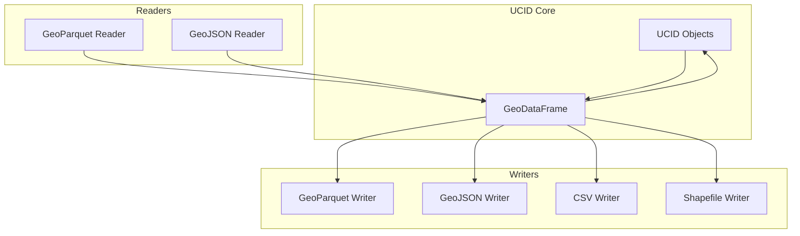

# Input/Output Formats

This document provides documentation for UCID's data import and export capabilities, covering GeoParquet, GeoJSON, and other spatial formats.

---

## Table of Contents

1. [Overview](#overview)
2. [GeoParquet](#geoparquet)
3. [GeoJSON](#geojson)
4. [CSV Export](#csv-export)
5. [Shapefile](#shapefile)
6. [GeoPackage](#geopackage)
7. [Format Comparison](#format-comparison)
8. [Implementation](#implementation)
9. [Streaming Export](#streaming-export)
10. [Best Practices](#best-practices)

---

## Overview

UCID supports multiple spatial data formats for maximum interoperability with GIS tools, databases, and analysis platforms.

### Supported Formats

| Format | Extension | Type | Recommended Use |
|--------|-----------|------|-----------------|
| GeoParquet | .parquet | Binary | Large datasets |
| GeoJSON | .geojson | Text | Web, APIs |
| CSV | .csv | Text | Tabular export |
| Shapefile | .shp | Binary | Legacy GIS |
| GeoPackage | .gpkg | Binary | Desktop GIS |
| FlatGeobuf | .fgb | Binary | Streaming |

### IO Architecture



---

## GeoParquet

### Overview

GeoParquet is the recommended format for large UCID datasets, providing efficient columnar storage with geometry support.

### Specification

GeoParquet extends Apache Parquet with:
- Geometry column encoded as WKB
- Spatial metadata in file metadata
- CRS information

### Export

```python
from ucid.io import export_geoparquet

# Export UCIDs to GeoParquet
export_geoparquet(
    ucids,
    "output.parquet",
    geometry_encoding="WKB",
    compression="snappy",
)
```

### Import

```python
from ucid.io import read_geoparquet

# Read GeoParquet to GeoDataFrame
gdf = read_geoparquet("input.parquet")

# Convert to UCID objects
ucids = [UCID.from_row(row) for _, row in gdf.iterrows()]
```

### Schema

| Column | Type | Description |
|--------|------|-------------|
| ucid_string | string | Full UCID string |
| version | string | Version identifier |
| city | string | City code |
| lat | float64 | Latitude |
| lon | float64 | Longitude |
| h3_resolution | int32 | H3 resolution |
| h3_index | string | H3 cell index |
| timestamp | string | Temporal key |
| context | string | Context ID |
| grade | string | Quality grade |
| confidence | float64 | Confidence score |
| geometry | geometry | Point geometry |

### Compression Options

| Compression | Ratio | Speed | Recommended |
|-------------|-------|-------|-------------|
| None | 1.0x | Fastest | Debug |
| Snappy | 2-4x | Fast | Default |
| GZIP | 4-8x | Medium | Archive |
| ZSTD | 4-8x | Fast | Best |

---

## GeoJSON

### Overview

GeoJSON is ideal for web applications, APIs, and smaller datasets requiring human-readable format.

### Export

```python
from ucid.io import export_geojson

# Export to GeoJSON
export_geojson(
    ucids,
    "output.geojson",
    pretty=True,
    include_properties=["grade", "confidence", "context"],
)
```

### Structure

```json
{
  "type": "FeatureCollection",
  "features": [
    {
      "type": "Feature",
      "geometry": {
        "type": "Point",
        "coordinates": [28.979, 41.015]
      },
      "properties": {
        "ucid": "UCID-V1:IST:+41.015:+028.979:9:...",
        "city": "IST",
        "grade": "A",
        "confidence": 0.92,
        "context": "15MIN"
      }
    }
  ]
}
```

### H3 Polygon Export

Export H3 cells as hexagonal polygons:

```python
from ucid.io import export_geojson_h3

export_geojson_h3(
    ucids,
    "output_h3.geojson",
    as_polygons=True,  # Export as H3 hexagons
)
```

---

## CSV Export

### Tabular Export

```python
from ucid.io import export_csv

export_csv(
    ucids,
    "output.csv",
    include_geometry=True,  # Include lat/lon columns
    include_h3=True,        # Include H3 index
)
```

### CSV Structure

| ucid | city | lat | lon | h3_index | timestamp | context | grade | confidence |
|------|------|-----|-----|----------|-----------|---------|-------|------------|
| UCID-V1:... | IST | 41.015 | 28.979 | 891f2e... | 2026W01T12 | 15MIN | A | 0.92 |

### Options

| Option | Description | Default |
|--------|-------------|---------|
| delimiter | Field separator | `,` |
| encoding | Character encoding | `utf-8` |
| include_header | Write header row | True |
| float_format | Number formatting | `%.6f` |

---

## Shapefile

### Legacy Support

Shapefiles are supported for compatibility with legacy GIS software.

```python
from ucid.io import export_shapefile

export_shapefile(
    ucids,
    "output_dir/ucid_export",  # Creates .shp, .shx, .dbf, .prj
)
```

### Limitations

| Limitation | Impact | Mitigation |
|------------|--------|------------|
| 10-char field names | Truncated columns | Use aliases |
| 254-char strings | Truncated UCID | Split fields |
| No NULL support | Empty strings | Handle in import |
| Single geometry type | Points only | Separate layers |

---

## GeoPackage

### SQLite-Based Format

GeoPackage is a modern alternative to Shapefiles:

```python
from ucid.io import export_geopackage

export_geopackage(
    ucids,
    "output.gpkg",
    layer_name="ucid_scores",
)
```

### Multiple Layers

```python
# Export multiple context results to same file
export_geopackage(
    ucids_15min,
    "city_analysis.gpkg",
    layer_name="15min_scores",
)

export_geopackage(
    ucids_transit,
    "city_analysis.gpkg",
    layer_name="transit_scores",
    mode="append",
)
```

---

## Format Comparison

### Size Comparison (1M UCIDs)

| Format | File Size | Write Time | Read Time |
|--------|-----------|------------|-----------|
| GeoParquet (ZSTD) | 45 MB | 2.1s | 0.8s |
| GeoParquet (Snappy) | 65 MB | 1.5s | 0.7s |
| GeoJSON | 450 MB | 8.5s | 12.0s |
| CSV | 120 MB | 3.2s | 4.5s |
| Shapefile | 180 MB | 5.0s | 3.0s |
| GeoPackage | 95 MB | 4.0s | 1.5s |

### Feature Comparison

| Feature | Parquet | GeoJSON | CSV | Shapefile | GPKG |
|---------|---------|---------|-----|-----------|------|
| Compression | Yes | No | No | No | SQLite |
| Streaming | Yes | No | Yes | No | No |
| Column Types | Strong | Weak | None | Limited | Strong |
| Geometry | WKB | GeoJSON | WKT/Lat-Lon | Binary | WKB |
| Metadata | Yes | Yes | No | PRJ file | Yes |
| Append | No | No | Yes | No | Yes |

---

## Implementation

### IOManager Class

```python
class IOManager:
    """Manage UCID import/export operations."""
    
    def export(
        self,
        ucids: list[UCID],
        path: str,
        format: str = "auto",
        **kwargs,
    ) -> None:
        """Export UCIDs to file."""
        if format == "auto":
            format = self._detect_format(path)
        
        exporter = self._get_exporter(format)
        exporter.export(ucids, path, **kwargs)
    
    def read(
        self,
        path: str,
        format: str = "auto",
    ) -> list[UCID]:
        """Read UCIDs from file."""
        if format == "auto":
            format = self._detect_format(path)
        
        reader = self._get_reader(format)
        return reader.read(path)
    
    def _detect_format(self, path: str) -> str:
        """Detect format from file extension."""
        ext = Path(path).suffix.lower()
        return {
            '.parquet': 'geoparquet',
            '.geojson': 'geojson',
            '.json': 'geojson',
            '.csv': 'csv',
            '.shp': 'shapefile',
            '.gpkg': 'geopackage',
        }.get(ext, 'unknown')
```

---

## Streaming Export

### Large Dataset Export

For datasets that don't fit in memory:

```python
from ucid.io import StreamingExporter

exporter = StreamingExporter("large_output.parquet")

for batch in generate_ucids_batched(city_bbox, batch_size=10000):
    exporter.write_batch(batch)

exporter.finalize()
```

### Chunked Reading

```python
from ucid.io import read_geoparquet_chunked

for chunk in read_geoparquet_chunked("large_file.parquet", chunksize=10000):
    process_chunk(chunk)
```

---

## Best Practices

### Format Selection

| Use Case | Recommended Format |
|----------|-------------------|
| Large-scale analysis | GeoParquet |
| Web applications | GeoJSON |
| Spreadsheet export | CSV |
| Desktop GIS | GeoPackage |
| Legacy systems | Shapefile |
| Streaming | FlatGeobuf |

### Performance Tips

| Tip | Benefit |
|-----|---------|
| Use GeoParquet for large data | 10x smaller, 5x faster |
| Enable compression | 3-5x size reduction |
| Select only needed columns | Faster reads |
| Use batch operations | Memory efficient |
| Pre-sort by H3 | Better compression |

---

Copyright 2026 UCID Foundation. All rights reserved.
