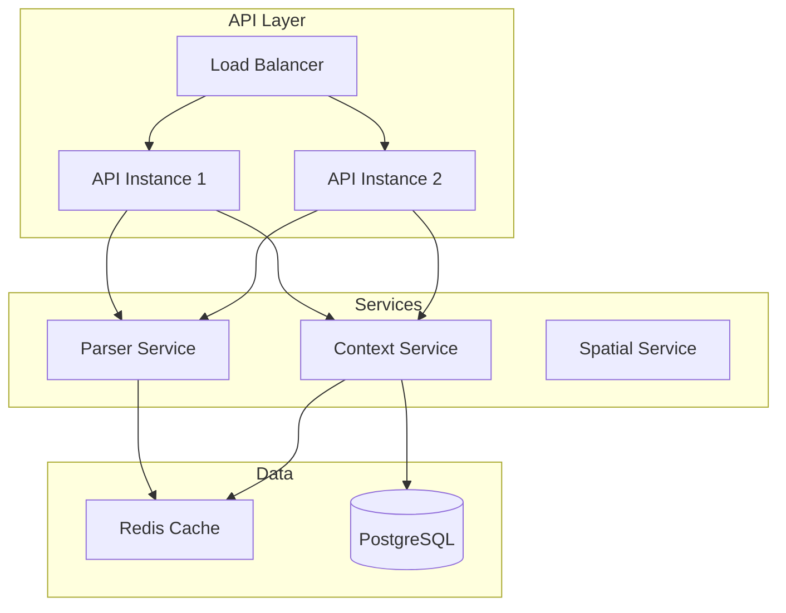

# FastAPI Service

This document provides documentation for the UCID REST API service built with FastAPI, including endpoints, authentication, and deployment.

---

## Table of Contents

1. [Overview](#overview)
2. [Architecture](#architecture)
3. [Endpoints](#endpoints)
4. [Request/Response Models](#requestresponse-models)
5. [Authentication](#authentication)
6. [Rate Limiting](#rate-limiting)
7. [Error Handling](#error-handling)
8. [Implementation](#implementation)
9. [Deployment](#deployment)
10. [Monitoring](#monitoring)

---

## Overview

The UCID API provides RESTful access to UCID creation, parsing, and context scoring functionality.

### API Specification

| Property | Value |
|----------|-------|
| Framework | FastAPI |
| OpenAPI Version | 3.1.0 |
| Authentication | API Key, OAuth2 |
| Rate Limit | 1000 req/min |
| Response Format | JSON |

### Architecture



---

## Endpoints

### UCID Operations

| Method | Endpoint | Description |
|--------|----------|-------------|
| POST | /v1/ucid/create | Create a new UCID |
| GET | /v1/ucid/parse | Parse a UCID string |
| POST | /v1/ucid/batch | Batch create UCIDs |
| GET | /v1/ucid/{ucid} | Get UCID details |

### Context Scoring

| Method | Endpoint | Description |
|--------|----------|-------------|
| POST | /v1/context/score | Score a location |
| GET | /v1/context/list | List available contexts |
| GET | /v1/context/{id} | Get context details |

### Spatial Operations

| Method | Endpoint | Description |
|--------|----------|-------------|
| POST | /v1/spatial/grid | Generate H3 grid |
| GET | /v1/spatial/neighbors | Get H3 neighbors |
| POST | /v1/spatial/aggregate | Aggregate scores |

### Health and Metadata

| Method | Endpoint | Description |
|--------|----------|-------------|
| GET | /health | Health check |
| GET | /ready | Readiness probe |
| GET | /v1/cities | List supported cities |
| GET | /v1/version | API version |

---

## Request/Response Models

### Create UCID Request

```python
from pydantic import BaseModel, Field

class CreateUCIDRequest(BaseModel):
    """Request to create a new UCID."""
    city: str = Field(..., min_length=3, max_length=3, example="IST")
    lat: float = Field(..., ge=-90, le=90, example=41.015)
    lon: float = Field(..., ge=-180, le=180, example=28.979)
    timestamp: str = Field(..., pattern=r"^\d{4}W\d{2}T\d{2}$", example="2026W01T12")
    context: str = Field(..., example="15MIN")
    compute_score: bool = Field(default=True)
```

### UCID Response

```python
class UCIDResponse(BaseModel):
    """Response containing UCID data."""
    ucid: str
    city: str
    lat: float
    lon: float
    h3_resolution: int
    h3_index: str
    timestamp: str
    context: str
    grade: str | None
    confidence: float | None
    breakdown: dict | None
```

### Error Response

```python
class ErrorResponse(BaseModel):
    """Error response model."""
    error: str
    code: str
    message: str
    details: dict | None = None
```

---

## Authentication

### API Key Authentication

```python
from fastapi import Security, HTTPException
from fastapi.security import APIKeyHeader

api_key_header = APIKeyHeader(name="X-API-Key")

async def verify_api_key(api_key: str = Security(api_key_header)):
    if not is_valid_api_key(api_key):
        raise HTTPException(status_code=403, detail="Invalid API key")
    return api_key
```

### OAuth2 (Optional)

```python
from fastapi.security import OAuth2PasswordBearer

oauth2_scheme = OAuth2PasswordBearer(tokenUrl="token")

async def get_current_user(token: str = Depends(oauth2_scheme)):
    user = decode_token(token)
    if not user:
        raise HTTPException(status_code=401, detail="Invalid token")
    return user
```

### Usage Tiers

| Tier | Rate Limit | Features |
|------|------------|----------|
| Free | 100/day | Basic UCID operations |
| Developer | 1000/hour | All contexts |
| Professional | 10000/hour | Batch, priority |
| Enterprise | Unlimited | SLA, support |

---

## Rate Limiting

### Implementation

```python
from slowapi import Limiter
from slowapi.util import get_remote_address

limiter = Limiter(key_func=get_remote_address)

@app.get("/v1/ucid/parse")
@limiter.limit("60/minute")
async def parse_ucid(request: Request, ucid: str):
    return {"result": parse_ucid(ucid)}
```

### Rate Limit Headers

| Header | Description |
|--------|-------------|
| X-RateLimit-Limit | Maximum requests |
| X-RateLimit-Remaining | Remaining requests |
| X-RateLimit-Reset | Reset timestamp |

---

## Error Handling

### Error Codes

| Code | HTTP Status | Description |
|------|-------------|-------------|
| INVALID_UCID | 400 | Malformed UCID string |
| INVALID_COORDINATES | 400 | Out of range coordinates |
| UNKNOWN_CITY | 400 | City not in registry |
| UNKNOWN_CONTEXT | 400 | Context not available |
| RATE_LIMITED | 429 | Too many requests |
| INTERNAL_ERROR | 500 | Server error |

### Exception Handler

```python
from fastapi import FastAPI, Request
from fastapi.responses import JSONResponse

@app.exception_handler(UCIDValidationError)
async def ucid_validation_exception_handler(
    request: Request,
    exc: UCIDValidationError,
):
    return JSONResponse(
        status_code=400,
        content={
            "error": "validation_error",
            "code": "INVALID_UCID",
            "message": str(exc),
        },
    )
```

---

## Implementation

### Application Setup

```python
from fastapi import FastAPI, Depends
from fastapi.middleware.cors import CORSMiddleware

app = FastAPI(
    title="UCID API",
    description="Urban Context Identifier API",
    version="1.0.0",
    docs_url="/docs",
    redoc_url="/redoc",
)

app.add_middleware(
    CORSMiddleware,
    allow_origins=["*"],
    allow_credentials=True,
    allow_methods=["*"],
    allow_headers=["*"],
)
```

### Router Implementation

```python
from fastapi import APIRouter, Depends

router = APIRouter(prefix="/v1/ucid", tags=["UCID"])

@router.post("/create", response_model=UCIDResponse)
async def create_ucid(
    request: CreateUCIDRequest,
    api_key: str = Depends(verify_api_key),
):
    """Create a new UCID."""
    ucid = ucid_lib.create_ucid(
        city=request.city,
        lat=request.lat,
        lon=request.lon,
        timestamp=request.timestamp,
        context=request.context,
    )
    
    result = UCIDResponse(
        ucid=str(ucid),
        city=ucid.city,
        lat=ucid.lat,
        lon=ucid.lon,
        h3_resolution=ucid.h3_res,
        h3_index=ucid.h3_index,
        timestamp=ucid.timestamp,
        context=ucid.context,
        grade=ucid.grade,
        confidence=ucid.confidence,
    )
    
    if request.compute_score:
        result.breakdown = compute_breakdown(ucid)
    
    return result

@router.get("/parse")
async def parse_ucid_endpoint(ucid: str):
    """Parse a UCID string."""
    parsed = ucid_lib.parse_ucid(ucid)
    return UCIDResponse.from_ucid(parsed)

@router.post("/batch", response_model=list[UCIDResponse])
async def batch_create(
    requests: list[CreateUCIDRequest],
    api_key: str = Depends(verify_api_key),
):
    """Batch create UCIDs."""
    if len(requests) > 1000:
        raise HTTPException(400, "Maximum 1000 UCIDs per batch")
    
    results = []
    for req in requests:
        ucid = create_ucid(...req.dict())
        results.append(UCIDResponse.from_ucid(ucid))
    
    return results
```

---

## Deployment

### Docker Deployment

```dockerfile
FROM python:3.12-slim

WORKDIR /app
COPY . .
RUN pip install -e ".[api]"

EXPOSE 8000
CMD ["uvicorn", "ucid.api.app:app", "--host", "0.0.0.0", "--port", "8000"]
```

### Kubernetes

```yaml
apiVersion: apps/v1
kind: Deployment
metadata:
  name: ucid-api
spec:
  replicas: 3
  selector:
    matchLabels:
      app: ucid-api
  template:
    spec:
      containers:
      - name: api
        image: ghcr.io/ucid-foundation/ucid:latest
        ports:
        - containerPort: 8000
        readinessProbe:
          httpGet:
            path: /ready
            port: 8000
        livenessProbe:
          httpGet:
            path: /health
            port: 8000
```

### Environment Variables

| Variable | Description | Default |
|----------|-------------|---------|
| UCID_API_KEY_SECRET | API key encryption | Required |
| UCID_DATABASE_URL | PostgreSQL URL | None |
| UCID_REDIS_URL | Redis URL | None |
| UCID_LOG_LEVEL | Logging level | INFO |

---

## Monitoring

### Metrics

```python
from prometheus_client import Counter, Histogram

REQUEST_COUNT = Counter(
    "ucid_api_requests_total",
    "Total requests",
    ["method", "endpoint", "status"],
)

REQUEST_LATENCY = Histogram(
    "ucid_api_request_latency_seconds",
    "Request latency",
    ["method", "endpoint"],
)
```

### Health Endpoints

```python
@app.get("/health")
async def health():
    return {"status": "healthy"}

@app.get("/ready")
async def ready():
    # Check dependencies
    db_ok = check_database()
    cache_ok = check_cache()
    
    if db_ok and cache_ok:
        return {"status": "ready"}
    raise HTTPException(503, "Not ready")
```

---

Copyright 2026 UCID Foundation. All rights reserved.
