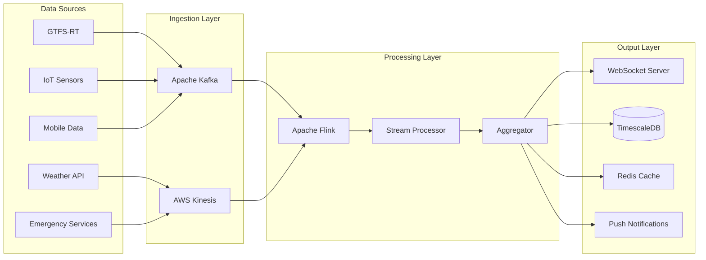
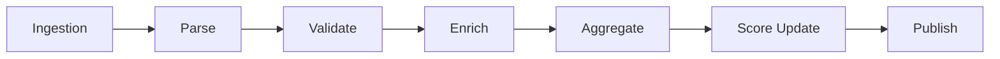
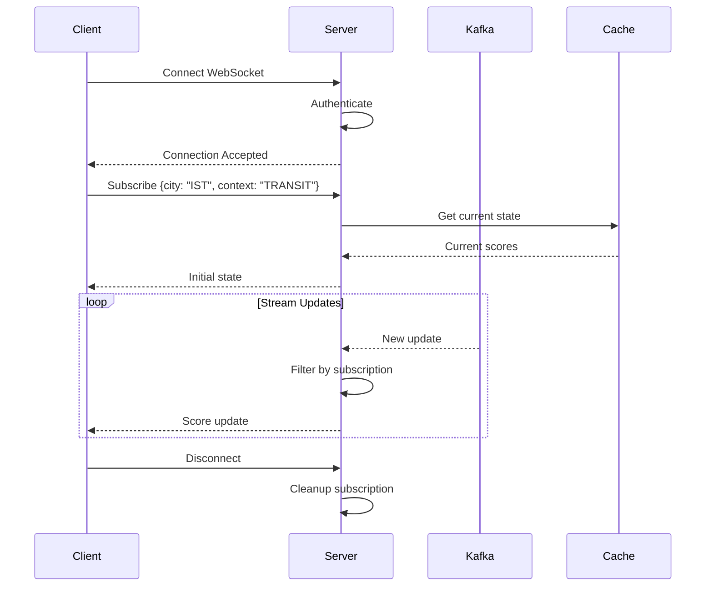
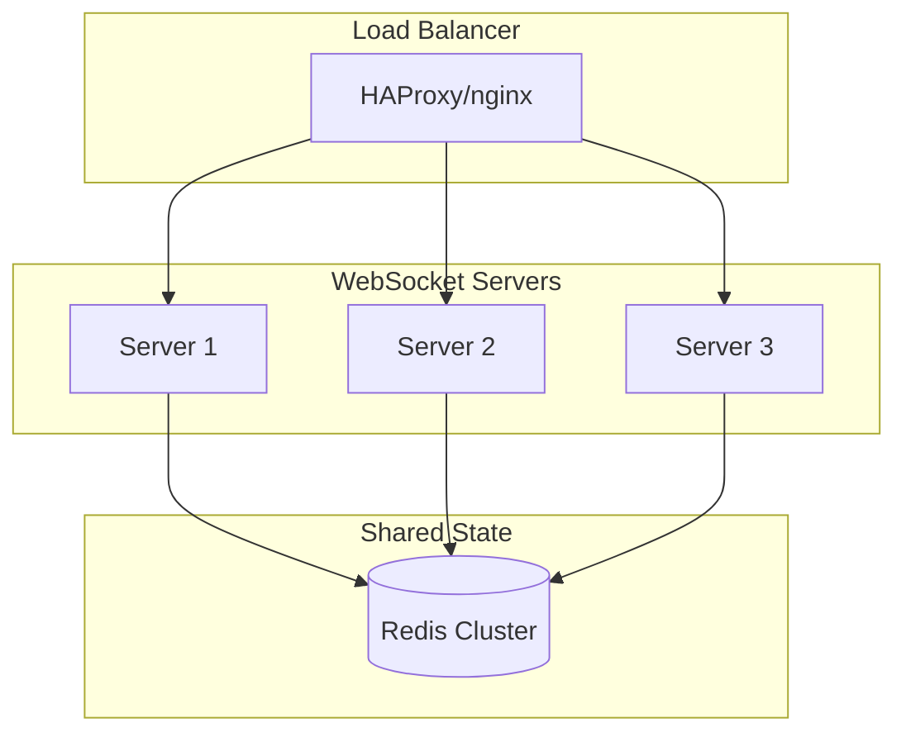

# Real-Time Streaming

This document provides comprehensive documentation for UCID's real-time streaming capabilities for live urban data analysis, including stream processing architectures, WebSocket APIs, and event-driven patterns.

---

## Table of Contents

1. [Overview](#overview)
2. [Architecture](#architecture)
3. [Data Sources](#data-sources)
4. [Stream Processing](#stream-processing)
5. [Apache Kafka Integration](#apache-kafka-integration)
6. [WebSocket API](#websocket-api)
7. [Event-Driven Patterns](#event-driven-patterns)
8. [Implementation](#implementation)
9. [Scalability](#scalability)
10. [Monitoring](#monitoring)
11. [Best Practices](#best-practices)
12. [Examples](#examples)

---

## Overview

UCID supports real-time streaming for dynamic urban analysis, enabling live updates to context scores based on streaming data sources. This capability is essential for applications requiring immediate response to changing urban conditions.

### Use Cases

| Use Case | Data Source | Update Frequency | Latency Target |
|----------|-------------|------------------|----------------|
| Transit delays | GTFS-RT | Real-time | < 5s |
| Traffic conditions | Sensors | 1-5 minutes | < 30s |
| Air quality | Monitoring stations | Hourly | < 5 min |
| Crowd density | Mobile data | 15 minutes | < 2 min |
| Emergency alerts | City services | Real-time | < 1s |
| Weather events | Meteorological | 10 minutes | < 1 min |

### Architecture



---

## Data Sources

### GTFS-Realtime Integration

GTFS-RT provides real-time updates for public transit:

```python
from ucid.streaming import GTFSRTConsumer

consumer = GTFSRTConsumer(
    feed_url="https://api.transit.city/gtfs-rt/vehicle-positions",
    update_interval_seconds=30,
)

async for update in consumer.stream():
    # Process vehicle position update
    ucid = update_transit_score(
        stop_id=update.stop_id,
        delay_seconds=update.delay,
    )
    await publish_update(ucid)
```

### IoT Sensor Integration

```python
from ucid.streaming import SensorConsumer

sensor_consumer = SensorConsumer(
    mqtt_broker="mqtt://sensors.city.gov",
    topics=["air-quality/#", "traffic/#"],
)

async for reading in sensor_consumer.stream():
    if reading.sensor_type == "air_quality":
        await update_climate_score(reading)
    elif reading.sensor_type == "traffic":
        await update_transit_score(reading)
```

### Data Source Configuration

| Source | Protocol | Authentication | Rate Limit |
|--------|----------|----------------|------------|
| GTFS-RT | HTTP/Protobuf | API Key | 60 req/min |
| IoT Sensors | MQTT | Certificate | Unlimited |
| Weather | REST | API Key | 1000/day |
| Mobile Data | Kafka | SASL | Unlimited |

---

## Stream Processing

### Processing Pipeline



### Window Functions

Aggregation over time windows for stable scoring:

**Tumbling Window:**
$$\bar{v}_{window} = \frac{1}{|T|}\sum_{t \in T} v_t$$

**Sliding Window:**
$$\bar{v}_{sliding}(t) = \frac{1}{w}\sum_{i=0}^{w-1} v_{t-i}$$

**Session Window:**
$$S = \{e_1, e_2, ..., e_n\} \text{ where } t_{i+1} - t_i < \text{gap}$$

### Window Configuration

| Window Type | Duration | Use Case |
|-------------|----------|----------|
| Tumbling | 5 minutes | Regular aggregation |
| Sliding | 15 min / 1 min slide | Moving average |
| Session | 30 min gap | Activity detection |

---

## Apache Kafka Integration

### Topic Structure

| Topic | Partitions | Retention | Purpose |
|-------|------------|-----------|---------|
| ucid.raw.gtfs-rt | 12 | 24h | Raw transit data |
| ucid.raw.sensors | 24 | 24h | Raw sensor data |
| ucid.processed.scores | 12 | 7d | Processed scores |
| ucid.alerts | 6 | 30d | Alert notifications |

### Producer Implementation

```python
from kafka import KafkaProducer
import json

class UCIDStreamProducer:
    """Produce UCID updates to Kafka."""
    
    def __init__(self, bootstrap_servers: list[str]):
        self.producer = KafkaProducer(
            bootstrap_servers=bootstrap_servers,
            value_serializer=lambda v: json.dumps(v).encode('utf-8'),
            acks='all',
            retries=3,
        )
    
    async def publish_score_update(
        self,
        ucid_string: str,
        score: float,
        timestamp: str,
    ):
        """Publish a score update."""
        message = {
            'ucid': ucid_string,
            'score': score,
            'timestamp': timestamp,
            'published_at': datetime.utcnow().isoformat(),
        }
        
        future = self.producer.send(
            'ucid.processed.scores',
            key=ucid_string.encode(),
            value=message,
        )
        return await asyncio.wrap_future(future)
```

### Consumer Implementation

```python
from kafka import KafkaConsumer

class UCIDStreamConsumer:
    """Consume UCID updates from Kafka."""
    
    def __init__(self, bootstrap_servers: list[str], group_id: str):
        self.consumer = KafkaConsumer(
            'ucid.processed.scores',
            bootstrap_servers=bootstrap_servers,
            group_id=group_id,
            value_deserializer=lambda m: json.loads(m.decode('utf-8')),
            auto_offset_reset='latest',
            enable_auto_commit=True,
        )
    
    async def process_stream(self):
        """Process incoming score updates."""
        for message in self.consumer:
            update = message.value
            yield UCIDUpdate(
                ucid=update['ucid'],
                score=update['score'],
                timestamp=update['timestamp'],
            )
```

---

## WebSocket API

### Connection Lifecycle



### WebSocket Implementation

```python
from fastapi import WebSocket, WebSocketDisconnect
from typing import Set

class ConnectionManager:
    """Manage WebSocket connections."""
    
    def __init__(self):
        self.active_connections: dict[str, Set[WebSocket]] = {}
    
    async def connect(self, websocket: WebSocket, city: str):
        await websocket.accept()
        if city not in self.active_connections:
            self.active_connections[city] = set()
        self.active_connections[city].add(websocket)
    
    def disconnect(self, websocket: WebSocket, city: str):
        self.active_connections[city].discard(websocket)
    
    async def broadcast_to_city(self, city: str, message: dict):
        """Broadcast update to all subscribers of a city."""
        if city in self.active_connections:
            for connection in self.active_connections[city]:
                await connection.send_json(message)


manager = ConnectionManager()


@app.websocket("/ws/ucid/{city}")
async def websocket_endpoint(websocket: WebSocket, city: str):
    """WebSocket endpoint for city updates."""
    await manager.connect(websocket, city)
    
    try:
        # Send initial state
        initial_state = await get_city_current_state(city)
        await websocket.send_json({"type": "initial", "data": initial_state})
        
        # Keep connection alive and handle client messages
        while True:
            data = await websocket.receive_json()
            if data.get("type") == "ping":
                await websocket.send_json({"type": "pong"})
    except WebSocketDisconnect:
        manager.disconnect(websocket, city)
```

### Client Example

```javascript
class UCIDStreamClient {
    constructor(city) {
        this.city = city;
        this.ws = null;
        this.handlers = new Map();
    }
    
    connect() {
        this.ws = new WebSocket(`wss://api.ucid.org/ws/ucid/${this.city}`);
        
        this.ws.onopen = () => {
            console.log('Connected to UCID stream');
            this.startPingInterval();
        };
        
        this.ws.onmessage = (event) => {
            const update = JSON.parse(event.data);
            this.handleUpdate(update);
        };
        
        this.ws.onclose = () => {
            console.log('Disconnected, reconnecting...');
            setTimeout(() => this.connect(), 5000);
        };
    }
    
    handleUpdate(update) {
        if (update.type === 'score_update') {
            const handler = this.handlers.get(update.context);
            if (handler) handler(update);
        }
    }
    
    subscribe(context, handler) {
        this.handlers.set(context, handler);
    }
}

// Usage
const client = new UCIDStreamClient('IST');
client.connect();
client.subscribe('TRANSIT', (update) => {
    console.log(`Transit score updated: ${update.score}`);
});
```

---

## Event-Driven Patterns

### Event Types

| Event Type | Trigger | Action |
|------------|---------|--------|
| ScoreUpdate | New computation | Broadcast to subscribers |
| ThresholdAlert | Score crosses threshold | Send notification |
| AnomalyDetected | Statistical anomaly | Flag for review |
| DataSourceDown | Source unavailable | Use cached data |

### Alert Configuration

```python
ALERT_THRESHOLDS = {
    "TRANSIT": {
        "low": 40,
        "critical": 20,
        "notification_channels": ["slack", "email"],
    },
    "CLIMATE": {
        "high_temp": 35,
        "low_air_quality": 30,
        "notification_channels": ["push", "sms"],
    },
}
```

---

## Scalability

### Horizontal Scaling



### Scaling Strategies

| Component | Scaling Strategy | Trigger |
|-----------|------------------|---------|
| Kafka | Add partitions | Throughput |
| Processors | Add workers | CPU > 70% |
| WebSocket | Add servers | Connections > 10k |
| Cache | Redis Cluster | Memory > 80% |

---

## Monitoring

### Metrics

| Metric | Description | Alert Threshold |
|--------|-------------|-----------------|
| message_lag | Kafka consumer lag | > 1000 messages |
| processing_latency_p99 | 99th percentile latency | > 5s |
| websocket_connections | Active connections | > 50k |
| error_rate | Processing errors | > 1% |

### Prometheus Metrics

```python
from prometheus_client import Counter, Histogram, Gauge

MESSAGES_PROCESSED = Counter(
    'ucid_streaming_messages_total',
    'Total messages processed',
    ['source', 'status'],
)

PROCESSING_LATENCY = Histogram(
    'ucid_streaming_latency_seconds',
    'Message processing latency',
    ['source'],
)

ACTIVE_CONNECTIONS = Gauge(
    'ucid_streaming_connections',
    'Active WebSocket connections',
    ['city'],
)
```

---

## Best Practices

### Recommendations

| Practice | Rationale |
|----------|-----------|
| Use message keys | Ensure ordering per UCID |
| Implement backpressure | Prevent memory exhaustion |
| Add circuit breakers | Handle downstream failures |
| Log correlation IDs | Enable distributed tracing |
| Test with chaos | Ensure resilience |

### Error Handling

```python
from circuitbreaker import circuit

@circuit(failure_threshold=5, recovery_timeout=60)
async def process_update(update: dict) -> None:
    """Process update with circuit breaker."""
    try:
        result = await compute_score(update)
        await publish_result(result)
    except TransientError:
        # Retry with exponential backoff
        raise
    except PermanentError:
        # Log and skip
        logger.error(f"Permanent error processing {update}")
```

---

Copyright 2026 UCID Foundation. All rights reserved.
