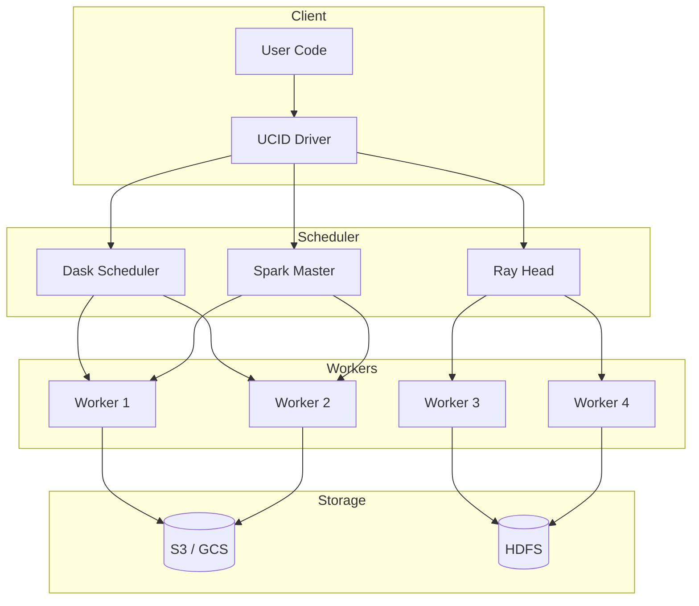
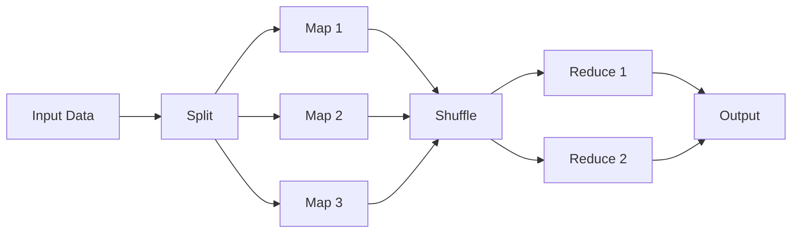
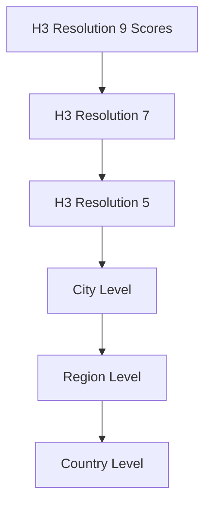

# Distributed Computing

This document provides comprehensive documentation for UCID's distributed computing capabilities using Dask, Ray, and Apache Spark for large-scale urban analysis.

---

## Table of Contents

1. [Overview](#overview)
2. [Framework Comparison](#framework-comparison)
3. [Dask Integration](#dask-integration)
4. [Ray Integration](#ray-integration)
5. [Apache Spark Integration](#apache-spark-integration)
6. [Distributed Patterns](#distributed-patterns)
7. [Cluster Configuration](#cluster-configuration)
8. [Performance Optimization](#performance-optimization)
9. [Fault Tolerance](#fault-tolerance)
10. [Implementation](#implementation)
11. [Cloud Deployment](#cloud-deployment)
12. [Best Practices](#best-practices)

---

## Overview

UCID supports distributed computing for processing large-scale urban datasets across multiple machines, enabling city-wide and multi-city analysis that would be impractical on a single node.

### Supported Frameworks

| Framework | Primary Use Case | Scaling Model | Python Native |
|-----------|------------------|---------------|---------------|
| Dask | DataFrame operations | Horizontal | Yes |
| Ray | Parallel functions | Horizontal | Yes |
| Spark | Big data ETL | Cluster | PySpark |
| Modin | Drop-in pandas | Horizontal | Yes |

### When to Use Distributed Computing

| Dataset Size | Approach | Framework |
|--------------|----------|-----------|
| < 1 GB | Single machine | pandas, UCID native |
| 1-100 GB | Distributed | Dask |
| 100 GB - 1 TB | Distributed | Dask or Spark |
| > 1 TB | Big data cluster | Spark |

### Architecture



---

## Framework Comparison

### Feature Comparison

| Feature | Dask | Ray | Spark |
|---------|------|-----|-------|
| DataFrames | dask.dataframe | ray.data | pyspark.sql |
| ML Integration | dask-ml | ray.tune | MLlib |
| GPU Support | dask-cuda | ray-gpu | rapids |
| Streaming | dask-streamz | ray.serve | Spark Streaming |
| Deployment | KubeCluster | ray up | spark-submit |
| Memory Model | Spill to disk | In-memory | Shuffle-based |

### Performance Comparison

| Operation | Dask (32 cores) | Ray (32 cores) | Spark (32 cores) |
|-----------|-----------------|----------------|------------------|
| CSV read (10 GB) | 45s | 50s | 60s |
| GroupBy + Mean | 12s | 15s | 20s |
| Spatial join | 30s | 35s | 45s |
| Context scoring (1M pts) | 180s | 120s | 240s |

---

## Dask Integration

### Dask DataFrames for UCID

```python
import dask.dataframe as dd
from dask.distributed import Client, LocalCluster
from ucid.distributed import UCIDDaskClient

# Create cluster
cluster = LocalCluster(n_workers=4, threads_per_worker=2)
client = Client(cluster)

# Load large dataset
ddf = dd.read_parquet("s3://ucid-data/scores/*.parquet")

# Distributed operations
result = ddf.groupby('city').score.agg(['mean', 'std', 'count']).compute()

print(result)
```

### Parallel UCID Creation

```python
from dask import delayed, compute
from ucid import create_ucid

@delayed
def create_ucid_batch(locations: list) -> list:
    """Create UCIDs for a batch of locations."""
    return [
        create_ucid(
            city=loc['city'],
            lat=loc['lat'],
            lon=loc['lon'],
            timestamp=loc['timestamp'],
            context=loc['context'],
        )
        for loc in locations
    ]

# Split locations into batches
batch_size = 1000
batches = [locations[i:i+batch_size] for i in range(0, len(locations), batch_size)]

# Create delayed tasks
tasks = [create_ucid_batch(batch) for batch in batches]

# Execute in parallel
results = compute(*tasks)

# Flatten results
all_ucids = [ucid for batch in results for ucid in batch]
```

### Lazy Evaluation

```python
# Define computation graph (lazy)
ddf = dd.read_parquet("data/*.parquet")
filtered = ddf[ddf.score > 50]
grouped = filtered.groupby('city').score.mean()

# Computation hasn't happened yet
print(grouped)  # Shows Dask DataFrame info

# Trigger computation
result = grouped.compute()
print(result)  # Actual values
```

### Dask with GeoPandas

```python
import dask_geopandas as dgd

# Load spatial data
gddf = dgd.read_parquet("s3://ucid-data/geometry/*.parquet")

# Spatial operations distributed
buffered = gddf.geometry.buffer(500)
area = buffered.area.compute()
```

---

## Ray Integration

### Ray Remote Functions

```python
import ray

ray.init(address='auto')  # Connect to existing cluster

@ray.remote
def compute_context_score(lat: float, lon: float, context: str) -> dict:
    """Compute context score for a single location."""
    from ucid.contexts import get_context
    ctx = get_context(context)
    result = ctx.compute(lat, lon, "2026W01T12")
    return {
        'lat': lat,
        'lon': lon,
        'context': context,
        'score': result.score,
        'grade': result.grade,
    }

# Parallel execution
locations = [{'lat': 41.0 + i*0.01, 'lon': 28.9 + i*0.01} for i in range(1000)]

futures = [
    compute_context_score.remote(loc['lat'], loc['lon'], "15MIN")
    for loc in locations
]

# Gather results
results = ray.get(futures)
print(f"Computed {len(results)} scores")
```

### Ray Data for ETL

```python
import ray.data

# Read from cloud storage
ds = ray.data.read_parquet("s3://ucid-data/locations/")

# Map transformation
def compute_ucid(batch: dict) -> dict:
    """Compute UCIDs for a batch."""
    ucids = []
    for i in range(len(batch['lat'])):
        ucid = create_ucid(
            city=batch['city'][i],
            lat=batch['lat'][i],
            lon=batch['lon'][i],
            timestamp="2026W01T12",
            context="15MIN",
        )
        ucids.append(str(ucid))
    batch['ucid'] = ucids
    return batch

# Apply transformation
ds_with_ucids = ds.map_batches(compute_ucid, batch_format="pandas")

# Write results
ds_with_ucids.write_parquet("s3://ucid-data/processed/")
```

### Ray Actors for Stateful Processing

```python
@ray.remote
class UCIDScorer:
    """Stateful actor for UCID scoring with caching."""
    
    def __init__(self, context: str):
        from ucid.contexts import get_context
        self.context = get_context(context)
        self.cache = {}
    
    def score(self, lat: float, lon: float) -> float:
        key = f"{lat:.3f},{lon:.3f}"
        if key not in self.cache:
            result = self.context.compute(lat, lon, "2026W01T12")
            self.cache[key] = result.score
        return self.cache[key]
    
    def get_cache_stats(self) -> dict:
        return {'size': len(self.cache)}

# Create actor pool
scorers = [UCIDScorer.remote("15MIN") for _ in range(4)]

# Distribute work across actors
results = []
for i, loc in enumerate(locations):
    scorer = scorers[i % len(scorers)]
    results.append(scorer.score.remote(loc['lat'], loc['lon']))

scores = ray.get(results)
```

---

## Apache Spark Integration

### PySpark for UCID

```python
from pyspark.sql import SparkSession
from pyspark.sql.functions import udf
from pyspark.sql.types import StructType, FloatType, StringType

spark = SparkSession.builder \
    .appName("UCID Processing") \
    .config("spark.executor.memory", "8g") \
    .getOrCreate()

# Read data
df = spark.read.parquet("s3://ucid-data/locations/")

# Define UDF for UCID creation
@udf(returnType=StringType())
def create_ucid_udf(city, lat, lon, timestamp, context):
    from ucid import create_ucid
    ucid = create_ucid(
        city=city, lat=lat, lon=lon,
        timestamp=timestamp, context=context,
    )
    return str(ucid)

# Apply transformation
df_with_ucids = df.withColumn(
    "ucid",
    create_ucid_udf(df.city, df.lat, df.lon, df.timestamp, df.context)
)

# Write results
df_with_ucids.write.parquet("s3://ucid-data/processed/")
```

---

## Distributed Patterns

### Map-Reduce Pattern



### City-Parallel Processing

```python
def process_city_distributed(city_code: str) -> GeoDataFrame:
    """Process a single city on a worker node."""
    from ucid import generate_grid_h3
    from ucid.contexts import get_context
    
    # Get city bounding box
    bbox = get_city_bbox(city_code)
    
    # Generate H3 grid
    grid = list(generate_grid_h3(bbox, resolution=9))
    
    # Compute scores for each cell
    context = get_context("15MIN")
    results = []
    for h3_index in grid:
        lat, lon = h3.cell_to_latlng(h3_index)
        result = context.compute(lat, lon, "2026W01T12")
        results.append({
            'h3_index': h3_index,
            'score': result.score,
            'grade': result.grade,
        })
    
    return pd.DataFrame(results)

# Parallel by city using Dask
with Client() as client:
    futures = client.map(process_city_distributed, city_codes)
    results = client.gather(futures)
    
# Combine results
combined = pd.concat(results, ignore_index=True)
```

### Hierarchical Aggregation



---

## Cluster Configuration

### Dask Kubernetes Cluster

```python
from dask_kubernetes import KubeCluster, make_pod_spec

pod_spec = make_pod_spec(
    image='ghcr.io/ucid-foundation/ucid-worker:latest',
    memory_limit='8GB',
    memory_request='4GB',
    cpu_limit=2,
    cpu_request=1,
)

cluster = KubeCluster(pod_spec)
cluster.scale(20)  # Scale to 20 workers

client = Client(cluster)
```

### Resource Requirements

| Worker Type | CPU | Memory | GPU | Use Case |
|-------------|-----|--------|-----|----------|
| Standard | 2 | 8 GB | No | General processing |
| Compute | 4 | 16 GB | No | Context scoring |
| Memory | 2 | 32 GB | No | Large joins |
| GPU | 4 | 16 GB | 1 | ML inference |

---

## Performance Optimization

### Partitioning Strategy

| Strategy | When to Use | Implementation |
|----------|-------------|----------------|
| By city | City-level analysis | `df.repartition('city')` |
| By H3 | Spatial locality | `df.repartition('h3_parent')` |
| By time | Temporal analysis | `df.repartition('timestamp')` |

### Memory Management

```python
# Persist intermediate results
ddf_filtered = ddf[ddf.score > 50]
ddf_filtered = ddf_filtered.persist()  # Keep in cluster memory

# Clear memory when done
del ddf_filtered
client.cancel(ddf_filtered)
```

### Scaling Efficiency

| Workers | Locations/sec | Efficiency | Notes |
|---------|---------------|------------|-------|
| 1 | 1,000 | 100% | Baseline |
| 4 | 3,800 | 95% | Near-linear |
| 16 | 14,400 | 90% | Good scaling |
| 64 | 51,200 | 80% | Acceptable |
| 256 | 179,200 | 70% | Communication overhead |

---

## Fault Tolerance

### Checkpointing

```python
# Enable checkpointing for long-running jobs
ddf.to_parquet(
    "s3://ucid-data/checkpoint/",
    engine='pyarrow',
    write_index=False,
)

# Resume from checkpoint
ddf = dd.read_parquet("s3://ucid-data/checkpoint/")
```

### Retry Configuration

```python
from dask.distributed import Client

client = Client(
    n_workers=4,
    retries=3,  # Retry failed tasks
    memory_limit='4GB',
)
```

---

## Best Practices

### Recommendations

| Practice | Benefit |
|----------|---------|
| Partition by H3 parent | Improve data locality |
| Persist intermediates | Avoid recomputation |
| Use chunked writes | Handle large outputs |
| Monitor dashboard | Identify bottlenecks |
| Test at small scale | Debug before scaling |

---

Copyright 2026 UCID Foundation. All rights reserved.
