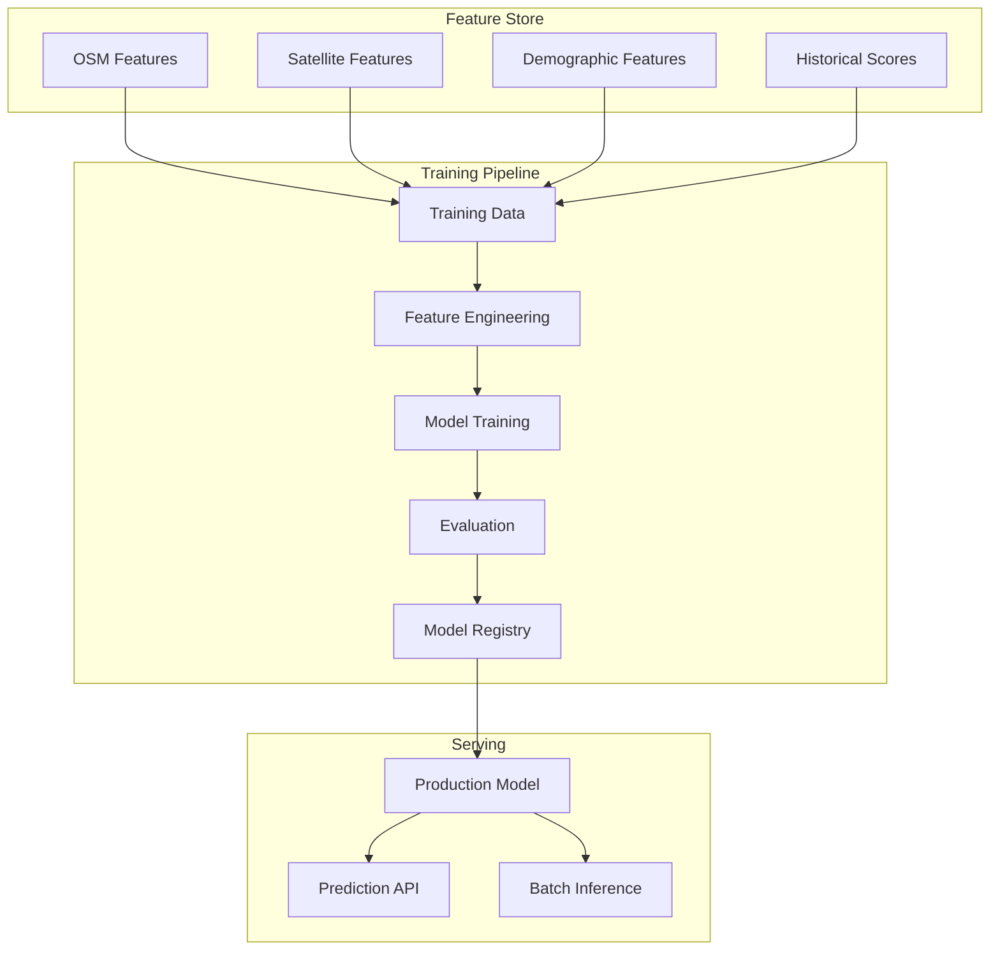
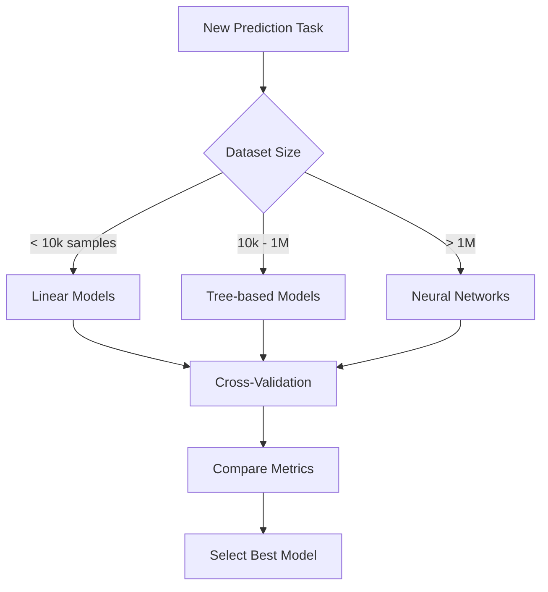
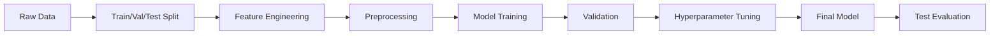

# Machine Learning Module

This document provides comprehensive documentation for UCID's machine learning capabilities for predictive urban analysis, anomaly detection, and automated scoring.

---

## Table of Contents

1. [Overview](#overview)
2. [ML Architecture](#ml-architecture)
3. [Prediction Models](#prediction-models)
4. [Feature Engineering](#feature-engineering)
5. [Model Training](#model-training)
6. [Hyperparameter Tuning](#hyperparameter-tuning)
7. [Model Evaluation](#model-evaluation)
8. [Model Serving](#model-serving)
9. [Anomaly Detection](#anomaly-detection)
10. [Time Series Forecasting](#time-series-forecasting)
11. [MLOps Pipeline](#mlops-pipeline)
12. [Use Cases](#use-cases)
13. [Best Practices](#best-practices)

---

## Overview

UCID includes machine learning capabilities for predicting urban context scores, detecting anomalies, and forecasting temporal trends. The ML module enables filling gaps in coverage and providing predictive insights.

### ML Capabilities

| Capability | Model Type | Primary Use Case |
|------------|------------|------------------|
| Score Prediction | Regression | Estimate missing scores |
| Grade Classification | Multi-class | Predict quality grades |
| Anomaly Detection | Isolation Forest | Identify data outliers |
| Trend Forecasting | Time Series | Predict future scores |
| Spatial Interpolation | Kriging/GNN | Fill spatial gaps |
| Change Detection | CUSUM | Detect score changes |

### Architecture



---

## ML Architecture

### Model Types

| Model | Algorithm | Strengths | Weaknesses |
|-------|-----------|-----------|------------|
| Linear | Ridge Regression | Interpretable, fast | Limited capacity |
| Tree-based | XGBoost/LightGBM | Handles non-linearity | Overfitting risk |
| Neural | MLP/Transformer | High capacity | Data hungry |
| Spatial | GNN/Kriging | Captures spatial correlation | Computationally expensive |
| Ensemble | Stacking | Best accuracy | Complexity |

### Model Selection Flow



---

## Prediction Models

### Score Predictor

Predict context scores from spatial features:

$$\hat{s} = f(\mathbf{x}; \theta) + \epsilon$$

Where:
- $\mathbf{x}$ = Feature vector
- $\theta$ = Model parameters
- $\epsilon$ = Residual error

### XGBoost Implementation

```python
from xgboost import XGBRegressor
from sklearn.model_selection import train_test_split, cross_val_score
from sklearn.metrics import mean_absolute_error, r2_score

class ScorePredictor:
    """Predict UCID context scores using XGBoost."""
    
    def __init__(self, context: str):
        self.context = context
        self.model = XGBRegressor(
            n_estimators=100,
            max_depth=6,
            learning_rate=0.1,
            subsample=0.8,
            colsample_bytree=0.8,
            random_state=42,
        )
        self.feature_names = None
    
    def train(self, X: pd.DataFrame, y: pd.Series) -> dict:
        """Train the prediction model."""
        self.feature_names = X.columns.tolist()
        
        X_train, X_test, y_train, y_test = train_test_split(
            X, y, test_size=0.2, random_state=42
        )
        
        self.model.fit(
            X_train, y_train,
            eval_set=[(X_test, y_test)],
            early_stopping_rounds=10,
            verbose=False,
        )
        
        predictions = self.model.predict(X_test)
        
        return {
            'mae': mean_absolute_error(y_test, predictions),
            'rmse': np.sqrt(mean_squared_error(y_test, predictions)),
            'r2': r2_score(y_test, predictions),
            'feature_importance': dict(zip(
                self.feature_names,
                self.model.feature_importances_
            )),
        }
    
    def predict(self, X: pd.DataFrame) -> np.ndarray:
        """Predict scores for new locations."""
        return self.model.predict(X)
```

### Performance Benchmarks

| Model | MAE | RMSE | R² | Training Time |
|-------|-----|------|-----|---------------|
| Ridge | 8.2 | 10.5 | 0.72 | 1s |
| Random Forest | 5.8 | 7.5 | 0.82 | 15s |
| XGBoost | 5.1 | 6.8 | 0.85 | 10s |
| LightGBM | 5.0 | 6.7 | 0.86 | 8s |
| Neural Net | 4.8 | 6.5 | 0.87 | 120s |
| Ensemble | 4.5 | 6.1 | 0.89 | 150s |

---

## Feature Engineering

### Spatial Features

| Feature | Source | Description | Importance |
|---------|--------|-------------|------------|
| poi_count | OSM | POIs within 500m | 0.15 |
| poi_diversity | OSM | Shannon entropy of POI types | 0.12 |
| road_density | OSM | Road length per area | 0.08 |
| intersection_density | OSM | Intersections per km² | 0.10 |
| ndvi_mean | Sentinel-2 | Average vegetation index | 0.09 |
| ndvi_std | Sentinel-2 | Vegetation heterogeneity | 0.05 |
| population | WorldPop | Population density | 0.11 |
| building_footprint | OSM | Building coverage ratio | 0.07 |
| avg_neighbor_score | H3 | Average score of neighbors | 0.18 |
| distance_to_center | Geometry | Distance to city center | 0.05 |

### Feature Extraction Pipeline

```python
from sklearn.pipeline import Pipeline
from sklearn.preprocessing import StandardScaler
from sklearn.impute import SimpleImputer

class FeatureExtractor:
    """Extract ML features for locations."""
    
    def __init__(self):
        self.osm_fetcher = OSMFetcher()
        self.satellite = SatelliteProcessor()
        self.population = PopulationEstimator()
    
    def extract(self, lat: float, lon: float, radius: int = 500) -> dict:
        """Extract all features for a location."""
        # POI features
        pois = self.osm_fetcher.fetch_amenities(lat, lon, radius)
        poi_counts = Counter(p.category for p in pois)
        
        # Network features
        network = self.osm_fetcher.fetch_network(lat, lon, radius)
        
        # Satellite features
        ndvi = self.satellite.get_ndvi(lat, lon)
        
        # Population
        pop = self.population.get_population(lat, lon, radius)
        
        # Neighbor features
        neighbors = get_h3_neighbors(lat, lon, resolution=9)
        neighbor_scores = [get_cached_score(n) for n in neighbors]
        
        return {
            'poi_count': len(pois),
            'poi_diversity': calculate_entropy(poi_counts),
            'poi_grocery': poi_counts.get('grocery', 0),
            'poi_health': poi_counts.get('healthcare', 0),
            'poi_education': poi_counts.get('education', 0),
            'road_length': sum(e['length'] for e in network.edges.data()),
            'intersection_count': sum(1 for n, d in network.degree() if d >= 3),
            'ndvi_mean': ndvi.mean(),
            'ndvi_std': ndvi.std(),
            'population': pop,
            'avg_neighbor_score': np.nanmean(neighbor_scores),
        }
```

### Feature Preprocessing

```python
preprocessing_pipeline = Pipeline([
    ('imputer', SimpleImputer(strategy='median')),
    ('scaler', StandardScaler()),
])
```

---

## Model Training

### Training Pipeline



### Cross-Validation

```python
from sklearn.model_selection import KFold

def cross_validate_model(model, X, y, n_folds=5):
    """Perform k-fold cross-validation."""
    kfold = KFold(n_splits=n_folds, shuffle=True, random_state=42)
    
    scores = {
        'mae': [],
        'rmse': [],
        'r2': [],
    }
    
    for train_idx, val_idx in kfold.split(X):
        X_train, X_val = X.iloc[train_idx], X.iloc[val_idx]
        y_train, y_val = y.iloc[train_idx], y.iloc[val_idx]
        
        model.fit(X_train, y_train)
        predictions = model.predict(X_val)
        
        scores['mae'].append(mean_absolute_error(y_val, predictions))
        scores['rmse'].append(np.sqrt(mean_squared_error(y_val, predictions)))
        scores['r2'].append(r2_score(y_val, predictions))
    
    return {k: (np.mean(v), np.std(v)) for k, v in scores.items()}
```

---

## Hyperparameter Tuning

### Grid Search

```python
from sklearn.model_selection import GridSearchCV

param_grid = {
    'n_estimators': [50, 100, 200],
    'max_depth': [3, 6, 9],
    'learning_rate': [0.01, 0.1, 0.3],
    'subsample': [0.7, 0.8, 0.9],
}

grid_search = GridSearchCV(
    XGBRegressor(),
    param_grid,
    cv=5,
    scoring='neg_mean_absolute_error',
    n_jobs=-1,
)

grid_search.fit(X_train, y_train)
print(f"Best parameters: {grid_search.best_params_}")
```

### Optuna Optimization

```python
import optuna

def objective(trial):
    params = {
        'n_estimators': trial.suggest_int('n_estimators', 50, 200),
        'max_depth': trial.suggest_int('max_depth', 3, 10),
        'learning_rate': trial.suggest_float('learning_rate', 0.01, 0.3, log=True),
        'subsample': trial.suggest_float('subsample', 0.6, 1.0),
    }
    
    model = XGBRegressor(**params)
    scores = cross_val_score(model, X, y, cv=5, scoring='neg_mean_absolute_error')
    return -scores.mean()

study = optuna.create_study(direction='minimize')
study.optimize(objective, n_trials=100)
```

---

## Model Evaluation

### Evaluation Metrics

| Metric | Formula | Target | Interpretation |
|--------|---------|--------|----------------|
| MAE | $\frac{1}{n}\sum\|y_i - \hat{y}_i\|$ | < 5 | Average error |
| RMSE | $\sqrt{\frac{1}{n}\sum(y_i - \hat{y}_i)^2}$ | < 7 | Penalizes large errors |
| R² | $1 - \frac{SS_{res}}{SS_{tot}}$ | > 0.85 | Variance explained |
| MAPE | $\frac{100}{n}\sum\|\frac{y_i-\hat{y}_i}{y_i}\|$ | < 10% | Percentage error |

### Evaluation Report

```python
def generate_evaluation_report(model, X_test, y_test) -> dict:
    """Generate comprehensive evaluation report."""
    predictions = model.predict(X_test)
    
    return {
        'metrics': {
            'mae': mean_absolute_error(y_test, predictions),
            'rmse': np.sqrt(mean_squared_error(y_test, predictions)),
            'r2': r2_score(y_test, predictions),
            'mape': np.mean(np.abs((y_test - predictions) / y_test)) * 100,
        },
        'residual_stats': {
            'mean': np.mean(y_test - predictions),
            'std': np.std(y_test - predictions),
            'skew': scipy.stats.skew(y_test - predictions),
        },
        'grade_accuracy': calculate_grade_accuracy(y_test, predictions),
    }
```

---

## Model Serving

### ONNX Export

```python
import onnx
from skl2onnx import convert_sklearn
from skl2onnx.common.data_types import FloatTensorType

def export_to_onnx(model, n_features: int, output_path: str):
    """Export model to ONNX format."""
    initial_type = [('input', FloatTensorType([None, n_features]))]
    
    onnx_model = convert_sklearn(model, initial_types=initial_type)
    onnx.save_model(onnx_model, output_path)

export_to_onnx(predictor.model, len(feature_names), 'ucid_predictor.onnx')
```

### REST API Serving

```python
from fastapi import FastAPI
from pydantic import BaseModel

app = FastAPI()

class PredictionRequest(BaseModel):
    lat: float
    lon: float
    context: str = "15MIN"

class PredictionResponse(BaseModel):
    predicted_score: float
    confidence: float

@app.post("/v1/ml/predict", response_model=PredictionResponse)
async def predict_score(request: PredictionRequest):
    """Predict score using ML model."""
    features = extractor.extract(request.lat, request.lon)
    feature_vector = pd.DataFrame([features])
    
    score = predictor.predict(feature_vector)[0]
    confidence = estimate_prediction_confidence(feature_vector)
    
    return PredictionResponse(
        predicted_score=float(score),
        confidence=float(confidence),
    )
```

---

## Anomaly Detection

### Isolation Forest

```python
from sklearn.ensemble import IsolationForest

class ScoreAnomalyDetector:
    """Detect anomalous scores."""
    
    def __init__(self, contamination: float = 0.05):
        self.model = IsolationForest(
            contamination=contamination,
            random_state=42,
        )
    
    def fit(self, scores: pd.DataFrame):
        self.model.fit(scores[['score', 'confidence']])
    
    def detect(self, scores: pd.DataFrame) -> np.ndarray:
        return self.model.predict(scores[['score', 'confidence']])
```

---

## Time Series Forecasting

### Score Trend Prediction

```python
from prophet import Prophet

def forecast_score_trend(historical_scores: pd.DataFrame, periods: int = 12):
    """Forecast future score trends."""
    df = historical_scores.rename(columns={'timestamp': 'ds', 'score': 'y'})
    
    model = Prophet(
        yearly_seasonality=True,
        weekly_seasonality=False,
    )
    model.fit(df)
    
    future = model.make_future_dataframe(periods=periods, freq='W')
    forecast = model.predict(future)
    
    return forecast[['ds', 'yhat', 'yhat_lower', 'yhat_upper']]
```

---

## Best Practices

### Recommendations

| Practice | Rationale |
|----------|-----------|
| Feature validation | Ensure data quality |
| Model versioning | Track experiments |
| A/B testing | Validate improvements |
| Monitoring | Detect drift |
| Explainability | Build trust |

---

Copyright 2026 UCID Foundation. All rights reserved.
