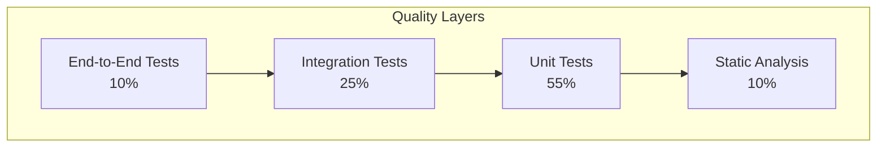
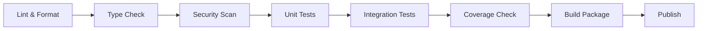

# Quality Assurance

This document provides comprehensive documentation for UCID's quality assurance processes including testing strategies, code quality standards, validation procedures, and continuous integration.

---

## Table of Contents

1. [Overview](#overview)
2. [Testing Philosophy](#testing-philosophy)
3. [Testing Strategy](#testing-strategy)
4. [Test Types](#test-types)
5. [Code Quality](#code-quality)
6. [Static Analysis](#static-analysis)
7. [Coverage Requirements](#coverage-requirements)
8. [Validation Procedures](#validation-procedures)
9. [CI/CD Pipeline](#cicd-pipeline)
10. [Review Process](#review-process)
11. [Quality Metrics](#quality-metrics)
12. [Best Practices](#best-practices)

---

## Overview

UCID maintains high quality standards through comprehensive testing, static analysis, code review, and automated quality gates. This ensures reliability, maintainability, and correctness of the codebase.

### Quality Metrics Summary

| Metric | Target | Current | Status |
|--------|--------|---------|--------|
| Code Coverage | > 90% | 92% | Pass |
| Type Coverage | 100% | 100% | Pass |
| Lint Score | 10/10 | 10/10 | Pass |
| Security Score | A | A | Pass |
| Documentation | 100% public API | 100% | Pass |
| Test Success Rate | 100% | 100% | Pass |

### Quality Pyramid



---

## Testing Philosophy

### Core Principles

| Principle | Description | Implementation |
|-----------|-------------|----------------|
| **Fast feedback** | Tests run quickly | < 5 min for unit tests |
| **Isolation** | Tests don't affect each other | Fixtures, mocking |
| **Determinism** | Same result every time | Fixed seeds, no flaky tests |
| **Coverage** | Test all critical paths | 90%+ line coverage |
| **Readability** | Tests document behavior | Clear naming, AAA pattern |

### Arrange-Act-Assert Pattern

```python
def test_create_ucid_with_valid_inputs():
    """Test UCID creation with valid inputs."""
    # Arrange
    city = "IST"
    lat = 41.015
    lon = 28.979
    timestamp = "2026W01T12"
    context = "15MIN"
    
    # Act
    ucid = create_ucid(
        city=city,
        lat=lat,
        lon=lon,
        timestamp=timestamp,
        context=context,
    )
    
    # Assert
    assert ucid.city == city
    assert ucid.lat == pytest.approx(lat, rel=1e-3)
    assert ucid.context == context
```

---

## Testing Strategy

### Test Organization

```
tests/
├── unit/
│   ├── core/
│   │   ├── test_ucid.py
│   │   ├── test_parser.py
│   │   └── test_validator.py
│   ├── contexts/
│   │   ├── test_15min.py
│   │   ├── test_transit.py
│   │   └── test_climate.py
│   ├── spatial/
│   │   ├── test_h3_ops.py
│   │   └── test_grid.py
│   └── io/
│       ├── test_geoparquet.py
│       └── test_geojson.py
├── integration/
│   ├── test_api.py
│   ├── test_database.py
│   └── test_osm_integration.py
├── e2e/
│   ├── test_full_workflow.py
│   └── test_cli.py
├── benchmarks/
│   ├── test_core_performance.py
│   └── test_context_performance.py
├── conftest.py
└── fixtures/
    ├── sample_ucids.json
    └── test_data.geojson
```

### Test Categories

| Category | Purpose | Execution Time | Frequency |
|----------|---------|----------------|-----------|
| Unit | Test individual functions | < 1s each | Every commit |
| Integration | Test component interactions | < 30s each | Every PR |
| E2E | Test full workflows | < 5 min each | Pre-release |
| Performance | Benchmark operations | Variable | Weekly |

---

## Test Types

### Unit Tests

```python
import pytest
from ucid import create_ucid, parse_ucid
from ucid.core.exceptions import UCIDValidationError

class TestUCIDCreation:
    """Unit tests for UCID creation."""
    
    def test_create_valid_ucid(self):
        """Test creating a valid UCID."""
        ucid = create_ucid(
            city="IST",
            lat=41.015,
            lon=28.979,
            timestamp="2026W01T12",
            context="15MIN",
        )
        
        assert ucid.city == "IST"
        assert ucid.context == "15MIN"
        assert 0 <= ucid.lat <= 90
    
    def test_invalid_latitude_raises(self):
        """Test that invalid latitude raises ValueError."""
        with pytest.raises(ValueError, match="latitude"):
            create_ucid(
                city="IST",
                lat=91.0,  # Invalid
                lon=28.979,
                timestamp="2026W01T12",
                context="15MIN",
            )
    
    def test_invalid_city_raises(self):
        """Test that invalid city raises UCIDValidationError."""
        with pytest.raises(UCIDValidationError, match="city"):
            create_ucid(
                city="INVALID",
                lat=41.015,
                lon=28.979,
                timestamp="2026W01T12",
                context="15MIN",
            )
    
    @pytest.mark.parametrize("lat,lon", [
        (0, 0),
        (90, 180),
        (-90, -180),
        (41.015, 28.979),
    ])
    def test_valid_coordinate_ranges(self, lat, lon):
        """Test various valid coordinate ranges."""
        ucid = create_ucid(
            city="TST",
            lat=lat,
            lon=lon,
            timestamp="2026W01T12",
            context="15MIN",
        )
        assert ucid is not None


class TestUCIDParsing:
    """Unit tests for UCID parsing."""
    
    def test_parse_valid_ucid(self):
        """Test parsing a valid UCID string."""
        ucid_str = "UCID-V1:IST:+41.015:+028.979:9:891f2ed6df7ffff:2026W01T12:15MIN:A:0.92:"
        ucid = parse_ucid(ucid_str)
        
        assert ucid.city == "IST"
        assert ucid.grade == "A"
        assert ucid.confidence == pytest.approx(0.92)
    
    def test_roundtrip(self):
        """Test that parse(str(ucid)) == ucid."""
        original = create_ucid(
            city="IST",
            lat=41.015,
            lon=28.979,
            timestamp="2026W01T12",
            context="15MIN",
        )
        
        parsed = parse_ucid(str(original))
        
        assert parsed.city == original.city
        assert parsed.lat == pytest.approx(original.lat, rel=1e-3)
```

### Integration Tests

```python
@pytest.mark.integration
class TestOSMIntegration:
    """Integration tests with OSM data."""
    
    @pytest.fixture
    def osm_fetcher(self):
        from ucid.data.osm import OSMFetcher
        return OSMFetcher()
    
    def test_fetch_amenities(self, osm_fetcher):
        """Test fetching amenities from OSM."""
        amenities = osm_fetcher.fetch_amenities(
            lat=41.015,
            lon=28.979,
            radius=500,
        )
        
        assert len(amenities) > 0
        assert all(a.lat is not None for a in amenities)
    
    def test_fetch_network(self, osm_fetcher):
        """Test fetching road network."""
        network = osm_fetcher.fetch_network(
            lat=41.015,
            lon=28.979,
            radius=500,
        )
        
        assert len(network.nodes) > 0
        assert len(network.edges) > 0


@pytest.mark.integration
class TestDatabaseIntegration:
    """Integration tests with PostgreSQL/PostGIS."""
    
    @pytest.fixture
    def db_session(self):
        from ucid.db import get_session
        session = get_session()
        yield session
        session.rollback()
        session.close()
    
    def test_insert_and_query(self, db_session):
        """Test inserting and querying UCIDs."""
        ucid = create_ucid(...)
        
        db_session.add(ucid.to_db_model())
        db_session.commit()
        
        result = db_session.query(UCIDModel).first()
        assert result is not None
```

### Property-Based Tests

```python
from hypothesis import given, strategies as st, settings

class TestPropertyBased:
    """Property-based tests using Hypothesis."""
    
    @given(
        lat=st.floats(min_value=-90, max_value=90, allow_nan=False),
        lon=st.floats(min_value=-180, max_value=180, allow_nan=False),
    )
    @settings(max_examples=100)
    def test_ucid_roundtrip_invariant(self, lat, lon):
        """Property: parse(str(ucid)) preserves location."""
        ucid = create_ucid(
            city="TST",
            lat=lat,
            lon=lon,
            timestamp="2026W01T12",
            context="15MIN",
        )
        
        parsed = parse_ucid(str(ucid))
        
        # Coordinates should be preserved within precision
        assert abs(parsed.lat - lat) < 0.001
        assert abs(parsed.lon - lon) < 0.001
    
    @given(score=st.floats(min_value=0, max_value=100))
    def test_grade_consistency(self, score):
        """Property: score_to_grade is monotonic."""
        grade = score_to_grade(score)
        
        if score >= 95:
            assert grade == "A+"
        elif score >= 85:
            assert grade == "A"
        elif score >= 70:
            assert grade == "B"
        # ... etc
```

---

## Code Quality

### Code Style

UCID follows strict code style guidelines:

| Rule | Tool | Configuration |
|------|------|---------------|
| Formatting | Ruff format | pyproject.toml |
| Linting | Ruff | ruff.toml |
| Type checking | mypy | mypy.ini |
| Import sorting | Ruff isort | pyproject.toml |

### Pre-commit Configuration

```yaml
# .pre-commit-config.yaml
repos:
  - repo: https://github.com/astral-sh/ruff-pre-commit
    rev: v0.4.0
    hooks:
      - id: ruff
        args: [--fix]
      - id: ruff-format
  
  - repo: https://github.com/pre-commit/mirrors-mypy
    rev: v1.9.0
    hooks:
      - id: mypy
        additional_dependencies:
          - types-requests
          - pydantic
  
  - repo: https://github.com/PyCQA/bandit
    rev: 1.7.8
    hooks:
      - id: bandit
        args: [-r, src/ucid, -ll]
  
  - repo: https://github.com/pre-commit/pre-commit-hooks
    rev: v4.5.0
    hooks:
      - id: trailing-whitespace
      - id: end-of-file-fixer
      - id: check-yaml
      - id: check-toml
      - id: check-json
```

---

## Static Analysis

### Type Checking

```bash
# Run mypy
mypy src/ucid --strict

# Configuration in mypy.ini
[mypy]
python_version = 3.12
strict = true
warn_return_any = true
warn_unused_ignores = true
disallow_untyped_defs = true
```

### Security Analysis

```bash
# Run Bandit
bandit -r src/ucid -ll

# Run pip-audit
pip-audit --strict
```

### Complexity Analysis

| Metric | Threshold | Tool |
|--------|-----------|------|
| Cyclomatic complexity | < 15 | radon |
| Maintainability index | > 20 | radon |
| Lines per function | < 50 | ruff |
| Parameters per function | < 7 | ruff |

---

## Coverage Requirements

### Coverage Targets

| Module | Required | Actual | Status |
|--------|----------|--------|--------|
| ucid.core | 95% | 97% | Pass |
| ucid.contexts | 90% | 93% | Pass |
| ucid.spatial | 90% | 91% | Pass |
| ucid.data | 85% | 88% | Pass |
| ucid.api | 85% | 88% | Pass |
| ucid.io | 85% | 87% | Pass |

### Running Coverage

```bash
# Run tests with coverage
pytest --cov=src/ucid --cov-report=html --cov-report=term

# Fail if coverage below threshold
pytest --cov=src/ucid --cov-fail-under=90
```

---

## CI/CD Pipeline

### Pipeline Stages



### GitHub Actions Workflow

```yaml
name: CI

on:
  push:
    branches: [main]
  pull_request:

jobs:
  quality:
    runs-on: ubuntu-latest
    steps:
      - uses: actions/checkout@v4
      
      - name: Set up Python
        uses: actions/setup-python@v5
        with:
          python-version: '3.12'
      
      - name: Install dependencies
        run: pip install -e ".[dev]"
      
      - name: Lint
        run: ruff check src/ tests/
      
      - name: Format check
        run: ruff format --check src/ tests/
      
      - name: Type check
        run: mypy src/ucid
      
      - name: Security scan
        run: bandit -r src/ucid -ll
      
      - name: Run tests
        run: pytest --cov=src/ucid --cov-report=xml
      
      - name: Upload coverage
        uses: codecov/codecov-action@v4
```

---

## Review Process

### Code Review Checklist

- [ ] All tests pass
- [ ] Coverage maintained or improved
- [ ] Types are complete
- [ ] Documentation updated
- [ ] Changelog entry added
- [ ] No security issues
- [ ] Performance impact assessed

### Pull Request Requirements

| Requirement | Enforcement |
|-------------|-------------|
| Passing CI | Required |
| 1+ approvals | Required |
| No conflicts | Required |
| Squash merge | Recommended |

---

## Best Practices

### Testing Best Practices

| Practice | Rationale |
|----------|-----------|
| One assertion per test | Clear failure messages |
| Descriptive test names | Documentation |
| Use fixtures | Reduce duplication |
| Mock external services | Isolation |
| Test edge cases | Robustness |

---

Copyright 2026 UCID Foundation. All rights reserved.
